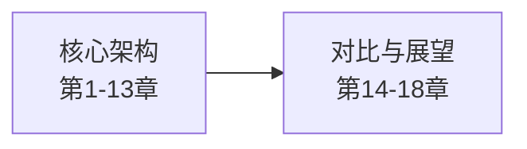

# 第0章 导读：本书定位与阅读指南

本书逐模块拆解 claw-code 源码，覆盖 Agent 启动流程、API 通信、工具系统、Turn Loop 引擎、权限模型、会话管理等核心机制。本章说明全书结构、claw-code 项目背景以及建议的阅读路径。

## 0.1 本书结构

全书共 19 章（含导读），按内容深度分为两个阶段：

| 阶段 | 章节 | 目标 |
| --- | --- | --- |
| 核心架构 | 第 1-13 章 | 理解 claw-code 是什么、整体架构、逐模块深入 Rust 源码 |
| 对比与展望 | 第 14-18 章 | 三端实现对比、思维转型、配置层、工作流、生态展望 |

第一阶段是全书核心，逐模块深入源码。第 1 章建立 Agent 概念框架，第 2 章给出整体架构全景，第 3 章追踪端到端执行路径，第 4-13 章逐个拆解 Rust workspace 中的核心 crate 与模块。

第二阶段脱离具体源码，转向工程实践和生态展望。第 14 章对比 TypeScript/Python/Rust 三种实现，第 15 章讨论从 Java 工程师到 Agent 工程师的思维转型，第 16 章拆解配置层，第 17 章介绍 AI-Native 工程工作流，第 18 章总结全书并展望 claw-code 生态。



## 0.2 claw-code 项目概览

claw-code 是 Claude Code 的公开 Rust 实现，由 ultraworkers 组织维护。仓库的 canonical runtime 位于 `rust/` 目录下，是一个 Cargo workspace，包含 10 个 crate、约 11.6 万行 Rust 代码。

README 明确说明："The canonical implementation lives in `rust/`"，而 `src/` 目录下的 Python 代码是 "companion Python/reference workspace and audit helpers; not the primary runtime surface"。因此本书以 Rust 实现为唯一源码依据，不涉及 Python 端的代码分析。

Rust workspace 的核心 crate 包括：

| Crate | 职责 |
| --- | --- |
| `rusty-claude-cli` | CLI 入口，参数解析，TUI 渲染 |
| `runtime` | 核心运行时：bootstrap、config、conversation、session、permissions、hooks、file ops、bash、mcp、task registry |
| `api` | HTTP 客户端、SSE 流解析、多 provider 路由 |
| `tools` | ToolPool、40 个工具规范定义、执行分发 |
| `plugins` | 插件生命周期、bundled hooks |
| `commands` | `/` 斜杠命令解析与分发 |
| `telemetry` | Token 计数、成本追踪 |
| `mock-anthropic-service` | 确定性 mock 服务，用于测试 |
| `compat-harness` | 兼容性测试设施 |
| `claw-rag-service` | RAG 检索服务（扩展层） |

本书基于 claw-code 仓库的 main 分支，分析边界以 9-lane checkpoint（2026-04-03）为界。如果后续源码有变动，以实际代码为准。

## 0.3 阅读建议

本书面向有 Java 后端经验的开发者。假设读者熟悉 Spring Boot、Maven 等工具，但不了解 LLM 和 Agent 的内部实现。

按章节顺序阅读效果最好。前 3 章建立全局认知，第 4-13 章逐模块深入源码，第 14-18 章偏向对比、思维转型和生态展望。

每章的代码片段均来自 `claw-code/rust/` 目录下的实际文件，标注了文件路径。建议在本地打开源码对照阅读。对于 Rust 代码，不需要深入掌握 Rust 语法，重点是理解设计思路和模块边界。

建议配合本地构建使用：

```bash
cd claw-code/rust
cargo build --workspace
./target/debug/claw doctor
```

## 小结

本章介绍了全书的两阶段结构：第 1-13 章聚焦 claw-code 核心架构的 Rust 源码，第 14-18 章转向对比、思维转型和生态展望。claw-code 是 Claude Code 的公开 Rust 实现，canonical runtime 位于 `rust/` workspace 中，本书以 Rust 实现为唯一源码依据。建议按顺序阅读，并在本地构建后对照源码。

下一章将建立 Agent 的概念框架，理解 Agent 与传统 CLI 的本质区别。
