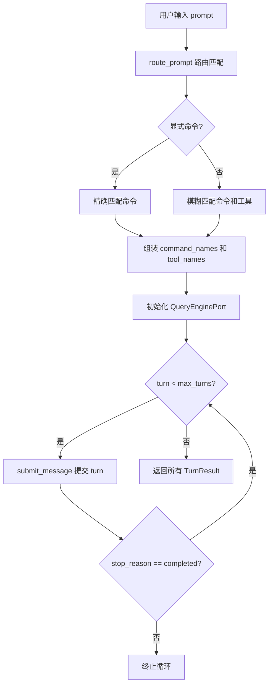

# 第1章 什么是 Agent

claw-code 不是一个传统意义上的命令行工具。它具备感知用户输入、自主决策和调用外部工具的能力，这些特征正是软件 Agent 的核心定义。理解 Agent 的基本模型，是阅读后续章节源码的前提。

## 1.1 感知-决策-执行循环

Agent 的本质是一个闭环：接收环境输入，做出决策，执行动作，然后观察结果。claw-code 将这个循环抽象为 `TurnResult`，每个 turn 记录一次完整的交互结果。

```python
# claw-code/src/query_engine.py

@dataclass(frozen=True)
class TurnResult:
    prompt: str
    output: str
    matched_commands: tuple[str, ...]
    matched_tools: tuple[str, ...]
    permission_denials: tuple[PermissionDenial, ...]
    usage: UsageSummary
    stop_reason: str
```

`TurnResult` 的字段直接映射了 Agent 循环的六个阶段：接收输入（prompt）、产生输出（output）、匹配命令（matched_commands）、匹配工具（matched_tools）、权限拦截（permission_denials）和停止判定（stop_reason）。stop_reason 的取值包括 `completed`、`max_turns_reached` 和 `max_budget_reached`，决定了循环是否继续。

## 1.2 Runtime：Agent 的运行时容器

`PortRuntime` 是 claw-code Agent 的运行时容器，负责将用户输入路由到匹配的命令和工具，并组装完整的会话。

```python
# claw-code/src/runtime.py

class PortRuntime:
    def route_prompt(self, prompt: str, limit: int = 5) -> list[RoutedMatch]:
        explicit_command = self._explicit_command_match(prompt)
        tokens = {token.lower() for token in prompt.replace('/', ' ').replace('-', ' ').split() if token}
        by_kind = {
            'command': self._collect_matches(tokens, PORTED_COMMANDS, 'command'),
            'tool': self._collect_matches(tokens, PORTED_TOOLS, 'tool'),
        }
        # 显式命令优先，然后各取一个命令和一个工具，剩余按分数排序
        selected: list[RoutedMatch] = []
        if explicit_command is not None:
            selected.append(explicit_command)
        # ...
```

`route_prompt` 是 Agent 的"感知-路由"入口。它先做显式命令匹配（例如用户输入以 `/` 开头的命令），然后对剩余 token 在命令和工具两个维度上做模糊匹配，最终返回一个按相关性排序的 `RoutedMatch` 列表。每个 `RoutedMatch` 包含 kind（command 或 tool）、name、source_hint 和 score。

```python
# claw-code/src/runtime.py

@dataclass(frozen=True)
class RoutedMatch:
    kind: str
    name: str
    source_hint: str
    score: int
```

匹配完成后，`bootstrap_session` 将这些结果组装为一个 `RuntimeSession`，其中包含上下文、历史记录、工具执行结果和 Turn 输出。这个会话对象就是 Agent 在一次交互中的完整状态快照。

## 1.3 Turn Loop：Agent 的心跳

`run_turn_loop` 是 Agent 的核心循环方法，它将一次用户请求拆分为多个 turn，直到任务完成或触达资源上限。

```python
# claw-code/src/runtime.py

def run_turn_loop(self, prompt: str, limit: int = 5, max_turns: int = 3, structured_output: bool = False) -> list[TurnResult]:
    engine = QueryEnginePort.from_workspace()
    engine.config = QueryEngineConfig(max_turns=max_turns, structured_output=structured_output)
    matches = self.route_prompt(prompt, limit=limit)
    command_names = tuple(match.name for match in matches if match.kind == 'command')
    tool_names = tuple(match.name for match in matches if match.kind == 'tool')
    results: list[TurnResult] = []
    for turn in range(max_turns):
        turn_prompt = prompt if turn == 0 else f'{prompt} [turn {turn + 1}]'
        result = engine.submit_message(turn_prompt, command_names, tool_names, ())
        results.append(result)
        if result.stop_reason != 'completed':
            break
    return results
```

循环逻辑很直接：初始化引擎，路由匹配，然后逐 turn 提交消息。每个 turn 的 stop_reason 被检查，如果不是 `completed`，循环立即终止。`max_turns` 参数在循环层面做硬限制，而 `QueryEngineConfig` 中还有更细粒度的 token 预算限制。



## 1.4 工具与命令：Agent 的可用能力

Agent 的决策能力取决于它拥有哪些可执行能力。claw-code 将原版 TypeScript 的命令和工具表面抽象为 `PortingModule` 镜像，存储在 JSON 快照中。

```python
# claw-code/src/models.py

@dataclass(frozen=True)
class PortingModule:
    name: str
    responsibility: str
    source_hint: str
    status: str = 'planned'
```

`tools.py` 和 `commands.py` 分别加载对应的快照，提供查找和匹配接口。以工具为例：

```python
# claw-code/src/tools.py

@lru_cache(maxsize=1)
def load_tool_snapshot() -> tuple[PortingModule, ...]:
    raw_entries = json.loads(SNAPSHOT_PATH.read_text())
    return tuple(
        PortingModule(
            name=entry['name'],
            responsibility=entry['responsibility'],
            source_hint=entry['source_hint'],
            status='mirrored',
        )
        for entry in raw_entries
    )

PORTED_TOOLS = load_tool_snapshot()
```

`PORTED_TOOLS` 和 `PORTED_COMMANDS` 是两个全局镜像列表，被 `PortRuntime.route_prompt` 用作匹配库。`execute_tool` 和 `execute_command` 提供模拟执行接口，实际处理逻辑由调用方提供。在 Python 移植版本中，这些工具目前处于"镜像"状态，即记录存在但执行体由外部框架接管。

## 1.5 资源预算与权限控制

Agent 不能无限制运行。`QueryEngineConfig` 定义了三层资源约束：

```python
# claw-code/src/query_engine.py

@dataclass(frozen=True)
class QueryEngineConfig:
    max_turns: int = 8
    max_budget_tokens: int = 2000
    compact_after_turns: int = 12
    structured_output: bool = False
    structured_retry_limit: int = 2
```

`max_turns` 限制单次请求的最大 turn 数，`max_budget_tokens` 限制累计 token 消耗，`compact_after_turns` 触发历史消息压缩。`submit_message` 在每个 turn 结束时检查预算：

```python
# claw-code/src/query_engine.py

projected_usage = self.total_usage.add_turn(prompt, output)
stop_reason = 'completed'
if projected_usage.input_tokens + projected_usage.output_tokens > self.config.max_budget_tokens:
    stop_reason = 'max_budget_reached'
```

权限控制通过 `PermissionDenial` 实现。`PortRuntime._infer_permission_denials` 会对高危工具（如包含 bash 的工具）自动拒绝，并返回拒绝原因。

```python
# claw-code/src/runtime.py

def _infer_permission_denials(self, matches: list[RoutedMatch]) -> list[PermissionDenial]:
    denials: list[PermissionDenial] = []
    for match in matches:
        if match.kind == 'tool' and 'bash' in match.name.lower():
            denials.append(PermissionDenial(
                tool_name=match.name,
                reason='destructive shell execution remains gated in the Python port'
            ))
    return denials
```

## 1.6 设计对比

将 claw-code 的 Agent 模型与 Java 生态做映射，有助于理解其架构定位。

| claw-code 概念 | Java 生态对应 |
| --- | --- |
| `PortRuntime` | `ApplicationContext` 运行时容器 |
| `QueryEnginePort` | `DispatcherServlet` 请求调度器 |
| `Turn Loop` | 同步请求处理循环 |
| `RoutedMatch` | `HandlerMapping` 匹配结果 |
| `QueryEngineConfig` | `application.properties` 配置约束 |
| `PermissionDenial` | `Spring Security` 访问控制决策 |

`PortRuntime` 类似 Spring Boot 的 `ApplicationContext`，它持有所有命令和工具的镜像注册表，并在启动时初始化运行环境。`QueryEnginePort` 类似 `DispatcherServlet`，负责将输入分发到合适的处理流程。两者的区别在于：Spring 处理的是 HTTP 请求，claw-code 处理的是自然语言 prompt，且每个请求内部可能包含多个 turn。

## 小结

`PortRuntime` 和 `QueryEnginePort` 共同构成了 claw-code Agent 的核心骨架。`PortRuntime` 负责输入路由和工具/命令匹配，`QueryEnginePort` 负责 turn 管理、资源预算和会话持久化。`TurnResult` 记录了每个 turn 的完整状态，包括命令匹配、工具匹配、权限拦截和停止原因。工具与命令以 `PortingModule` 镜像的形式注册在全局快照中，权限控制通过 `PermissionDenial` 在运行时拦截高危操作。下一章将介绍 LLM 的最小必要知识，这是理解 Agent 如何"思考"的基础。
