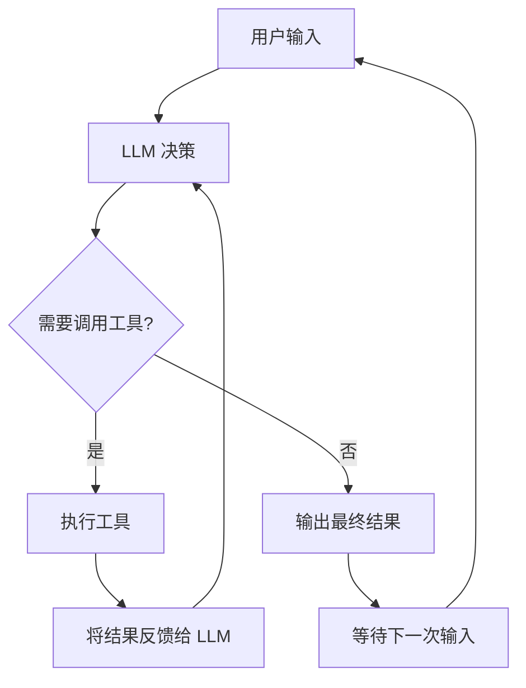

# 第1章 什么是 Agent：Agent 与传统 CLI 的本质区别

## 本章概览

本章建立 Agent 的概念框架。不涉及任何源码，目标是读完之后能向同事解释清楚"Agent 和传统 CLI 工具有什么本质区别"。

本章是全书的认知地基，后续章节会逐步展开 Agent 各个组件的源码实现。在进入源码之前，先明确 Agent 的定义、特征和与传统软件的差异。

## 1.1 Agent 的定义

Agent 是一个能自主感知环境、做出决策、执行动作并观察结果的软件系统。这个定义有三个关键词：

自主：Agent 不是被动等待人类指令逐步操作，而是接收一个目标后自己决定执行路径。人类给出"帮我写一个快速排序"，Agent 自己决定是先读项目结构、还是先写代码、还是先写测试。

感知-决策-执行：这是一个闭环。Agent 感知环境（读取文件、接收用户输入），做出决策（调用 LLM 生成方案），执行动作（写文件、运行命令），然后把执行结果反馈回来，进入下一轮感知。

观察结果：Agent 不是"执行完就结束"。它会观察上一步动作的结果，判断是否需要继续。如果写的代码编译报错了，它看到错误信息后会自己修改，不需要人再下一条指令。

## 1.2 传统 CLI vs Agent CLI

| 维度 | 传统 CLI（如 git、mvn） | Agent CLI（如 claw-code） |
| --- | --- | --- |
| 执行模式 | 一条命令对应一个固定动作 | 一条指令触发自主多步执行 |
| 控制流 | 人类编写脚本串联命令 | Agent 内部循环决定下一步 |
| 输出确定性 | 相同输入必定相同输出 | 相同输入可能不同输出（LLM 概率性） |
| 错误处理 | 报错退出，人类决定下一步 | Agent 看到错误后自主修正 |
| 状态管理 | 通常无状态或简单状态 | 维护完整对话上下文 |
| 工具使用 | 固定的子命令集 | 运行时动态选择工具 |
| 终止条件 | 命令执行完毕即退出 | Agent 自主判断任务是否完成 |

传统 CLI 的控制流在编译时就确定了。`git commit` 会执行 add → write tree → commit → update ref 这条固定链路，不会因为上下文不同而走不同路径。

Agent CLI 的控制流在运行时由 LLM 动态决定。同样是"帮我修个 bug"，Agent 可能先读日志、也可能先读代码、也可能先问澄清问题，取决于 LLM 对当前上下文的判断。

## 1.3 claw-code 的 Agent 特征

claw-code 具备以下 Agent 核心能力，每项对应后续章节的源码分析：

| Agent 能力 | 作用 | 对应章节 |
| --- | --- | --- |
| 启动与初始化 | 加载配置、注册工具、构建系统提示词 | 第3章 |
| API 通信 | 与 LLM 建立 SSE 流式连接 | 第5章 |
| 工具调用 | 读写文件、执行命令、搜索代码 | 第6章 |
| 多轮交互（Turn Loop） | LLM 循环决策，调用工具，观察结果 | 第11章 |
| 权限控制 | 限制 Agent 能操作的文件和命令范围 | 第8章 |
| 钩子系统 | 在关键节点插入前置/后置处理 | 第10章 |
| 会话管理 | 维护对话历史，支持恢复和压缩 | 第9章 |
| 多 Agent 协调 | 任务拆分、并行执行、结果合并 | 第12章 |
| MCP 协议与插件扩展 | 连接外部工具，用户自定义扩展 | 第7章 |

这些能力不是独立的功能模块，而是一条完整的执行链。从用户输入到最终输出，数据依次流经启动初始化、API 通信、工具注册、Turn Loop 循环、权限检查、会话存储，最终返回结果。

## 1.4 Agent 的执行循环

Agent 的核心是 Turn Loop——一个"感知-决策-执行-观察"的循环：

这个循环和 Java 后端开发者熟悉的请求-响应模式有本质区别。Spring MVC 的 `DispatcherServlet` 处理完一个 HTTP 请求就结束了，下一个请求是新的一次处理。Agent 的 Turn Loop 在 LLM 调用工具后不会结束，而是把工具结果喂回 LLM，让 LLM 决定是否继续调用更多工具。

循环的终止不是"代码执行完毕"，而是"LLM 认为任务完成了"。这个判断由 LLM 自主做出，人类不干预每一步的决策。

## 1.5 为什么 Java 工程师需要理解 Agent

Java 后端工程师已经熟悉一套成熟的工程范式：Spring Boot 管理依赖注入和生命周期，MVC 处理请求路由，MyBatis 管理数据持久化，Maven 管理构建。这些范式的共同特征是确定性——相同的配置产生相同的行为。

Agent 系统引入了一个根本性的变化：控制流由概率模型（LLM）驱动。这意味着：

系统行为不可预测：同一个输入可能产生不同的执行路径。传统软件的测试方法论（断言精确输出）不能直接套用。

工具选择是动态的：Spring 的 `@Autowired` 在编译时确定依赖关系。Agent 的工具池在启动时注册所有工具，但具体调用哪个工具由 LLM 在运行时决定。

状态管理面临新挑战：传统后端的状态持久化在数据库中，按需查询。Agent 的状态是完整的对话历史，每次调用 LLM 都要全量发送，受 Token 窗口限制。

权限模型需要重新设计：Spring Security 用注解在编译时声明权限规则。Agent 的权限需要运行时动态检查，因为工具调用是 LLM 运行时决定的，事先不知道会调用什么。

这些差异不意味着 Java 工程师的经验失效，而是意味着需要把已有的架构思维（分层、解耦、权限、状态管理）迁移到新的执行模型上。后续章节会逐步展示 claw-code 如何在 Agent 架构中实现这些熟悉的关注点。

## 小结

Agent 是一个自主感知-决策-执行-观察的闭环系统，与传统 CLI 的固定命令执行有本质区别。claw-code 具备启动初始化、API 通信、工具调用、Turn Loop、权限控制、钩子、会话管理、多 Agent 协调和 MCP 扩展九项核心能力。对于 Java 工程师，理解 Agent 的关键是接受控制流由 LLM 动态驱动这一前提。

下一章将展示 claw-code 的整体架构——Rust workspace 的 10 个 crate 模块地图，以及各模块之间的数据流关系。
