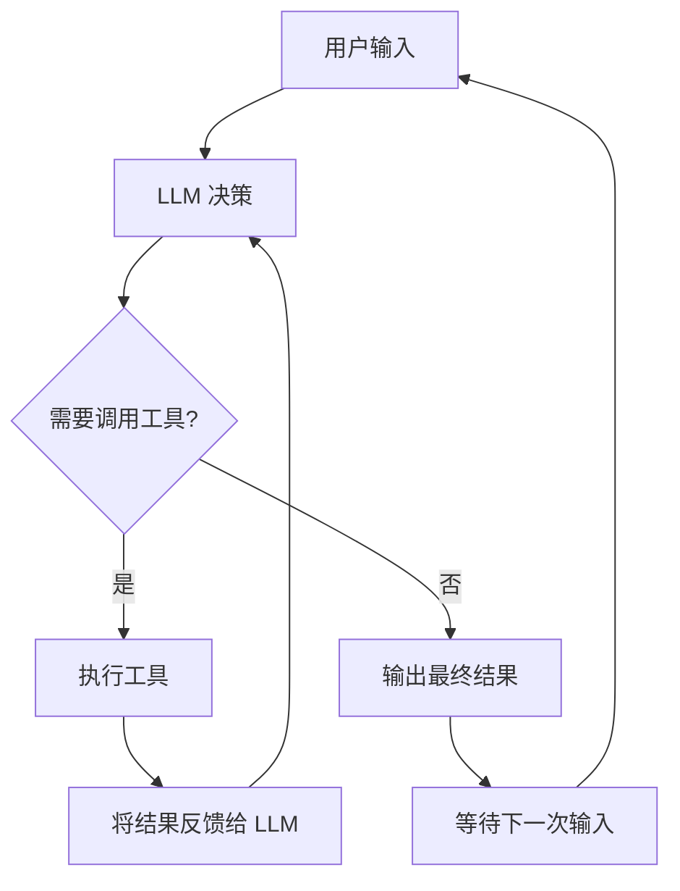

# 第1章 什么是 Agent：Agent 与传统 CLI 的本质区别

## 本章概览

本章是全书的认知基础，在进入源码之前，先明确 Agent 的定义、特征和与传统软件的差异。

## 1.1 Agent 的定义

Agent 是一个能自主感知环境、做出决策、执行动作并观察结果的软件系统。这个定义有三个关键词：

自主：Agent 接收一个目标后会自主决定执行路径，不会被动等待人类指令逐步操作。人类给出"帮我写一个快速排序"，Agent 自己决定是先读项目结构、还是先写代码、还是先写测试。

感知-决策-执行：这是一个闭环。Agent 感知环境（读取文件、接收用户输入），做出决策（调用 LLM 生成方案），执行动作（写文件、运行命令），然后把执行结果反馈回来，进入下一轮感知。

观察结果：Agent 不是"执行完就结束"。它会观察上一步动作的结果，判断是否需要继续。如果写的代码编译报错了，它看到错误信息后会自己修改，不需要人再下一条指令。

### 工具：Agent 连接外部世界的桥梁

Agent 的"执行动作"通过**工具（Tool）**这一抽象层实现，不会直接调用操作系统 API。工具是预定义的、有明确输入输出 Schema 的操作单元，例如"读取文件""执行 Bash 命令""搜索代码"。LLM 输出"调用 ReadFile 工具、参数是文件路径"的结构化请求，由 Agent 执行层实际调用。

这种设计有两个关键意义。第一，**LLM 不需要知道文件系统的具体 API**——它只需要知道"有一个叫 ReadFile 的工具，接收 path 参数"，工具的底层实现由 Agent 提供。第二，**工具列表决定了 Agent 的能力边界**——如果工具列表里没有"删除文件"，LLM 就无法请求这个操作，无论它多想删除。

tools 是 Agent 的"手脚"，而 LLM 是 Agent 的"大脑"。没有 tools，LLM 只能生成文本；没有 LLM，tools 只是孤立的函数调用。两者的结合才让 Agent 具备了自主行动的能力。

claw-code 的工具分为两类。**内置工具**（第7章）由 `tools` crate 直接实现，包括文件读写、Bash 执行、代码搜索等约 55 个操作。**外部工具**（第8章）通过 MCP（Model Context Protocol）协议连接——Agent 可以动态发现和使用外部 MCP 服务器提供的工具，如数据库查询、浏览器操作、第三方 API 调用等。内置工具是"标配"，外部工具是"扩展"，两者在工具调用接口层面统一。

## 1.2 传统 CLI vs Agent CLI

| 维度 | 传统 CLI（如 git、mvn） | Agent CLI（如 claw-code） |
| --- | --- | --- |
| 执行模式 | 一条命令对应一个固定动作 | 一条指令触发自主多步执行 |
| 控制流 | 人类编写脚本串联命令 | Agent 内部循环决定下一步 |
| 输出确定性 | 相同输入必定相同输出 | 相同输入可能不同输出（LLM 概率性） |
| 错误处理 | 报错退出，人类决定下一步 | Agent 看到错误后自主修正 |
| 状态管理 | 通常无状态或简单状态 | 维护完整对话上下文 |
| 工具使用 | 固定的子命令集 | 运行时动态选择工具 |
| 可扩展性 | 重新编译或安装插件才能加功能 | 通过 MCP 协议动态连接外部工具 |
| 观测性 | 执行完即结束，无审计轨迹 | 完整会话持久化，可事后审计 |
| 终止条件 | 命令执行完毕即退出 | Agent 自主判断任务是否完成 |

传统 CLI 的控制流在编译时就确定了。`git commit` 会执行 add → write tree → commit → update ref 这条固定链路，不会因为上下文不同而走不同路径。

Agent CLI 的控制流在运行时由 LLM 动态决定。同样是"帮我修个 bug"，Agent 可能先读日志、也可能先读代码、也可能先问澄清问题，取决于 LLM 对当前上下文的判断。

### 为什么 Agent 需要权限系统

传统 CLI 不需要权限系统——`rm -rf /` 会报错是因为操作系统层面的权限，而不是 CLI 本身在限制你。但 Agent 不同：LLM 是概率性系统，它的输出不是完全可预测的。一个训练数据中包含危险操作模式的 LLM，可能在某些上下文中尝试执行你不希望它执行的操作，比如删除生产环境配置文件、暴露敏感信息、或者执行网络请求。

核心问题在于，**Agent 的自主性使它不会在每个操作前询问你**。传统 CLI 中，你要删除文件必须自己输入 `rm`，这是一个明确的意图表达。但 Agent 可能在 Turn Loop 的某一轮中自主决定"这个临时文件没用了，删掉吧"，而这个决定可能是错误的。

claw-code 的权限系统（第9章）是 LLM 行为的约束层，它在 Agent 尝试调用工具前拦截请求，根据配置的规则判断这个操作是否被允许。`ReadOnly` 模式禁止任何写操作，`WorkspaceWrite` 只允许修改工作区目录，`DangerFullAccess` 才放开所有限制。这种分级设计承认了一个事实：LLM 的自主性是有风险的，必须通过外部约束来管理。

权限系统与工具系统的关系也很紧密：权限检查发生在"LLM 请求调用工具"和"工具实际执行"之间。即使 LLM 请求了一个危险的 Bash 命令，权限系统可以在执行前将其降级为只读操作，或者直接拒绝。工具定义了 Agent"能做什么"，权限系统定义了 Agent"被允许做什么"。

## 1.3 Agent 的执行循环

Agent 的核心是 Turn Loop——一个"感知-决策-执行-观察"的循环：

这个循环和常见的请求-响应模式有本质区别。传统的 HTTP 服务处理完一个请求就结束了，下一个请求是新的一次处理。Agent 的 Turn Loop 在 LLM 调用工具后不会结束，而是把工具结果喂回 LLM，让 LLM 决定是否继续调用更多工具。Turn Loop 的完整源码实现分析在第6章。

循环的终止以"LLM 判断任务完成"为标志，而不是"代码执行完毕"。这个判断由 LLM 自主做出，人类不干预每一步的决策。但人类可以通过权限系统（第9章）和Hooks系统（第11章）在关键节点插入干预——权限系统在工具执行前做安全审查，Hooks系统在工具执行前后插入自定义处理逻辑。

## 1.4 claw-code 的 Agent 特征

claw-code 具备以下 Agent 核心能力，每项对应后续章节的源码分析：

| Agent 能力 | 作用 | 对应章节 |
| --- | --- | --- |
| 启动与初始化 | 加载配置、注册工具、构建系统提示词 | 第3章 |
| API 通信 | 与 LLM 建立 SSE 流式连接 | 第5章 |
| 工具调用 | 读写文件、执行命令、搜索代码 | 第7章 |
| MCP 协议与插件扩展 | 连接外部工具，用户自定义扩展 | 第8章 |
| 权限控制 | 限制 Agent 能操作的文件和命令范围 | 第9章 |
| 会话管理 | 维护对话历史，支持恢复和压缩 | 第10章 |
| Hooks系统 | 在关键节点插入前置/后置处理 | 第11章 |
| 多轮交互（Turn Loop） | LLM 循环决策，调用工具，观察结果 | 第6章 |
| 多 Agent 协调 | 任务/团队状态跟踪、定时任务登记 | 第12章 |

这些能力构成一条完整的执行链：从用户输入到最终输出，数据依次流经启动初始化、API 通信、工具注册、Turn Loop 循环、权限检查、会话存储，最终返回结果。

## 小结

Agent 是一个自主感知-决策-执行-观察的闭环系统，与传统 CLI 的固定命令执行有本质区别。工具是 Agent 连接外部世界的桥梁。LLM 通过调用预定义的工具来执行动作，不会直接操作操作系统 API。工具列表决定了 Agent 的能力边界。claw-code 的工具分为内置工具（55 个，第7章）和外部 MCP 工具（第8章）两类。

Agent 的自主性带来了不可控性风险：LLM 是概率性系统，可能在某些上下文中尝试危险操作，而且 Agent 不会在每个操作前询问人类。因此 claw-code 设计了分级权限系统（第9章），在"LLM 请求调用工具"和"工具实际执行"之间插入安全审查。工具定义了 Agent"能做什么"，权限系统定义了 Agent"被允许做什么"。

claw-code 具备启动初始化、API 通信、工具调用、Turn Loop、权限控制、钩子、会话管理、多 Agent 协调和 MCP 扩展九项核心能力，构成从用户输入到最终输出的完整执行链。

下一章将展示 claw-code 的整体架构——Rust workspace 的 11 个 crate 模块地图，以及各模块之间的数据流关系。
