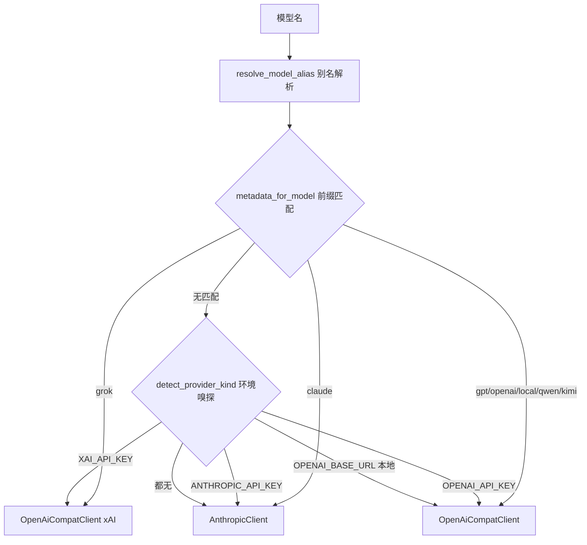

# 第2章 LLM 最小必要知识

理解 Agent 之前，需要先弄清 LLM 调用层的基本概念：一次请求如何组织、模型如何返回结果、多个供应商如何统一、token 如何计量。claw-code 的 LLM 交互逻辑集中在 Rust 的 api crate 里，本章以该 crate 为样本，把最小必要知识逐条讲清楚。

chapter-plan.json 中本章列出的 `src/models.py` 实际存放的是 PortingModule、Subsystem 等移植进度跟踪用的 dataclass，与 LLM 模型无关。真正的 LLM 类型定义在 `rust/crates/api/src/`，下面的代码引用均以该目录为准。

## 2.1 消息结构：一次调用的输入与输出

一次 LLM 调用的最小单元是 `MessageRequest`，它描述发给模型的完整请求：模型名、最大输出 token、消息列表、system 提示、工具定义和采样参数。

```rust
// claw-code/rust/crates/api/src/types.rs

pub struct MessageRequest {
    pub model: String,
    pub max_tokens: u32,
    pub messages: Vec<InputMessage>,
    pub system: Option<String>,          // 系统提示，独立于消息列表
    pub tools: Option<Vec<ToolDefinition>>,
    pub tool_choice: Option<ToolChoice>,
    pub stream: bool,                    // 是否走 SSE 流式返回
    pub temperature: Option<f64>,
    pub top_p: Option<f64>,
    pub frequency_penalty: Option<f64>,
    pub presence_penalty: Option<f64>,
    pub stop: Option<Vec<String>>,
    pub reasoning_effort: Option<String>,
    pub extra_body: BTreeMap<String, Value>,  // 透传供应商私有参数
}
```

`messages` 是核心，它由 `InputMessage` 组成，每条消息带一个 `role`（user 或 assistant）和一个 content block 列表。content block 不是字符串，而是带类型的枚举，这是理解 Agent 工具调用的关键。

```rust
// claw-code/rust/crates/api/src/types.rs

#[serde(tag = "type", rename_all = "snake_case")]
pub enum InputContentBlock {
    Text { text: String },
    Thinking { thinking: String, signature: Option<String> },
    ToolUse { id: String, name: String, input: Value },
    ToolResult {
        tool_use_id: String,
        content: Vec<ToolResultContentBlock>,
        is_error: bool,
    },
}
```

模型的一条回复可能混合文本和工具调用，输入历史则要把上一轮的工具执行结果以 `ToolResult` 形式回填。`ToolUse` 与 `ToolResult` 通过 `tool_use_id` 配对，这个字段在整个工具调用往返中保持不变。

响应侧是 `MessageResponse`，包含 `content`（`OutputContentBlock` 列表）、`stop_reason` 和 `usage`。`stop_reason` 的值决定了 Turn Loop 下一步做什么：`end_turn` 表示模型说完了，`tool_use` 表示模型要调用工具，`max_tokens` 表示被截断。

```rust
// claw-code/rust/crates/api/src/types.rs

pub struct MessageResponse {
    pub id: String,
    pub role: String,
    pub content: Vec<OutputContentBlock>,
    pub model: String,
    pub stop_reason: Option<String>,
    pub usage: Usage,
    pub request_id: Option<String>,
}
```

## 2.2 多供应商路由：一套抽象对接多种协议

claw-code 同时支持 Anthropic 原生协议和 OpenAI 兼容协议。前者走 `/v1/messages` 端点的 Messages API，后者走 Chat Completions 端点，两者字段命名和流式事件结构都不同。api crate 用 `ProviderClient` 枚举把差异收敛到一个入口。

```rust
// claw-code/rust/crates/api/src/client.rs

pub enum ProviderClient {
    Anthropic(AnthropicClient),
    Xai(OpenAiCompatClient),
    OpenAi(OpenAiCompatClient),
}
```

`Xai` 和 `OpenAi` 共用 `OpenAiCompatClient`，因为 xAI、OpenAI、阿里 DashScope、本地 Ollama 都讲 OpenAI 的 wire format，只有 base URL 和鉴权环境变量不同。`OpenAiCompatConfig` 把这几组差异固化成常量。

```rust
// claw-code/rust/crates/api/src/providers/openai_compat.rs

pub const DEFAULT_XAI_BASE_URL: &str = "https://api.x.ai/v1";
pub const DEFAULT_OPENAI_BASE_URL: &str = "https://api.openai.com/v1";
pub const DEFAULT_DASHSCOPE_BASE_URL: &str = "https://dashscope.aliyuncs.com/compatible-mode/v1";
```

选择哪个 client 由模型名决定。`from_model` 先做别名解析，再按前缀判断供应商。别名让用户能写 `opus`、`grok` 这样的短名，解析成完整的模型 id。

```rust
// claw-code/rust/crates/api/src/providers/mod.rs

pub fn resolve_model_alias(model: &str) -> String {
    let lower = model.trim().to_ascii_lowercase();
    MODEL_REGISTRY
        .iter()
        .find_map(|(alias, metadata)| {
            (*alias == lower).then_some(match metadata.provider {
                ProviderKind::Anthropic => match *alias {
                    "opus" => "claude-opus-4-7",
                    "sonnet" => "claude-sonnet-4-6",
                    "haiku" => "claude-haiku-4-5-20251213",
                    _ => trimmed,
                },
                ProviderKind::Xai => match *alias {
                    "grok" | "grok-3" => "grok-3",
                    "grok-mini" | "grok-3-mini" => "grok-3-mini",
                    "grok-2" => "grok-2",
                    _ => trimmed,
                },
                ProviderKind::OpenAi => match *alias {
                    "kimi" => "kimi-k2.5",
                    _ => trimmed,
                },
            })
        })
        .map_or_else(|| trimmed.to_string(), ToOwned::to_owned)
}
```

`detect_provider_kind` 是路由的兜底逻辑：优先看模型名前缀，前缀匹配不到时再嗅探环境变量。这个顺序是有意的，源码注释明确说明前缀必须压过环境变量，否则 `openai/gpt-4.1-mini` 会因环境里存在 `ANTHROPIC_API_KEY` 而被误路由。



每种协议支持的特性不同，`provider_capabilities_for_model` 用一个能力矩阵显式声明差异：prompt_cache 只有 Anthropic 支持，streaming_usage 只有 OpenAI 支持，reasoning_effort 只有 OpenAI 兼容模型支持。上层拿到这个矩阵后可以决定是否启用某个参数，而不是把参数硬塞给不认识的供应商。

## 2.3 流式响应与 SSE 解析

流式返回是 Agent 逐字输出、边生成边渲染的基础。模型端点是 SSE（Server-Sent Events），每个事件是一段 `event:` 加一段 `data:`，data 内容是 JSON。`SseParser` 负责把字节流切成帧并反序列化成 `StreamEvent`。

```rust
// claw-code/rust/crates/api/src/sse.rs

for line in trimmed.lines() {
    if line.starts_with(':') {
        continue;                       // 注释行 / keepalive
    }
    if let Some(name) = line.strip_prefix("event:") {
        event_name = Some(name.trim());
        continue;
    }
    if let Some(data) = line.strip_prefix("data:") {
        data_lines.push(data.trim_start());
    }
}

if matches!(event_name, Some("ping")) {
    return Ok(None);                    // 心跳帧直接丢弃
}
if data_lines.is_empty() {
    return Ok(None);
}
let payload = data_lines.join("\n");
if payload == "[DONE]" {
    return Ok(None);                    // OpenAI 协议的结束标记
}
serde_json::from_str::<StreamEvent>(&payload)  // 剩余帧解析成事件
```

流式响应的难点在于字节边界和 JSON 边界不一致：一个 JSON 事件可能被 TCP 拆成多个 chunk，一个 chunk 里也可能包含多个事件。`SseParser` 用内部 buffer 累积，`push` 方法把新 chunk 追加到 buffer，再循环切出完整帧。

```rust
// claw-code/rust/crates/api/src/sse.rs

pub fn push(&mut self, chunk: &[u8]) -> Result<Vec<StreamEvent>, ApiError> {
    self.buffer.extend_from_slice(chunk);
    let mut events = Vec::new();
    while let Some(frame) = self.next_frame() {
        if let Some(event) = self.parse_frame_with_context(&frame)? {
            events.push(event);
        }
    }
    Ok(events)
}
```

帧的切分以 `\n\n` 或 `\r\n\r\n` 为分隔符。增量内容通过 `ContentBlockDelta` 事件逐段到达，`StreamEvent` 枚举覆盖了从 message_start 到 message_stop 的完整生命周期。

```rust
// claw-code/rust/crates/api/src/types.rs

#[serde(tag = "type", rename_all = "snake_case")]
pub enum StreamEvent {
    MessageStart(MessageStartEvent),
    MessageDelta(MessageDeltaEvent),
    ContentBlockStart(ContentBlockStartEvent),
    ContentBlockDelta(ContentBlockDeltaEvent),
    ContentBlockStop(ContentBlockStopEvent),
    MessageStop(MessageStopEvent),
}
```

## 2.4 Token 计量与成本估算

token 是 LLM 的计费单位和上下文计量单位。`Usage` 结构拆出了四个字段，其中 cache 相关字段是 Anthropic prompt caching 特有的，OpenAI 兼容模型这两个字段恒为 0。

```rust
// claw-code/rust/crates/api/src/types.rs

pub struct Usage {
    pub input_tokens: u32,
    pub cache_creation_input_tokens: u32,
    pub cache_read_input_tokens: u32,
    pub output_tokens: u32,
}

impl Usage {
    pub const fn total_tokens(&self) -> u32 {
        self.input_tokens
            + self.output_tokens
            + self.cache_creation_input_tokens
            + self.cache_read_input_tokens
    }
}
```

成本估算通过 `estimated_cost_usd` 完成，它先从 `pricing_for_model` 查该模型的单价，查不到则用默认价。单价不硬编码在 api crate 里，而是来自 runtime crate 的定价表，保证计费逻辑集中维护。

```rust
// claw-code/rust/crates/api/src/types.rs

pub fn estimated_cost_usd(&self, model: &str) -> UsageCostEstimate {
    let usage = self.token_usage();
    pricing_for_model(model).map_or_else(
        || usage.estimate_cost_usd(),
        |pricing| usage.estimate_cost_usd_with_pricing(pricing),
    )
}
```

## 2.5 上下文窗口预检与重试退避

上下文窗口是模型一次能容纳的 token 上限，超过会直接报错或截断。claw-code 在发出请求前先做本地估算，把明显超限的请求拦下来，省去一次注定失败的网络往返。

```rust
// claw-code/rust/crates/api/src/providers/mod.rs

pub fn preflight_message_request(request: &MessageRequest) -> Result<(), ApiError> {
    let Some(limit) = model_token_limit(&request.model) else {
        return Ok(());
    };
    let estimated_input_tokens = estimate_message_request_input_tokens(request);
    let estimated_total_tokens = estimated_input_tokens.saturating_add(request.max_tokens);
    if estimated_total_tokens > limit.context_window_tokens {
        return Err(ApiError::ContextWindowExceeded { /* ... */ });
    }
    Ok(())
}
```

各模型的上限记录在 `model_token_limit` 的 match 表里，例如 `claude-sonnet-4-6` 是 200_000 上下文窗口、64_000 最大输出，`gpt-5.4` 是 1_000_000 上下文窗口。Anthropic 客户端在本地估算通过后，还会调用 `/v1/messages/count_tokens` 做精确复核，失败则回退到本地估算结果。

网络层的不稳定由重试机制兜底。`send_with_retry` 对可重试的错误（408、409、429、5xx）做指数退避，最大 8 次。

```rust
// claw-code/rust/crates/api/src/providers/anthropic.rs

fn backoff_for_attempt(&self, attempt: u32) -> Result<Duration, ApiError> {
    let Some(multiplier) = 1_u32.checked_shl(attempt.saturating_sub(1)) else {
        return Err(ApiError::BackoffOverflow { attempt, base_delay: self.initial_backoff });
    };
    Ok(self
        .initial_backoff
        .checked_mul(multiplier)
        .map_or(self.max_backoff, |delay| delay.min(self.max_backoff)))
}
```

初始退避 1 秒，每次翻倍，封顶 128 秒。实际等待还会加一个随机 jitter，用 splitmix64 对时间戳和计数器混合后取模，让多个并发 client 的重试在时间上错开，避免同时打回上游。

## 设计对比

api crate 的架构在 Java 生态里能找到对应的模式，对应关系如下。

| claw-code 概念 | Java 生态对应 | 说明 |
| --- | --- | --- |
| `Provider` trait + `ProviderClient` 枚举 | JDBC Driver SPI | 统一接口，多个实现按需加载，屏蔽底层协议差异 |
| `MessageRequest` / `MessageResponse` | DTO / POJO | 纯数据结构，序列化成 JSON 走网络 |
| `OpenAiCompatClient` 的协议翻译 | MyBatis Dialect | 一套内部模型，翻译成不同方言的 SQL/JSON |
| SSE 流式解析 | Reactor `Flux` / WebFlux | 边收边解析，事件驱动而非阻塞等完整响应 |
| 指数退避 + jitter 重试 | Resilience4j Retry | 网络错误按策略重试，避免重试风暴 |
| `preflight_message_request` | Bean Validation | 请求出站前的参数校验，快速失败 |

两处关键差异值得注意。一是 Java 的 SPI 通常靠反射和 classpath 扫描发现实现，而这里靠纯函数 `detect_provider_kind` 的显式前缀匹配和环境变量嗅探，无反射、无动态加载，行为完全可预测。二是 token 计量和成本估算在 Java 生态没有直接对应物，因为传统的 RPC/HTTP 调用按请求数或流量计费，而 LLM 调用按 token 计费，这迫使客户端必须内建 Usage 结构和定价表。

## 小结

本章涉及的源码集中在 `rust/crates/api/src/` 下的 `types.rs`、`providers/mod.rs`、`providers/anthropic.rs`、`providers/openai_compat.rs`、`client.rs`、`sse.rs`、`prompt_cache.rs` 和 `error.rs`。核心机制可以归纳为四条：消息用带类型的 content block 表达文本、思考、工具调用和工具结果；多供应商通过 `ProviderClient` 枚举和前缀路由收敛差异；流式响应由 `SseParser` 按帧解析成 `StreamEvent`；token 用 `Usage` 四元组计量并由定价表折算成本。`src/models.py` 与本章主题无关，它是移植进度跟踪的数据结构，不影响上述结论。
