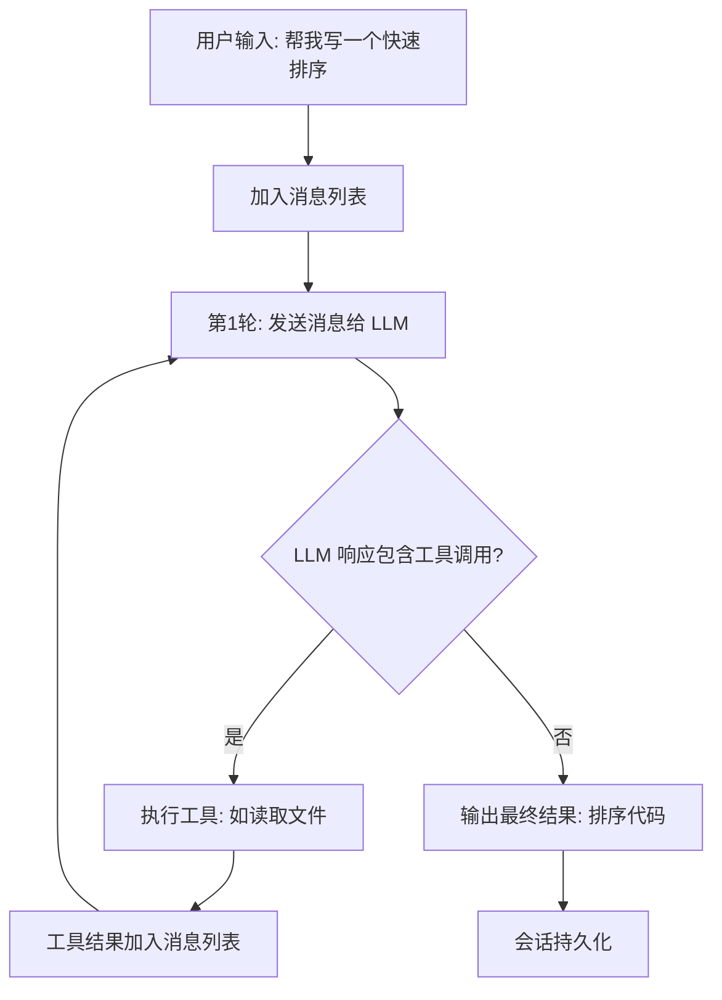

# 第3章 启动到第一条消息：端到端流程概述

## 本章概览

本章追踪一次完整的命令执行路径：从用户在终端输入 `claw "帮我写一个快速排序"`，到第一条 LLM 响应流出，数据依次经过哪些模块、执行什么操作。

本章不展开任何模块的内部实现——那是第4到第12章的任务。本章的作用是勾画路径，让读者建立"一条命令经过哪些地方"的整体印象。全章只包含 5 个代码片段，每个只展示关键路径上的入口点。

| 关键文件 | 职责 |
| --- | --- |
| `rust/crates/rusty-claude-cli/src/main.rs` | CLI 入口，参数解析 |
| `rust/crates/runtime/src/bootstrap.rs` | Bootstrap 阶段定义 |
| `rust/crates/runtime/src/config.rs` | 配置加载与三层合并 |
| `rust/crates/runtime/src/conversation.rs` | 会话创建与消息管理 |
| `rust/crates/api/src/client.rs` | LLM 通信，provider 路由 |

## 3.1 CLI 入口：命令被接收

用户输入 `claw "帮我写一个快速排序"` 后，Rust 版的 `main()` 函数接收命令行参数。`main()` 只做错误包装，核心逻辑在 `run()` 中：

```rust
// claw-code/rust/crates/rusty-claude-cli/src/main.rs

fn run() -> Result<(), Box<dyn std::error::Error>> {
    let args: Vec<String> = env::args().skip(1).collect();
    let json_mode = raw_args_request_json_output(&args);
    if json_mode {
        runtime::suppress_config_warnings_for_json_mode();
    }
    let (args, cwd) = split_global_cwd_args(&args)?;
    apply_global_cwd(cwd)?;
    match parse_args(&args)? {
        CliAction::Prompt { prompt, model, .. } => {
            // 进入交互模式，启动 Turn Loop
        }
        CliAction::Version { .. } => print_version(),
        // ...其他分支
    }
}
```

`parse_args` 把参数解析为 `CliAction` 枚举。用户输入的 prompt 文本匹配到 `CliAction::Prompt` 变体，携带 prompt 内容、模型选择、权限模式等参数。枚举匹配是穷尽的，编译器保证所有分支都被处理。

这条命令不会走 `Version` 或 `Status` 等快速退出路径，而是进入完整的 Bootstrap 流程。

## 3.2 Bootstrap 阶段：系统就绪

Bootstrap 是从命令接收到 Turn Loop 启动之间的初始化过程。Rust 版在 `runtime/src/bootstrap.rs` 中定义了一组阶段：

```rust
// claw-code/rust/crates/runtime/src/bootstrap.rs

pub enum BootstrapPhase {
    CliEntry,
    FastPathVersion,
    StartupProfiler,
    SystemPromptFastPath,
    ChromeMcpFastPath,
    DaemonWorkerFastPath,
    BridgeFastPath,
    DaemonFastPath,
    BackgroundSessionFastPath,
    TemplateFastPath,
    EnvironmentRunnerFastPath,
    MainRuntime,
}
```

`BootstrapPlan` 按顺序编排这些阶段，默认计划包含全部 12 个阶段：

```rust
// claw-code/rust/crates/runtime/src/bootstrap.rs

impl BootstrapPlan {
    pub fn claude_code_default() -> Self {
        Self::from_phases(vec![
            BootstrapPhase::CliEntry,
            BootstrapPhase::FastPathVersion,
            BootstrapPhase::StartupProfiler,
            BootstrapPhase::SystemPromptFastPath,
            BootstrapPhase::ChromeMcpFastPath,
            BootstrapPhase::DaemonWorkerFastPath,
            BootstrapPhase::BridgeFastPath,
            BootstrapPhase::DaemonFastPath,
            BootstrapPhase::BackgroundSessionFastPath,
            BootstrapPhase::TemplateFastPath,
            BootstrapPhase::EnvironmentRunnerFastPath,
            BootstrapPhase::MainRuntime,
        ])
    }
}
```

`CliEntry` 是入口阶段，`FastPathVersion` 处理 `--version` 等快速退出命令，`MainRuntime` 是最终进入完整运行时的阶段。中间的阶段处理各种快速路径和预加载逻辑。

`from_phases` 方法会去除重复阶段，保证同一阶段不会执行两次。这种设计允许不同启动场景自定义阶段序列，同时保证执行安全。

## 3.3 配置加载：三层合并

Bootstrap 过程中，`ConfigLoader` 加载三层配置文件并合并。三个层次从低到高：

| 层级 | 文件路径 | 作用 |
| --- | --- | --- |
| User | `~/.claw/settings.json` | 用户全局配置 |
| Project | `.claw/settings.json` | 项目共享配置 |
| Local | `.claw/settings.local.json` | 个人本地覆盖（不提交 git） |

`ConfigLoader::discover()` 返回按优先级排列的文件列表，`load()` 逐个读取并通过 `deep_merge_objects` 合并，后加载的覆盖先加载的：

```rust
// claw-code/rust/crates/runtime/src/config.rs

pub fn load(&self) -> Result<RuntimeConfig, ConfigError> {
    let mut merged = BTreeMap::new();
    for entry in self.discover() {
        let OptionalConfigFile::Loaded(parsed) = read_optional_json_object(&entry.path)? else {
            continue;
        };
        deep_merge_objects(&mut merged, &parsed.object); // 后加载的覆盖先加载的
    }
    build_runtime_config(merged, ...)
}
```

合并后的 `RuntimeConfig` 包含模型选择、权限模式、MCP 服务器配置、钩子配置等所有运行时参数。这些参数在后续阶段被各模块使用。

## 3.4 工具注册与权限初始化

配置加载完成后，系统注册工具并初始化权限。

工具注册由 `tools` crate 的 `mvp_tool_specs()` 完成，加载所有内置工具（文件读写、Bash 执行、代码搜索等）和 MCP 外部工具。每个工具注册时声明自己的名称、描述和参数 Schema，这些信息后续会发给 LLM，让 LLM 知道有哪些工具可用。

权限初始化由 `PermissionEnforcer` 完成，根据配置中的 `PermissionMode` 设置操作边界：

| 模式 | 允许的操作 |
| --- | --- |
| ReadOnly | 只读，不允许任何写操作 |
| WorkspaceWrite | 只允许写工作区目录 |
| DangerFullAccess | 完全访问，无限制 |

本次命令默认使用 `WorkspaceWrite` 模式，Agent 可以读写当前工作区目录中的文件，但不能修改系统文件。

## 3.5 Turn Loop 启动：第一条消息进入循环

Bootstrap 的 `MainRuntime` 阶段启动 Turn Loop。`ConversationRuntime` 先被初始化，包含系统提示词（由 CLAUDE.md 和内置指令组成）和空的消息列表。然后用户的 prompt 被加入消息列表，开始第一轮循环。

第一轮循环把完整的消息列表发给 LLM，LLM 返回响应。如果响应包含工具调用（比如"先读取项目结构"），Agent 执行工具后把结果加入消息列表，进入第二轮循环。如果响应不包含工具调用，循环结束，输出最终结果。



从用户输入到第一条 LLM 响应流出，数据经过了 CLI 入口、Bootstrap 阶段、配置加载、工具注册、权限初始化、会话创建、Turn Loop 启动这七个环节。每个环节的具体实现在后续章节展开。

## 小结

一次完整的命令执行经过七个环节：CLI 入口接收参数、Bootstrap 阶段完成初始化、ConfigLoader 三层合并配置、ToolPool 注册工具、PermissionEnforcer 设置权限边界、Conversation 初始化会话、ConversationRuntime 启动 Turn Loop。其中 Bootstrap 的 `BootstrapPlan` 按阶段编排初始化流程，ConfigLoader 的三层合并决定运行参数，Turn Loop 的循环决定执行路径。

下一章将深入 Bootstrap 和 CLI 入口的完整源码实现。

| 关键文件 | 对应章节 |
| --- | --- |
| `rusty-claude-cli/src/main.rs` | 第4章 |
| `runtime/src/bootstrap.rs` | 第4章 |
| `runtime/src/config.rs` | 第4章 |
| `runtime/src/conversation.rs` | 第7章 |
| `api/src/client.rs` | 第5章 |
| `runtime/src/permission_enforcer.rs` | 第8章 |
| `runtime/src/session.rs` | 第10章 |
