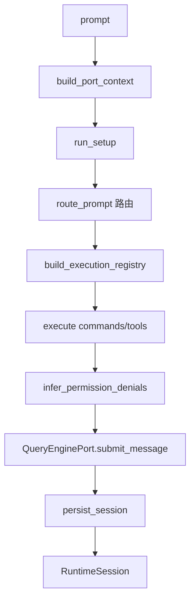

# 第3章 整体架构全景

claw-code 的代码库由两个并行的实现组成：一个 Python 移植工作区和一个 Rust 重写版。在深入单个子系统之前，先建立整体的空间感，明确每个模块和 crate 各自承担什么职责、它们之间如何连接。

## 3.1 双实现布局

仓库根目录下并存两套实现，分别位于 `src/` 和 `rust/crates/`。Python 版的定位写在了 `main.py` 的 parser 描述里：

```python
# claw-code/src/main.py

parser = argparse.ArgumentParser(description='Python porting workspace for the Claude Code rewrite effort')
```

Python 工作区是一个"移植"项目，其目标是把原版 TypeScript 代码的模块表面镜像过来，用于盘点、路由和模拟，而不是真正的生产 CLI。真正的生产实现是 Rust 重写版，位于 `rust/crates/` 下的 workspace 中：

```toml
# claw-code/rust/Cargo.toml

[workspace]
members = ["crates/*"]
resolver = "2"

[workspace.lints.rust]
unsafe_code = "forbid"
```

两个实现的定位差异决定了阅读方式：Python 侧看的是"概念地图"，每个文件对应原版的一个子系统；Rust 侧看的是"真实执行"，每个 crate 是编译后真正跑起来的代码。Rust workspace 强制 `unsafe_code = "forbid"`，说明重写版把内存安全作为硬约束。

| 维度 | Python 移植工作区 | Rust 重写版 |
| --- | --- | --- |
| 位置 | `src/` | `rust/crates/` |
| 定位 | 移植进度盘点、路由模拟 | 生产 CLI |
| 入口 | `main.py` | `rusty-claude-cli/src/main.rs` |
| 模块组织 | 单层 Python 包 + 顶层模块 | Cargo workspace + 多个 crate |
| 数据来源 | 归档 TypeScript 快照 | 真实逻辑实现 |

## 3.2 Python 工作区的模块清单

Python 侧没有正式的依赖注入容器，模块关系靠文件扫描自动盘点。`port_manifest.py` 扫描 `src/` 下所有 `.py` 文件，按顶层目录统计出每个子系统的文件数：

```python
# claw-code/src/port_manifest.py

def build_port_manifest(src_root: Path | None = None) -> PortManifest:
    root = src_root or DEFAULT_SRC_ROOT
    files = [path for path in root.rglob('*.py') if path.is_file()]
    counter = Counter(
        path.relative_to(root).parts[0] if len(path.relative_to(root).parts) > 1 else path.name
        for path in files
        if path.name != '__pycache__'
    )
    modules = tuple(
        Subsystem(name=name, path=f'src/{name}', file_count=count, notes=notes.get(name, 'Python port support module'))
        for name, count in counter.most_common()
    )
    return PortManifest(src_root=root, total_python_files=len(files), top_level_modules=modules)
```

清单的结果是两个数据结构：`Subsystem` 描述单个子系统的文件数和注释，`PortManifest` 汇总整个工作区：

```python
# claw-code/src/models.py

@dataclass(frozen=True)
class Subsystem:
    name: str
    path: str
    file_count: int
    notes: str
```

`notes` 字段对关键模块做了人工标注，见 `port_manifest.py` 顶部的字典。`main.py` 的 `subsystems` 子命令就靠这个清单输出工作区的模块列表。这套机制说明 Python 侧的核心模块之间没有显式的 import 依赖树，而是靠约定和盘点来维持"全景"。

## 3.3 RuntimeSession：会话数据流的中枢

理解架构最直接的方式是看一次会话要经过哪些组件。`runtime.py` 中的 `RuntimeSession` dataclass 把一次完整交互的所有中间产物都列了出来：

```python
# claw-code/src/runtime.py

@dataclass
class RuntimeSession:
    prompt: str
    context: PortContext
    setup: WorkspaceSetup
    setup_report: SetupReport
    system_init_message: str
    history: HistoryLog
    routed_matches: list[RoutedMatch]
    turn_result: TurnResult
    command_execution_messages: tuple[str, ...]
    tool_execution_messages: tuple[str, ...]
    stream_events: tuple[dict[str, object], ...]
    persisted_session_path: str
```

这 12 个字段按执行顺序排列，恰好是会话生命周期的完整快照：输入 `prompt`，装配 `context` 和 `setup_report`，生成 `system_init_message`，路由出 `routed_matches`，执行命令和工具得到两组消息，产出 `turn_result` 和 `stream_events`，最后写入 `persisted_session_path`。组装这些字段的是 `bootstrap_session` 方法：

```python
# claw-code/src/runtime.py

def bootstrap_session(self, prompt: str, limit: int = 5) -> RuntimeSession:
    context = build_port_context()
    setup_report = run_setup(trusted=True)
    setup = setup_report.setup
    history = HistoryLog()
    engine = QueryEnginePort.from_workspace()
    matches = self.route_prompt(prompt, limit=limit)
    registry = build_execution_registry()
    command_execs = tuple(registry.command(match.name).execute(prompt) for match in matches if match.kind == 'command' and registry.command(match.name))
    tool_execs = tuple(registry.tool(match.name).execute(prompt) for match in matches if match.kind == 'tool' and registry.tool(match.name))
    denials = tuple(self._infer_permission_denials(matches))
    stream_events = tuple(engine.stream_submit_message(prompt, ...))
    turn_result = engine.submit_message(prompt, ...)
    persisted_session_path = engine.persist_session()
    return RuntimeSession(...)
```

这段代码把第 1 章和第 2 章介绍过的组件串成了一条线。`PortRuntime` 负责路由，`QueryEnginePort` 负责 turn 执行和持久化，`HistoryLog` 记录每一步的日志，`execution_registry` 统一命令和工具的执行入口。它们之间的调用关系可以用一张图概括：



## 3.4 Bootstrap Graph：启动骨架

启动阶段在 `bootstrap_graph.py` 中被固化为七个命名的 stage，构成整个系统启动的骨架：

```python
# claw-code/src/bootstrap_graph.py

def build_bootstrap_graph() -> BootstrapGraph:
    return BootstrapGraph(
        stages=(
            'top-level prefetch side effects',
            'warning handler and environment guards',
            'CLI parser and pre-action trust gate',
            'setup() + commands/agents parallel load',
            'deferred init after trust',
            'mode routing: local / remote / ssh / teleport / direct-connect / deep-link',
            'query engine submit loop',
        )
    )
```

这七个 stage 是架构层面的时间线：从预取副作用，到环境守卫、信任门禁、并行加载、延迟初始化、模式路由，最后进入提交循环。每个 stage 的细节在第 4 章展开，这里只需记住它定义了系统"从上电到运行"的骨架。`system_init.py` 的 `build_system_init_message` 会把这个骨架和加载数量汇总成一段初始化报告，供 `RuntimeSession` 使用：

```python
# claw-code/src/system_init.py

def build_system_init_message(trusted: bool = True) -> str:
    setup = run_setup(trusted=trusted)
    commands = get_commands()
    tools = get_tools()
    lines = [
        '# System Init',
        f'Trusted: {setup.trusted}',
        f'Loaded command entries: {len(commands)}',
        f'Loaded tool entries: {len(tools)}',
        'Startup steps:',
        *(f'- {step}' for step in setup.setup.startup_steps()),
    ]
    return '\n'.join(lines)
```

## 3.5 Rust runtime crate 的公共 API 地图

Rust 重写版的核心是 `runtime` crate。它的模块清单写在 `lib.rs` 顶部注释里，一句点明了职责边界：

```rust
// claw-code/rust/crates/runtime/src/lib.rs

//! Core runtime primitives for the `claw` CLI and supporting crates.
//! This crate owns session persistence, permission evaluation, prompt assembly,
//! MCP plumbing, tool-facing file operations, and the core conversation loop
//! that drives interactive and one-shot turns.
```

`lib.rs` 的 `mod` 声明就是 runtime crate 的模块地图，按职责可以分组如下：

| 职责 | 模块 |
| --- | --- |
| 会话持久化 | `session.rs`、`session_control.rs`、`summary_compression.rs`、`compact.rs` |
| 权限评估 | `permissions.rs`、`policy_engine.rs`、`permission_enforcer.rs`、`trust_resolver.rs`、`approval_tokens.rs` |
| Prompt 组装 | `prompt.rs` |
| MCP 通信 | `mcp.rs`、`mcp_client.rs`、`mcp_stdio.rs`、`mcp_server.rs`、`mcp_tool_bridge.rs`、`mcp_lifecycle_hardened.rs` |
| 文件操作 | `file_ops.rs`、`git_context.rs` |
| 对话循环 | `conversation.rs` |
| 配置 | `config.rs`、`config_validate.rs` |
| 沙箱与工具 | `sandbox.rs`、`bash.rs`、`bash_validation.rs` |

`lib.rs` 的另一半是大量的 `pub use` 再导出，把各模块内部的类型提升到 crate 根部，形成稳定的公共 API 面。例如 `session::Session`、`conversation::ConversationRuntime`、`config::RuntimeConfig` 都通过 `pub use` 暴露给外部 crate。`rusty-claude-cli` 正是通过这个公共面来调用 runtime 的，两者之间只有单向依赖。

## 3.6 Rust workspace 的 crate 分工

Rust workspace 下共有 11 个 crate，各自有明确的边界：

| crate | 职责 |
| --- | --- |
| `rusty-claude-cli` | CLI 二进制入口，参数解析、模式分发、渲染 |
| `runtime` | 核心运行时，会话、权限、MCP、配置、对话循环 |
| `api` | LLM 供应商客户端，消息构建、SSE 解析、token 计量 |
| `plugins` | 插件与钩子系统 |
| `commands` | 命令元数据 |
| `tools` | 工具实现，含 PDF 提取、lane 完成 |
| `compat-harness` | TypeScript 与重写版的兼容性测试 |
| `mock-anthropic-service` | 测试用的 Anthropic 模拟服务 |
| `claw-rag-service` | RAG 检索服务，含 embedding 和 Qdrant 索引 |
| `claw-analog` | 诊断工具，含 `doctor`、配置查看 |
| `telemetry` | 遥测数据 |

依赖方向是 `rusty-claude-cli` 依赖 `runtime`，`runtime` 再依赖 `api`、`plugins`、`tools` 等底层 crate。这个单向依赖链对应了前面 `RuntimeSession` 里看到的调用顺序：入口层、运行时层、能力层。`claw-rag-service`、`claw-analog`、`mock-anthropic-service` 是相对独立的侧翼服务，不在主调用链上。

## 设计对比

| claw-code 概念 | Java 生态对应 |
| --- | --- |
| Python `src/` 移植工作区 | 概念模型层 / 移植盘点文档 |
| `PortManifest` + `build_port_manifest` | 模块扫描器（类似 jdeps / classpath 扫描） |
| `RuntimeSession` | 一次请求的 `RequestContext` 聚合对象 |
| `lib.rs` 的 `pub use` 再导出 | Maven 模块的公开 `api` 包 |
| Rust workspace 11 个 crate | 多模块 Maven/Gradle 工程 |
| `rusty-claude-cli → runtime → api/tools` 依赖链 | 分层架构：web 层 → service 层 → dao 层 |

Rust workspace 的 crate 划分对应 Java 多模块工程。`runtime` 类似 service 层，聚合了会话、权限、MCP 等核心能力；`api` 类似一个独立的 HTTP client 模块；`rusty-claude-cli` 类似 web 层，只做参数解析和渲染。`lib.rs` 中把内部类型用 `pub use` 提升到 crate 根部，相当于 Java 里把模块内部的实现类封装起来、只暴露 `public` 接口包。区别在于 Java 靠 package 和 `public` 关键字控制可见性，Rust 靠 `pub mod` 和 `pub use` 显式声明每一层边界。

## 小结

本章建立了 claw-code 的整体空间感。代码库由 Python 移植工作区（`src/`）和 Rust 重写版（`rust/crates/`）组成，前者做概念盘点，后者做生产实现。Python 侧靠 `port_manifest.py` 的 `build_port_manifest` 扫描生成模块清单，`runtime.py` 的 `RuntimeSession` 聚合了会话的全部中间产物，`bootstrap_graph.py` 固化了七个启动阶段。Rust 侧的 `runtime` crate 以 `lib.rs` 的模块声明和 `pub use` 再导出为公共 API 面，workspace 下 11 个 crate 按入口层、运行时层、能力层单向依赖。
