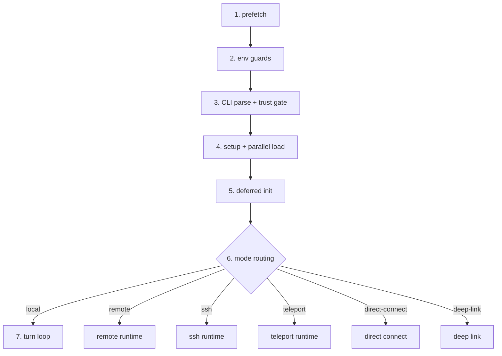

# 第4章 启动流程深度解析

claw-code 的启动过程从 CLI 参数解析开始，经过配置加载、权限初始化、工具池组装，最终进入 Turn Loop。本章追踪这条完整路径，覆盖 Python 版和 Rust 版两个实现。

## 4.1 CLI 入口与参数解析

Python 版的入口在 `main.py`，使用 `argparse` 构建子命令系统：

```python
# claw-code/src/main.py

def build_parser() -> argparse.ArgumentParser:
    parser = argparse.ArgumentParser(description='Python porting workspace for the Claude Code rewrite effort')
    subparsers = parser.add_subparsers(dest='command', required=True)
    subparsers.add_parser('summary', help='render a Markdown summary of the Python porting workspace')
    subparsers.add_parser('manifest', help='print the current Python workspace manifest')
    # ...更多子命令
    return parser

def main(argv: list[str] | None = None) -> int:
    parser = build_parser()
    args = parser.parse_args(argv)
    manifest = build_port_manifest()
    if args.command == 'summary':
        print(QueryEnginePort(manifest).render_summary())
        return 0
    # ...按 command 分发
```

Python 版的 `main()` 函数是一个线性的 if-elif 链，按 `args.command` 的值逐个匹配。每个子命令独立处理，没有共享的初始化阶段。

Rust 版的入口在 `rusty-claude-cli/src/main.rs`，结构完全不同。`main()` 只做错误包装，核心逻辑在 `run()` 函数中：

```rust
// claw-code/rust/crates/rusty-claude-cli/src/main.rs

fn main() {
    if let Err(error) = run() {
        // 错误处理：区分 JSON 模式和文本模式
        let json_output = raw_args_request_json_output(&argv[1..]);
        if json_output {
            println!("{}", error_json);  // 结构化错误输出
        } else {
            eprintln!("[error-kind: {kind}]\nerror: {message}");
        }
        std::process::exit(1);
    }
}

fn run() -> Result<(), Box<dyn std::error::Error>> {
    let args: Vec<String> = env::args().skip(1).collect();
    let json_mode = raw_args_request_json_output(&args);
    if json_mode {
        runtime::suppress_config_warnings_for_json_mode();
    }
    let (args, cwd) = split_global_cwd_args(&args)?;
    apply_global_cwd(cwd)?;
    match parse_args(&args)? {
        CliAction::Version { output_format } => print_version(output_format)?,
        CliAction::Prompt { prompt, model, .. } => { /* 交互模式 */ },
        CliAction::Status { .. } => print_status_snapshot(/* ... */)?,
        // ...
    }
}
```

Rust 版用 `CliAction` 枚举做模式匹配，每个变体对应一种 CLI 行为。与 Python 版的 if-elif 链相比，枚举匹配是穷尽的，编译器保证所有分支都被处理。

`parse_args` 的返回值是 `CliAction` 枚举，定义了所有支持的 CLI 动作：

```rust
// claw-code/rust/crates/rusty-claude-cli/src/main.rs

enum CliAction {
    DumpManifests { output_format, manifests_dir },
    BootstrapPlan { output_format },
    Version { output_format },
    Status { model, model_flag_raw, permission_mode, ... },
    Prompt { prompt, model, output_format, allowed_tools, ... },
    ResumeSession { session_path, commands, ... },
    PrintSystemPrompt { cwd, date, model, ... },
    // ...
}
```

Rust 版在 `run()` 的开头有一行关键的 JSON 模式检测：

```rust
// claw-code/rust/crates/rusty-claude-cli/src/main.rs

let json_mode = raw_args_request_json_output(&args);
if json_mode {
    runtime::suppress_config_warnings_for_json_mode();
}
```

当用户传入 `--output-format json` 时，配置加载阶段的弃用警告会被抑制，保证 stderr 干净，方便下游工具解析。这个设计在 Python 版中没有对应实现。

## 4.2 Bootstrap Graph：七个启动阶段

Python 版在 `bootstrap_graph.py` 中定义了启动阶段图：

```python
# claw-code/src/bootstrap_graph.py

@dataclass(frozen=True)
class BootstrapGraph:
    stages: tuple[str, ...]

def build_bootstrap_graph() -> BootstrapGraph:
    return BootstrapGraph(
        stages=(
            'top-level prefetch side effects',
            'warning handler and environment guards',
            'CLI parser and pre-action trust gate',
            'setup() + commands/agents parallel load',
            'deferred init after trust',
            'mode routing: local / remote / ssh / teleport / direct-connect / deep-link',
            'query engine submit loop',
        )
    )
```

七个阶段按顺序执行，每个阶段有明确的职责：

| 阶段 | 作用 | 对应代码 |
| --- | --- | --- |
| 1. prefetch side effects | 预加载清单文件、注册警告处理器 | `prefetch.py` |
| 2. environment guards | 检查运行环境、设置全局警告 | `system_init.py` |
| 3. CLI parser + trust gate | 解析参数、判断可信模式 | `main.py` `build_parser()` |
| 4. setup + parallel load | 加载命令和 Agent 定义 | `setup.py` |
| 5. deferred init | 延迟初始化非关键组件 | `deferred_init.py` |
| 6. mode routing | 选择运行模式 | `main.py` 中的 mode 分发 |
| 7. query engine submit loop | 进入 Turn Loop | `query_engine.py` |



阶段 3 的 trust gate 决定了后续初始化路径。`system_init.py` 中的 `build_system_init_message` 函数接受 `trusted` 参数：

```python
# claw-code/src/system_init.py

def build_system_init_message(trusted: bool = True) -> str:
    setup = run_setup(trusted=trusted)  # trusted 影响加载范围
    commands = get_commands()
    tools = get_tools()
    lines = [
        '# System Init',
        f'Trusted: {setup.trusted}',
        f'Loaded command entries: {len(commands)}',
        f'Loaded tool entries: {len(tools)}',
        'Startup steps:',
        *(f'- {step}' for step in setup.setup.startup_steps()),
    ]
    return '\n'.join(lines)
```

不可信模式下，`setup()` 会跳过部分命令和工具的加载，减少攻击面。这与 Rust 版的 `PermissionMode` 机制对应。

## 4.3 配置加载与三层合并

Rust 版的配置系统在 `runtime/src/config.rs` 中实现，核心是 `ConfigLoader` 结构体：

```rust
// claw-code/rust/crates/runtime/src/config.rs

pub struct ConfigLoader {
    cwd: PathBuf,        // 当前工作目录
    config_home: PathBuf, // 用户配置目录（如 ~/.claw/）
}
```

`ConfigLoader::discover()` 返回按优先级排列的配置文件列表，从低到高：

```rust
// claw-code/rust/crates/runtime/src/config.rs

pub fn discover(&self) -> Vec<ConfigEntry> {
    vec![
        ConfigEntry { source: ConfigSource::User,
            path: user_legacy_path },                    // ~/.claw.json
        ConfigEntry { source: ConfigSource::User,
            path: self.config_home.join("settings.json") }, // ~/.claw/settings.json
        ConfigEntry { source: ConfigSource::Project,
            path: self.cwd.join(".claw.json") },          // ./.claw.json
        ConfigEntry { source: ConfigSource::Project,
            path: self.cwd.join(".claw").join("settings.json") }, // ./.claw/settings.json
        ConfigEntry { source: ConfigSource::Local,
            path: self.cwd.join(".claw").join("settings.local.json") }, // ./.claw/settings.local.json
    ]
}
```

三层配置的优先级从低到高：User → Project → Local。`ConfigSource` 枚举定义了这三个层级：

```rust
// claw-code/rust/crates/runtime/src/config.rs

pub enum ConfigSource {
    User,    // 用户全局配置
    Project, // 项目共享配置
    Local,   // 个人本地覆盖（不提交 git）
}
```

`load()` 方法遍历所有发现的配置文件，通过 `deep_merge_objects` 逐层合并：

```rust
// claw-code/rust/crates/runtime/src/config.rs

pub fn load(&self) -> Result<RuntimeConfig, ConfigError> {
    let mut merged = BTreeMap::new();
    let mut loaded_entries = Vec::new();

    for entry in self.discover() {
        let OptionalConfigFile::Loaded(parsed) = read_optional_json_object(&entry.path)? else {
            continue;  // 文件不存在或为空，跳过
        };
        let validation = validate_config_file(&parsed.object, &parsed.source, &entry.path);
        if !validation.is_ok() {
            return Err(ConfigError::Parse(first_error.to_string()));
        }
        merge_mcp_servers(&mut mcp, entry.source, &parsed.object, &entry.path)?;
        deep_merge_objects(&mut merged, &parsed.object);  // 后加载的覆盖先加载的
        loaded_entries.push(entry);
    }
    build_runtime_config(merged, loaded_entries, mcp)
}
```

合并过程中还会收集 MCP 服务器配置（`merge_mcp_servers`）和验证钩子配置（`validate_optional_hooks_config`）。每个配置文件在合并前都会经过 schema 验证，无效文件直接报错返回。

`ConfigFileReport` 记录了每个配置文件的加载状态和键覆盖情况：

```rust
// claw-code/rust/crates/runtime/src/config.rs

pub struct ConfigFileReport {
    pub entry: ConfigEntry,
    pub loaded: bool,
    pub status: ConfigFileStatus,  // Loaded / NotFound / Skipped / LoadError
    pub wins_for_keys: Vec<String>,   // 此文件中生效的键
    pub shadowed_keys: Vec<String>,   // 被更高优先级覆盖的键
}
```

这个设计让 `claw status` 命令可以展示每个配置项来自哪个文件，方便调试。

Python 版的 `bootstrap/__init__.py` 目前只是一个占位模块，从归档元数据加载信息：

```python
# claw-code/src/bootstrap/__init__.py

from src._archive_helper import load_archive_metadata

_SNAPSHOT = load_archive_metadata("bootstrap")
ARCHIVE_NAME = _SNAPSHOT["archive_name"]
MODULE_COUNT = _SNAPSHOT["module_count"]
SAMPLE_FILES = tuple(_SNAPSHOT["sample_files"])
```

实际的配置加载逻辑在 Python 版中尚未完整移植，主要由 Rust 版承载。

## 4.4 模型与权限的来源追踪

Rust 版的 `run()` 函数在解析参数后，会确定模型和权限模式的来源。`ModelProvenance` 结构体记录模型字符串的完整溯源：

```rust
// claw-code/rust/crates/rusty-claude-cli/src/main.rs

struct ModelProvenance {
    resolved: String,      // 最终使用的模型名（别名展开后）
    raw: Option<String>,   // 用户原始输入
    source: ModelSource,   // 来源：Flag / Env / Config / Default
    alias_resolved_to: Option<String>,  // 别名展开目标
    env_var: Option<String>,            // 环境变量名（当 source=Env）
}

enum ModelSource {
    Flag,    // --model 命令行参数
    Env,     // 环境变量
    Config,  // settings.json 中的 model 字段
    Default, // 编译时默认值
}
```

权限模式有同样的溯源机制：

```rust
// claw-code/rust/crates/rusty-claude-cli/src/main.rs

enum PermissionModeSource {
    Flag,
    Env,
    Config,
    Default,
}

struct PermissionModeProvenance {
    mode: PermissionMode,  // ReadOnly / WorkspaceWrite / DangerFullAccess
    source: PermissionModeSource,
    env_var: Option<&'static str>,
}
```

默认模型是 `anthropic/claude-opus-4-7`，定义在编译时常量中：

```rust
// claw-code/rust/crates/rusty-claude-cli/src/main.rs

const DEFAULT_MODEL: &str = "anthropic/claude-opus-4-7";
```

这种四级溯源设计（Flag → Env → Config → Default）使得 `claw status` 命令能精确告诉用户当前模型和权限来自哪里，而不是让用户去猜。

## 4.5 错误分类

`main()` 函数中的错误处理有一套完整的分类体系。`classify_error_kind()` 将错误消息映射为 `snake_case` 的机器可读标签：

```rust
// claw-code/rust/crates/rusty-claude-cli/src/main.rs

fn classify_error_kind(message: &str) -> &'static str {
    if message.starts_with("unknown_slash_command:") {
        "unknown_slash_command"
    } else if message.contains("missing Anthropic credentials") {
        "missing_credentials"
    } else if message.contains("session not found") {
        "session_not_found"
    } else if message.starts_with("invalid_cwd:") {
        "invalid_cwd"
    } else if message.contains("unrecognized argument") {
        "cli_parse"
    } else if message.contains("api failed") && message.contains("401") {
        "api_auth_error"
    } else if message.contains("api failed") && message.contains("429") {
        "api_rate_limit_error"
    }
    // ...更多分支
}
```

JSON 模式下，错误以结构化对象输出：

```rust
// claw-code/rust/crates/rusty-claude-cli/src/main.rs

let mut error_json = serde_json::json!({
    "type": "error",
    "kind": kind,
    "status": "error",
    "error_kind": kind,
    "error": short_reason,
    "message": short_reason,
    "action": "abort",
    "hint": hint,
    "exit_code": 1,
});
```

特定错误类型还会附加结构化字段。例如 `invalid_cwd` 错误会附带路径和原因：

```rust
if kind == "invalid_cwd" {
    object.insert("path".to_string(), serde_json::json!(&error.path));
    object.insert("reason".to_string(), serde_json::json!(error.reason.as_str()));
}
```

这种设计让下游工具（如 CI 脚本）可以根据 `error_kind` 做精确的错误路由，而不需要正则匹配错误消息文本。

## 设计对比

| claw-code 概念 | Java 生态对应 |
| --- | --- |
| `CliAction` 枚举匹配 | Spring MVC 的 `@RequestMapping` 路由分发 |
| Bootstrap 七阶段 | Spring Boot 启动阶段（扫描 → 注册 → 初始化 → 就绪） |
| `ConfigLoader` 三层合并 | `application.properties` → `application-{profile}.properties` → 环境变量 |
| `ConfigFileReport` 键覆盖追踪 | Spring Boot 的 `--debug` 配置来源报告 |
| `ModelProvenance` 四级溯源 | Spring Boot 的 `@Value` 配置注入来源链 |
| `classify_error_kind` 错误标签 | Spring 的 `ErrorCode` 体系 |

Spring Boot 的启动过程也是分阶段的：扫描 classpath → 注册 Bean → 初始化 IoC 容器 → 启动内嵌容器 → 执行 Runner。claw-code 的 Bootstrap 七阶段与此结构类似，区别在于 claw-code 的阶段 5（deferred init）是一个显式的延迟初始化点，而 Spring Boot 的延迟初始化通过 `@Lazy` 注解分散在各 Bean 上。

配置合并机制几乎一致。Spring Boot 的 `application.properties` → `application-{profile}.properties` → 命令行参数的覆盖顺序，对应 claw-code 的 User → Project → Local。`ConfigFileReport` 的 `wins_for_keys` 和 `shadowed_keys` 字段提供了 Spring Boot `--debug` 模式下的配置来源追踪能力。

## 小结

本章覆盖了 claw-code 启动流程的完整路径。Python 版入口在 `src/main.py`，使用 `argparse` 构建子命令系统；Rust 版入口在 `rust/crates/rusty-claude-cli/src/main.rs`，使用 `CliAction` 枚举做穷尽匹配。启动阶段由 `bootstrap_graph.py` 定义为七步，从 prefetch 到 Turn Loop。配置加载在 Rust 版的 `runtime/src/config.rs` 中实现，`ConfigLoader` 按 User → Project → Local 三层合并，每层通过 `deep_merge_objects` 覆盖。模型和权限的来源通过 `ModelProvenance` 和 `PermissionModeProvenance` 做四级溯源。
