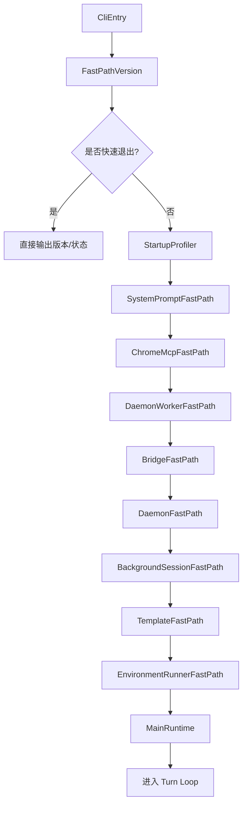

# 第4章 启动流程深度解析：Bootstrap 七阶段与配置合并

## 本章概览

本章分析 claw-code 从接收命令行参数到进入 Turn Loop 之间的完整初始化过程。
<!-- 对应第2章架构全景中的 `rusty-claude-cli` 和 `runtime::config` 两个模块。 -->

启动流程要解决的核心问题是：如何把一组命令行参数、若干个 JSON 配置文件、一个 CLAUDE.md 指令文件，组装成一个可运行的 Agent 系统。这个过程分为多个阶段（Bootstrap Plan），每个阶段有明确的职责，前一阶段的输出是后一阶段的输入。

本章按数据流顺序展开：先看 CLI 入口如何接收和分发命令（4.1），再看 Bootstrap 阶段如何编排初始化（4.2），然后深入配置加载的三层合并机制（4.3），最后看模型和权限的来源追踪（4.4）。

| 关键文件 | 职责 |
| --- | --- |
| `rust/crates/rusty-claude-cli/src/main.rs` | CLI 入口，`CliAction` 枚举分发 |
| `rust/crates/runtime/src/bootstrap.rs` | Bootstrap 阶段定义与编排 |
| `rust/crates/runtime/src/config.rs` | 三层配置加载与合并 |

## 4.1 CLI 入口与参数解析

入口在 `rust/crates/rusty-claude-cli/src/main.rs` 中。`main()` 函数只做错误包装，核心逻辑在 `run()` 中：

```rust
// claw-code/rust/crates/rusty-claude-cli/src/main.rs

fn run() -> Result<(), Box<dyn std::error::Error>> {
    let args: Vec<String> = env::args().skip(1).collect();
    let json_mode = raw_args_request_json_output(&args);
    if json_mode {
        runtime::suppress_config_warnings_for_json_mode();
    }
    let (args, cwd) = split_global_cwd_args(&args)?;
    apply_global_cwd(cwd)?;
    match parse_args(&args)? {
        CliAction::DumpManifests { output_format, manifests_dir } => {
            dump_manifests(manifests_dir.as_deref(), output_format)?
        }
        CliAction::Version { output_format } => print_version(output_format)?,
        CliAction::Status { model, model_flag_raw, permission_mode, .. } => {
            print_status_snapshot(&model, model_flag_raw.as_deref(), permission_mode, output_format)?
        }
        CliAction::Prompt { prompt, model, output_format, .. } => {
            // 进入交互模式，启动 Turn Loop
        }
        CliAction::Repl { model, .. } => {
            // 进入 REPL 模式
        }
        // ...其他分支
    }
    Ok(())
}
```

`run()` 函数的前三行有一个重要的设计：JSON 模式检测。`raw_args_request_json_output(&args)` 在正式解析参数之前先扫描原始 argv，检查是否包含 `--output-format json`。如果是，就调用 `suppress_config_warnings_for_json_mode()` 抑制配置加载阶段的弃用警告。

这么做是因为后续的 `ConfigLoader::load()` 在发现过时的配置项时会向 stderr 输出警告文本。在 JSON 模式下，下游工具（如 CI 脚本）期望 stderr 是干净的——任何非 JSON 输出都会干扰解析。这个"预扫描 + 抑制"的设计确保了 JSON 模式的输出纯粹性。

`parse_args()` 返回 `CliAction` 枚举，定义了所有支持的 CLI 动作：

```rust
// claw-code/rust/crates/rusty-claude-cli/src/main.rs

enum CliAction {
    DumpManifests { output_format: CliOutputFormat, manifests_dir: Option<PathBuf> },
    BootstrapPlan { output_format: CliOutputFormat },
    Version { output_format: CliOutputFormat },
    Status { model: String, model_flag_raw: Option<String>, permission_mode: PermissionModeProvenance, .. },
    Prompt { prompt: String, model: String, output_format: CliOutputFormat, .. },
    Repl { model: String, allowed_tools: Option<AllowedToolSet>, .. },
    ResumeSession { session_path: PathBuf, commands: Vec<String>, .. },
    PrintSystemPrompt { cwd: PathBuf, date: String, model: String, .. },
    Config { section: Option<String>, .. },
    Diff { .. },
    Export { session_reference: String, .. },
    // ...更多变体
}
```

每个枚举变体对应一种 CLI 行为，变体携带的数据就是该行为所需的全部参数。Rust 的 `match` 是穷尽的——编译器强制处理所有枚举变体，否则编译不通过。这意味着如果未来新增了一个 `CliAction` 变体但忘了在 `match` 中处理，编译阶段就会报错。

`CliAction::Prompt` 是最核心的变体——用户输入 `claw "帮我写一个快速排序"` 时就走这个分支。`LiveCli::new()` 在这个分支中被调用，完成完整的运行时初始化：

```rust
// claw-code/rust/crates/rusty-claude-cli/src/main.rs

let resolved_model = resolve_repl_model(model)?;
let mut cli = LiveCli::new(resolved_model, true, allowed_tools, permission_mode)?;
cli.set_reasoning_effort(reasoning_effort);
cli.run_turn_with_output(&effective_prompt, output_format, compact)?;
```

`LiveCli::new()` 内部依次完成：构建 system prompt、创建 session、调用 `build_runtime()` 组装运行时。这是 Bootstrap 的核心调用链。

## 4.2 Bootstrap Plan：阶段编排

Rust 版在 `runtime/src/bootstrap.rs` 中定义了启动阶段。`BootstrapPhase` 枚举列出了所有可能的阶段：

```rust
// claw-code/rust/crates/runtime/src/bootstrap.rs

pub enum BootstrapPhase {
    CliEntry,                    // CLI 入口
    FastPathVersion,             // --version 快速退出
    StartupProfiler,             // 启动性能分析
    SystemPromptFastPath,        // System Prompt 快速路径
    ChromeMcpFastPath,           // Chrome MCP 快速路径
    DaemonWorkerFastPath,        // Daemon Worker 快速路径
    BridgeFastPath,              // Bridge 快速路径
    DaemonFastPath,              // Daemon 快速路径
    BackgroundSessionFastPath,   // 后台会话快速路径
    TemplateFastPath,            // 模板快速路径
    EnvironmentRunnerFastPath,   // 环境运行器快速路径
    MainRuntime,                 // 主运行时
}
```

`BootstrapPlan` 按顺序编排这些阶段，默认计划包含全部 12 个阶段：

```rust
// claw-code/rust/crates/runtime/src/bootstrap.rs

impl BootstrapPlan {
    pub fn claude_code_default() -> Self {
        Self::from_phases(vec![
            BootstrapPhase::CliEntry,
            BootstrapPhase::FastPathVersion,
            BootstrapPhase::StartupProfiler,
            BootstrapPhase::SystemPromptFastPath,
            BootstrapPhase::ChromeMcpFastPath,
            BootstrapPhase::DaemonWorkerFastPath,
            BootstrapPhase::BridgeFastPath,
            BootstrapPhase::DaemonFastPath,
            BootstrapPhase::BackgroundSessionFastPath,
            BootstrapPhase::TemplateFastPath,
            BootstrapPhase::EnvironmentRunnerFastPath,
            BootstrapPhase::MainRuntime,
        ])
    }
}
```

`from_phases` 方法会去除重复阶段，保证同一阶段不会执行两次：

```rust
// claw-code/rust/crates/runtime/src/bootstrap.rs

pub fn from_phases(phases: Vec<BootstrapPhase>) -> Self {
    let mut deduped = Vec::new();
    for phase in phases {
        if !deduped.contains(&phase) {
            deduped.push(phase);
        }
    }
    Self { phases: deduped }
}
```

这种设计允许不同启动场景自定义阶段序列，同时保证执行安全。比如 `--version` 只需要 `CliEntry` 和 `FastPathVersion` 两个阶段，不需要进入 `MainRuntime`。



`MainRuntime` 阶段是进入完整运行时的入口。在这个阶段，`build_runtime()` 被调用，它组装 `ConversationRuntime` 所需的所有组件：API 客户端、工具执行器、会话状态、权限策略。

## 4.3 配置加载与三层合并

### ConfigLoader 结构

Rust 版的配置系统在 `runtime/src/config.rs` 中实现。`ConfigLoader` 是核心结构体，只包含两个路径：

```rust
// claw-code/rust/crates/runtime/src/config.rs

pub struct ConfigLoader {
    cwd: PathBuf,        // 当前工作目录
    config_home: PathBuf, // 用户配置目录（如 ~/.claw/）
}
```

这两个路径决定了配置文件的搜索范围。`ConfigLoader::default_for(cwd)` 用默认的 `config_home` 创建实例：

```rust
// claw-code/rust/crates/runtime/src/config.rs

pub fn default_for(cwd: impl Into<PathBuf>) -> Self {
    let cwd = cwd.into();
    let config_home = default_config_home();
    Self { cwd, config_home }
}
```

### discover()：文件发现

`discover()` 方法返回按优先级排列的配置文件列表：

```rust
// claw-code/rust/crates/runtime/src/config.rs

pub fn discover(&self) -> Vec<ConfigEntry> {
    let user_legacy_path = self.config_home.parent().map_or_else(
        || PathBuf::from(".claw.json"),
        |parent| parent.join(".claw.json"),
    );
    vec![
        ConfigEntry { source: ConfigSource::User,
            path: user_legacy_path },                        // ~/.claw.json（旧格式）
        ConfigEntry { source: ConfigSource::User,
            path: self.config_home.join("settings.json") },  // ~/.claw/settings.json
        ConfigEntry { source: ConfigSource::Project,
            path: self.cwd.join(".claw.json") },             // ./.claw.json（旧格式）
        ConfigEntry { source: ConfigSource::Project,
            path: self.cwd.join(".claw").join("settings.json") }, // ./.claw/settings.json
        ConfigEntry { source: ConfigSource::Local,
            path: self.cwd.join(".claw").join("settings.local.json") }, // ./.claw/settings.local.json
    ]
}
```

这里有五个配置文件，分为三个层级。`ConfigSource` 枚举定义了层级：

```rust
// claw-code/rust/crates/runtime/src/config.rs

pub enum ConfigSource {
    User,    // 用户全局配置
    Project, // 项目共享配置
    Local,   // 个人本地覆盖（不提交 git）
}
```

每个层级的含义：

User 级（`~/.claw/settings.json`）：用户在所有项目中共享的配置。比如默认模型选择、API 密钥存储方式。

Project 级（`./.claw/settings.json`）：项目团队共享的配置，提交到 git。比如项目允许的 MCP 服务器列表、钩子定义。

Local 级（`./.claw/settings.local.json`）：个人覆盖配置，不提交 git（应加入 `.gitignore`）。比如开发时临时切换到更强的模型、调试时开启额外日志。

每个层级都有旧格式（`.claw.json` 平铺在目录下）和新格式（`.claw/settings.json` 放在子目录中）两种路径。旧格式是为了向后兼容，新格式是推荐用法。`discover()` 返回的列表顺序是 User → Project → Local，从低优先级到高优先级。

### load()：逐文件合并

`load()` 方法遍历 `discover()` 返回的文件列表，逐个读取并合并：

```rust
// claw-code/rust/crates/runtime/src/config.rs

pub fn load(&self) -> Result<RuntimeConfig, ConfigError> {
    let mut merged = BTreeMap::new();
    let mut loaded_entries = Vec::new();
    let mut mcp = McpConfigCollection::default();
    let mut all_warnings = Vec::new();

    for entry in self.discover() {
        crate::config_validate::check_unsupported_format(&entry.path)?;
        let OptionalConfigFile::Loaded(parsed) = read_optional_json_object(&entry.path)? else {
            continue;  // 文件不存在或为空，跳过
        };
        let validation = crate::config_validate::validate_config_file(
            &parsed.object,
            &parsed.source,
            &entry.path,
        );
        if !validation.is_ok() {
            let first_error = &validation.errors[0];
            return Err(ConfigError::Parse(first_error.to_string()));
        }
        all_warnings.extend(validation.warnings);
        validate_optional_hooks_config(&parsed.object, &entry.path)?;
        merge_mcp_servers(&mut mcp, entry.source, &parsed.object, &entry.path)?;
        deep_merge_objects(&mut merged, &parsed.object);  // 后加载的覆盖先加载的
        loaded_entries.push(entry);
    }

    for warning in &all_warnings {
        emit_config_warning_once(&warning.to_string());
    }

    build_runtime_config(merged, loaded_entries, mcp)
}
```

这段代码做了五件事。第一，格式检查（`check_unsupported_format`）。在读取文件之前先检查文件格式是否被支持，比如不支持 YAML 或 TOML 格式的配置文件。

第二，可选读取（`read_optional_json_object`）。配置文件是可选的——五个文件中可能只有一两个存在。`OptionalConfigFile` 是一个枚举，`Loaded` 变体表示成功读取，其他变体表示跳过。`let-else` 语法在模式不匹配时直接跳过，避免了嵌套的 if。

第三，Schema 验证（`validate_config_file`）。每个配置文件在合并前都要经过 schema 验证。验证不通过直接返回错误，不会把无效配置混入合并结果。验证还会收集警告（`validation.warnings`），比如使用了已弃用的配置项名。警告不阻断加载，但会通过 `emit_config_warning_once` 输出到 stderr。

`emit_config_warning_once` 有一个去重机制，用进程级的 `HashSet` 记录已输出的警告：

```rust
// claw-code/rust/crates/runtime/src/config.rs

static EMITTED_CONFIG_WARNINGS: std::sync::OnceLock<Mutex<HashSet<String>>> =
    std::sync::OnceLock::new();

fn emit_config_warning_once(warning: &str) {
    if SUPPRESS_CONFIG_WARNINGS_STDERR.load(std::sync::atomic::Ordering::Relaxed) {
        return;
    }
    let set = EMITTED_CONFIG_WARNINGS.get_or_init(|| Mutex::new(HashSet::new()));
    let mut guard = set.lock().unwrap_or_else(|e| e.into_inner());
    if guard.insert(warning.to_string()) {
        eprintln!("warning: {warning}");
    }
}
```

`SUPPRESS_CONFIG_WARNINGS_STDERR` 就是 4.1 节中 `suppress_config_warnings_for_json_mode()` 设置的原子布尔值。当 JSON 模式开启时，警告直接丢弃。`guard.insert()` 返回 `true` 表示集合中之前没有这个警告（首次出现），输出到 stderr；返回 `false` 表示重复警告，跳过。

第四，MCP 服务器合并（`merge_mcp_servers`）。MCP 配置不是简单的键值对，而是嵌套的服务器定义，需要专门的合并逻辑。

第五，深度合并（`deep_merge_objects`）。递归地合并两个 JSON 对象：对于同名键，如果两个值都是对象，递归合并；否则后加载的值直接覆盖先加载的值。

### ConfigFileReport：键覆盖追踪

合并完成后，每个配置文件的加载状态被记录在 `ConfigFileReport` 中：

```rust
// claw-code/rust/crates/runtime/src/config.rs

pub struct ConfigFileReport {
    pub entry: ConfigEntry,
    pub loaded: bool,
    pub status: ConfigFileStatus,
    pub reason: Option<String>,
    pub detail: Option<String>,
    pub precedence_rank: usize,
    pub wins_for_keys: Vec<String>,     // 此文件中生效的键
    pub shadowed_keys: Vec<String>,     // 被更高优先级覆盖的键
    key_paths: Vec<String>,
}
```

`wins_for_keys` 和 `shadowed_keys` 是两个关键字段。如果一个键在当前文件中定义，且没有被更高优先级的文件覆盖，它出现在 `wins_for_keys` 中。如果被覆盖了，出现在 `shadowed_keys` 中。这个设计让 `claw status` 命令可以精确展示每个配置项来自哪个文件。

### RuntimeFeatureConfig：合并后的配置视图

合并的最终产物是 `RuntimeFeatureConfig`，它把扁平的 JSON 对象解析为类型化的配置视图：

```rust
// claw-code/rust/crates/runtime/src/config.rs

pub struct RuntimeFeatureConfig {
    hooks: RuntimeHookConfig,
    plugins: RuntimePluginConfig,
    mcp: McpConfigCollection,
    oauth: Option<OAuthConfig>,
    model: Option<String>,
    aliases: BTreeMap<String, String>,
    permission_mode: Option<ResolvedPermissionMode>,
    sandbox: SandboxConfig,
    api_timeout: ApiTimeoutConfig,
    rules_import: RulesImportConfig,
    provider: RuntimeProviderConfig,
    // ...更多字段
}
```

每个字段对应一个子系统。`RuntimeFeatureConfig` 是配置加载的终点，也是后续所有子系统初始化的起点。

### API 超时配置

`ApiTimeoutConfig` 是一个值得单独说明的配置项：

```rust
// claw-code/rust/crates/runtime/src/config.rs

pub struct ApiTimeoutConfig {
    pub connect_timeout_secs: u64,    // 连接超时，默认 30 秒
    pub request_timeout_secs: u64,    // 请求超时，默认 300 秒（5 分钟）
    pub max_retries: u32,             // 最大重试次数，默认 8 次
}

impl Default for ApiTimeoutConfig {
    fn default() -> Self {
        Self {
            connect_timeout_secs: 30,
            request_timeout_secs: 300,
            max_retries: 8,
        }
    }
}
```

请求超时设为 5 分钟是因为 LLM 推理可能很慢——复杂 prompt 的首 token 延迟可能超过 60 秒，完整响应可能需要数分钟。如果超时太短，长任务会被误杀。重试 8 次是为了应对 API 的瞬态错误（429 限流、503 服务不可用），每次重试之间有指数退避。

## 4.4 模型与权限的来源追踪

### ModelProvenance：四级溯源

Rust 版的 `run()` 函数在解析参数后，需要确定使用哪个模型。模型的来源有四个层级，优先级从高到低：命令行参数（Flag）→ 环境变量（Env）→ 配置文件（Config）→ 编译时默认值（Default）。

`ModelProvenance` 结构体记录模型的完整溯源信息：

```rust
// claw-code/rust/crates/rusty-claude-cli/src/main.rs

struct ModelProvenance {
    resolved: String,      // 最终使用的模型名（别名展开后）
    raw: Option<String>,   // 用户原始输入（别名展开前）
    source: ModelSource,   // 来源：Flag / Env / Config / Default
    alias_resolved_to: Option<String>,  // 别名展开目标
    env_var: Option<String>,            // 环境变量名（当 source=Env 时）
}
```

`resolved` 是最终使用的模型名。`raw` 是用户原始输入，可能是一个别名（如 `opus`），`resolved` 是别名展开后的完整名（如 `anthropic/claude-opus-4-7`）。`alias_resolved_to` 在别名展开时记录展开目标，方便调试。`env_var` 记录是哪个环境变量提供了模型名（如 `CLAW_MODEL` 或 `ANTHROPIC_MODEL`）。

`ModelSource` 枚举定义了四个来源：

```rust
// claw-code/rust/crates/rusty-claude-cli/src/main.rs

enum ModelSource {
    Flag,    // --model 命令行参数
    Env,     // 环境变量
    Config,  // settings.json 中的 model 字段
    Default, // 编译时默认值
}
```

编译时默认值定义在常量中：

```rust
// claw-code/rust/crates/rusty-claude-cli/src/main.rs

const DEFAULT_MODEL: &str = "anthropic/claude-opus-4-7";
```

`from_env_or_config_or_default()` 方法实现了四级溯源逻辑：

```rust
// claw-code/rust/crates/rusty-claude-cli/src/main.rs

fn from_env_or_config_or_default(cli_model: &str) -> Result<Self, String> {
    if cli_model != DEFAULT_MODEL {
        let provenance = Self::from_resolved(cli_model, cli_model, ModelSource::Flag, None);
        provenance.validate()?;
        return Ok(provenance);
    }
    if let Some(env_model) = env_model_for_runtime() {
        let provenance =
            Self::from_raw(&env_model.value, ModelSource::Env, Some(env_model.name));
        provenance.validate()?;
        return Ok(provenance);
    }
    if let Some(config_model) = config_model_for_current_dir() {
        let provenance = Self::from_raw(&config_model, ModelSource::Config, None);
        provenance.validate()?;
        return Ok(provenance);
    }
    Ok(Self::default_fallback())
}
```

这段代码的逻辑是：先检查是否有 `--model` flag，再检查环境变量（`CLAW_MODEL`、`ANTHROPIC_MODEL`、`ANTHROPIC_DEFAULT_MODEL`），再检查配置文件，最后回退到默认值。每一层如果命中就立即返回，不再检查更低优先级的来源。

为什么要记录来源？因为 `claw status` 命令需要展示"当前模型来自哪里"。用户设置了 `--model opus` 但发现没生效，可能是因为环境变量 `CLAW_MODEL` 设置了不同的值。`ModelProvenance` 让这个问题可追溯。

### PermissionModeProvenance：权限模式溯源

权限模式有同样的溯源机制：

```rust
// claw-code/rust/crates/rusty-claude-cli/src/main.rs

enum PermissionModeSource {
    Flag, Env, Config, Default,
}

struct PermissionModeProvenance {
    mode: PermissionMode,
    source: PermissionModeSource,
    env_var: Option<&'static str>,
}
```

`PermissionMode` 定义了三个权限级别：

```rust
// claw-code/rust/crates/runtime/src/config.rs

pub enum ResolvedPermissionMode {
    ReadOnly,         // 只读，不允许任何写操作
    WorkspaceWrite,   // 只允许写工作区目录
    DangerFullAccess, // 完全访问，无限制
}
```

默认权限模式是 `WorkspaceWrite`：

```rust
// claw-code/rust/crates/rusty-claude-cli/src/main.rs

impl PermissionModeProvenance {
    fn default_fallback() -> Self {
        Self {
            mode: PermissionMode::WorkspaceWrite,
            source: PermissionModeSource::Default,
            env_var: None,
        }
    }
}
```

`WorkspaceWrite` 作为默认值而不是 `ReadOnly`，是因为 claw-code 的主要用途是写代码——如果默认只读，用户每次都要手动指定 `--permission-mode workspace-write`，体验太差。`DangerFullAccess` 只在用户显式指定时才启用，避免误操作。

`is_explicit()` 方法判断权限模式是否是用户显式设置的：

```rust
// claw-code/rust/crates/rusty-claude-cli/src/main.rs

impl PermissionModeSource {
    fn is_explicit(self) -> bool {
        !matches!(self, Self::Default)
    }
}
```

当 `source` 是 `Default` 时，`is_explicit()` 返回 `false`，表示权限模式不是用户主动选择的，而是系统回退到默认值。这个信息在 `claw status` 中展示，提醒用户当前权限是默认值而非显式选择。

## 小结

claw-code 的启动流程从 CLI 入口到 Turn Loop 分为多个阶段。CLI 入口 `main.rs` 用 `CliAction` 枚举和穷尽 `match` 匹配分发命令，编译时保证所有分支被处理。Bootstrap 由 `BootstrapPlan` 按阶段编排，默认包含 12 个阶段，从 `CliEntry` 到 `MainRuntime`，`from_phases` 方法自动去重保证安全。配置加载由 `ConfigLoader` 的 `discover()` 发现五个配置文件（三个层级，每层新旧两种格式），`load()` 逐个读取并通过 `deep_merge_objects` 递归合并，同时进行 schema 验证和 MCP 服务器合并，`ConfigFileReport` 记录每个键的覆盖关系。模型和权限的来源通过四级溯源（Flag → Env → Config → Default）记录，`claw status` 命令可展示完整来源链。

| 关键文件 | 核心机制 | 对应章节 |
| --- | --- | --- |
| `rusty-claude-cli/src/main.rs` | `CliAction` 枚举，`run()` 分发，`LiveCli::new()` | 本章 4.1 |
| `runtime/src/bootstrap.rs` | `BootstrapPhase`，`BootstrapPlan` | 本章 4.2 |
| `runtime/src/config.rs` | `ConfigLoader`，三层合并，`ConfigFileReport` | 本章 4.3 |
| `rusty-claude-cli/src/main.rs` | `ModelProvenance`，`PermissionModeProvenance` | 本章 4.4 |

下一章将分析 API 通信与模型交互——claw-code 如何与 LLM 建立 SSE 流式连接，以及如何实现多 provider 路由。
