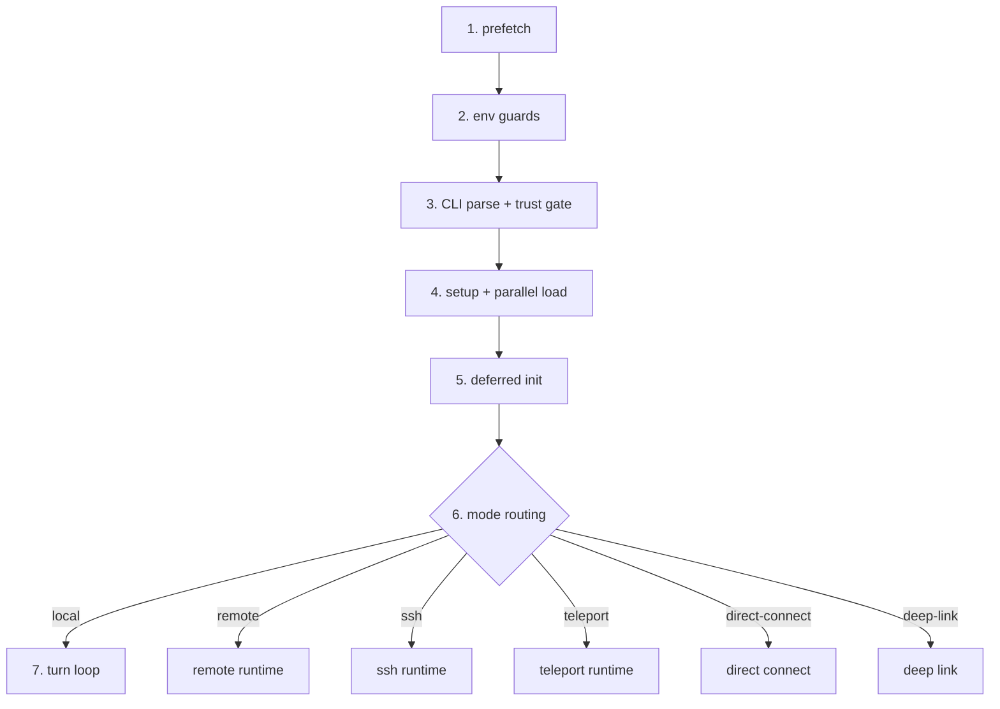

# 第4章 启动流程深度解析：Bootstrap 七阶段

## 本章概览

本章分析 claw-code 从接收命令行参数到进入 Turn Loop 之间的完整初始化过程。对应第2章架构全景中的 `rusty-claude-cli` 和 `runtime::config` 两个模块。

启动流程要解决的核心问题是：如何把一组命令行参数、若干个 JSON 配置文件、一个 CLAUDE.md 指令文件，组装成一个可运行的 Agent 系统。这个过程分为七个阶段（Bootstrap Graph），每个阶段有明确的职责，前一阶段的输出是后一阶段的输入。

本章按数据流顺序展开：先看 CLI 入口如何接收和分发命令（4.1），再看 Bootstrap 七阶段如何编排初始化（4.2），然后深入配置加载的三层合并机制（4.3），最后看模型和权限的来源追踪（4.4）。

| 关键文件 | 职责 |
| --- | --- |
| `src/main.py` | Python 版 CLI 入口，argparse 子命令系统 |
| `src/bootstrap_graph.py` | Bootstrap 七阶段定义 |
| `src/system_init.py` | 系统初始化，trust gate 分支 |
| `src/setup.py` | 启动报告，prefetch 和延迟初始化 |
| `src/deferred_init.py` | 延迟初始化，按 trust 分级加载 |
| `src/prefetch.py` | 预加载：清单文件、密钥链、项目扫描 |
| `rust/crates/rusty-claude-cli/src/main.rs` | Rust 版 CLI 入口，CliAction 枚举分发 |
| `rust/crates/runtime/src/config.rs` | 三层配置加载与合并 |

## 4.1 CLI 入口与参数解析

claw-code 有两个 CLI 入口：Python 版的 `src/main.py` 和 Rust 版的 `rust/crates/rusty-claude-cli/src/main.rs`。Python 版是移植工作区，用于盘点和模拟；Rust 版是生产 CLI，真正运行时使用的是这个。两者的设计思路不同，对比阅读能更好地理解架构意图。

### Python 版：argparse 子命令系统

Python 版用标准库的 `argparse` 构建子命令系统。`build_parser()` 函数注册了所有子命令：

```python
# claw-code/src/main.py

def build_parser() -> argparse.ArgumentParser:
    parser = argparse.ArgumentParser(
        description='Python porting workspace for the Claude Code rewrite effort'
    )
    subparsers = parser.add_subparsers(dest='command', required=True)
    subparsers.add_parser('summary', help='render a Markdown summary of the Python porting workspace')
    subparsers.add_parser('manifest', help='print the current Python workspace manifest')
    subparsers.add_parser('parity-audit', help='compare the Python workspace against the local ignored TypeScript archive when available')
    subparsers.add_parser('setup-report', help='render the startup/prefetch setup report')
    subparsers.add_parser('command-graph', help='show command graph segmentation')
    subparsers.add_parser('tool-pool', help='show assembled tool pool with default settings')
    subparsers.add_parser('bootstrap-graph', help='show the mirrored bootstrap/runtime graph stages')
    # ...更多子命令
    return parser
```

`add_subparsers(dest='command', required=True)` 要求用户必须指定一个子命令，否则报错。每个 `add_parser` 调用注册一个子命令，并可以附加参数。比如 `turn-loop` 子命令接受 `--max-turns` 参数：

```python
# claw-code/src/main.py

loop_parser = subparsers.add_parser('turn-loop', help='run a small stateful turn loop for the mirrored runtime')
loop_parser.add_argument('prompt')
loop_parser.add_argument('--limit', type=int, default=5)
loop_parser.add_argument('--max-turns', type=int, default=3)
loop_parser.add_argument('--structured-output', action='store_true')
```

`prompt` 是位置参数（必传），`--limit`、`--max-turns` 是可选参数，`--structured-output` 是开关。这种参数声明方式和 Java 的 CLI 库（如 Picocli）几乎一样——Picocli 用 `@Parameters` 和 `@Option` 注解，argparse 用 `add_argument` 方法调用，本质都是把命令行字符串映射为类型化的参数对象。

`main()` 函数是分发入口，用 if-elif 链逐个匹配 `args.command`：

```python
# claw-code/src/main.py

def main(argv: list[str] | None = None) -> int:
    parser = build_parser()
    args = parser.parse_args(argv)
    manifest = build_port_manifest()
    if args.command == 'summary':
        print(QueryEnginePort(manifest).render_summary())
        return 0
    if args.command == 'manifest':
        print(manifest.to_markdown())
        return 0
    if args.command == 'parity-audit':
        print(run_parity_audit().to_markdown())
        return 0
    # ...继续匹配其他子命令
    parser.error(f'unknown command: {args.command}')
    return 2
```

这里有一个设计细节值得注意：`build_port_manifest()` 在所有子命令分支之前无条件执行。这意味着无论用户运行哪个子命令，都会先构建完整的端口清单。对于 `summary` 和 `manifest` 子命令来说这是必要的，但对于 `bootstrap-graph` 这种只需要展示阶段定义的子命令来说，构建清单是多余的开销。

Python 版为什么用 if-elif 而不是字典分发？因为每个子命令的参数集不同，`args` 对象上的属性也不同。如果用字典 `{'summary': handle_summary, ...}`，每个 handler 仍然需要从 `args` 上取自己的参数，类型检查和参数验证的逻辑不会减少。if-elif 链虽然没有字典优雅，但更直观——每个分支的上下文是完整的 `args` 对象，不需要额外的参数提取层。

在 Java 生态中，Spring Shell 用 `@ShellComponent` + `@ShellMethod` 注解注册命令，Spring MVC 用 `@RequestMapping` 路由到 Controller 方法。两者都是声明式的——命令和处理逻辑的绑定关系由框架在运行时通过反射建立。Python 版的 if-elif 链是命令式的——绑定关系在代码中显式写出来。前者更优雅，后者更透明。

### Rust 版：CliAction 枚举与穷尽匹配

Rust 版的入口结构完全不同。`main()` 函数只做错误包装，核心逻辑在 `run()` 中：

```rust
// claw-code/rust/crates/rusty-claude-cli/src/main.rs

fn run() -> Result<(), Box<dyn std::error::Error>> {
    let args: Vec<String> = env::args().skip(1).collect();
    // #824: suppress config deprecation prose warnings to stderr when JSON
    // output mode is active.  Scan the raw argv before parse_args so the
    // suppression is in place before any settings file is loaded.
    let json_mode = raw_args_request_json_output(&args);
    if json_mode {
        runtime::suppress_config_warnings_for_json_mode();
    }
    let (args, cwd) = split_global_cwd_args(&args)?;
    apply_global_cwd(cwd)?;
    match parse_args(&args)? {
        CliAction::DumpManifests { output_format, manifests_dir } => {
            dump_manifests(manifests_dir.as_deref(), output_format)?
        }
        CliAction::Version { output_format } => print_version(output_format)?,
        CliAction::Status { model, model_flag_raw, permission_mode, .. } => {
            print_status_snapshot(&model, model_flag_raw.as_deref(), permission_mode, output_format)?
        }
        CliAction::Prompt { prompt, model, output_format, .. } => {
            // 进入交互模式，启动 Turn Loop
        }
        CliAction::Repl { model, .. } => {
            // 进入 REPL 模式
        }
        // ...其他分支
    }
    Ok(())
}
```

`run()` 函数的前三行有一个重要的设计：JSON 模式检测。`raw_args_request_json_output(&args)` 在正式解析参数之前先扫描原始 argv，检查是否包含 `--output-format json`。如果是，就调用 `suppress_config_warnings_for_json_mode()` 抑制配置加载阶段的弃用警告。

为什么要这么做？因为后续的 `ConfigLoader::load()` 在发现过时的配置项时会向 stderr 输出警告文本。在 JSON 模式下，下游工具（如 CI 脚本）期望 stderr 是干净的——任何非 JSON 输出都会干扰解析。这个"预扫描 + 抑制"的设计确保了 JSON 模式的输出纯粹性。

`parse_args()` 返回 `CliAction` 枚举，定义了所有支持的 CLI 动作：

```rust
// claw-code/rust/crates/rusty-claude-cli/src/main.rs

enum CliAction {
    DumpManifests { output_format: CliOutputFormat, manifests_dir: Option<PathBuf> },
    BootstrapPlan { output_format: CliOutputFormat },
    Version { output_format: CliOutputFormat },
    Status { model: String, model_flag_raw: Option<String>, permission_mode: PermissionModeProvenance, .. },
    Prompt { prompt: String, model: String, output_format: CliOutputFormat, .. },
    Repl { model: String, allowed_tools: Option<AllowedToolSet>, .. },
    ResumeSession { session_path: PathBuf, commands: Vec<String>, .. },
    PrintSystemPrompt { cwd: PathBuf, date: String, model: String, .. },
    Config { section: Option<String>, .. },
    Diff { .. },
    Export { session_reference: String, .. },
    // ...更多变体
}
```

每个枚举变体对应一种 CLI 行为，变体携带的数据就是该行为所需的全部参数。比如 `Prompt` 变体携带 `prompt`（用户输入的文本）、`model`（模型选择）、`permission_mode`（权限模式）等，这些都是从命令行参数解析出来的。

Rust 的 `match` 是穷尽的——编译器强制你处理所有枚举变体，否则编译不通过。这意味着如果未来新增了一个 `CliAction` 变体但忘了在 `match` 中处理，编译阶段就会报错。Python 版的 if-elif 链没有这个保证——如果新增了一个子命令但忘了加 if 分支，运行时才会发现（走到 `parser.error` 分支）。

这个差异在 Java 中也有对应。Java 的 `switch` 语句在 `switch` 表达式（Java 14+）中也是穷尽的，但传统的 `switch` 语句不强制。Sealed class（Java 17+）配合 `switch` 表达式可以实现和 Rust 枚举匹配类似的安全性。

`CliAction::Prompt` 是最核心的变体——用户输入 `claude "帮我写一个快速排序"` 时就走这个分支。它携带的参数决定了后续整个 Bootstrap 流程的配置：

```rust
// claw-code/rust/crates/rusty-claude-cli/src/main.rs

CliAction::Prompt {
    prompt: String,                    // 用户的输入文本
    model: String,                     // 模型选择（如 "anthropic/claude-opus-4-7"）
    output_format: CliOutputFormat,    // 输出格式（text / json）
    allowed_tools: Option<AllowedToolSet>,  // 工具白名单
    permission_mode: PermissionMode,   // 权限模式
    compact: bool,                     // 是否启用上下文压缩
    base_commit: Option<String>,       // 基线 commit（用于检测代码变更）
    reasoning_effort: Option<String>,  // 推理强度（如 "high"）
    allow_broad_cwd: bool,             // 是否允许跨目录操作
}
```

这些参数在 `parse_args` 阶段从命令行解析出来，传入 Bootstrap 流程。其中 `permission_mode` 和 `model` 的来源会在 4.4 节展开。

## 4.2 Bootstrap Graph：七个启动阶段

### 七阶段定义

Python 版在 `bootstrap_graph.py` 中定义了启动阶段图。这是一个非常简洁的数据结构——只有一个 `stages` 元组：

```python
# claw-code/src/bootstrap_graph.py

from dataclasses import dataclass

@dataclass(frozen=True)
class BootstrapGraph:
    stages: tuple[str, ...]

    def as_markdown(self) -> str:
        lines = ['# Bootstrap Graph', '']
        lines.extend(f'- {stage}' for stage in self.stages)
        return '\n'.join(lines)

def build_bootstrap_graph() -> BootstrapGraph:
    return BootstrapGraph(
        stages=(
            'top-level prefetch side effects',
            'warning handler and environment guards',
            'CLI parser and pre-action trust gate',
            'setup() + commands/agents parallel load',
            'deferred init after trust',
            'mode routing: local / remote / ssh / teleport / direct-connect / deep-link',
            'query engine submit loop',
        )
    )
```

`@dataclass(frozen=True)` 让 `BootstrapGraph` 不可变——启动阶段定义在运行时不会被修改。`as_markdown()` 方法提供可读的输出格式，`bootstrap-graph` 子命令就是调用这个方法展示阶段列表。

七个阶段构成了一条线性的初始化链路，每个阶段有明确的职责：

| 阶段 | 作用 | 对应代码 |
| --- | --- | --- |
| 1. prefetch side effects | 预加载清单文件、密钥链、项目扫描 | `prefetch.py` |
| 2. environment guards | 设置全局警告处理器，检查运行环境 | `system_init.py` |
| 3. CLI parser + trust gate | 解析参数，判断是否可信模式 | `main.py` |
| 4. setup + parallel load | 加载命令定义和工具定义 | `setup.py` |
| 5. deferred init | 延迟初始化非关键组件 | `deferred_init.py` |
| 6. mode routing | 选择运行模式 | `main.py` 中的 mode 分发 |
| 7. query engine submit loop | 启动 Turn Loop | `query_engine.py` |



### 阶段 1-2：预加载与环境检查

`prefetch.py` 定义了三个预加载函数，在启动最早期并行执行：

```python
# claw-code/src/prefetch.py

@dataclass(frozen=True)
class PrefetchResult:
    name: str
    started: bool
    detail: str

def start_mdm_raw_read() -> PrefetchResult:
    return PrefetchResult('mdm_raw_read', True, 'Simulated MDM raw-read prefetch for workspace bootstrap')

def start_keychain_prefetch() -> PrefetchResult:
    return PrefetchResult('keychain_prefetch', True, 'Simulated keychain prefetch for trusted startup path')

def start_project_scan(root: Path) -> PrefetchResult:
    return PrefetchResult('project_scan', True, f'Scanned project root {root}')
```

三个预加载分别做不同的事：`mdm_raw_read` 预读设备管理清单（MDM），用于企业环境中检测安全策略；`keychain_prefetch` 预读系统密钥链，用于后续的 OAuth 凭证获取；`project_scan` 扫描项目根目录结构，用于后续的工具注册和路径检查。

在 Python 移植版中这些函数返回的是模拟结果（`Simulated`），实际的预加载逻辑在 Rust 版中实现。但设计意图是清晰的：把 I/O 密集型操作提前到启动最早期，与后续的 CPU 密集型操作（参数解析、配置合并）并行，减少总启动时间。

这与 Spring Boot 的早期初始化类似。Spring Boot 在 `ApplicationContext` 刷新之前会先加载 `Environment`（读取 `application.properties`、解析环境变量），然后才开始扫描 Bean 定义。claw-code 的 prefetch 阶段对应 Spring Boot 的 `Environment` 准备阶段。

### 阶段 3：trust gate

阶段 3 的核心是 trust gate——判断当前运行环境是否可信。`setup.py` 中的 `run_setup()` 函数接受 `trusted` 参数：

```python
# claw-code/src/setup.py

def run_setup(cwd: Path | None = None, trusted: bool = True) -> SetupReport:
    root = cwd or Path(__file__).resolve().parent.parent
    prefetches = [
        start_mdm_raw_read(),
        start_keychain_prefetch(),
        start_project_scan(root),
    ]
    return SetupReport(
        setup=build_workspace_setup(),
        prefetches=tuple(prefetches),
        deferred_init=run_deferred_init(trusted=trusted),
        trusted=trusted,
        cwd=root,
    )
```

`trusted` 参数传递给 `run_deferred_init()`，决定阶段 5 的加载范围。`build_workspace_setup()` 收集环境信息（Python 版本、平台）：

```python
# claw-code/src/setup.py

def build_workspace_setup() -> WorkspaceSetup:
    return WorkspaceSetup(
        python_version='.'.join(str(part) for part in sys.version_info[:3]),
        implementation=platform.python_implementation(),
        platform_name=platform.platform(),
    )
```

`WorkspaceSetup` 还定义了 `startup_steps()` 方法，返回启动步骤的有序列表：

```python
# claw-code/src/setup.py

@dataclass(frozen=True)
class WorkspaceSetup:
    python_version: str
    implementation: str
    platform_name: str
    test_command: str = 'python3 -m unittest discover -s tests -v'

    def startup_steps(self) -> tuple[str, ...]:
        return (
            'start top-level prefetch side effects',
            'build workspace context',
            'load mirrored command snapshot',
            'load mirrored tool snapshot',
            'prepare parity audit hooks',
            'apply trust-gated deferred init',
        )
```

这六个步骤是阶段 4-5 的细化：构建工作区上下文 → 加载命令快照 → 加载工具快照 → 准备一致性审计钩子 → 应用 trust 分级的延迟初始化。`system_init.py` 中的 `build_system_init_message()` 把这些步骤格式化为可读的启动报告：

```python
# claw-code/src/system_init.py

def build_system_init_message(trusted: bool = True) -> str:
    setup = run_setup(trusted=trusted)
    commands = get_commands()
    tools = get_tools()
    lines = [
        '# System Init',
        '',
        f'Trusted: {setup.trusted}',
        f'Built-in command names: {len(built_in_command_names())}',
        f'Loaded command entries: {len(commands)}',
        f'Loaded tool entries: {len(tools)}',
        '',
        'Startup steps:',
        *(f'- {step}' for step in setup.setup.startup_steps()),
    ]
    return '\n'.join(lines)
```

这个函数同时调用了 `get_commands()` 和 `get_tools()`，这就是阶段 4 的工作——加载命令和工具的镜像快照。`trusted` 值直接出现在输出中，让用户可以通过 `setup-report` 子命令查看当前是否处于可信模式。

### 阶段 5：deferred init

`deferred_init.py` 定义了延迟初始化的结果：

```python
# claw-code/src/deferred_init.py

@dataclass(frozen=True)
class DeferredInitResult:
    trusted: bool
    plugin_init: bool
    skill_init: bool
    mcp_prefetch: bool
    session_hooks: bool

def run_deferred_init(trusted: bool) -> DeferredInitResult:
    enabled = bool(trusted)
    return DeferredInitResult(
        trusted=trusted,
        plugin_init=enabled,
        skill_init=enabled,
        mcp_prefetch=enabled,
        session_hooks=enabled,
    )
```

这里的设计意图是：不可信模式下，`plugin_init`、`skill_init`、`mcp_prefetch`、`session_hooks` 全部关闭。这四个组件都涉及外部代码执行——插件加载外部代码，MCP 连接外部进程，session hooks 执行用户定义的钩子函数。在不可信环境（如 CI 服务器、共享开发机）中，执行外部代码是安全风险，因此全部禁用。

`as_lines()` 方法把结果格式化为可读的行列表：

```python
# claw-code/src/deferred_init.py

    def as_lines(self) -> tuple[str, ...]:
        return (
            f'- plugin_init={self.plugin_init}',
            f'- skill_init={self.skill_init}',
            f'- mcp_prefetch={self.mcp_prefetch}',
            f'- session_hooks={self.session_hooks}',
        )
```

这与 Spring Boot 的 `@Lazy` 注解理念不同。Spring Boot 的延迟初始化是按 Bean 粒度的——每个 Bean 可以独立声明 `@Lazy`。claw-code 的延迟初始化是按 trust 级别批量控制的——一个 `trusted` 布尔值决定四个组件的开关。这是因为 claw-code 的安全模型更粗粒度：要么完全可信（本地开发），要么完全不可信（CI 环境），中间状态很少需要。

### 阶段 6：mode routing

阶段 6 根据用户指定的运行模式选择执行路径。Python 版在 `main.py` 的 if-elif 链中处理六种模式：

```python
# claw-code/src/main.py

if args.command == 'remote-mode':
    print(run_remote_mode(args.target).as_text())
    return 0
if args.command == 'ssh-mode':
    print(run_ssh_mode(args.target).as_text())
    return 0
if args.command == 'teleport-mode':
    print(run_teleport_mode(args.target).as_text())
    return 0
if args.command == 'direct-connect-mode':
    print(run_direct_connect(args.target).as_text())
    return 0
if args.command == 'deep-link-mode':
    print(run_deep_link(args.target).as_text())
    return 0
```

六种模式分别对应不同的远程执行场景：`remote` 通过 claw-code 协议连接，`ssh` 通过 SSH 隧道，`teleport` 通过 Teleport 基础设施，`direct-connect` 直连，`deep-link` 深度链接。默认模式是 `local`——在当前机器上直接执行，进入阶段 7 的 Turn Loop。

## 4.3 配置加载与三层合并

### ConfigLoader 结构

Rust 版的配置系统在 `runtime/src/config.rs` 中实现。`ConfigLoader` 是核心结构体，只包含两个路径：

```rust
// claw-code/rust/crates/runtime/src/config.rs

pub struct ConfigLoader {
    cwd: PathBuf,        // 当前工作目录
    config_home: PathBuf, // 用户配置目录（如 ~/.claw/）
}
```

这两个路径决定了配置文件的搜索范围。`cwd` 是用户执行命令时的当前目录，`config_home` 是用户级配置的根目录。`ConfigLoader::default_for(cwd)` 用默认的 `config_home` 创建实例：

```rust
// claw-code/rust/crates/runtime/src/config.rs

pub fn default_for(cwd: impl Into<PathBuf>) -> Self {
    let cwd = cwd.into();
    let config_home = default_config_home();
    Self { cwd, config_home }
}
```

`default_config_home()` 通常返回 `~/.claw/`，但可以通过环境变量覆盖。

### discover()：五文件发现

`discover()` 方法返回按优先级排列的配置文件列表：

```rust
// claw-code/rust/crates/runtime/src/config.rs

pub fn discover(&self) -> Vec<ConfigEntry> {
    let user_legacy_path = self.config_home.parent().map_or_else(
        || PathBuf::from(".claw.json"),
        |parent| parent.join(".claw.json"),
    );
    vec![
        ConfigEntry { source: ConfigSource::User,
            path: user_legacy_path },                        // ~/.claw.json（旧格式）
        ConfigEntry { source: ConfigSource::User,
            path: self.config_home.join("settings.json") },  // ~/.claw/settings.json
        ConfigEntry { source: ConfigSource::Project,
            path: self.cwd.join(".claw.json") },             // ./.claw.json（旧格式）
        ConfigEntry { source: ConfigSource::Project,
            path: self.cwd.join(".claw").join("settings.json") }, // ./.claw/settings.json
        ConfigEntry { source: ConfigSource::Local,
            path: self.cwd.join(".claw").join("settings.local.json") }, // ./.claw/settings.local.json
    ]
}
```

这里有五个配置文件，分为三个层级。`ConfigSource` 枚举定义了层级：

```rust
// claw-code/rust/crates/runtime/src/config.rs

pub enum ConfigSource {
    User,    // 用户全局配置
    Project, // 项目共享配置
    Local,   // 个人本地覆盖（不提交 git）
}
```

每个层级的含义：

User 级（`~/.claw/settings.json`）：用户在所有项目中共享的配置。比如默认模型选择、API 密钥存储方式。对应 Spring Boot 的 `application.properties` 放在 `~/.config/` 下的场景。

Project 级（`./.claw/settings.json`）：项目团队共享的配置，提交到 git。比如项目允许的 MCP 服务器列表、钩子定义。对应 Spring Boot 的 `src/main/resources/application.properties`。

Local 级（`./.claw/settings.local.json`）：个人覆盖配置，不提交 git（应加入 `.gitignore`）。比如开发时临时切换到更强的模型、调试时开启额外日志。对应 Spring Boot 的 `application-local.properties`（配合 `spring.profiles.active=local`）。

每个层级都有旧格式（`.claw.json` 平铺在目录下）和新格式（`.claw/settings.json` 放在子目录中）两种路径。旧格式是为了向后兼容，新格式是推荐用法。`discover()` 返回的列表顺序是 User → Project → Local，从低优先级到高优先级。

### load()：逐文件合并

`load()` 方法遍历 `discover()` 返回的文件列表，逐个读取并合并：

```rust
// claw-code/rust/crates/runtime/src/config.rs

pub fn load(&self) -> Result<RuntimeConfig, ConfigError> {
    let mut merged = BTreeMap::new();
    let mut loaded_entries = Vec::new();
    let mut mcp = McpConfigCollection::default();
    let mut all_warnings = Vec::new();

    for entry in self.discover() {
        crate::config_validate::check_unsupported_format(&entry.path)?;
        let OptionalConfigFile::Loaded(parsed) = read_optional_json_object(&entry.path)? else {
            continue;  // 文件不存在或为空，跳过
        };
        let validation = crate::config_validate::validate_config_file(
            &parsed.object,
            &parsed.source,
            &entry.path,
        );
        if !validation.is_ok() {
            let first_error = &validation.errors[0];
            return Err(ConfigError::Parse(first_error.to_string()));
        }
        all_warnings.extend(validation.warnings);
        validate_optional_hooks_config(&parsed.object, &entry.path)?;
        merge_mcp_servers(&mut mcp, entry.source, &parsed.object, &entry.path)?;
        deep_merge_objects(&mut merged, &parsed.object);  // 后加载的覆盖先加载的
        loaded_entries.push(entry);
    }

    for warning in &all_warnings {
        emit_config_warning_once(&warning.to_string());
    }

    build_runtime_config(merged, loaded_entries, mcp)
}
```

这段代码做了五件事，每件都值得展开解释。

第一，格式检查（`check_unsupported_format`）。在读取文件之前先检查文件格式是否被支持，比如不支持 YAML 或 TOML 格式的配置文件。这避免了"读到一半才发现格式不对"的尴尬。

第二，可选读取（`read_optional_json_object`）。配置文件是可选的——五个文件中可能只有一两个存在。`OptionalConfigFile` 是一个枚举，`Loaded` 变体表示成功读取，其他变体（`NotFound`、`Skipped`）表示跳过。`let-else` 语法（`let OptionalConfigFile::Loaded(parsed) = ... else { continue; }`）在模式不匹配时直接跳过，避免了嵌套的 if。

第三，Schema 验证（`validate_config_file`）。每个配置文件在合并前都要经过 schema 验证。验证不通过直接返回错误，不会把无效配置混入合并结果。验证还会收集警告（`validation.warnings`），比如使用了已弃用的配置项名。警告不阻断加载，但会通过 `emit_config_warning_once` 输出到 stderr。

`emit_config_warning_once` 有一个去重机制，用进程级的 `HashSet` 记录已输出的警告：

```rust
// claw-code/rust/crates/runtime/src/config.rs

static EMITTED_CONFIG_WARNINGS: std::sync::OnceLock<Mutex<HashSet<String>>> =
    std::sync::OnceLock::new();

fn emit_config_warning_once(warning: &str) {
    if SUPPRESS_CONFIG_WARNINGS_STDERR.load(std::sync::atomic::Ordering::Relaxed) {
        return;
    }
    let set = EMITTED_CONFIG_WARNINGS.get_or_init(|| Mutex::new(HashSet::new()));
    let mut guard = set.lock().unwrap_or_else(|e| e.into_inner());
    if guard.insert(warning.to_string()) {
        eprintln!("warning: {warning}");
    }
}
```

`SUPPRESS_CONFIG_WARNINGS_STDERR` 就是 4.1 节中 `suppress_config_warnings_for_json_mode()` 设置的原子布尔值。当 JSON 模式开启时，警告直接丢弃。`guard.insert()` 返回 `true` 表示集合中之前没有这个警告（首次出现），输出到 stderr；返回 `false` 表示重复警告，跳过。这保证了同一个警告在一次运行中只输出一次，即使多个配置文件都触发了它。

第四，MCP 服务器合并（`merge_mcp_servers`）。MCP 配置不是简单的键值对，而是嵌套的服务器定义，需要专门的合并逻辑。每个 MCP 服务器有 `command`、`args`、`env` 等字段，高优先级的完整定义会覆盖低优先级的。

第五，深度合并（`deep_merge_objects`）。这是配置合并的核心算法。它递归地合并两个 JSON 对象：对于同名键，如果两个值都是对象，递归合并；否则后加载的值直接覆盖先加载的值。这和 Spring Boot 的配置覆盖机制一致——`application-{profile}.properties` 中的值覆盖 `application.properties` 中的同名键。

### ConfigFileReport：键覆盖追踪

合并完成后，每个配置文件的加载状态被记录在 `ConfigFileReport` 中：

```rust
// claw-code/rust/crates/runtime/src/config.rs

pub struct ConfigFileReport {
    pub entry: ConfigEntry,
    pub loaded: bool,                   // 文件是否成功加载
    pub status: ConfigFileStatus,       // 加载状态枚举
    pub reason: Option<String>,         // 失败原因（当 status 不是 Loaded 时）
    pub detail: Option<String>,         // 附加细节
    pub precedence_rank: usize,         // 优先级排名（0 = 最低）
    pub wins_for_keys: Vec<String>,     // 此文件中生效的键
    pub shadowed_keys: Vec<String>,     // 被更高优先级覆盖的键
    key_paths: Vec<String>,             // 所有键的完整路径
}
```

`wins_for_keys` 和 `shadowed_keys` 是两个关键字段。如果一个键在当前文件中定义，且没有被更高优先级的文件覆盖，它出现在 `wins_for_keys` 中。如果被覆盖了，出现在 `shadowed_keys` 中。

这个设计让 `claw status` 命令可以精确展示每个配置项来自哪个文件。用户不需要猜"为什么我的 `model` 配置没生效"——`claw status` 会告诉你 `model` 在 `~/.claw/settings.json` 中定义了，但被 `./.claw/settings.local.json` 覆盖了。

`ConfigFileStatus` 枚举定义了四种状态：

```rust
// claw-code/rust/crates/runtime/src/config.rs

pub enum ConfigFileStatus {
    Loaded,     // 成功加载并合并
    NotFound,   // 文件不存在
    Skipped,    // 文件存在但被跳过（如格式不支持）
    LoadError,  // 加载失败（如 JSON 解析错误）
}
```

### RuntimeFeatureConfig：合并后的配置视图

合并的最终产物是 `RuntimeFeatureConfig`，它把扁平的 JSON 对象解析为类型化的配置视图：

```rust
// claw-code/rust/crates/runtime/src/config.rs

pub struct RuntimeFeatureConfig {
    hooks: RuntimeHookConfig,           // 钩子配置
    plugins: RuntimePluginConfig,       // 插件配置
    mcp: McpConfigCollection,           // MCP 服务器配置
    oauth: Option<OAuthConfig>,         // OAuth 凭证
    model: Option<String>,              // 模型选择
    aliases: BTreeMap<String, String>,  // 模型别名
    permission_mode: Option<ResolvedPermissionMode>,  // 权限模式
    sandbox: SandboxConfig,             // 沙箱配置
    api_timeout: ApiTimeoutConfig,      // API 超时和重试
    rules_import: RulesImportConfig,    // 外部框架规则导入
    provider: RuntimeProviderConfig,    // 供应商配置
    // ...更多字段
}
```

每个字段对应一个子系统。比如 `hooks` 字段包含用户定义的 PreToolUse/PostToolUse 钩子（第8章展开），`mcp` 字段包含 MCP 服务器列表（第15章展开），`permission_mode` 字段决定权限级别（第7章展开）。`RuntimeFeatureConfig` 是配置加载的终点，也是后续所有子系统初始化的起点。

### API 超时配置

`ApiTimeoutConfig` 是一个值得单独说明的配置项：

```rust
// claw-code/rust/crates/runtime/src/config.rs

pub struct ApiTimeoutConfig {
    pub connect_timeout_secs: u64,    // 连接超时，默认 30 秒
    pub request_timeout_secs: u64,    // 请求超时，默认 300 秒（5 分钟）
    pub max_retries: u32,             // 最大重试次数，默认 8 次
}

impl Default for ApiTimeoutConfig {
    fn default() -> Self {
        Self {
            connect_timeout_secs: 30,
            request_timeout_secs: 300,
            max_retries: 8,
        }
    }
}
```

请求超时设为 5 分钟是因为 LLM 推理可能很慢——复杂 prompt 的首 token 延迟可能超过 60 秒，完整响应可能需要数分钟。如果超时太短，长任务会被误杀。重试 8 次是为了应对 API 的瞬态错误（429 限流、503 服务不可用），每次重试之间有指数退避。

## 4.4 模型与权限的来源追踪

### ModelProvenance：四级溯源

Rust 版的 `run()` 函数在解析参数后，需要确定使用哪个模型。模型的来源有四个层级，优先级从高到低：命令行参数（Flag）→ 环境变量（Env）→ 配置文件（Config）→ 编译时默认值（Default）。

`ModelProvenance` 结构体记录模型的完整溯源信息：

```rust
// claw-code/rust/crates/rusty-claude-cli/src/main.rs

struct ModelProvenance {
    resolved: String,      // 最终使用的模型名（别名展开后）
    raw: Option<String>,   // 用户原始输入（别名展开前）
    source: ModelSource,   // 来源：Flag / Env / Config / Default
    alias_resolved_to: Option<String>,  // 别名展开目标（当 raw != resolved 时）
    env_var: Option<String>,            // 环境变量名（当 source=Env 时）
}
```

`resolved` 是最终使用的模型名。`raw` 是用户原始输入，可能是一个别名（如 `opus`），`resolved` 是别名展开后的完整名（如 `anthropic/claude-opus-4-7`）。`alias_resolved_to` 在别名展开时记录展开目标，方便调试。`env_var` 记录是哪个环境变量提供了模型名（如 `CLAW_MODEL` 或 `ANTHROPIC_MODEL`）。

`ModelSource` 枚举定义了四个来源：

```rust
// claw-code/rust/crates/rusty-claude-cli/src/main.rs

enum ModelSource {
    Flag,    // --model 命令行参数
    Env,     // 环境变量
    Config,  // settings.json 中的 model 字段
    Default, // 编译时默认值
}
```

编译时默认值定义在常量中：

```rust
// claw-code/rust/crates/rusty-claude-cli/src/main.rs

const DEFAULT_MODEL: &str = "anthropic/claude-opus-4-7";
```

`from_env_or_config_or_default()` 方法实现了四级溯源逻辑：

```rust
// claw-code/rust/crates/rusty-claude-cli/src/main.rs

fn from_env_or_config_or_default(cli_model: &str) -> Result<Self, String> {
    // Only called when no --model flag was passed. Probe env first,
    // then config, else fall back to default.
    if cli_model != DEFAULT_MODEL {
        let provenance = Self::from_resolved(cli_model, cli_model, ModelSource::Flag, None);
        provenance.validate()?;
        return Ok(provenance);
    }
    if let Some(env_model) = env_model_for_runtime() {
        let provenance =
            Self::from_raw(&env_model.value, ModelSource::Env, Some(env_model.name));
        provenance.validate()?;
        return Ok(provenance);
    }
    // ...继续检查 Config 和 Default
}
```

这段代码的注释说明了逻辑：只在没有 `--model` flag 时调用。先检查环境变量，再检查配置文件，最后回退到默认值。每一层如果命中就立即返回，不再检查更低优先级的来源。

为什么要记录来源？因为 `claw status` 命令需要展示"当前模型来自哪里"。用户设置了 `--model opus` 但发现没生效，可能是因为环境变量 `CLAW_MODEL` 设置了不同的值。`ModelProvenance` 让这个问题可追溯——`claw status` 会显示 `model: anthropic/claude-opus-4-7 (source: env, env_var: CLAW_MODEL)`。

### PermissionModeProvenance：权限模式溯源

权限模式有同样的溯源机制：

```rust
// claw-code/rust/crates/rusty-claude-cli/src/main.rs

enum PermissionModeSource {
    Flag,
    Env,
    Config,
    Default,
}

struct PermissionModeProvenance {
    mode: PermissionMode,  // ReadOnly / WorkspaceWrite / DangerFullAccess
    source: PermissionModeSource,
    env_var: Option<&'static str>,
}
```

`PermissionMode` 定义了三个权限级别：

```rust
// claw-code/rust/crates/runtime/src/config.rs

pub enum ResolvedPermissionMode {
    ReadOnly,         // 只读，不允许任何写操作
    WorkspaceWrite,   // 只允许写工作区目录
    DangerFullAccess, // 完全访问，无限制
}
```

默认权限模式是 `WorkspaceWrite`：

```rust
// claw-code/rust/crates/rusty-claude-cli/src/main.rs

impl PermissionModeProvenance {
    fn default_fallback() -> Self {
        Self {
            mode: PermissionMode::WorkspaceWrite,
            source: PermissionModeSource::Default,
            env_var: None,
        }
    }
}
```

`WorkspaceWrite` 作为默认值而不是 `ReadOnly`，是因为 claw-code 的主要用途是写代码——如果默认只读，用户每次都要手动指定 `--permission-mode workspace-write`，体验太差。`DangerFullAccess` 只在用户显式指定时才启用，避免误操作。

`is_explicit()` 方法判断权限模式是否是用户显式设置的：

```rust
// claw-code/rust/crates/rusty-claude-cli/src/main.rs

impl PermissionModeSource {
    fn is_explicit(self) -> bool {
        !matches!(self, Self::Default)
    }
}
```

当 `source` 是 `Default` 时，`is_explicit()` 返回 `false`，表示权限模式不是用户主动选择的，而是系统回退到默认值。这个信息在 `claw status` 中展示，提醒用户当前权限是默认值而非显式选择。

## 设计对比

| claw-code 概念 | Java 生态对应 | 对比说明 |
| --- | --- | --- |
| `CliAction` 枚举穷尽匹配 | Spring MVC `@RequestMapping` | 枚举匹配编译时安全，注解路由运行时灵活 |
| Bootstrap 七阶段 | Spring Boot 启动阶段 | 结构相似，claw-code 的 trust gate 是 Spring Boot 没有的 |
| `ConfigLoader` 三层合并 | `application.properties` 多 profile 覆盖 | 机制一致，claw-code 额外有 `ConfigFileReport` 追踪 |
| `deep_merge_objects` | Spring `PropertySource` 覆盖 | 递归合并 vs 扁平覆盖 |
| `ModelProvenance` 四级溯源 | Spring `@Value` 来源链 | Spring 不主动暴露来源，claw-code 显式记录 |
| `emit_config_warning_once` 去重 | Spring `DeprecationLogger` | 两者都解决重复警告问题 |
| trust gate + deferred init | Spring `@ConditionalOnProperty` | 批量禁用 vs 逐 Bean 条件装配 |
| `ApiTimeoutConfig` 默认值 | Spring Boot `application.yml` 默认值 | 两者都在代码中定义默认值，配置文件可覆盖 |

Spring Boot 的启动过程和 claw-code 的 Bootstrap 七阶段在结构上高度相似。Spring Boot 的启动分为：准备 `Environment` → 创建 `ApplicationContext` → 注册 Bean 定义 → 初始化单例 Bean → 启动内嵌容器 → 执行 `ApplicationRunner`。claw-code 的 Bootstrap 分为：prefetch → env guards → CLI parse + trust gate → setup + parallel load → deferred init → mode routing → Turn Loop。

两者的核心差异在 trust gate。Spring Boot 没有全局的"可信模式"概念，条件装配是按 Bean 粒度通过 `@ConditionalOnProperty`、`@Profile` 等注解实现的。claw-code 的 trust gate 是全局开关——一个布尔值决定四个子系统（插件、Skills、MCP、session hooks）的开关。这是因为 Agent 系统的安全模型更关注"AI 能否执行外部代码"，而传统 Web 应用更关注"哪些 Bean 需要加载"。

配置合并机制几乎一致。Spring Boot 的 `PropertySource` 链按优先级排列配置来源（命令行参数 > 环境变量 > `application-{profile}.properties` > `application.properties`），高优先级覆盖低优先级。claw-code 的 `ConfigLoader` 按三层排列（Local > Project > User），`deep_merge_objects` 递归合并。差异在于 Spring Boot 的覆盖是扁平的（同名键直接替换），claw-code 的合并是递归的（对象类型的值会递归合并子键）。`ConfigFileReport` 的 `wins_for_keys` 和 `shadowed_keys` 提供了 Spring Boot `--debug` 模式下的配置来源追踪能力，但粒度更细——精确到每个键而非每个 PropertySource。

## 小结

claw-code 的启动流程从 CLI 入口到 Turn Loop 分为七个阶段。Python 版入口 `main.py` 用 `argparse` 构建子命令系统和 if-elif 分发链，Rust 版入口 `main.rs` 用 `CliAction` 枚举和穷尽 `match` 匹配，后者在编译时保证所有分支被处理。Bootstrap 七阶段从 prefetch 预加载开始，经过 trust gate 判断可信模式，按 trust 级别决定是否加载插件、Skills、MCP 和 session hooks。配置加载由 `ConfigLoader` 的 `discover()` 发现五个配置文件（三个层级，每层新旧两种格式），`load()` 逐个读取并通过 `deep_merge_objects` 递归合并，`ConfigFileReport` 记录每个键的覆盖关系。模型和权限的来源通过四级溯源（Flag → Env → Config → Default）记录，`claw status` 命令可展示完整来源链。

| 关键文件 | 核心机制 | 对应章节 |
| --- | --- | --- |
| `rusty-claude-cli/src/main.rs` | `CliAction` 枚举，`run()` 分发 | 本章 4.1 |
| `src/bootstrap_graph.py` | 七阶段定义 | 本章 4.2 |
| `src/setup.py` | trust gate，prefetch，延迟初始化 | 本章 4.2 |
| `src/deferred_init.py` | 按 trust 批量控制四个子系统 | 本章 4.2 |
| `rust/crates/runtime/src/config.rs` | `ConfigLoader`，三层合并，`ConfigFileReport` | 本章 4.3 |
| `rusty-claude-cli/src/main.rs` | `ModelProvenance`，`PermissionModeProvenance` | 本章 4.4 |

下一章将分析工具系统——Bootstrap 阶段 4 加载的工具如何被定义、注册、发现和执行。
