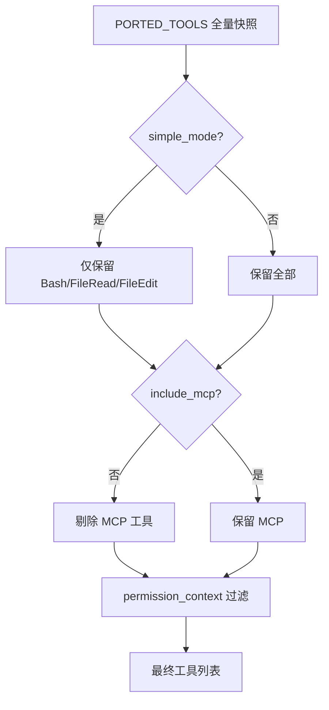
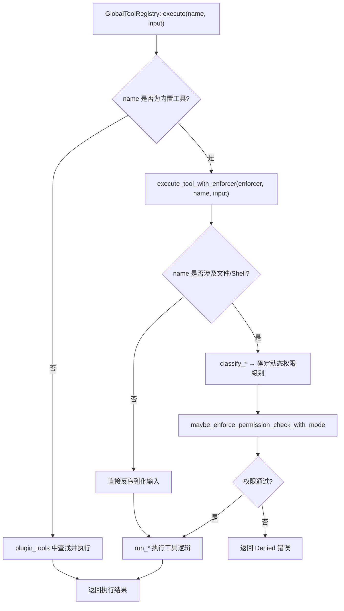

# 第5章 工具系统

Agent 拥有语言模型的理解和推理能力，但要操作文件、执行命令、搜索代码，需要一套工具系统作为"手和脚"。本章解析 claw-code 双实现中工具的定义、注册、组装和执行机制，覆盖 Python 端的快照式注册表和 Rust 端的完整 ToolSpec 体系。

## 5.1 Tool.py：工具定义的起点

Python 端的工具定义从一个极简的 dataclass 开始。整个文件只有十几行：

```python
# claw-code/src/Tool.py

@dataclass(frozen=True)
class ToolDefinition:
    name: str
    purpose: str


DEFAULT_TOOLS = (
    ToolDefinition('port_manifest', 'Summarize the active Python workspace'),
    ToolDefinition('query_engine', 'Render a Python-first porting summary'),
)
```

`ToolDefinition` 只有两个字段：`name` 标识工具，`purpose` 描述用途。`DEFAULT_TOOLS` 定义了两个默认工具，都服务于 Python 移植审计场景，不是 Agent 运行时实际调用的工具。这个文件更像一个"接口原型"，表明 Python 端对工具的定义停留在最小抽象层面。

真正的工具元数据存放在 `models.py` 的 `PortingModule` 中：

```python
# claw-code/src/models.py

@dataclass(frozen=True)
class PortingModule:
    name: str
    responsibility: str
    source_hint: str
    status: str = 'planned'
```

`PortingModule` 比 `ToolDefinition` 多了 `source_hint`（原始 TypeScript 文件路径）和 `status`（移植状态）。Python 端的工具系统围绕 `PortingModule` 构建，每个"工具"实际上是一个被镜像的 TypeScript 模块的元数据记录。

## 5.2 tools.py：Python 端工具注册表

`tools.py` 是 Python 端工具系统的核心文件。它从 JSON 快照加载工具列表，提供查询、执行和权限过滤能力。

### 快照加载

工具数据来自一个 JSON 快照文件：

```python
# claw-code/src/tools.py

SNAPSHOT_PATH = Path(__file__).resolve().parent / 'reference_data' / 'tools_snapshot.json'

@lru_cache(maxsize=1)
def load_tool_snapshot() -> tuple[PortingModule, ...]:
    raw_entries = json.loads(SNAPSHOT_PATH.read_text())
    return tuple(
        PortingModule(
            name=entry['name'],
            responsibility=entry['responsibility'],
            source_hint=entry['source_hint'],
            status='mirrored',
        )
        for entry in raw_entries
    )

PORTED_TOOLS = load_tool_snapshot()
```

`load_tool_snapshot` 用 `lru_cache` 保证只读一次磁盘。快照文件 `tools_snapshot.json` 记录了原始 TypeScript 项目中所有工具模块的元数据，包括 `AgentTool`、`BashTool`、`FileEditTool`、`GrepTool` 等数十个工具条目，每个条目都标注了对应的 `.ts` / `.tsx` 源文件路径。所有工具的 `status` 统一设为 `'mirrored'`，表示这些是镜像自原始 TypeScript 实现的元数据记录，不是 Python 原生实现。

### 工具查询

`tools.py` 提供了多种查询方式：

```python
# claw-code/src/tools.py

def tool_names() -> list[str]:
    return [module.name for module in PORTED_TOOLS]

def get_tool(name: str) -> PortingModule | None:
    needle = name.lower()
    for module in PORTED_TOOLS:
        if module.name.lower() == needle:
            return module
    return None

def find_tools(query: str, limit: int = 20) -> list[PortingModule]:
    needle = query.lower()
    matches = [module for module in PORTED_TOOLS
               if needle in module.name.lower() or needle in module.source_hint.lower()]
    return matches[:limit]
```

`get_tool` 做大小写不敏感的精确匹配，`find_tools` 做子串模糊搜索，同时在工具名和源文件路径中匹配。这些查询函数为 `ToolSearch` 工具提供底层支持。

### 工具执行

Python 端的 `execute_tool` 是一个模拟执行器，不真正运行工具逻辑：

```python
# claw-code/src/tools.py

def execute_tool(name: str, payload: str = '',
                 permission_context: ToolPermissionContext | None = None) -> ToolExecution:
    module = get_tool(name)
    if module is None:
        return ToolExecution(name=name, source_hint='', payload=payload,
                             handled=False, message=f'Unknown mirrored tool: {name}')
    if permission_context and permission_context.blocks(module.name):
        return ToolExecution(name=module.name, source_hint=module.source_hint,
                             payload=payload, handled=False,
                             message=f"Permission denied for mirrored tool '{module.name}'.")
    if permission_context:
        scope_decision = permission_context.validate_payload_scope(module.name, payload)
        if not scope_decision.allowed:
            return ToolExecution(
                name=module.name, source_hint=module.source_hint,
                payload=payload, handled=False,
                message=f"Permission denied for mirrored tool '{module.name}': {scope_decision.reason}"
            )
    action = f"Mirrored tool '{module.name}' from {module.source_hint} would handle payload {payload!r}."
    return ToolExecution(name=module.name, source_hint=module.source_hint,
                         payload=payload, handled=True, message=action)
```

执行流程分三步：查找工具、检查权限拦截、检查路径作用域。如果通过所有检查，返回 `handled=True` 并附带一条描述性消息，说明该工具"会处理"这个 payload。Python 端的工具执行是占位性质，真正的工具逻辑运行在 Rust 端。

### 权限过滤

`get_tools` 函数在返回工具列表前应用权限过滤：

```python
# claw-code/src/tools.py

def get_tools(
    simple_mode: bool = False,
    include_mcp: bool = True,
    permission_context: ToolPermissionContext | None = None,
) -> tuple[PortingModule, ...]:
    tools = list(PORTED_TOOLS)
    if simple_mode:
        tools = [m for m in tools if m.name in {'BashTool', 'FileReadTool', 'FileEditTool'}]
    if not include_mcp:
        tools = [m for m in tools if 'mcp' not in m.name.lower() and 'mcp' not in m.source_hint.lower()]
    return filter_tools_by_permission_context(tuple(tools), permission_context)

def filter_tools_by_permission_context(
    tools: tuple[PortingModule, ...],
    permission_context: ToolPermissionContext | None = None,
) -> tuple[PortingModule, ...]:
    if permission_context is None:
        return tools
    return tuple(m for m in tools if not permission_context.blocks(m.name))
```

`simple_mode` 将工具集缩减为三个基础工具（`BashTool`、`FileReadTool`、`FileEditTool`），对应"最小可用"场景。`include_mcp` 控制是否包含 MCP（Model Context Protocol）相关工具。`permission_context` 通过 `blocks` 方法过滤被禁用的工具。



## 5.3 tool_pool.py：工具池组装

`tool_pool.py` 将过滤后的工具列表封装为 `ToolPool` 对象：

```python
# claw-code/src/tool_pool.py

@dataclass(frozen=True)
class ToolPool:
    tools: tuple[PortingModule, ...]
    simple_mode: bool
    include_mcp: bool

    def as_markdown(self) -> str:
        lines = [
            '# Tool Pool', '',
            f'Simple mode: {self.simple_mode}',
            f'Include MCP: {self.include_mcp}',
            f'Tool count: {len(self.tools)}',
        ]
        lines.extend(f'- {tool.name} — {tool.source_hint}' for tool in self.tools[:15])
        return '\n'.join(lines)

def assemble_tool_pool(
    simple_mode: bool = False,
    include_mcp: bool = True,
    permission_context: ToolPermissionContext | None = None,
) -> ToolPool:
    return ToolPool(
        tools=get_tools(simple_mode=simple_mode, include_mcp=include_mcp,
                        permission_context=permission_context),
        simple_mode=simple_mode,
        include_mcp=include_mcp,
    )
```

`ToolPool` 是一个不可变数据容器，记录三个维度的状态：工具列表、是否简单模式、是否包含 MCP。`as_markdown` 方法生成一份人类可读的摘要，截取前 15 个工具。`assemble_tool_pool` 是工厂函数，把 `get_tools` 的结果包装成 `ToolPool`。

Python 端的工具系统到此为止：从 JSON 快照加载元数据，提供查询和模拟执行，支持权限过滤和工具池组装。真正的工具定义、Schema 校验和执行逻辑在 Rust 端。

## 5.4 Rust 端：ToolSpec 与 GlobalToolRegistry

Rust 端的 `tools` crate 是工具系统的完整实现。核心类型是 `ToolSpec` 和 `GlobalToolRegistry`。

### ToolSpec：静态工具规格

```rust
// claw-code/rust/crates/tools/src/lib.rs

#[derive(Debug, Clone, PartialEq, Eq)]
pub struct ToolSpec {
    pub name: &'static str,
    pub description: &'static str,
    pub input_schema: Value,
    pub required_permission: PermissionMode,
}
```

`ToolSpec` 有四个字段：`name` 是工具名（静态字符串引用），`description` 是给 LLM 看的工具说明，`input_schema` 是 JSON Schema 格式的输入定义，`required_permission` 是该工具所需的权限级别。与 Python 端的 `PortingModule` 相比，`ToolSpec` 多了 `input_schema` 和 `required_permission`，这两个字段使得 Rust 端能做输入校验和权限控制。

### GlobalToolRegistry：三层注册表

```rust
// claw-code/rust/crates/tools/src/lib.rs

#[derive(Debug, Clone)]
pub struct GlobalToolRegistry {
    plugin_tools: Vec<PluginTool>,
    runtime_tools: Vec<RuntimeToolDefinition>,
    enforcer: Option<PermissionEnforcer>,
}
```

`GlobalToolRegistry` 持有三层数据：内置工具（通过 `mvp_tool_specs()` 静态返回）、插件工具（`PluginTool` 列表）和运行时工具（`RuntimeToolDefinition` 列表），以及一个可选的权限执行器。

工具注册采用 Builder 模式，`with_plugin_tools` 和 `with_runtime_tools` 逐层叠加，每一层都做名称冲突检查：

```rust
// claw-code/rust/crates/tools/src/lib.rs

pub fn with_plugin_tools(plugin_tools: Vec<PluginTool>) -> Result<Self, String> {
    let builtin_names = mvp_tool_specs()
        .into_iter()
        .map(|spec| spec.name.to_string())
        .collect::<BTreeSet<_>>();
    let mut seen_plugin_names = BTreeSet::new();

    for tool in &plugin_tools {
        let name = tool.definition().name.clone();
        if builtin_names.contains(&name) {
            return Err(format!("plugin tool `{name}` conflicts with a built-in tool name"));
        }
        if !seen_plugin_names.insert(name.clone()) {
            return Err(format!("duplicate plugin tool name `{name}`"));
        }
    }
    // ... 构造 registry
}
```

插件工具名不能与内置工具名冲突，插件之间也不能重名。运行时工具在此基础上进一步检查，不能与内置工具和已注册的插件工具重名。这保证了工具名的全局唯一性。

`definitions` 方法将三层工具合并为 `ToolDefinition` 列表，供 LLM API 调用使用：

```rust
// claw-code/rust/crates/tools/src/lib.rs

pub fn definitions(&self, allowed_tools: Option<&BTreeSet<String>>) -> Vec<ToolDefinition> {
    let builtin = mvp_tool_specs().into_iter()
        .filter(|spec| allowed_tools.is_none_or(|a| a.contains(&canonical_allowed_tool_name(spec.name))))
        .map(|spec| ToolDefinition {
            name: spec.name.to_string(),
            description: Some(spec.description.to_string()),
            input_schema: spec.input_schema,
        });
    let runtime = self.runtime_tools.iter()
        .filter(|t| allowed_tools.is_none_or(|a| a.contains(&canonical_allowed_tool_name(&t.name))))
        .map(|t| ToolDefinition { /* ... */ });
    let plugin = self.plugin_tools.iter()
        .filter(|t| /* ... */)
        .map(|t| ToolDefinition { /* ... */ });
    builtin.chain(runtime).chain(plugin).collect()
}
```

如果调用方通过 `--allowedTools` 指定了允许的工具子集，`definitions` 会按 `canonical_allowed_tool_name` 做大小写不敏感的匹配过滤。这个规范化函数把 CamelCase 转成 snake_case，例如 `WebFetch` 变成 `web_fetch`。

## 5.5 内置工具清单：基础工具与延迟工具

`mvp_tool_specs()` 返回所有内置工具的静态规格。这些工具分为两组：基础工具和延迟工具。

| 工具名 | 权限级别 | 用途 |
| --- | --- | --- |
| bash | DangerFullAccess | 执行 shell 命令 |
| read_file | ReadOnly | 读取工作区文件 |
| write_file | WorkspaceWrite | 写入工作区文件 |
| edit_file | WorkspaceWrite | 替换文件中的文本 |
| glob_search | ReadOnly | 按 glob 模式查找文件 |
| grep_search | ReadOnly | 按正则搜索文件内容 |

以上六个是基础工具，始终对 LLM 可见。其余内置工具通过 `deferred_tool_specs` 函数暴露：

```rust
// claw-code/rust/crates/tools/src/lib.rs

fn deferred_tool_specs() -> Vec<ToolSpec> {
    mvp_tool_specs().into_iter()
        .filter(|spec| {
            !matches!(
                spec.name,
                "bash" | "read_file" | "write_file" | "edit_file" | "glob_search" | "grep_search"
            )
        })
        .collect()
}
```

延迟工具包括 `WebFetch`、`WebSearch`、`TodoWrite`、`Skill`、`Agent`、`ToolSearch`、`NotebookEdit`、`Sleep`、`SendUserMessage`、`Config`、`EnterPlanMode`、`ExitPlanMode`、`StructuredOutput`、`REPL`、`PowerShell`、`AskUserQuestion`、`TaskCreate`/`TaskGet`/`TaskList`/`TaskStop`/`TaskUpdate`/`TaskOutput`、`WorkerCreate` 等 Worker 系列、`TeamCreate`/`TeamDelete`、`CronCreate`/`CronDelete`/`CronList`、`LSP`、`MCP` 系列、`GitStatus`/`GitDiff`/`GitLog`/`GitShow`/`GitBlame` 等。

延迟工具不直接暴露给 LLM，而是通过 `ToolSearch` 工具按需发现。`ToolSearch` 内部调用 `search_tool_specs` 做关键词匹配：

```rust
// claw-code/rust/crates/tools/src/lib.rs

fn search_tool_specs(query: &str, max_results: usize, specs: &[SearchableToolSpec]) -> Vec<String> {
    let lowered = query.to_lowercase();
    if let Some(selection) = lowered.strip_prefix("select:") {
        // 精确选择模式：select:tool1,tool2
        return selection.split(',').filter_map(/* 精确匹配 */).collect();
    }
    // 关键词评分模式
    let mut required = Vec::new();
    let mut optional = Vec::new();
    for term in lowered.split_whitespace() {
        if let Some(rest) = term.strip_prefix('+') {
            required.push(rest);  // +term 表示必须包含
        } else {
            optional.push(term);
        }
    }
    // ... 评分排序，取 top N
}
```

`ToolSearch` 支持两种查询语法：`select:tool1,tool2` 做精确选择，普通关键词做模糊评分。前缀 `+` 标记必须匹配的词。这种设计让 LLM 在面对数十个工具时不需要全部加载到上下文，而是按需搜索。

## 5.6 工具执行分发：execute_tool_with_enforcer

`GlobalToolRegistry` 的 `execute` 方法是工具执行的入口：

```rust
// claw-code/rust/crates/tools/src/lib.rs

pub fn execute(&self, name: &str, input: &Value) -> Result<String, String> {
    if mvp_tool_specs().iter().any(|spec| spec.name == name) {
        return execute_tool_with_enforcer(self.enforcer.as_ref(), name, input);
    }
    self.plugin_tools.iter()
        .find(|tool| tool.definition().name == name)
        .ok_or_else(|| format!("unsupported tool: {name}"))?
        .execute(input)
        .map_err(|error| error.to_string())
}
```

如果是内置工具，走 `execute_tool_with_enforcer` 分发；如果是插件工具，走 `PluginTool::execute`。`execute_tool_with_enforcer` 是一个大型 match 分发器：

```rust
// claw-code/rust/crates/tools/src/lib.rs

fn execute_tool_with_enforcer(
    enforcer: Option<&PermissionEnforcer>,
    name: &str,
    input: &Value,
) -> Result<String, String> {
    match name {
        "bash" => {
            let bash_input: BashCommandInput = from_value(input)?;
            let classified_mode = classify_bash_permission(&bash_input.command);
            maybe_enforce_permission_check_with_mode(enforcer, name, input, classified_mode)?;
            run_bash(bash_input)
        }
        "read_file" => {
            let file_input: ReadFileInput = from_value(input)?;
            let required_mode = classify_read_path_permission(&file_input.path, false);
            maybe_enforce_permission_check_with_mode(enforcer, name, input, required_mode)?;
            run_read_file(file_input)
        }
        // ... write_file, edit_file, glob_search, grep_search 同结构
        "TodoWrite" => from_value::<TodoWriteInput>(input).and_then(run_todo_write),
        "Skill" => from_value::<SkillInput>(input).and_then(run_skill),
        "Agent" => from_value::<AgentInput>(input).and_then(run_agent),
        // ... 其余工具
        _ => Err(format!("unsupported tool: {name}")),
    }
}
```

工具分两类执行路径。第一类是涉及文件系统或 shell 的工具（`bash`、`read_file`、`write_file`、`edit_file`、`glob_search`、`grep_search`、`PowerShell`），这些工具在执行前需要根据具体输入动态确定权限级别，因此先调用 `classify_*` 函数分析命令或路径，再通过 `maybe_enforce_permission_check_with_mode` 做权限检查，最后调用 `run_*` 函数执行。

第二类是逻辑工具（`TodoWrite`、`Skill`、`Agent`、`ToolSearch` 等），权限级别是静态的（在 `ToolSpec` 中已定义），不需要动态分类，直接反序列化输入后调用 `run_*` 函数。这类工具用 `and_then` 链式调用，如果反序列化失败会直接返回错误。



## 5.7 权限集成：动态权限分类

`maybe_enforce_permission_check_with_mode` 是权限检查的统一入口：

```rust
// claw-code/rust/crates/tools/src/lib.rs

fn maybe_enforce_permission_check_with_mode(
    enforcer: Option<&PermissionEnforcer>,
    tool_name: &str,
    input: &Value,
    required_mode: PermissionMode,
) -> Result<(), String> {
    if let Some(enforcer) = enforcer {
        let input_str = serde_json::to_string(input).unwrap_or_default();
        let result = enforcer.check_with_required_mode(tool_name, &input_str, required_mode);
        match result {
            EnforcementResult::Allowed => Ok(()),
            EnforcementResult::Denied { reason, .. } => Err(reason),
        }
    } else {
        Ok(())
    }
}
```

如果 `enforcer` 不存在（`None`），权限检查直接跳过。这在某些测试或调试场景下有用。当 `enforcer` 存在时，它将输入序列化为字符串，调用 `check_with_required_mode` 做权限判定，返回 `EnforcementResult::Allowed` 或 `EnforcementResult::Denied`。

动态权限分类的关键在于 `classify_bash_permission` 和 `classify_file_path_permission` 等函数。以 bash 为例，同一条 `bash` 工具的 `required_permission` 在 `ToolSpec` 中标为 `DangerFullAccess`，但实际执行时，`classify_bash_permission` 会分析命令内容：只读命令（如 `ls`、`cat`）可能只需要 `ReadOnly` 级别，写命令（如 `rm`、`echo >`）则需要 `WorkspaceWrite` 或 `DangerFullAccess`。这种动态分类使得权限控制比静态声明更精细。

Python 端的权限过滤通过 `ToolPermissionContext` 实现类似功能：

```python
# claw-code/src/permissions.py

@dataclass(frozen=True)
class ToolPermissionContext:
    deny_names: frozenset[str] = field(default_factory=frozenset)
    deny_prefixes: tuple[str, ...] = ()
    workspace_scope: WorkspacePathScope | None = None
    cwd: Path | None = None

    def blocks(self, tool_name: str) -> bool:
        lowered = tool_name.lower()
        return lowered in self.deny_names or any(lowered.startswith(p) for p in self.deny_prefixes)

    def validate_payload_scope(self, tool_name: str, payload: str) -> PathScopeDecision:
        if self.workspace_scope is None or not _scope_checked_tool(tool_name):
            return PathScopeDecision(True, 'workspace path scope not required for this tool')
        return self.workspace_scope.validate_payload(payload, cwd=self.cwd)
```

`blocks` 方法通过名称和前缀黑名单拦截工具。`validate_payload_scope` 对涉及文件系统操作的工具（bash、shell、PowerShell、FileRead、FileWrite、FileEdit）做路径作用域验证，确保所有路径参数都在工作区根目录内。`_scope_checked_tool` 函数决定了哪些工具需要做路径检查：

```python
# claw-code/src/permissions.py

def _scope_checked_tool(tool_name: str) -> bool:
    lowered = tool_name.lower()
    return any(marker in lowered for marker in ('bash', 'shell', 'powershell', 'fileread', 'filewrite', 'fileedit'))
```

`WorkspacePathScope.validate_payload` 从 payload 中提取路径候选（通过 `shlex` 分词、展开环境变量和通配符），逐一检查解析后的路径是否在工作区根目录内。如果路径通过符号链接逃逸出工作区，会被拒绝。

## 设计对比

| claw-code 概念 | Java 生态对应 |
| --- | --- |
| ToolSpec | Spring 中 `@Controller` 方法签名 + `@RequestMapping` 路由 |
| GlobalToolRegistry 三层叠加 | Spring IoC 容器中 BeanDefinition 注册（内置 / ComponentScan / 编程式注册） |
| mvp_tool_specs + deferred_tool_specs | Spring 中 `@Conditional` 条件 Bean，部分 Bean 始终加载，部分按需延迟初始化 |
| execute_tool_with_enforcer match 分发 | Spring 的 `DispatcherServlet` 根据 URL 路径分发到 Controller 方法 |
| ToolSearch 延迟工具发现 | Spring 中 `@Lazy` 注解的 Bean，首次使用时才初始化 |
| classify_bash_permission 动态权限 | Spring Security 中 `@PreAuthorize` 表达式中的 SpEL 动态判定 |
| ToolPermissionContext 黑名单 | Spring Security 中 `SecurityFilterChain` 的 `denyAll()` 规则 |

Java 工程师习惯通过注解声明权限和路由，claw-code 则通过 `ToolSpec` 结构体集中定义。Spring 的 `DispatcherServlet` 通过 URL 路径匹配分发请求，`execute_tool_with_enforcer` 通过工具名字面量 match 分发。两者都是"注册表 + 分发器"模式，区别在于 Spring 面向 HTTP 请求，claw-code 面向 LLM 的 tool call。

## 小结

工具系统在 Python 端以 `tools.py` 为核心，通过 JSON 快照加载元数据，提供查询和模拟执行，不包含真正的工具逻辑。Rust 端的 `GlobalToolRegistry` 是完整实现，三层注册表（内置 `ToolSpec` + 插件 `PluginTool` + 运行时 `RuntimeToolDefinition`）通过 Builder 模式叠加，名称冲突时直接报错。内置工具分为六个基础工具（始终可见）和数十个延迟工具（通过 `ToolSearch` 按需发现）。`execute_tool_with_enforcer` 是执行分发器，对涉及文件和 shell 的工具做动态权限分类，对逻辑工具直接执行。涉及的关键文件：`src/Tool.py`、`src/tools.py`、`src/tool_pool.py`、`src/permissions.py`、`src/path_scope.py`、`rust/crates/tools/src/lib.rs`。
