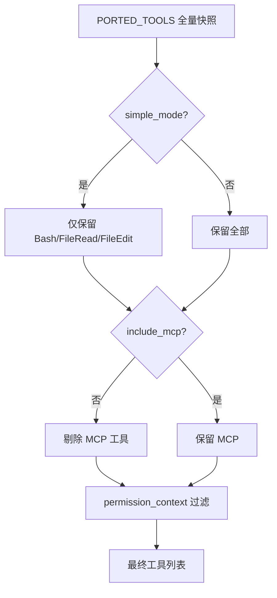
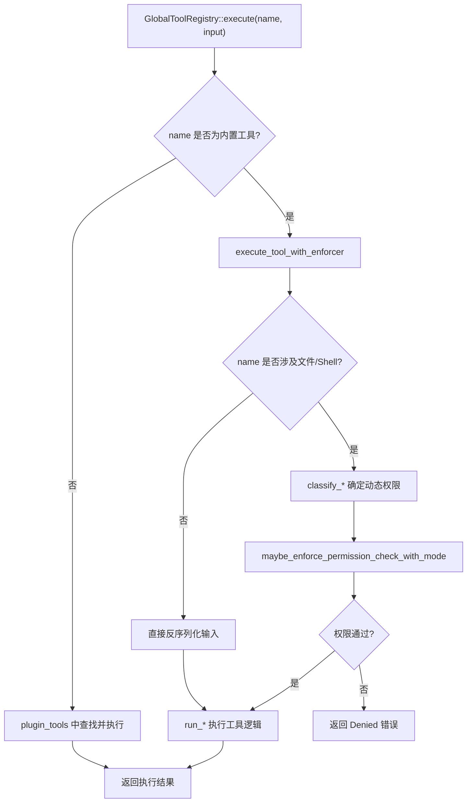

# 第5章 工具系统：ToolPool 与工具注册

## 本章概览

本章分析 claw-code 的工具系统——Agent 如何定义、注册、发现和执行工具。对应第2章架构全景中的 `tools` crate 和 Python 端的 `tools.py`、`tool_pool.py`、`permissions.py`、`path_scope.py` 模块。

工具系统要解决的核心问题是：LLM 本身只能生成文本，不能读写文件、执行命令、搜索代码。工具系统给 LLM 提供了"手和脚"——一组可调用的函数，LLM 通过 tool call 协议选择工具并传入参数，工具系统负责执行并把结果返回给 LLM。

本章按数据流顺序展开：先看工具定义的两个层次（Python 端的元数据快照和 Rust 端的 ToolSpec 规格），再看工具注册的三层架构（内置 + 插件 + 运行时）和冲突检测，然后看工具的延迟发现机制（ToolSearch 评分搜索），最后看工具执行的权限集成（动态权限分类和路径作用域验证）。

| 关键文件 | 职责 |
| --- | --- |
| `src/Tool.py` | Python 端工具定义原型 |
| `src/tools.py` | Python 端工具注册表，快照加载与模拟执行 |
| `src/tool_pool.py` | Python 端工具池封装 |
| `src/permissions.py` | Python 端权限上下文，黑名单与路径作用域 |
| `src/path_scope.py` | 路径提取与工作区边界验证 |
| `rust/crates/tools/src/lib.rs` | Rust 端完整工具系统（ToolSpec、GlobalToolRegistry、执行分发） |

## 5.1 工具定义：从原型到规格

### Python 端：最小定义原型

Python 端的工具定义从 `Tool.py` 开始，这是一个极简文件：

```python
# claw-code/src/Tool.py

@dataclass(frozen=True)
class ToolDefinition:
    name: str
    purpose: str


DEFAULT_TOOLS = (
    ToolDefinition('port_manifest', 'Summarize the active Python workspace'),
    ToolDefinition('query_engine', 'Render a Python-first porting summary'),
)
```

`ToolDefinition` 只有两个字段：`name` 标识工具，`purpose` 描述用途。`DEFAULT_TOOLS` 定义了两个默认工具，都服务于 Python 移植审计场景，不是 Agent 运行时实际调用的工具。这个文件的角色是"接口原型"——它定义了工具的最小抽象，但真正的工具元数据在别处。

在 Java 中，这相当于定义了一个接口 `interface ToolDefinition { String getName(); String getPurpose(); }`，然后用一个 record 或 immutable class 实现。Python 的 `@dataclass(frozen=True)` 等价于 Java 的 final class + 所有字段 final + 全参构造器 + equals/hashCode/toString 自动生成。

真正承载工具元数据的是 `models.py` 中的 `PortingModule`：

```python
# claw-code/src/models.py

@dataclass(frozen=True)
class PortingModule:
    name: str
    responsibility: str
    source_hint: str
    status: str = 'planned'
```

`PortingModule` 比 `ToolDefinition` 多了 `source_hint`（原始 TypeScript 文件路径）和 `status`（移植状态，默认 `'planned'`）。Python 端的每个"工具"实际上是一个被镜像的 TypeScript 模块的元数据记录，`source_hint` 指向原始 `.ts` / `.tsx` 文件。

### Rust 端：完整工具规格

Rust 端的 `ToolSpec` 是工具的完整规格定义，包含 LLM 调用所需的全部信息：

```rust
// claw-code/rust/crates/tools/src/lib.rs

#[derive(Debug, Clone, PartialEq, Eq)]
pub struct ToolSpec {
    pub name: &'static str,           // 工具名，编译时静态字符串
    pub description: &'static str,     // 给 LLM 看的工具说明
    pub input_schema: Value,           // JSON Schema 格式的输入定义
    pub required_permission: PermissionMode,  // 该工具所需的权限级别
}
```

四个字段的含义和设计意图：

`name` 用 `&'static str` 而不是 `String`。这意味着工具名在编译时就确定了，不需要堆分配。在 Java 中等价于 `private final String name`，但 Rust 的 `&'static str` 更进一步——它是一个指向程序只读数据段的引用，零分配开销。所有内置工具名（如 `"bash"`、`"read_file"`）都直接编译进二进制文件。

`description` 也是 `&'static str`，原因相同。这个字段的内容会被发送给 LLM 作为工具说明——LLM 根据 description 决定何时使用这个工具。因此 description 的质量直接影响 Agent 的行为准确性。比如 `"Execute a shell command in the current workspace."` 清楚地告诉 LLM 这个工具的用途和作用域。

`input_schema` 是 `Value` 类型（`serde_json::Value`），包含 JSON Schema 格式的输入参数定义。LLM 根据 schema 生成符合格度的参数。`Value` 而非具体结构体是因为不同工具的参数结构差异巨大——`bash` 接受 `command` 字符串，`grep_search` 接受 `pattern` + `path` + `glob` + 多个 flag，用统一的 `Value` 避免为每个工具定义一个结构体。

`required_permission` 是 `PermissionMode` 枚举，定义该工具的静态权限要求。三个级别从低到高：`ReadOnly`（只读，如 `read_file`）、`WorkspaceWrite`（写工作区，如 `write_file`）、`DangerFullAccess`（完全访问，如 `bash`）。这个字段是静态声明——工具规格中写死的权限要求，但实际执行时可能被动态分类函数调整（5.5 节展开）。

与 Python 端的 `PortingModule` 相比，`ToolSpec` 多了 `input_schema` 和 `required_permission`，这两个字段使得 Rust 端能做输入校验和权限控制。Python 端的 `PortingModule` 只有元数据（名字、职责、来源路径），不能做这两件事。

`RuntimeToolDefinition` 是运行时动态注册的工具定义，与 `ToolSpec` 结构类似但字段类型从 `&'static str` 变为 `String`：

```rust
// claw-code/rust/crates/tools/src/lib.rs

#[derive(Debug, Clone, PartialEq)]
pub struct RuntimeToolDefinition {
    pub name: String,                    // 运行时分配的字符串
    pub description: Option<String>,     // 可选描述
    pub input_schema: Value,
    pub required_permission: PermissionMode,
}
```

`Option<String>` 表示描述可以省略——运行时注册的工具（如 MCP 服务器提供的工具）不一定有描述。`String` 而非 `&'static str` 是因为这些工具名在运行时动态产生（如从 MCP 服务器的 JSON 响应中解析），编译时不存在。

## 5.2 Python 端工具注册表：快照加载与查询

### 快照加载

`tools.py` 是 Python 端工具系统的核心。工具数据从 JSON 快照文件加载：

```python
# claw-code/src/tools.py

SNAPSHOT_PATH = Path(__file__).resolve().parent / 'reference_data' / 'tools_snapshot.json'

@lru_cache(maxsize=1)
def load_tool_snapshot() -> tuple[PortingModule, ...]:
    raw_entries = json.loads(SNAPSHOT_PATH.read_text())
    return tuple(
        PortingModule(
            name=entry['name'],
            responsibility=entry['responsibility'],
            source_hint=entry['source_hint'],
            status='mirrored',
        )
        for entry in raw_entries
    )

PORTED_TOOLS = load_tool_snapshot()
```

`SNAPSHOT_PATH` 指向 `reference_data/tools_snapshot.json`，这个文件记录了原始 TypeScript 项目中所有工具模块的元数据，包括 `AgentTool`、`BashTool`、`FileEditTool`、`GrepTool` 等数十个工具条目。

`@lru_cache(maxsize=1)` 保证函数只执行一次——首次调用读取文件并解析，后续调用直接返回缓存结果。在 Java 中等价于 Guava 的 `CacheBuilder.newBuilder().maximumSize(1)` 或简单的 `private volatile Tuple cached;` + double-checked locking。Python 的 `lru_cache` 装饰器是线程安全的（在 CPython 的 GIL 下），且自动处理缓存失效。

所有工具的 `status` 统一设为 `'mirrored'`，表示这些是镜像自原始 TypeScript 实现的元数据记录，不是 Python 原生实现。模块级变量 `PORTED_TOOLS = load_tool_snapshot()` 在导入时立即执行，这意味着 `import tools` 就会触发文件读取。

### 工具查询

`tools.py` 提供了三种查询方式：

```python
# claw-code/src/tools.py

def tool_names() -> list[str]:
    return [module.name for module in PORTED_TOOLS]

def get_tool(name: str) -> PortingModule | None:
    needle = name.lower()
    for module in PORTED_TOOLS:
        if module.name.lower() == needle:
            return module
    return None

def find_tools(query: str, limit: int = 20) -> list[PortingModule]:
    needle = query.lower()
    matches = [module for module in PORTED_TOOLS
               if needle in module.name.lower() or needle in module.source_hint.lower()]
    return matches[:limit]
```

`tool_names()` 返回所有工具名的列表，是最简单的查询。`get_tool()` 做大小写不敏感的精确匹配——先用 `name.lower()` 把搜索词转小写，再和每个工具名的小写形式比较。`find_tools()` 做子串模糊搜索，同时在工具名和源文件路径中匹配，返回最多 `limit` 个结果。

`get_tool()` 的时间复杂度是 O(n)，对每次调用都线性扫描整个工具列表。如果工具数量很大（如 Rust 端有 40+ 个工具），这会成为性能问题。但在 Python 端，工具列表是静态的快照，`lru_cache` 保证了快照只读一次，查询本身的 O(n) 在几十个工具的规模下可以接受。在 Java 中，如果需要更快的查找，可以用 `HashMap<String, PortingModule>` 做索引——但 Python 端这里是移植审计工具，不需要生产级性能。

### 工具池组装

`tool_pool.py` 把过滤后的工具列表封装为 `ToolPool`：

```python
# claw-code/src/tool_pool.py

@dataclass(frozen=True)
class ToolPool:
    tools: tuple[PortingModule, ...]
    simple_mode: bool
    include_mcp: bool

    def as_markdown(self) -> str:
        lines = [
            '# Tool Pool', '',
            f'Simple mode: {self.simple_mode}',
            f'Include MCP: {self.include_mcp}',
            f'Tool count: {len(self.tools)}',
        ]
        lines.extend(f'- {tool.name} — {tool.source_hint}' for tool in self.tools[:15])
        return '\n'.join(lines)

def assemble_tool_pool(
    simple_mode: bool = False,
    include_mcp: bool = True,
    permission_context: ToolPermissionContext | None = None,
) -> ToolPool:
    return ToolPool(
        tools=get_tools(simple_mode=simple_mode, include_mcp=include_mcp,
                        permission_context=permission_context),
        simple_mode=simple_mode,
        include_mcp=include_mcp,
    )
```

`ToolPool` 是一个不可变数据容器，记录三个维度的状态：工具列表、是否简单模式、是否包含 MCP。`as_markdown()` 方法生成人类可读的摘要，截取前 15 个工具。截取是为了避免输出过长——完整的工具列表可能有几十个，Markdown 报告只需要代表性的样本。

`assemble_tool_pool()` 是工厂函数，把 `get_tools()` 的结果包装成 `ToolPool`。三个参数的含义：`simple_mode=True` 时只保留三个基础工具（`BashTool`、`FileReadTool`、`FileEditTool`），对应"最小可用"场景；`include_mcp=False` 时剔除名称或来源路径中包含 `mcp` 的工具；`permission_context` 做权限过滤。

`get_tools()` 的过滤逻辑：

```python
# claw-code/src/tools.py

def get_tools(
    simple_mode: bool = False,
    include_mcp: bool = True,
    permission_context: ToolPermissionContext | None = None,
) -> tuple[PortingModule, ...]:
    tools = list(PORTED_TOOLS)
    if simple_mode:
        tools = [module for module in tools if module.name in {'BashTool', 'FileReadTool', 'FileEditTool'}]
    if not include_mcp:
        tools = [module for module in tools if 'mcp' not in module.name.lower() and 'mcp' not in module.source_hint.lower()]
    return filter_tools_by_permission_context(tuple(tools), permission_context)
```

过滤分三步，每步在上一步的结果上继续过滤。`simple_mode` 用集合成员判断 `module.name in {...}`，O(1) 查找。`include_mcp` 用子串匹配 `'mcp' not in module.name.lower()`，检测名称中是否包含 `mcp`（如 `McpTool`、`ListMcpResources`）。最后 `filter_tools_by_permission_context` 做权限黑名单过滤。



### 模拟执行

Python 端的 `execute_tool` 是一个模拟执行器，不真正运行工具逻辑：

```python
# claw-code/src/tools.py

def execute_tool(name: str, payload: str = '',
                 permission_context: ToolPermissionContext | None = None) -> ToolExecution:
    module = get_tool(name)
    if module is None:
        return ToolExecution(name=name, source_hint='', payload=payload,
                             handled=False, message=f'Unknown mirrored tool: {name}')
    if permission_context and permission_context.blocks(module.name):
        return ToolExecution(name=module.name, source_hint=module.source_hint,
                             payload=payload, handled=False,
                             message=f"Permission denied for mirrored tool '{module.name}'.")
    if permission_context:
        scope_decision = permission_context.validate_payload_scope(module.name, payload)
        if not scope_decision.allowed:
            return ToolExecution(
                name=module.name, source_hint=module.source_hint,
                payload=payload, handled=False,
                message=(
                    f"Permission denied for mirrored tool '{module.name}': {scope_decision.reason}"
                    f" (candidate={scope_decision.candidate!r}, resolved={scope_decision.resolved!r})."
                ),
            )
    action = f"Mirrored tool '{module.name}' from {module.source_hint} would handle payload {payload!r}."
    return ToolExecution(name=module.name, source_hint=module.source_hint,
                         payload=payload, handled=True, message=action)
```

执行流程分四步。第一步查找工具（`get_tool`），找不到返回 `handled=False`。第二步检查权限黑名单（`permission_context.blocks`），被拦直接返回。第三步检查路径作用域（`validate_payload_scope`），路径逃逸出工作区直接返回。第四步如果通过所有检查，返回 `handled=True` 并附带一条描述性消息，说明该工具"会处理"这个 payload。

注意第四步的 `action` 字符串：`"Mirrored tool '{name}' from {source_hint} would handle payload {payload!r}."`。这不是真正的执行——没有文件被读写，没有命令被执行。Python 端的工具执行是占位性质，真正的工具逻辑运行在 Rust 端。这个模拟器的主要价值是测试权限过滤和路径作用域验证是否正确工作。

`ToolExecution` 结构体记录执行结果：

```python
# claw-code/src/tools.py

@dataclass(frozen=True)
class ToolExecution:
    name: str           # 工具名
    source_hint: str    # 源文件路径
    payload: str        # 原始输入
    handled: bool       # 是否"处理"了（通过权限检查）
    message: str        # 结果消息
```

`handled=True` 表示工具"本应执行"（权限检查通过），`handled=False` 表示被拦截（工具不存在、权限拒绝、路径越界）。`message` 字段包含详细的拒绝原因或模拟执行描述。

## 5.3 Rust 端：GlobalToolRegistry 三层注册

### 三层架构

`GlobalToolRegistry` 是 Rust 端工具注册表的核心，持有三层数据：

```rust
// claw-code/rust/crates/tools/src/lib.rs

#[derive(Debug, Clone)]
pub struct GlobalToolRegistry {
    plugin_tools: Vec<PluginTool>,              // 第一层：插件工具
    runtime_tools: Vec<RuntimeToolDefinition>,  // 第二层：运行时工具
    enforcer: Option<PermissionEnforcer>,       // 权限执行器（可选）
}
```

三层工具的来源不同。内置工具不在结构体字段中——它们通过 `mvp_tool_specs()` 函数静态返回，每次调用都重新生成 `Vec<ToolSpec>`。这个设计意味着内置工具定义是编译时常量，不占用 `GlobalToolRegistry` 的存储空间。

在 Java 中，这相当于三层 Bean 注册：内置工具像 Spring Boot 的自动配置 Bean（框架内置），插件工具像通过 `@ComponentScan` 扫描到的 Bean（外部贡献），运行时工具像通过 `BeanDefinitionRegistry.registerBeanDefinition` 编程式注册的 Bean（动态添加）。

`builtin()` 创建一个空的注册表（只有内置工具，无插件、无运行时工具、无 enforcer）：

```rust
// claw-code/rust/crates/tools/src/lib.rs

impl GlobalToolRegistry {
    #[must_use]
    pub fn builtin() -> Self {
        Self {
            plugin_tools: Vec::new(),
            runtime_tools: Vec::new(),
            enforcer: None,
        }
    }
```

`#[must_use]` 注解告诉编译器：这个方法的返回值必须被使用，不能丢弃。如果调用 `GlobalToolRegistry::builtin()` 但不绑定返回值，编译器会发出警告。这是 Rust 的安全网——防止无意中创建了一个注册表却不用它。

### Builder 模式与冲突检测

插件工具通过 `with_plugin_tools()` 注册：

```rust
// claw-code/rust/crates/tools/src/lib.rs

pub fn with_plugin_tools(plugin_tools: Vec<PluginTool>) -> Result<Self, String> {
    let builtin_names = mvp_tool_specs()
        .into_iter()
        .map(|spec| spec.name.to_string())
        .collect::<BTreeSet<_>>();
    let mut seen_plugin_names = BTreeSet::new();

    for tool in &plugin_tools {
        let name = tool.definition().name.clone();
        if builtin_names.contains(&name) {
            return Err(format!(
                "plugin tool `{name}` conflicts with a built-in tool name"
            ));
        }
        if !seen_plugin_names.insert(name.clone()) {
            return Err(format!("duplicate plugin tool name `{name}`"));
        }
    }

    Ok(Self {
        plugin_tools,
        runtime_tools: Vec::new(),
        enforcer: None,
    })
}
```

这个方法做了两次冲突检测。第一次检测插件工具名是否与内置工具名冲突：先把所有内置工具名收集到 `builtin_names`（一个 `BTreeSet<String>`），然后逐个检查插件工具名是否在其中。如果冲突，返回错误 `"plugin tool `{name}` conflicts with a built-in tool name"`。

第二次检测插件工具之间是否重名：`seen_plugin_names.insert(name.clone())` 返回 `false` 表示集合中已有同名工具，返回错误 `"duplicate plugin tool name"`。`BTreeSet::insert` 的返回值是 `bool`——`true` 表示新增成功（之前没有），`false` 表示已存在。利用这个返回值做去重检测是 Rust 的常见模式。

返回类型是 `Result<Self, String>`——成功返回注册表，失败返回错误描述。在 Java 中这等价于 `throws ToolRegistrationException`，但 Rust 用 `Result` 强制调用方处理错误，不能像 Java 那样忽略 checked exception。

运行时工具通过 `with_runtime_tools()` 追加：

```rust
// claw-code/rust/crates/tools/src/lib.rs

pub fn with_runtime_tools(
    mut self,
    runtime_tools: Vec<RuntimeToolDefinition>,
) -> Result<Self, String> {
    let mut seen_names = mvp_tool_specs()
        .into_iter()
        .map(|spec| spec.name.to_string())
        .chain(
            self.plugin_tools
                .iter()
                .map(|tool| tool.definition().name.clone()),
        )
        .collect::<BTreeSet<_>>();

    for tool in &runtime_tools {
        if !seen_names.insert(tool.name.clone()) {
            return Err(format!(
                "runtime tool `{}` conflicts with an existing tool name",
                tool.name
            ));
        }
    }

    self.runtime_tools = runtime_tools;
    Ok(self)
}
```

`with_runtime_tools` 接受 `mut self`（获取所有权，可变），返回 `Result<Self, String>`。这是 Builder 模式的链式调用风格——`registry.with_plugin_tools(plugins)?.with_runtime_tools(runtime)?.with_enforcer(enforcer)`。

冲突检测把内置工具名和已注册的插件工具名合并到一个 `BTreeSet` 中，然后检查运行时工具名是否与之冲突。`chain()` 方法把两个迭代器串联——先迭代内置工具名，再迭代插件工具名。这确保运行时工具不能与内置工具或插件工具重名。

权限执行器通过 `with_enforcer()` 设置：

```rust
// claw-code/rust/crates/tools/src/lib.rs

#[must_use]
pub fn with_enforcer(mut self, enforcer: PermissionEnforcer) -> Self {
    self.set_enforcer(enforcer);
    self
}
```

与 `with_plugin_tools` 和 `with_runtime_tools` 不同，`with_enforcer` 返回 `Self` 而非 `Result<Self, String>`——设置 enforcer 不会失败。`set_enforcer` 把 enforcer 存入 `self.enforcer` 字段，后续工具执行时会用到它。

### definitions：合并输出

`definitions()` 方法把三层工具合并为 `ToolDefinition` 列表，这是发给 LLM API 的最终格式：

```rust
// claw-code/rust/crates/tools/src/lib.rs

#[must_use]
pub fn definitions(&self, allowed_tools: Option<&BTreeSet<String>>) -> Vec<ToolDefinition> {
    let builtin = mvp_tool_specs()
        .into_iter()
        .filter(|spec| {
            allowed_tools
                .is_none_or(|allowed| allowed.contains(&canonical_allowed_tool_name(spec.name)))
        })
        .map(|spec| ToolDefinition {
            name: spec.name.to_string(),
            description: Some(spec.description.to_string()),
            input_schema: spec.input_schema,
        });
    let runtime = self
        .runtime_tools
        .iter()
        .filter(|tool| {
            allowed_tools.is_none_or(|allowed| {
                allowed.contains(&canonical_allowed_tool_name(&tool.name))
            })
        })
        .map(|tool| ToolDefinition {
            name: tool.name.clone(),
            description: tool.description.clone(),
            input_schema: tool.input_schema.clone(),
        });
    let plugin = self
        .plugin_tools
        .iter()
        .filter(|tool| { /* 同结构过滤 */ })
        .map(|tool| ToolDefinition { /* 同结构转换 */ });
    builtin.chain(runtime).chain(plugin).collect()
}
```

每一层都做同样的两步操作：filter + map。`filter` 检查 `allowed_tools`——如果 `allowed_tools` 是 `None`，`is_none_or` 返回 `true`（所有工具通过）；如果是 `Some(allowed_set)`，检查工具名（经 `canonical_allowed_tool_name` 规范化后）是否在集合中。

`canonical_allowed_tool_name` 把 CamelCase 工具名转成 snake_case。例如 `WebFetch` 变成 `web_fetch`，`TodoWrite` 变成 `todo_write`：

```rust
// claw-code/rust/crates/tools/src/lib.rs

pub fn canonical_allowed_tool_name(value: &str) -> String {
    let trimmed = value.trim().replace('-', "_");
    let mut output = String::new();
    let chars = trimmed.chars().collect::<Vec<_>>();
    for (index, ch) in chars.iter().copied().enumerate() {
        if ch == '_' || ch.is_whitespace() {
            output.push('_');
            continue;
        }
        let previous = index.checked_sub(1).and_then(|i| chars.get(i)).copied();
        let next = chars.get(index + 1).copied();
        if ch.is_ascii_uppercase()
            && index > 0
            && !output.ends_with('_')
            && (previous.is_some_and(|p| p.is_ascii_lowercase() || p.is_ascii_digit())
                || next.is_some_and(|n| n.is_ascii_lowercase()))
        {
            output.push('_');
        }
        output.push(ch.to_ascii_lowercase());
    }
    output.trim_matches('_').to_string()
}
```

这个函数的算法是逐字符扫描，在大写字母前插入下划线。但有一个条件：前一个字符必须是小写或数字（`previous.is_some_and(|p| p.is_ascii_lowercase() || p.is_ascii_digit())`），或者下一个字符是小写（`next.is_some_and(|n| n.is_ascii_lowercase())`）。这避免了在连续大写（如 `HTTPServer`）中每个字母间都插下划线——`HTTP` 会变成 `http` 而非 `h_t_t_p`。

为什么要规范化？因为用户在 `--allowedTools` 参数中可能写 `WebFetch` 也可能写 `web_fetch` 也可能写 `web-fetch`，系统需要统一处理。规范化后做集合查找，确保所有写法都能匹配到同一个工具。

`chain()` 方法把三个迭代器串联为一个，最后 `collect()` 收集为 `Vec<ToolDefinition>`。三层工具的顺序是 builtin → runtime → plugin，内置工具在最前面。这个顺序影响 LLM 看到的工具列表排列——排在前面的工具更可能被 LLM 优先选用。

## 5.4 内置工具清单与延迟发现

### mvp_tool_specs：全部内置工具

`mvp_tool_specs()` 返回所有内置工具的静态规格。这个名字中的 "mvp" 指的是"最小可行产品"——这些工具是 Agent 运行所需的最小集合。实际上返回的工具远不止"最小"，包含了 40+ 个工具。

前六个是基础工具，始终对 LLM 可见：

```rust
// claw-code/rust/crates/tools/src/lib.rs

pub fn mvp_tool_specs() -> Vec<ToolSpec> {
    vec![
        ToolSpec {
            name: "bash",
            description: "Execute a shell command in the current workspace.",
            input_schema: json!({
                "type": "object",
                "properties": {
                    "command": { "type": "string" },
                    "timeout": { "type": "integer", "minimum": 1 },
                    "description": { "type": "string" },
                    "run_in_background": { "type": "boolean" },
                    "dangerouslyDisableSandbox": { "type": "boolean" },
                    "namespaceRestrictions": { "type": "boolean" },
                    "isolateNetwork": { "type": "boolean" },
                    "filesystemMode": { "type": "string", "enum": ["off", "workspace-only", "allow-list"] },
                    "allowedMounts": { "type": "array", "items": { "type": "string" } }
                },
                "required": ["command"],
                "additionalProperties": false
            }),
            required_permission: PermissionMode::DangerFullAccess,
        },
```

`bash` 工具的 schema 值得仔细看。`command` 是必填字段（在 `required` 数组中），其余都是可选。`dangerouslyDisableSandbox` 字段名以 `dangerously` 开头，这是一个命名约定——告诉 LLM 和开发者这个选项有安全风险。`filesystemMode` 用枚举限制为三个值：`off`（不允许文件访问）、`workspace-only`（只允许工作区内）、`allow-list`（按白名单）。`additionalProperties: false` 禁止额外字段——LLM 不能传入 schema 中未定义的参数。

`required_permission: PermissionMode::DangerFullAccess` 是静态声明，但实际执行时 `classify_bash_permission` 会根据命令内容动态降级（5.5 节展开）。

接下来是文件操作工具：

```rust
// claw-code/rust/crates/tools/src/lib.rs

        ToolSpec {
            name: "read_file",
            description: "Read a text file from the workspace.",
            input_schema: json!({
                "type": "object",
                "properties": {
                    "path": { "type": "string" },
                    "offset": { "type": "integer", "minimum": 0 },
                    "limit": { "type": "integer", "minimum": 1 }
                },
                "required": ["path"],
                "additionalProperties": false
            }),
            required_permission: PermissionMode::ReadOnly,
        },
        ToolSpec {
            name: "write_file",
            description: "Write a text file in the workspace.",
            input_schema: json!({
                "type": "object",
                "properties": {
                    "path": { "type": "string" },
                    "content": { "type": "string" }
                },
                "required": ["path", "content"],
                "additionalProperties": false
            }),
            required_permission: PermissionMode::WorkspaceWrite,
        },
```

`read_file` 的 `path` 是必填，`offset` 和 `limit` 是可选——用于读取大文件的部分内容。`write_file` 的 `path` 和 `content` 都是必填——没有内容的写入没有意义。两者的权限级别不同：读只需要 `ReadOnly`，写需要 `WorkspaceWrite`。

`edit_file` 工具用于精确替换文件中的文本片段：

```rust
// claw-code/rust/crates/tools/src/lib.rs

        ToolSpec {
            name: "edit_file",
            description: "Replace text in a workspace file.",
            input_schema: json!({
                "type": "object",
                "properties": {
                    "path": { "type": "string" },
                    "old_string": { "type": "string" },
                    "new_string": { "type": "string" },
                    "replace_all": { "type": "boolean" }
                },
                "required": ["path", "old_string", "new_string"],
                "additionalProperties": false
            }),
            required_permission: PermissionMode::WorkspaceWrite,
        },
```

`old_string` 和 `new_string` 是必填——替换操作需要知道替换什么和替换成什么。`replace_all` 是可选布尔值，控制是替换第一个匹配还是全部匹配。这个工具的设计理念是"最小变更"——LLM 只需提供要改的文本片段，不需要重写整个文件。这比 `write_file` 更安全（不会意外覆盖未改动的部分），也更节省 token。

搜索类工具：

```rust
// claw-code/rust/crates/tools/src/lib.rs

        ToolSpec {
            name: "glob_search",
            description: "Find files by glob pattern.",
            input_schema: json!({
                "type": "object",
                "properties": {
                    "pattern": { "type": "string" },
                    "path": { "type": "string" }
                },
                "required": ["pattern"],
                "additionalProperties": false
            }),
            required_permission: PermissionMode::ReadOnly,
        },
        ToolSpec {
            name: "grep_search",
            description: "Search file contents with a regex pattern.",
            input_schema: json!({
                "type": "object",
                "properties": {
                    "pattern": { "type": "string" },
                    "path": { "type": "string" },
                    "glob": { "type": "string" },
                    "output_mode": { "type": "string" },
                    "-B": { "type": "integer", "minimum": 0 },
                    "-A": { "type": "integer", "minimum": 0 },
                    "-C": { "type": "integer", "minimum": 0 },
                    "context": { "type": "integer", "minimum": 0 },
                    "-n": { "type": "boolean" },
                    "-i": { "type": "boolean" },
                    "type": { "type": "string" },
                    "head_limit": { "type": "integer", "minimum": 1 },
                    "offset": { "type": "integer", "minimum": 0 },
                    "multiline": { "type": "boolean" }
                },
                "required": ["pattern"],
                "additionalProperties": false
            }),
            required_permission: PermissionMode::ReadOnly,
        },
```

`grep_search` 的 schema 有很多参数，对应 ripgrep 的命令行选项。`-B`/`-A`/`-C` 控制上下文行数（before/after/context），`-n` 显示行号，`-i` 忽略大小写，`type` 按文件类型过滤，`head_limit` 限制输出行数，`multiline` 启用多行匹配。这些参数直接映射到 ripgrep 的 CLI 选项，让 LLM 能像使用 `rg` 命令一样使用这个工具。

六个基础工具的权限级别分布：`ReadOnly`（`read_file`、`glob_search`、`grep_search`）、`WorkspaceWrite`（`write_file`、`edit_file`）、`DangerFullAccess`（`bash`）。这个分布反映了工具的破坏潜力——只读工具无害，写工具影响工作区，shell 工具可能影响整个系统。

### 延迟工具与 ToolSearch

除了六个基础工具，`mvp_tool_specs()` 还返回大量延迟工具——`WebFetch`、`WebSearch`、`TodoWrite`、`Skill`、`Agent`、`ToolSearch`、`NotebookEdit`、`Sleep`、`SendUserMessage`、`Config`、`EnterPlanMode`、`ExitPlanMode`、`StructuredOutput`、`REPL`、`PowerShell`、`AskUserQuestion`、Task 系列、Worker 系列、Team 系列、Cron 系列、`LSP`、MCP 系列、Git 系列等。

延迟工具不直接暴露给 LLM，而是通过 `ToolSearch` 工具按需发现。`deferred_tool_specs()` 函数从 `mvp_tool_specs()` 中过滤掉六个基础工具：

```rust
// claw-code/rust/crates/tools/src/lib.rs

fn deferred_tool_specs() -> Vec<ToolSpec> {
    mvp_tool_specs()
        .into_iter()
        .filter(|spec| {
            !matches!(
                spec.name,
                "bash" | "read_file" | "write_file" | "edit_file" | "glob_search" | "grep_search"
            )
        })
        .collect()
}
```

`matches!` 宏做模式匹配——如果 `spec.name` 等于六个基础工具名中的任何一个，返回 `true`，`!` 取反后 `filter` 保留不匹配的（即延迟工具）。这个写法比 `if spec.name != "bash" && spec.name != "read_file" && ...` 简洁得多。

为什么要延迟加载？因为 LLM 的上下文窗口有限。如果一次性把 40+ 个工具的 schema 全部发给 LLM，会消耗大量 token（每个工具的 schema 约 100-300 token，40 个工具就是 4000-12000 token）。大部分工具在一次对话中根本用不到。通过 `ToolSearch` 按需发现，LLM 只在需要时搜索工具，大大减少了 token 消耗。

`search_tool_specs` 是 `ToolSearch` 工具的底层实现：

```rust
// claw-code/rust/crates/tools/src/lib.rs

fn search_tool_specs(query: &str, max_results: usize, specs: &[SearchableToolSpec]) -> Vec<String> {
    let lowered = query.to_lowercase();
    if let Some(selection) = lowered.strip_prefix("select:") {
        return selection
            .split(',')
            .map(str::trim)
            .filter(|part| !part.is_empty())
            .filter_map(|wanted| {
                let wanted = canonical_tool_token(wanted);
                specs
                    .iter()
                    .find(|spec| canonical_tool_token(&spec.name) == wanted)
                    .map(|spec| spec.name.clone())
            })
            .take(max_results)
            .collect();
    }

    let mut required = Vec::new();
    let mut optional = Vec::new();
    for term in lowered.split_whitespace() {
        if let Some(rest) = term.strip_prefix('+') {
            if !rest.is_empty() {
                required.push(rest);
            }
        } else {
            optional.push(term);
        }
    }
```

`search_tool_specs` 支持两种查询语法。第一种是精确选择模式：`select:tool1,tool2`。`strip_prefix("select:")` 检查查询是否以 `select:` 开头，如果是，把后面的部分按逗号分割，逐个精确匹配工具名。`filter_map` 在 `find` 成功时返回工具名，失败时跳过。`take(max_results)` 限制返回数量。

第二种是关键词评分模式。查询被分词后，前缀 `+` 标记的词放入 `required` 列表（必须匹配），其余放入 `optional` 列表。评分逻辑根据匹配程度给每个工具打分：

```rust
// claw-code/rust/crates/tools/src/lib.rs

    let mut scored = specs
        .iter()
        .filter_map(|spec| {
            let name = spec.name.to_lowercase();
            let canonical_name = canonical_tool_token(&spec.name);
            let normalized_description = normalize_tool_search_query(&spec.description);
            let haystack = format!(
                "{name} {} {canonical_name}",
                spec.description.to_lowercase()
            );
            let normalized_haystack = format!("{canonical_name} {normalized_description}");
            if required.iter().any(|term| !haystack.contains(term)) {
                return None;
            }

            let mut score = 0_i32;
            for term in &terms {
                let canonical_term = canonical_tool_token(term);
                if haystack.contains(term) {
                    score += 2;
                }
                if name == *term {
                    score += 8;
                }
                if name.contains(term) {
                    score += 4;
                }
                if canonical_name == canonical_term {
                    score += 12;
                }
                if normalized_haystack.contains(&canonical_term) {
                    score += 3;
                }
            }

            if score == 0 && !lowered.is_empty() {
                return None;
            }
            Some((score, spec.name.clone()))
        })
        .collect::<Vec<_>>();

    scored.sort_by(|left, right| right.0.cmp(&left.0).then_with(|| left.1.cmp(&right.1)));
    scored
        .into_iter()
        .map(|(_, name)| name)
        .take(max_results)
        .collect()
```

评分规则有五个维度。`haystack.contains(term)` 检查词是否出现在工具名+描述+规范名的组合文本中，命中加 2 分。`name == *term` 检查词是否完全等于工具名（小写），命中加 8 分——完全匹配是最强信号。`name.contains(term)` 检查词是否是工具名的子串，命中加 4 分。`canonical_name == canonical_term` 检查规范名是否完全匹配，加 12 分——这是最高分，因为规范名匹配意味着用户用了正确的工具名格式。`normalized_haystack.contains(&canonical_term)` 检查规范化的文本中是否包含规范化的词，加 3 分。

`required` 列表中的词必须全部出现在 `haystack` 中，否则工具被过滤掉（`return None`）。这确保了 `+git` 搜索只返回与 git 相关的工具。`optional` 词不强制要求，但出现会增加分数。

排序使用 `sort_by`，先按分数降序（`right.0.cmp(&left.0)`），分数相同时按名称升序（`left.1.cmp(&right.1)`）保持稳定排序。`take(max_results)` 限制返回数量。

## 5.5 工具执行分发与动态权限

### execute 入口

`GlobalToolRegistry::execute` 是工具执行的入口：

```rust
// claw-code/rust/crates/tools/src/lib.rs

pub fn execute(&self, name: &str, input: &Value) -> Result<String, String> {
    if mvp_tool_specs().iter().any(|spec| spec.name == name) {
        return execute_tool_with_enforcer(self.enforcer.as_ref(), name, input);
    }
    self.plugin_tools
        .iter()
        .find(|tool| tool.definition().name == name)
        .ok_or_else(|| format!("unsupported tool: {name}"))?
        .execute(input)
        .map_err(|error| error.to_string())
}
```

执行分两条路径。第一条：如果工具名在内置工具列表中（`mvp_tool_specs().iter().any(|spec| spec.name == name)`），走 `execute_tool_with_enforcer` 分发。`any` 方法遍历内置工具列表，只要有一个工具名匹配就返回 `true`。注意这里每次执行都会调用 `mvp_tool_specs()` 重新生成列表——在性能敏感的场景下这是个优化点，但在工具调用频率不高的 Agent 场景中可以接受。

第二条：如果不在内置列表中，在插件工具列表中查找。`find` 方法返回 `Option`——找到返回 `Some(tool)`，没找到返回 `None`。`ok_or_else` 把 `None` 转为 `Err`，错误消息是 `"unsupported tool: {name}"`。`?` 操作符在 `Err` 时提前返回，在 `Ok` 时解包继续。找到后调用 `tool.execute(input)` 执行，`map_err` 把错误类型从插件特定类型转为 `String`。

### execute_tool_with_enforcer：大型 match 分发

`execute_tool_with_enforcer` 是工具执行的核心分发器：

```rust
// claw-code/rust/crates/tools/src/lib.rs

#[allow(clippy::too_many_lines)]
#[aspect(LoggingAspect::new().log_args().log_result())]
fn execute_tool_with_enforcer(
    enforcer: Option<&PermissionEnforcer>,
    name: &str,
    input: &Value,
) -> Result<String, String> {
    match name {
        "bash" => {
            let bash_input: BashCommandInput = from_value(input)?;
            let classified_mode = classify_bash_permission(&bash_input.command);
            maybe_enforce_permission_check_with_mode(enforcer, name, input, classified_mode)?;
            run_bash(bash_input)
        }
        "read_file" => {
            let file_input: ReadFileInput = from_value(input)?;
            let required_mode = classify_read_path_permission(&file_input.path, false);
            maybe_enforce_permission_check_with_mode(enforcer, name, input, required_mode)?;
            run_read_file(file_input)
        }
        "write_file" => {
            let file_input: WriteFileInput = from_value(input)?;
            let required_mode = classify_file_path_permission(&file_input.path, true);
            maybe_enforce_permission_check_with_mode(enforcer, name, input, required_mode)?;
            run_write_file(file_input)
        }
        "edit_file" => {
            let file_input: EditFileInput = from_value(input)?;
            let required_mode = classify_file_path_permission(&file_input.path, false);
            maybe_enforce_permission_check_with_mode(enforcer, name, input, required_mode)?;
            run_edit_file(file_input)
        }
        "glob_search" => {
            let glob_input: GlobSearchInputValue = from_value(input)?;
            let required_mode = classify_glob_permission(&glob_input);
            maybe_enforce_permission_check_with_mode(enforcer, name, input, required_mode)?;
            run_glob_search(glob_input)
        }
        "grep_search" => {
            let grep_input: GrepSearchInput = from_value(input)?;
            let required_mode = classify_grep_permission(&grep_input);
            maybe_enforce_permission_check_with_mode(enforcer, name, input, required_mode)?;
            run_grep_search(grep_input)
        }
```

`#[aspect(LoggingAspect::new().log_args().log_result())]` 是一个 AOP（面向切面编程）注解，自动在函数执行前后记录参数和返回值。在 Java 中等价于 Spring AOP 的 `@Around` 注解 + 自定义切面。

前六个基础工具（bash、read_file、write_file、edit_file、glob_search、grep_search）的执行模式一致，都是三步：反序列化输入 → 动态分类权限 → 执行。以 `bash` 为例：

第一步 `from_value(input)?` 把 JSON `Value` 反序列化为 `BashCommandInput` 结构体。`from_value` 是 `serde_json` 的函数，等价于 Java 的 `ObjectMapper.readValue(json, Class)`。`?` 在反序列化失败时返回错误。

第二步 `classify_bash_permission(&bash_input.command)` 分析命令内容，动态确定权限级别。这是与静态 `required_permission` 不同的动态权限——`ToolSpec` 中 bash 的 `required_permission` 是 `DangerFullAccess`（最严格），但 `classify_bash_permission` 可能降级为 `WorkspaceWrite` 甚至 `ReadOnly`（如果命令是 `ls` 或 `cat`）。

第三步 `maybe_enforce_permission_check_with_mode` 做权限检查，通过后 `run_bash(bash_input)` 真正执行命令。

然后是逻辑工具的分支，模式更简洁：

```rust
// claw-code/rust/crates/tools/src/lib.rs

        "TodoWrite" => from_value::<TodoWriteInput>(input).and_then(run_todo_write),
        "Skill" => from_value::<SkillInput>(input).and_then(run_skill),
        "Agent" => from_value::<AgentInput>(input).and_then(run_agent),
        "ToolSearch" => from_value::<ToolSearchInput>(input).and_then(run_tool_search),
        "NotebookEdit" => from_value::<NotebookEditInput>(input).and_then(run_notebook_edit),
        "Sleep" => from_value::<SleepInput>(input).and_then(run_sleep),
        "SendUserMessage" | "Brief" => from_value::<BriefInput>(input).and_then(run_brief),
        "Config" => from_value::<ConfigInput>(input).and_then(run_config),
```

逻辑工具不需要动态权限分类——它们的权限级别是静态的（在 `ToolSpec` 中已定义），不因输入内容变化。因此用 `and_then` 链式调用：`from_value` 反序列化成功后直接调用 `run_*` 执行。`and_then` 等价于 Java 的 `flatMap`——`Result` 的 `and_then` 在 `Ok` 时应用函数，在 `Err` 时传递错误。

`"SendUserMessage" | "Brief"` 用 `|` 合并两个模式——两个工具名走同一个分支。这是因为 `Brief` 是 `SendUserMessage` 的旧名称，为了向后兼容两个名字都接受。



### 动态权限分类

`classify_bash_permission` 是动态权限分类的典型例子：

```rust
// claw-code/rust/crates/tools/src/lib.rs

fn classify_bash_permission(command: &str) -> PermissionMode {
    const READ_ONLY_COMMANDS: &[&str] = &[
        "cat", "head", "tail", "less", "more", "ls", "ll", "dir", "find", "test", "[", "[[",
        "grep", "rg", "awk", "sed", "file", "stat", "readlink", "wc", "sort", "uniq", "cut", "tr",
        "pwd", "echo", "printf",
    ];

    let base_cmd = command.split_whitespace().next().unwrap_or("");
    let base_cmd = base_cmd.split('|').next().unwrap_or("").trim();
    let base_cmd = base_cmd.split(';').next().unwrap_or("").trim();
    let base_cmd = base_cmd.split('>').next().unwrap_or("").trim();
    let base_cmd = base_cmd.split('<').next().unwrap_or("").trim();

    let cmd_name = base_cmd.split('/').last().unwrap_or(base_cmd);
    let is_read_only = READ_ONLY_COMMANDS.contains(&cmd_name);

    if !is_read_only {
        return PermissionMode::DangerFullAccess;
    }

    if has_dangerous_paths(command) {
        return PermissionMode::DangerFullAccess;
    }

    PermissionMode::WorkspaceWrite
}
```

`READ_ONLY_COMMANDS` 是一个静态数组，列出了所有被视为"只读"的命令。包括文件查看器（`cat`、`head`、`tail`、`less`、`more`）、目录列表器（`ls`、`ll`、`dir`、`find`）、搜索工具（`grep`、`rg`）、文本处理（`awk`、`sed`、`cut`、`tr`、`sort`、`uniq`）、信息查询（`file`、`stat`、`readlink`、`wc`、`pwd`）、输出（`echo`、`printf`）。

注意 `sed` 在只读列表中——虽然 `sed` 可以用 `-i` 原地编辑文件，但分类器只看命令名不看参数。这是一个保守的近似：把 `sed` 归为只读，后续的 `has_dangerous_paths` 会检查路径参数是否越界。如果 `sed -i /etc/passwd`，`has_dangerous_paths` 会检测到 `/etc/passwd` 在工作区外，升级为 `DangerFullAccess`。

提取基础命令名的过程用连续的 `split` 和 `trim`：先按空白分词取第一个词，再依次按 `|`、`;`、`>`、`<` 分割取第一段。这处理了管道（`ls | grep foo`）、命令链接（`cd /tmp; rm -rf *`）、重定向（`echo > file.txt`）等情况——只取第一个命令做分类。`split('/').last()` 取路径的最后一部分，处理 `/usr/bin/ls` 这种完整路径写法。

分类逻辑分三级。如果命令不在只读列表中，直接返回 `DangerFullAccess`。如果在只读列表中，检查路径参数是否有危险路径（工作区外的绝对路径、`../` 目录逃逸、环境变量 `$`）。如果有危险路径，升级为 `DangerFullAccess`。如果都没有，降级为 `WorkspaceWrite`——这是最宽松的级别，允许在工作区内操作。

`has_dangerous_paths` 检查命令中的路径参数：

```rust
// claw-code/rust/crates/tools/src/lib.rs

fn has_dangerous_paths(command: &str) -> bool {
    let tokens: Vec<&str> = command.split_whitespace().collect();
    let cwd = std::env::current_dir()
        .ok()
        .map(|cwd| cwd.canonicalize().unwrap_or(cwd));

    for token in tokens {
        let token = token.trim_matches(|ch: char| {
            matches!(
                ch,
                '"' | '\'' | '`' | ',' | ';' | ')' | '(' | '[' | ']' | '{' | '}'
            )
        });
        if token.starts_with('-') {
            continue;
        }

        if token.contains('$') {
            return true;
        }

        if looks_like_windows_absolute_path(token) {
            return true;
        }

        if token.starts_with('/') || token.starts_with("~/") {
            let path =
                PathBuf::from(token.replace('~', &std::env::var("HOME").unwrap_or_default()));
            if let Some(cwd) = cwd.as_ref() {
                let resolved = path.canonicalize().unwrap_or(path);
                if !resolved.starts_with(cwd) {
                    return true;
                }
            }
        }

        if token.contains("../..") || token.starts_with("../") && !token.starts_with("./") {
            return true;
        }
```

`trim_matches` 去掉 token 周围的引号和括号字符。`-` 开头的 token 被视为命令选项，跳过路径检查。`$` 出现在 token 中被视为危险——环境变量展开后的路径不可预测。Windows 绝对路径（如 `C:\Users\...`）在非 Windows 环境中被视为危险。Unix 绝对路径和 `~/` 开头的路径通过 `canonicalize` 解析后检查是否在工作区内。`../..` 和 `../` 开头的路径被视为目录逃逸——可能指向工作区外。

### 权限检查统一入口

`maybe_enforce_permission_check_with_mode` 是所有工具权限检查的统一入口：

```rust
// claw-code/rust/crates/tools/src/lib.rs

fn maybe_enforce_permission_check_with_mode(
    enforcer: Option<&PermissionEnforcer>,
    tool_name: &str,
    input: &Value,
    required_mode: PermissionMode,
) -> Result<(), String> {
    if let Some(enforcer) = enforcer {
        let input_str = serde_json::to_string(input).unwrap_or_default();
        let result = enforcer.check_with_required_mode(tool_name, &input_str, required_mode);

        match result {
            EnforcementResult::Allowed => Ok(()),
            EnforcementResult::Denied { reason, .. } => Err(reason),
        }
    } else {
        Ok(())
    }
}
```

`enforcer` 是 `Option<&PermissionEnforcer>`——可能存在也可能不存在。当 `enforcer` 为 `None` 时（如测试场景或未配置权限执行器），权限检查直接跳过，返回 `Ok(())`。当 `enforcer` 存在时，把输入 JSON 序列化为字符串，调用 `check_with_required_mode` 做权限判定。

`check_with_required_mode` 接受三个参数：工具名、输入字符串、动态分类的权限级别。返回 `EnforcementResult` 枚举——`Allowed` 或 `Denied { reason }`。`Denied` 变体携带拒绝原因，作为错误返回给 LLM。

### Python 端权限上下文

Python 端的权限过滤通过 `ToolPermissionContext` 实现：

```python
# claw-code/src/permissions.py

@dataclass(frozen=True)
class ToolPermissionContext:
    deny_names: frozenset[str] = field(default_factory=frozenset)
    deny_prefixes: tuple[str, ...] = ()
    workspace_scope: WorkspacePathScope | None = None
    cwd: Path | None = None

    @classmethod
    def from_iterables(
        cls,
        deny_names: list[str] | None = None,
        deny_prefixes: list[str] | None = None,
        workspace_root: str | Path | None = None,
        workspace_roots: list[str | Path] | tuple[str | Path, ...] | None = None,
        cwd: str | Path | None = None,
    ) -> 'ToolPermissionContext':
        roots: list[str | Path] = []
        if workspace_roots:
            roots.extend(workspace_roots)
        if workspace_root is not None:
            roots.append(workspace_root)
        return cls(
            deny_names=frozenset(name.lower() for name in (deny_names or [])),
            deny_prefixes=tuple(prefix.lower() for prefix in (deny_prefixes or [])),
            workspace_scope=WorkspacePathScope.from_roots(roots) if roots else None,
            cwd=Path(cwd).expanduser().resolve(strict=False) if cwd is not None else None,
        )
```

`ToolPermissionContext` 持有四个字段。`deny_names` 是工具名黑名单（`frozenset`，不可变集合），`deny_prefixes` 是前缀黑名单（如 `"mcp"` 会拦截所有以 `mcp` 开头的工具）。`workspace_scope` 是工作区路径范围（`WorkspacePathScope` 对象），`cwd` 是当前工作目录。

`from_iterables` 是工厂方法，把列表参数转换为不可变类型。所有工具名和前缀都转为小写——这与 Rust 端的 `canonical_allowed_tool_name` 规范化理念一致，确保大小写不影响匹配。`workspace_root` 和 `workspace_roots` 合并为一个列表，然后创建 `WorkspacePathScope`。`cwd` 通过 `expanduser().resolve()` 展开 `~` 并解析为绝对路径。

`blocks` 方法做黑名单检查：

```python
# claw-code/src/permissions.py

    def blocks(self, tool_name: str) -> bool:
        lowered = tool_name.lower()
        return lowered in self.deny_names or any(lowered.startswith(prefix) for prefix in self.deny_prefixes)
```

`lowered in self.deny_names` 做精确匹配（`frozenset` 的 `in` 操作是 O(1)）。`any(lowered.startswith(prefix) for prefix in self.deny_prefixes)` 做前缀匹配。如果任一匹配，返回 `True` 表示工具被拦截。`any` 函数在第一个 `True` 时短路——不需要遍历所有前缀。

`validate_payload_scope` 做路径作用域验证：

```python
# claw-code/src/permissions.py

    def validate_payload_scope(self, tool_name: str, payload: str) -> PathScopeDecision:
        if self.workspace_scope is None or not _scope_checked_tool(tool_name):
            return PathScopeDecision(True, 'workspace path scope not required for this tool')
        return self.workspace_scope.validate_payload(payload, cwd=self.cwd)
```

`_scope_checked_tool` 判断工具是否需要路径检查——只有涉及文件系统操作的工具才检查：

```python
# claw-code/src/permissions.py

def _scope_checked_tool(tool_name: str) -> bool:
    lowered = tool_name.lower()
    return any(marker in lowered for marker in ('bash', 'shell', 'powershell', 'fileread', 'filewrite', 'fileedit'))
```

如果工具名中包含 `bash`、`shell`、`powershell`、`fileread`、`filewrite`、`fileedit` 中的任何一个标记，就需要做路径检查。其他工具（如 `TodoWrite`、`Skill`、`Agent`）不涉及文件系统，不需要路径验证。

### 路径提取与工作区边界验证

`WorkspacePathScope.validate_payload` 是路径验证的核心：

```python
# claw-code/src/path_scope.py

def validate_payload(self, payload: str, cwd: str | Path | None = None) -> PathScopeDecision:
    cwd_path = Path(cwd).expanduser().resolve(strict=False) if cwd else self.roots[0]
    cwd_decision = self.validate_path(cwd_path)
    if not cwd_decision.allowed:
        return PathScopeDecision(False, f'cwd outside workspace scope: {cwd_path}', str(cwd_path), cwd_decision.resolved)
    for candidate in extract_path_candidates(payload):
        decision = self.validate_path(candidate, cwd_path)
        if not decision.allowed:
            return decision
    return PathScopeDecision(True, 'all path candidates are inside workspace scope')
```

验证分两步。第一步验证 cwd 本身是否在工作区内——如果 cwd 已经在工作区外，所有相对路径解析都会逃逸，直接拒绝。第二步从 payload 中提取路径候选，逐个验证是否在工作区内。任何一个路径候选逃逸出工作区，立即返回拒绝。

`extract_path_candidates` 从 shell 命令或工具 payload 中提取路径候选：

```python
# claw-code/src/path_scope.py

def extract_path_candidates(payload: str) -> tuple[str, ...]:
    try:
        tokens = shlex.split(payload, posix=True)
    except ValueError:
        tokens = payload.split()
    raw_tokens = payload.split()
    candidates: list[str] = []
    for token in (*tokens, *raw_tokens):
        if not token or token.startswith('-') or _ENV_ASSIGNMENT_RE.match(token):
            continue
        token = _strip_redirection_operator(token)
        expanded = os.path.expandvars(os.path.expanduser(token))
        if _looks_like_path(token) or _looks_like_path(expanded):
            candidate = expanded if _looks_like_path(expanded) else token
            if candidate not in candidates:
                candidates.append(candidate)
    return tuple(candidates)
```

`shlex.split` 用 POSIX shell 规则分词——正确处理引号、转义、管道符。如果分词失败（如不匹配的引号），回退到 `payload.split()` 做简单分词。`raw_tokens` 是简单分词的结果，与 `shlex` 结果合并遍历，确保不遗漏。

每个 token 经过三层过滤。`token.startswith('-')` 跳过命令选项（如 `-l`、`--help`）。`_ENV_ASSIGNMENT_RE.match(token)` 跳过环境变量赋值（如 `FOO=bar`）。`_strip_redirection_operator` 去掉重定向操作符（如 `>file.txt` 变成 `file.txt`）。然后展开环境变量和 `~`，判断是否像路径：

```python
# claw-code/src/path_scope.py

def _looks_like_path(token: str) -> bool:
    return (
        token in {'.', '..'}
        or token.startswith(('./', '../', '/', '~/', '~/'))
        or '..' in token.split('/')
        or '/' in token
        or '\\' in token
        or any(char in token for char in _GLOB_META)
        or _is_windows_absolute(token)
    )
```

`_looks_like_path` 用多个启发式判断：特殊目录（`.`、`..`）、路径前缀（`./`、`../`、`/`、`~/`）、包含路径分隔符（`/`、`\`）、包含 glob 元字符（`*`、`?`、`[`）、Windows 绝对路径。这些启发式覆盖了常见的路径写法。

`validate_path` 做实际的路径解析和边界检查：

```python
# claw-code/src/path_scope.py

def validate_path(self, candidate: str | Path, cwd: str | Path | None = None) -> PathScopeDecision:
    raw = os.path.expandvars(os.path.expanduser(str(candidate)))
    if _is_windows_absolute(raw):
        return self._validate_windows_path(raw)
    base = Path(cwd).expanduser().resolve(strict=False) if cwd else self.roots[0]
    path = Path(raw)
    if not path.is_absolute():
        path = base / path
    expanded = self._expand_glob(path)
    for expanded_path in expanded:
        resolved = expanded_path.resolve(strict=False)
        if not any(_is_relative_to(resolved, root) for root in self.roots):
            return PathScopeDecision(
                False,
                'path resolves outside workspace scope',
                str(candidate),
                str(resolved),
            )
    return PathScopeDecision(True, 'path is inside workspace scope', str(candidate), str(expanded[0].resolve(strict=False)))
```

验证过程分四步。第一步展开环境变量和 `~`。第二步如果是 Windows 绝对路径，走单独的 Windows 验证逻辑。第三步如果是相对路径，拼接 cwd 变为绝对路径。第四步展开 glob 模式（如 `*.py` 匹配多个文件），对每个展开后的路径做 `resolve()`（解析符号链接），然后检查解析后的路径是否在任一工作区根目录内。

`resolve(strict=False)` 是关键——`strict=False` 允许路径不存在也能解析（不抛异常）。这是因为工具可能要创建新文件，新文件路径还不存在，但仍需要验证路径是否在工作区内。`resolve()` 会解析符号链接——如果 `/workspace/symlink` 指向 `/etc/passwd`，`resolve()` 会返回 `/etc/passwd`，边界检查会发现它在工作区外。

`_is_relative_to` 检查路径是否在根目录内：

```python
# claw-code/src/path_scope.py

def _is_relative_to(path: Path, root: Path) -> bool:
    try:
        path.relative_to(root)
        return True
    except ValueError:
        return False
```

`Path.relative_to(root)` 尝试计算 `path` 相对于 `root` 的路径。如果 `path` 不在 `root` 下，抛出 `ValueError`。捕获异常返回 `False`。这是 Python 3.9 之前的标准写法——Python 3.9+ 有 `Path.is_relative_to()` 方法可以直接用。

## 设计对比

| claw-code 概念 | Java 生态对应 | 对比说明 |
| --- | --- | --- |
| `ToolSpec`（name + description + schema + permission） | Spring `@Controller` 方法签名 + `@RequestMapping` + `@PreAuthorize` | claw-code 集中定义，Spring 分散注解 |
| `GlobalToolRegistry` 三层叠加 | Spring IoC 容器 BeanDefinition 注册（内置 / ComponentScan / 编程式） | 三层来源一致，claw-code 做名称冲突检测 |
| `mvp_tool_specs` + `deferred_tool_specs` | Spring `@Conditional` 条件 Bean + `@Lazy` 延迟初始化 | claw-code 按需搜索，Spring 按需创建 |
| `execute_tool_with_enforcer` match 分发 | Spring `DispatcherServlet` 按 URL 路径分发到 Controller | 都是"注册表 + 分发器"模式，面向不同协议 |
| `ToolSearch` 评分搜索 | Spring Boot Actuator 的 endpoint 列表 | claw-code 是运行时搜索，Actuator 是预定义列表 |
| `classify_bash_permission` 动态权限 | Spring Security `@PreAuthorize` SpEL 表达式 | 两者都根据输入动态判定权限 |
| `ToolPermissionContext` 黑名单 + 路径作用域 | Spring Security `SecurityFilterChain` denyAll + 路径匹配 | 机制一致，claw-code 额外做符号链接解析 |
| `canonical_allowed_tool_name` CamelCase → snake_case | Java BeanPropertyName 的 getter → property 转换 | 两者都做命名规范化以支持多种写法 |
| `search_tool_specs` 评分排序 | Spring Data 的 `Sort` + `Pageable` | 两者都按相关性排序返回 top N |

Spring 的工具注册通过注解声明式完成——`@Controller` + `@RequestMapping` 自动注册路由，`@PreAuthorize` 声明权限。claw-code 的工具注册通过 `ToolSpec` 结构体命令式完成——每个工具的定义是代码中的数据结构，不是注解。声明式更优雅但更隐式（路由关系在运行时才建立），命令式更冗长但更透明（所有工具定义都在一个函数中可见）。

动态权限分类是两者的共同设计。Spring Security 用 SpEL 表达式在 `@PreAuthorize("hasRole('ADMIN') and #dto.id > 0")` 中动态判定，claw-code 用 `classify_bash_permission` 函数分析命令内容后动态判定。两者的核心思路一致：静态声明的权限（注解或 `ToolSpec.required_permission`）是默认值，运行时根据实际输入动态调整。差异在于 Spring 的 SpEL 是通用的表达式语言，claw-code 的分类函数是针对特定工具的硬编码逻辑。

路径作用域验证是 claw-code 独有的设计。Spring Security 的 `SecurityFilterChain` 做的是 URL 路径匹配（如 `/admin/**` 需要 ADMIN 角色），不涉及文件系统路径验证。claw-code 的 `WorkspacePathScope` 做的是文件系统路径验证——解析符号链接、展开 glob、检查路径是否在工作区内。这是因为 Agent 的工具直接操作文件系统，需要比 Web 应用更精细的路径安全控制。

## 小结

工具系统在 Python 端以 `tools.py` 为核心，通过 JSON 快照加载元数据（`PortingModule`），提供查询（`get_tool`、`find_tools`）、模拟执行（`execute_tool`）和工具池封装（`ToolPool`）。Rust 端的 `GlobalToolRegistry` 是完整实现，三层注册表（内置 `ToolSpec` + 插件 `PluginTool` + 运行时 `RuntimeToolDefinition`）通过 Builder 模式叠加，`with_plugin_tools` 和 `with_runtime_tools` 做名称冲突检测。内置工具由 `mvp_tool_specs()` 静态返回 40+ 个，其中六个基础工具始终对 LLM 可见，其余延迟工具通过 `ToolSearch` 的评分搜索按需发现。`execute_tool_with_enforcer` 是执行分发器，对涉及文件和 shell 的工具调用 `classify_*` 函数动态分类权限级别，再通过 `maybe_enforce_permission_check_with_mode` 做权限检查，最后调用 `run_*` 执行。Python 端的 `ToolPermissionContext` 和 `WorkspacePathScope` 提供黑名单过滤和路径作用域验证，`extract_path_candidates` 从 payload 中提取路径候选，`resolve()` 解析符号链接后检查是否在工作区根目录内。

| 关键文件 | 核心机制 | 对应章节 |
| --- | --- | --- |
| `src/Tool.py` | `ToolDefinition` 原型 | 本章 5.1 |
| `src/tools.py` | 快照加载，查询，模拟执行 | 本章 5.2 |
| `src/tool_pool.py` | `ToolPool` 封装，工厂函数 | 本章 5.2 |
| `rust/crates/tools/src/lib.rs` | `ToolSpec`，`GlobalToolRegistry`，三层注册 | 本章 5.3 |
| `rust/crates/tools/src/lib.rs` | `mvp_tool_specs`，`deferred_tool_specs`，`search_tool_specs` | 本章 5.4 |
| `rust/crates/tools/src/lib.rs` | `execute_tool_with_enforcer`，`classify_bash_permission` | 本章 5.5 |
| `src/permissions.py` | `ToolPermissionContext`，黑名单与前缀匹配 | 本章 5.5 |
| `src/path_scope.py` | `WorkspacePathScope`，路径提取与边界验证 | 本章 5.5 |

下一章将分析 Turn Loop——工具执行完成后，LLM 的响应如何被解析、工具调用如何被触发、多轮对话如何循环。
