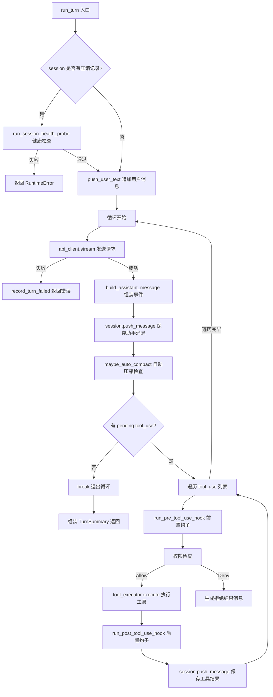

# 第6章 查询引擎与 Turn Loop

Agent 的核心运行机制是"接收用户输入 → 调用模型 → 执行工具 → 返回结果"这一循环。这个循环在 claw-code 中被称为 Turn Loop。本章分析 Python 端查询引擎的模拟实现和 Rust 端 `ConversationRuntime` 的完整 Turn Loop。

## 6.1 Python 端查询引擎数据结构

Python 端的查询引擎是一个模拟实现，用于验证架构设计和测试。核心类定义在 `QueryEnginePort` 中，配置和结果通过 dataclass 表达。

```python
# claw-code/src/query_engine.py

@dataclass(frozen=True)
class QueryEngineConfig:
    max_turns: int = 8                    # 单次会话最大轮数
    max_budget_tokens: int = 2000        # token 预算上限
    compact_after_turns: int = 12         # 触发压缩的消息条数阈值
    structured_output: bool = False      # 是否输出 JSON 格式
    structured_retry_limit: int = 2       # JSON 序列化重试次数

@dataclass(frozen=True)
class TurnResult:
    prompt: str
    output: str
    matched_commands: tuple[str, ...]
    matched_tools: tuple[str, ...]
    permission_denials: tuple[PermissionDenial, ...]
    usage: UsageSummary
    stop_reason: str                      # completed / max_turns_reached / max_budget_reached
```

`QueryEngineConfig` 是 frozen dataclass，不可变，保证配置在运行期间不会被意外修改。`TurnResult` 同样 frozen，每轮结束时生成一个快照。`stop_reason` 字段控制循环退出条件，对应三种终止场景：正常完成、轮数超限、token 预算耗尽。

`QueryEnginePort` 是可变状态容器，持有会话的运行时数据：

```python
# claw-code/src/query_engine.py

@dataclass
class QueryEnginePort:
    manifest: PortManifest
    config: QueryEngineConfig = field(default_factory=QueryEngineConfig)
    session_id: str = field(default_factory=lambda: uuid4().hex)
    mutable_messages: list[str] = field(default_factory=list)          # 可压缩的消息列表
    permission_denials: list[PermissionDenial] = field(default_factory=list)
    total_usage: UsageSummary = field(default_factory=UsageSummary)
    transcript_store: TranscriptStore = field(default_factory=TranscriptStore)
```

`mutable_messages` 是一个普通 list，可以随时裁剪。`transcript_store` 是 `TranscriptStore` 实例，负责记录用户消息的原始序列：

```python
# claw-code/src/transcript.py

@dataclass
class TranscriptStore:
    entries: list[str] = field(default_factory=list)
    flushed: bool = False

    def compact(self, keep_last: int = 10) -> None:
        if len(self.entries) > keep_last:
            self.entries[:] = self.entries[-keep_last:]    # 原地截断，保留最近 N 条
```

`TranscriptStore` 的 `compact` 方法是原地截断操作，直接修改 `entries` 列表。这是 Python 端对上下文压缩的简化模拟。Rust 端的 `compact_session` 实现了更完整的摘要+保留逻辑。

## 6.2 submit_message 单轮执行

`submit_message` 是 Python 端的核心方法，处理一条用户消息并返回 `TurnResult`。

```python
# claw-code/src/query_engine.py

def submit_message(
    self,
    prompt: str,
    matched_commands: tuple[str, ...] = (),
    matched_tools: tuple[str, ...] = (),
    denied_tools: tuple[PermissionDenial, ...] = (),
) -> TurnResult:
    if len(self.mutable_messages) >= self.config.max_turns:
        # 轮数超限，直接返回，不调用模型
        return TurnResult(
            prompt=prompt, output=f'Max turns reached before processing prompt: {prompt}',
            ..., stop_reason='max_turns_reached',
        )

    # 构造摘要输出
    summary_lines = [
        f'Prompt: {prompt}',
        f'Matched commands: {", ".join(matched_commands) if matched_commands else "none"}',
        f'Matched tools: {", ".join(matched_tools) if matched_tools else "none"}',
        f'Permission denials: {len(denied_tools)}',
    ]
    output = self._format_output(summary_lines)

    # 估算 token 用量（用 word count 模拟）
    projected_usage = self.total_usage.add_turn(prompt, output)
    stop_reason = 'completed'
    if projected_usage.input_tokens + projected_usage.output_tokens > self.config.max_budget_tokens:
        stop_reason = 'max_budget_reached'

    # 更新可变状态
    self.mutable_messages.append(prompt)
    self.transcript_store.append(prompt)
    self.permission_denials.extend(denied_tools)
    self.total_usage = projected_usage
    self.compact_messages_if_needed()     # 检查是否需要压缩

    return TurnResult(prompt, output, matched_commands, matched_tools,
                      denied_tools, self.total_usage, stop_reason)
```

这个方法不调用真实的 LLM API，而是用字符串拼接模拟模型输出。`UsageSummary.add_turn` 用空格分词计算 token 数量，是一种粗略估算：

```python
# claw-code/src/models.py

@dataclass(frozen=True)
class UsageSummary:
    input_tokens: int = 0
    output_tokens: int = 0

    def add_turn(self, prompt: str, output: str) -> 'UsageSummary':
        return UsageSummary(
            input_tokens=self.input_tokens + len(prompt.split()),
            output_tokens=self.output_tokens + len(output.split()),
        )
```

`stream_submit_message` 是 `submit_message` 的流式版本，通过 generator yield 事件序列：

```python
# claw-code/src/query_engine.py

def stream_submit_message(self, prompt, matched_commands=(), matched_tools=(), denied_tools=()):
    yield {'type': 'message_start', 'session_id': self.session_id, 'prompt': prompt}
    if matched_commands:
        yield {'type': 'command_match', 'commands': matched_commands}
    if matched_tools:
        yield {'type': 'tool_match', 'tools': matched_tools}
    if denied_tools:
        yield {'type': 'permission_denial', 'denials': [...]}
    result = self.submit_message(prompt, matched_commands, matched_tools, denied_tools)
    yield {'type': 'message_delta', 'text': result.output}
    yield {'type': 'message_stop', 'usage': {...}, 'stop_reason': result.stop_reason, ...}
```

流式事件模型与 Rust 端的 `AssistantEvent` 枚举形成对应关系，只是 Python 端用 dict 代替了 enum。

## 6.3 Python 端 Turn Loop 雏形

`PortRuntime` 类在 `runtime.py` 中实现了 Python 端的 Turn Loop 雏形。这个循环不是无限循环，而是一个有限次数的 for 循环：

```python
# claw-code/src/runtime.py

def run_turn_loop(self, prompt: str, limit: int = 5, max_turns: int = 3,
                  structured_output: bool = False) -> list[TurnResult]:
    engine = QueryEnginePort.from_workspace()
    engine.config = QueryEngineConfig(max_turns=max_turns, structured_output=structured_output)
    matches = self.route_prompt(prompt, limit=limit)
    command_names = tuple(match.name for match in matches if match.kind == 'command')
    tool_names = tuple(match.name for match in matches if match.kind == 'tool')

    results: list[TurnResult] = []
    for turn in range(max_turns):
        turn_prompt = prompt if turn == 0 else f'{prompt} [turn {turn + 1}]'
        result = engine.submit_message(turn_prompt, command_names, tool_names, ())
        results.append(result)
        if result.stop_reason != 'completed':    # 非正常结束则退出循环
            break
    return results
```

`route_prompt` 方法做的是关键词匹配路由，将用户输入与已注册的命令和工具进行匹配：

```python
# claw-code/src/runtime.py

def route_prompt(self, prompt: str, limit: int = 5) -> list[RoutedMatch]:
    explicit_command = self._explicit_command_match(prompt)  # 检查 /command 前缀
    tokens = {token.lower() for token in prompt.replace('/', ' ').replace('-', ' ').split() if token}
    by_kind = {
        'command': self._collect_matches(tokens, PORTED_COMMANDS, 'command'),
        'tool': self._collect_matches(tokens, PORTED_TOOLS, 'tool'),
    }
    # 精确匹配优先，然后按分数排序
    ...
    return selected[:limit]
```

`_score` 方法用简单的子串匹配计算相关度分数：每个 prompt token 出现在模块名、来源路径或职责描述中，就加 1 分。这是一个基于关键词的路由策略，不涉及向量搜索或语义匹配。

`QueryEngineRuntime` 类继承 `QueryEnginePort`，增加了 `route` 方法，但只是简单调用 `PortRuntime` 的路由功能并格式化输出：

```python
# claw-code/src/QueryEngine.py

class QueryEngineRuntime(QueryEnginePort):
    def route(self, prompt: str, limit: int = 5) -> str:
        matches = PortRuntime().route_prompt(prompt, limit=limit)
        lines = ['# Query Engine Route', '', f'Prompt: {prompt}', '']
        if not matches:
            lines.append('No mirrored command/tool matches found.')
            return '\n'.join(lines)
        lines.append('Matches:')
        lines.extend(f'- [{match.kind}] {match.name} ({match.score}) — {match.source_hint}'
                     for match in matches)
        return '\n'.join(lines)
```

Python 端的 Turn Loop 是一个设计原型，不包含真实的模型调用、工具执行和权限交互。真正的 Turn Loop 实现在 Rust 端的 `ConversationRuntime` 中。

## 6.4 Rust 端 ConversationRuntime 结构

Rust 端的 `ConversationRuntime` 是一个泛型结构体，通过 trait 约束注入 API 客户端和工具执行器：

```rust
// claw-code/rust/crates/runtime/src/conversation.rs

pub struct ConversationRuntime<C, T> {
    session: Session,                              // 会话状态（消息列表、压缩元数据）
    api_client: C,                                  // 泛型 API 客户端
    tool_executor: T,                               // 泛型工具执行器
    permission_policy: PermissionPolicy,            // 权限策略
    system_prompt: Vec<String>,                     // 系统提示词
    max_iterations: usize,                          // 最大迭代次数
    usage_tracker: UsageTracker,                    // token 用量追踪
    hook_runner: HookRunner,                        // 钩子执行器
    auto_compaction_input_tokens_threshold: u32,    // 自动压缩阈值
    hook_abort_signal: HookAbortSignal,             // 钩子中断信号
    hook_progress_reporter: Option<Box<dyn HookProgressReporter>>,
    session_tracer: Option<SessionTracer>,           // 遥测追踪器
}
```

泛型参数 `C` 和 `T` 分别约束为 `ApiClient` 和 `ToolExecutor` trait。这种设计允许在生产环境注入真实的 HTTP 客户端和工具分发器，在测试环境注入 `ScriptedApiClient` 和 `StaticToolExecutor`。

`ApiClient` trait 定义了唯一的 `stream` 方法，接收 `ApiRequest` 返回 `Vec<AssistantEvent>`：

```rust
// claw-code/rust/crates/runtime/src/conversation.rs

pub trait ApiClient {
    fn stream(&mut self, request: ApiRequest) -> Result<Vec<AssistantEvent>, RuntimeError>;
}

pub trait ToolExecutor {
    fn execute(&mut self, tool_name: &str, input: &str) -> Result<String, ToolError>;
}
```

`ApiRequest` 只包含 system_prompt 和 messages 两个字段，是发给模型的最小请求结构。`AssistantEvent` 是流式事件枚举，覆盖模型返回的所有内容类型：

```rust
// claw-code/rust/crates/runtime/src/conversation.rs

pub enum AssistantEvent {
    Thinking { thinking: String, signature: Option<String> },  // 思考过程（extended thinking）
    TextDelta(String),                                            // 文本增量
    ToolUse { id: String, name: String, input: String },        // 工具调用请求
    Usage(TokenUsage),                                            // token 用量
    PromptCache(PromptCacheEvent),                                // prompt cache 遥测
    MessageStop,                                                  // 消息结束标记
}
```

`PromptCacheEvent` 记录 prompt cache 的命中异常，当 cache read tokens 突然下降但 prompt fingerprint 未变时触发，用于诊断缓存失效问题。

## 6.5 run_turn 核心循环

`run_turn` 是 `ConversationRuntime` 的核心方法，实现了完整的 Turn Loop。整个方法约 200 行，可以拆分为四个阶段。



第一阶段是会话健康检查。如果 session 之前被压缩过，`run_turn` 会先执行健康探针，通过调用 `glob_search` 工具验证 tool executor 是否正常工作：

```rust
// claw-code/rust/crates/runtime/src/conversation.rs

fn run_session_health_probe(&mut self) -> Result<(), String> {
    if self.session.messages.is_empty() && self.session.compaction.is_some() {
        return Ok(());  // 刚压缩完，没有消息是正常的
    }
    let probe_input = r#"{"pattern": "*.health-check-probe-"}"#;
    match self.tool_executor.execute("glob_search", probe_input) {
        Ok(_) => Ok(()),
        Err(e) => Err(format!("Tool executor probe failed: {e}")),
    }
}
```

探针使用一个不会匹配任何文件的 glob 模式，是非破坏性操作。如果 tool executor 不可用，整个 turn 会被中止，避免在一个损坏的会话状态上继续交互。

第二阶段是 API 调用与消息组装。`build_assistant_message` 函数将 `Vec<AssistantEvent>` 转换为 `ConversationMessage`：

```rust
// claw-code/rust/crates/runtime/src/conversation.rs

fn build_assistant_message(events: Vec<AssistantEvent>)
    -> Result<(ConversationMessage, Option<TokenUsage>, Vec<PromptCacheEvent>), RuntimeError>
{
    let mut text = String::new();
    let mut blocks = Vec::new();
    let mut finished = false;

    for event in events {
        match event {
            AssistantEvent::Thinking { thinking, signature } => {
                flush_text_block(&mut text, &mut blocks);  // 先把累积的文本刷入 blocks
                blocks.push(ContentBlock::Thinking { thinking, signature });
            }
            AssistantEvent::TextDelta(delta) => text.push_str(&delta),
            AssistantEvent::ToolUse { id, name, input } => {
                flush_text_block(&mut text, &mut blocks);
                blocks.push(ContentBlock::ToolUse { id, name, input });
            }
            AssistantEvent::Usage(value) => usage = Some(value),
            AssistantEvent::PromptCache(event) => prompt_cache_events.push(event),
            AssistantEvent::MessageStop => finished = true,
        }
    }
    flush_text_block(&mut text, &mut blocks);  // 最后刷入剩余文本

    if !finished {
        return Err(RuntimeError::new("assistant stream ended without a message stop event"));
    }
    if blocks.is_empty() {
        return Err(RuntimeError::new("assistant stream produced no content"));
    }
    Ok((ConversationMessage::assistant_with_usage(blocks, usage), usage, prompt_cache_events))
}
```

`flush_text_block` 是一个辅助函数，将累积的文本字符串转为 `ContentBlock::Text` 并清空缓冲区。这个设计确保文本和工具调用在 blocks 中的顺序与模型输出的顺序一致。`MessageStop` 事件必须存在，否则视为流截断。

第三阶段是工具执行循环。从 assistant message 中提取所有 `ContentBlock::ToolUse`，逐个执行：

```rust
// claw-code/rust/crates/runtime/src/conversation.rs

let pending_tool_uses = assistant_message.blocks.iter()
    .filter_map(|block| match block {
        ContentBlock::ToolUse { id, name, input } => Some((id.clone(), name.clone(), input.clone())),
        _ => None,
    })
    .collect::<Vec<_>>();

if pending_tool_uses.is_empty() {
    break;  // 没有工具调用，模型已完成回答，退出循环
}
```

每个工具调用经过四个步骤：前置钩子 → 权限检查 → 执行 → 后置钩子。

前置钩子可以修改工具输入、覆盖权限决策，或直接取消工具调用：

```rust
// claw-code/rust/crates/runtime/src/conversation.rs

let pre_hook_result = self.run_pre_tool_use_hook(&tool_name, &input);
let effective_input = pre_hook_result.updated_input()
    .map_or_else(|| input.clone(), ToOwned::to_owned);

let permission_context = PermissionContext::new(
    pre_hook_result.permission_override(),
    pre_hook_result.permission_reason().map(ToOwned::to_owned),
);

let permission_outcome = if pre_hook_result.is_cancelled() {
    PermissionOutcome::Deny { reason: format_hook_message(&pre_hook_result, ...) }
} else if pre_hook_result.is_failed() {
    PermissionOutcome::Deny { reason: format_hook_message(&pre_hook_result, ...) }
} else if pre_hook_result.is_denied() {
    PermissionOutcome::Deny { reason: format_hook_message(&pre_hook_result, ...) }
} else if let Some(prompt) = prompter.as_mut() {
    self.permission_policy.authorize_with_context(&tool_name, &effective_input, &permission_context, Some(*prompt))
} else {
    self.permission_policy.authorize_with_context(&tool_name, &effective_input, &permission_context, None)
};
```

权限检查有两条路径：如果前置钩子已取消/失败/拒绝，直接生成 `Deny` 结果，不再调用权限策略。否则将决策委托给 `PermissionPolicy::authorize_with_context`，如果有 `prompter`（交互式确认接口），还会弹出用户确认提示。

工具执行后，根据执行结果选择不同的后置钩子：

```rust
// claw-code/rust/crates/runtime/src/conversation.rs

let (mut output, mut is_error) = match self.tool_executor.execute(&tool_name, &effective_input) {
    Ok(output) => (output, false),
    Err(error) => (error.to_string(), true),
};
output = merge_hook_feedback(pre_hook_result.messages(), output, false);

let post_hook_result = if is_error {
    self.run_post_tool_use_failure_hook(&tool_name, &effective_input, &output)
} else {
    self.run_post_tool_use_hook(&tool_name, &effective_input, &output, false)
};
```

`merge_hook_feedback` 将钩子产生的消息拼接到工具输出中，确保用户和模型都能看到钩子的反馈。工具失败时走 `post_tool_use_failure` 钩子而非 `post_tool_use`，两者是独立的钩子通道。

第四阶段是循环退出与结果汇总。当 `pending_tool_uses` 为空时，模型已不再请求工具，本轮 turn 结束：

```rust
// claw-code/rust/crates/runtime/src/conversation.rs

let summary = TurnSummary {
    assistant_messages,
    tool_results,
    prompt_cache_events,
    iterations,
    usage: self.usage_tracker.cumulative_usage(),
    auto_compaction,
};
self.record_turn_completed(&summary);
Ok(summary)
```

`TurnSummary` 包含本轮所有助手消息、工具结果、prompt cache 事件、迭代次数和累计 token 用量。如果自动压缩在循环中触发过，也会包含在 `auto_compaction` 字段中。

## 6.6 自动压缩与上下文管理

长对话会累积大量消息，最终超过模型的上下文窗口。`ConversationRuntime` 在每次 API 调用返回后检查是否需要自动压缩：

```rust
// claw-code/rust/crates/runtime/src/conversation.rs

fn maybe_auto_compact(&mut self) -> Option<AutoCompactionEvent> {
    if self.usage_tracker.cumulative_usage().input_tokens
        < self.auto_compaction_input_tokens_threshold
    {
        return None;   // 未达阈值，不压缩
    }

    let result = compact_session(&self.session, CompactionConfig {
        max_estimated_tokens: 0,       // 强制压缩，阈值设为 0
        ..CompactionConfig::default()
    });

    if result.removed_message_count == 0 {
        return None;                   // 没有可压缩的内容
    }

    self.session = result.compacted_session;  // 替换当前 session
    Some(AutoCompactionEvent { removed_message_count: result.removed_message_count })
}
```

默认阈值是 100,000 input tokens，可通过环境变量 `CLAUDE_CODE_AUTO_COMPACT_INPUT_TOKENS` 覆盖：

```rust
// claw-code/rust/crates/runtime/src/conversation.rs

const DEFAULT_AUTO_COMPACTION_INPUT_TOKENS_THRESHOLD: u32 = 100_000;
const AUTO_COMPACTION_THRESHOLD_ENV_VAR: &str = "CLAUDE_CODE_AUTO_COMPACT_INPUT_TOKENS";

pub fn auto_compaction_threshold_from_env() -> u32 {
    parse_auto_compaction_threshold(
        std::env::var(AUTO_COMPACTION_THRESHOLD_ENV_VAR).ok().as_deref(),
    )
}

fn parse_auto_compaction_threshold(value: Option<&str>) -> u32 {
    value
        .and_then(|raw| raw.trim().parse::<u32>().ok())
        .filter(|threshold| *threshold > 0)   // 0 视为无效，回退默认值
        .unwrap_or(DEFAULT_AUTO_COMPACTION_INPUT_TOKENS_THRESHOLD)
}
```

`compact_session` 在 `compact.rs` 中实现，将历史消息汇总为一条 system 消息，保留最近几条消息作为上下文：

```rust
// claw-code/rust/crates/runtime/src/compact.rs

pub struct CompactionConfig {
    pub preserve_recent_messages: usize,    // 保留最近消息数，默认 4
    pub max_estimated_tokens: usize,         // token 预算阈值，默认 10_000
}
```

`estimate_session_tokens` 用消息的字符长度粗略估算 token 数量，不做精确分词。这个估算只用于判断是否触发压缩，不影响实际的 token 计费。

自动压缩的触发时机在每次迭代循环末尾，包括工具执行后和模型不再请求工具时：

```rust
// claw-code/rust/crates/runtime/src/conversation.rs

// 在每次 API 返回后、检查 pending_tool_uses 之前
if let Some(compaction) = self.maybe_auto_compact() {
    auto_compaction = Some(compaction);
}

if pending_tool_uses.is_empty() {
    break;  // 即使退出循环，也已经检查过压缩
}
```

这个设计确保在 turn 结束前一定会执行压缩检查，防止 session 无限增长。

## 6.7 会话追踪与遥测

`ConversationRuntime` 通过 `SessionTracer` 记录 turn 的完整生命周期事件。tracer 是可选的，只在显式配置时生效：

```rust
// claw-code/rust/crates/runtime/src/conversation.rs

pub fn with_session_tracer(mut self, session_tracer: SessionTracer) -> Self {
    self.session_tracer = Some(session_tracer);
    self
}
```

turn 生命周期包含五个关键事件点，每个事件携带不同的属性：

| 事件名 | 触发时机 | 关键属性 |
| --- | --- | --- |
| `turn_started` | 用户消息入队后 | `user_input` |
| `assistant_iteration_completed` | 每次 API 返回后 | `iteration`, `assistant_blocks`, `pending_tool_use_count` |
| `tool_execution_started` | 工具开始执行前 | `iteration`, `tool_name` |
| `tool_execution_finished` | 工具结果入队后 | `iteration`, `tool_name`, `is_error` |
| `turn_completed` | TurnSummary 组装后 | `iterations`, `assistant_messages`, `tool_results`, `prompt_cache_events` |

还有一个 `turn_failed` 事件，在任何阶段出错时触发，携带 `iteration` 和 `error` 属性。这些事件通过 `SessionTracer` 写入遥测 sink，用于运行时诊断和性能分析。

每个 record 方法都遵循相同的模式：先检查 tracer 是否存在，不存在则直接返回：

```rust
// claw-code/rust/crates/runtime/src/conversation.rs

fn record_turn_started(&self, user_input: &str) {
    let Some(session_tracer) = &self.session_tracer else { return; };

    let mut attributes = Map::new();
    attributes.insert("user_input".to_string(), Value::String(user_input.to_string()));
    session_tracer.record("turn_started", attributes);
}
```

## 6.8 StaticToolExecutor 测试工具

`StaticToolExecutor` 是 `ToolExecutor` trait 的内存实现，用于测试和轻量集成：

```rust
// claw-code/rust/crates/runtime/src/conversation.rs

pub struct StaticToolExecutor {
    handlers: BTreeMap<String, ToolHandler>,   // tool_name → 闭包
}

impl StaticToolExecutor {
    pub fn register(
        mut self,
        tool_name: impl Into<String>,
        handler: impl FnMut(&str) -> Result<String, ToolError> + 'static,
    ) -> Self {
        self.handlers.insert(tool_name.into(), Box::new(handler));
        self      // 返回 self，支持链式注册
    }
}

impl ToolExecutor for StaticToolExecutor {
    fn execute(&mut self, tool_name: &str, input: &str) -> Result<String, ToolError> {
        self.handlers
            .get_mut(tool_name)
            .ok_or_else(|| ToolError::new(format!("unknown tool: {tool_name}")))?(input)
    }
}
```

`register` 方法接收闭包，用 `Box<dyn FnMut>` 存储。`BTreeMap` 保证工具按名称排序，测试输出确定性强。测试中使用 `ScriptedApiClient` 配合 `StaticToolExecutor`，可以精确控制每个迭代的模型返回和工具行为。

## 设计对比

`ConversationRuntime` 的 `run_turn` 方法与 Spring MVC 的 `DispatcherServlet.doDispatch` 在结构上高度相似，但运行模式有本质区别。

`DispatcherServlet` 处理的是 HTTP 请求，每个请求独立、无状态（session 由外层管理）。`run_turn` 处理的是对话轮次，每轮共享同一个 `Session`，消息在轮次间累积。对应关系如下：

| claw-code 概念 | Spring 生态对应 |
| --- | --- |
| `ConversationRuntime<C, T>` | `DispatcherServlet` + `HandlerMapping` + `HandlerAdapter` |
| `ApiClient` trait | `HttpMessageConverter` / RPC client |
| `ToolExecutor` trait | `HandlerAdapter`（执行控制器方法） |
| `run_turn` 主循环 | `doDispatch` 请求处理流程 |
| `build_assistant_message` | `HandlerMethodReturnValueHandler`（组装返回值） |
| `maybe_auto_compact` | 无直接对应（Spring 不做 session 压缩） |
| `SessionTracer` | `HandlerInterceptor` 的 afterCompletion 回调 |
| `HookRunner` | `HandlerInterceptor` 的 preHandle/postHandle |
| `PermissionPolicy` | Spring Security 的 `FilterSecurityInterceptor` |

核心差异在于循环次数：`DispatcherServlet` 处理一次请求就返回，`run_turn` 会循环多次直到模型不再请求工具。这更接近 Spring 的 `RequestMappingHandlerAdapter` 在处理 Server-Sent Events 时的持续推送模式。

另一个差异是 `ConversationRuntime` 的泛型设计。Spring 的 `DispatcherServlet` 通过接口注入组件，claw-code 通过 trait 约束注入。trait 的静态分发在编译期确定具体类型，运行时无虚函数开销（除了 `hook_progress_reporter` 和 `session_tracer` 用了 `Box<dyn>`）。Spring 的接口注入是动态分发，有 JDK 动态代理开销。

## 小结

本章分析了 claw-code 查询引擎的两层实现。Python 端 `QueryEnginePort`（`src/query_engine.py`）是模拟原型，用字符串拼接和 word count 估算模型输出和 token 用量，通过 `PortRuntime.run_turn_loop`（`src/runtime.py`）实现有限次数循环。Rust 端 `ConversationRuntime`（`rust/crates/runtime/src/conversation.rs`）是生产实现，`run_turn` 方法通过 `ApiClient` trait 调用真实模型，通过 `ToolExecutor` trait 执行工具，在循环中集成钩子（`HookRunner`）、权限（`PermissionPolicy`）和自动压缩（`compact_session`）。`build_assistant_message` 将流式事件组装为结构化消息，`maybe_auto_compact` 在每轮迭代后检查 token 阈值并触发上下文压缩。`SessionTracer` 记录从 `turn_started` 到 `turn_completed` 的完整生命周期事件。
