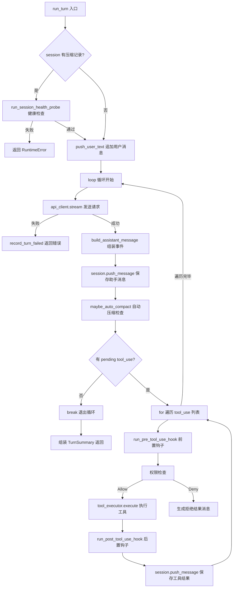

# 第6章 Turn Loop：对话循环与工具执行

## 本章概览

本章分析 claw-code 的核心运行机制——Turn Loop。对应第2章架构全景中的 `runtime` crate 和 Python 端的 `query_engine.py`、`runtime.py`、`transcript.py` 模块。

Turn Loop 要解决的核心问题是：Agent 如何把"用户输入一句话"转化为"执行若干工具后给出最终回答"。这个过程不是一次性的请求-响应，而是一个循环——模型可能在一轮中请求多个工具，工具结果被送回模型，模型基于新信息继续推理，可能再请求工具，如此往复直到模型不再请求工具，给出最终文本回答。

本章按数据流顺序展开：先看 Python 端的查询引擎原型和简化 Turn Loop（6.1-6.2），再看 Rust 端 `ConversationRuntime` 的泛型设计与 trait 约束（6.3），然后深入 `run_turn` 核心循环的四个阶段（6.4），接着看流式事件组装和自动压缩机制（6.5-6.6），最后看会话追踪和测试设施（6.7-6.8）。

| 关键文件 | 职责 |
| --- | --- |
| `src/query_engine.py` | Python 端查询引擎，配置、状态、模拟执行 |
| `src/runtime.py` | Python 端 Turn Loop 雏形，路由匹配 |
| `src/transcript.py` | Python 端消息记录与压缩 |
| `rust/crates/runtime/src/conversation.rs` | Rust 端 ConversationRuntime，run_turn，事件组装，追踪 |
| `rust/crates/runtime/src/compact.rs` | Rust 端会话压缩，摘要+保留 |

## 6.1 Python 端查询引擎：配置与状态

### QueryEngineConfig：循环控制参数

Python 端的查询引擎是一个模拟实现，用于验证架构设计和测试。配置通过 `QueryEngineConfig` 表达：

```python
# claw-code/src/query_engine.py

@dataclass(frozen=True)
class QueryEngineConfig:
    max_turns: int = 8
    max_budget_tokens: int = 2000
    compact_after_turns: int = 12
    structured_output: bool = False
    structured_retry_limit: int = 2
```

五个字段控制循环行为。`max_turns` 限制单次会话最大轮数——超过此值循环停止，防止无限对话。`max_budget_tokens` 是 token 预算上限——累计 token 超过此值时停止。`compact_after_turns` 是触发压缩的消息条数阈值——消息超过此值时截断旧消息。`structured_output` 控制输出格式——`True` 时输出 JSON，`False` 时输出纯文本。`structured_retry_limit` 是 JSON 序列化失败时的重试次数。

`@dataclass(frozen=True)` 让配置不可变——创建后不能修改字段值。这保证了配置在运行期间不会被意外篡改。Python 的 `frozen=True` 还会自动生成 `__hash__`，使得配置对象可以作为字典键或集合元素。

### TurnResult：单轮结果快照

每轮结束时生成一个 `TurnResult` 快照：

```python
# claw-code/src/query_engine.py

@dataclass(frozen=True)
class TurnResult:
    prompt: str
    output: str
    matched_commands: tuple[str, ...]
    matched_tools: tuple[str, ...]
    permission_denials: tuple[PermissionDenial, ...]
    usage: UsageSummary
    stop_reason: str
```

`stop_reason` 控制循环退出条件，对应三种终止场景：`'completed'`（正常完成）、`'max_turns_reached'`（轮数超限）、`'max_budget_reached'`（token 预算耗尽）。`matched_commands` 和 `matched_tools` 记录本轮匹配到的命令和工具名。`permission_denials` 记录被权限拒绝的工具列表。`usage` 是累计 token 用量。

`tuple` 而非 `list` 用于不可变序列——`TurnResult` 是 frozen 的，其字段也应该是不可变的。

### QueryEnginePort：可变状态容器

`QueryEnginePort` 持有会话的运行时数据，是可变的（没有 `frozen=True`）：

```python
# claw-code/src/query_engine.py

@dataclass
class QueryEnginePort:
    manifest: PortManifest
    config: QueryEngineConfig = field(default_factory=QueryEngineConfig)
    session_id: str = field(default_factory=lambda: uuid4().hex)
    mutable_messages: list[str] = field(default_factory=list)
    permission_denials: list[PermissionDenial] = field(default_factory=list)
    total_usage: UsageSummary = field(default_factory=UsageSummary)
    transcript_store: TranscriptStore = field(default_factory=TranscriptStore)
```

`mutable_messages` 是一个普通 `list`，可以随时裁剪——这是上下文压缩的基础。`transcript_store` 是 `TranscriptStore` 实例，负责记录用户消息的原始序列。`session_id` 用 `uuid4().hex` 自动生成唯一标识。`field(default_factory=...)` 在每次创建实例时调用工厂函数生成新对象——避免了可变默认值的经典陷阱（Python 中 `default=[]` 会让所有实例共享同一个列表）。

```python
# claw-code/src/query_engine.py

@classmethod
def from_saved_session(cls, session_id: str) -> 'QueryEnginePort':
    stored = load_session(session_id)
    transcript = TranscriptStore(entries=list(stored.messages), flushed=True)
    return cls(
        manifest=build_port_manifest(),
        session_id=stored.session_id,
        mutable_messages=list(stored.messages),
        total_usage=UsageSummary(stored.input_tokens, stored.output_tokens),
        transcript_store=transcript,
    )
```

`list(stored.messages)` 创建消息列表的副本——避免修改恢复的消息时影响原始存储。`flushed=True` 表示恢复的 transcript 已经持久化过，不需要再次 flush。

### TranscriptStore：消息记录与压缩

`TranscriptStore` 记录用户消息的原始序列，支持压缩和回放：

```python
# claw-code/src/transcript.py

@dataclass
class TranscriptStore:
    entries: list[str] = field(default_factory=list)
    flushed: bool = False

    def append(self, entry: str) -> None:
        self.entries.append(entry)
        self.flushed = False

    def compact(self, keep_last: int = 10) -> None:
        if len(self.entries) > keep_last:
            self.entries[:] = self.entries[-keep_last:]

    def replay(self) -> tuple[str, ...]:
        return tuple(self.entries)

    def flush(self) -> None:
        self.flushed = True
```

`compact` 方法是原地截断操作——`self.entries[:] = self.entries[-keep_last:]` 用切片赋值替换列表内容，保留最后 `keep_last` 条消息。`self.entries[:]` 是整个列表的切片视图，赋值会修改原列表而非创建新列表。

`flushed` 标记表示消息是否已持久化——`append` 时设为 `False`（有新消息未保存），`flush` 时设为 `True`（已保存）。这是一个脏标记（dirty flag）模式，避免不必要的重复持久化。

## 6.2 Python 端 submit_message 与 Turn Loop

### submit_message 单轮执行

`submit_message` 是 Python 端的核心方法，处理一条用户消息并返回 `TurnResult`：

```python
# claw-code/src/query_engine.py

def submit_message(
    self,
    prompt: str,
    matched_commands: tuple[str, ...] = (),
    matched_tools: tuple[str, ...] = (),
    denied_tools: tuple[PermissionDenial, ...] = (),
) -> TurnResult:
    if len(self.mutable_messages) >= self.config.max_turns:
        output = f'Max turns reached before processing prompt: {prompt}'
        return TurnResult(
            prompt=prompt,
            output=output,
            matched_commands=matched_commands,
            matched_tools=matched_tools,
            permission_denials=denied_tools,
            usage=self.total_usage,
            stop_reason='max_turns_reached',
        )
```

方法首先检查轮数是否超限。`len(self.mutable_messages) >= self.config.max_turns` 用已存储的消息数与最大轮数比较——如果已经存了 8 条消息且 `max_turns=8`，直接返回 `stop_reason='max_turns_reached'`，不处理新消息。这是一个保护机制，防止在配置的轮数上限内无限循环。

如果没有超限，构造模拟输出：

```python
# claw-code/src/query_engine.py

    summary_lines = [
        f'Prompt: {prompt}',
        f'Matched commands: {", ".join(matched_commands) if matched_commands else "none"}',
        f'Matched tools: {", ".join(matched_tools) if matched_tools else "none"}',
        f'Permission denials: {len(denied_tools)}',
        *(f'Permission denial: {denial.tool_name} status={denial.status} reason={denial.reason}' for denial in denied_tools),
    ]
    output = self._format_output(summary_lines)
```

这里不调用真实的 LLM API，而是用字符串拼接模拟模型输出。`summary_lines` 是一个列表，用 `f-string` 格式化每个字段。`*(f'...' for denial in denied_tools)` 用星号解包生成器表达式，把每个权限拒绝的详情展开为列表元素。

`_format_output` 根据 `structured_output` 配置决定输出格式：

```python
# claw-code/src/query_engine.py

def _format_output(self, summary_lines: list[str]) -> str:
    if self.config.structured_output:
        payload = {
            'summary': summary_lines,
            'session_id': self.session_id,
        }
        return self._render_structured_output(payload)
    return '\n'.join(summary_lines)
```

结构化模式输出 JSON（通过 `json.dumps`），非结构化模式输出纯文本（用换行符连接）。`_render_structured_output` 有重试逻辑——如果 JSON 序列化失败（如不可序列化的对象），重试最多 `structured_retry_limit` 次，每次用简化的 payload。

token 估算和状态更新：

```python
# claw-code/src/query_engine.py

    projected_usage = self.total_usage.add_turn(prompt, output)
    stop_reason = 'completed'
    if projected_usage.input_tokens + projected_usage.output_tokens > self.config.max_budget_tokens:
        stop_reason = 'max_budget_reached'

    self.mutable_messages.append(prompt)
    self.transcript_store.append(prompt)
    self.permission_denials.extend(denied_tools)
    self.total_usage = projected_usage
    self.compact_messages_if_needed()
```

`add_turn` 用 word count 模拟 token 计数：

```python
# claw-code/src/models.py

@dataclass(frozen=True)
class UsageSummary:
    input_tokens: int = 0
    output_tokens: int = 0

    def add_turn(self, prompt: str, output: str) -> 'UsageSummary':
        return UsageSummary(
            input_tokens=self.input_tokens + len(prompt.split()),
            output_tokens=self.output_tokens + len(output.split()),
        )
```

`len(prompt.split())` 用空格分词计算词数，作为 token 的粗略估算。真实的 token 计数需要用 tokenizer（如 tiktoken），Python 端用 word count 是一种简化的模拟。`add_turn` 返回新的 `UsageSummary` 而非修改自身——这是 frozen dataclass 的不可变模式，每次更新都创建新实例。

`compact_messages_if_needed` 检查是否需要压缩：

```python
# claw-code/src/query_engine.py

def compact_messages_if_needed(self) -> None:
    if len(self.mutable_messages) > self.config.compact_after_turns:
        self.mutable_messages[:] = self.mutable_messages[-self.config.compact_after_turns:]
    self.transcript_store.compact(self.config.compact_after_turns)
```

当消息数超过 `compact_after_turns`（默认 12），截断保留最近 12 条。`self.mutable_messages[:] = ...` 是原地修改——保持列表对象身份不变，只替换内容。同时调用 `transcript_store.compact` 压缩原始记录。

### stream_submit_message：流式事件

`stream_submit_message` 是 `submit_message` 的流式版本，通过 generator yield 事件序列：

```python
# claw-code/src/query_engine.py

def stream_submit_message(
    self,
    prompt: str,
    matched_commands: tuple[str, ...] = (),
    matched_tools: tuple[str, ...] = (),
    denied_tools: tuple[PermissionDenial, ...] = (),
):
    yield {'type': 'message_start', 'session_id': self.session_id, 'prompt': prompt}
    if matched_commands:
        yield {'type': 'command_match', 'commands': matched_commands}
    if matched_tools:
        yield {'type': 'tool_match', 'tools': matched_tools}
    if denied_tools:
        yield {
            'type': 'permission_denial',
            'denials': [
                {'tool_name': denial.tool_name, 'reason': denial.reason, 'status': denial.status}
                for denial in denied_tools
            ],
        }
    result = self.submit_message(prompt, matched_commands, matched_tools, denied_tools)
    yield {'type': 'message_delta', 'text': result.output}
    yield {
        'type': 'message_stop',
        'usage': {'input_tokens': result.usage.input_tokens, 'output_tokens': result.usage.output_tokens},
        'stop_reason': result.stop_reason,
        'transcript_size': len(self.transcript_store.entries),
    }
```

Python 的 generator（`yield`）实现了惰性流式输出——调用方每迭代一次，函数执行到下一个 `yield` 暂停。事件按顺序产生：`message_start` → `command_match`（如果有）→ `tool_match`（如果有）→ `permission_denial`（如果有）→ `message_delta`（输出文本）→ `message_stop`（结束）。

但 Python 的 generator 更轻量——不需要额外的流式处理框架。

事件用 `dict` 表示而非自定义类——这是 Python 端的简化设计。Rust 端用 `AssistantEvent` 枚举替代，类型安全且穷尽匹配。

### PortRuntime.run_turn_loop：有限循环

`PortRuntime` 类在 `runtime.py` 中实现了 Python 端的 Turn Loop 雏形：

```python
# claw-code/src/runtime.py

def run_turn_loop(self, prompt: str, limit: int = 5, max_turns: int = 3,
                  structured_output: bool = False) -> list[TurnResult]:
    engine = QueryEnginePort.from_workspace()
    engine.config = QueryEngineConfig(max_turns=max_turns, structured_output=structured_output)
    matches = self.route_prompt(prompt, limit=limit)
    command_names = tuple(match.name for match in matches if match.kind == 'command')
    tool_names = tuple(match.name for match in matches if match.kind == 'tool')

    results: list[TurnResult] = []
    for turn in range(max_turns):
        turn_prompt = prompt if turn == 0 else f'{prompt} [turn {turn + 1}]'
        result = engine.submit_message(turn_prompt, command_names, tool_names, ())
        results.append(result)
        if result.stop_reason != 'completed':
            break
    return results
```

这个循环不是 `while True`，而是 `for turn in range(max_turns)`——有限次数的 for 循环。每轮调用 `submit_message`，如果 `stop_reason != 'completed'`（超限或预算耗尽），立即 break 退出。

第一轮用原始 `prompt`，后续轮次追加 `[turn N]` 标记。这模拟了多轮对话中模型需要"继续"的场景。在真实的 Turn Loop 中，后续轮次的 prompt 是工具执行结果，不是原始 prompt 的重复——但 Python 端是模拟，不需要真实的多轮交互。

`route_prompt` 做关键词匹配路由：

```python
# claw-code/src/runtime.py

def route_prompt(self, prompt: str, limit: int = 5) -> list[RoutedMatch]:
    explicit_command = self._explicit_command_match(prompt)
    tokens = {token.lower() for token in prompt.replace('/', ' ').replace('-', ' ').split() if token}
    by_kind = {
        'command': self._collect_matches(tokens, PORTED_COMMANDS, 'command'),
        'tool': self._collect_matches(tokens, PORTED_TOOLS, 'tool'),
    }

    selected: list[RoutedMatch] = []
    if explicit_command is not None:
        selected.append(explicit_command)
        by_kind['command'] = [
            match for match in by_kind['command']
            if not (match.name == explicit_command.name and match.source_hint == explicit_command.source_hint)
        ]
    for kind in ('command', 'tool'):
        if by_kind[kind]:
            selected.append(by_kind[kind].pop(0))
    leftovers = sorted(
        [match for matches in by_kind.values() for match in matches],
        key=lambda item: (-item.score, item.kind, item.name),
    )
    selected.extend(leftovers[:max(0, limit - len(selected))])
    return selected[:limit]
```

路由分三步。第一步检查显式命令——`_explicit_command_match` 检查 prompt 是否以 `/command` 开头，如果是，在 `PORTED_COMMANDS` 中查找匹配。`score=100` 表示显式匹配的最高优先级。

第二步关键词分词——`prompt.replace('/', ' ').replace('-', ' ').split()` 把斜杠和连字符替换为空格再分词，`{token.lower() for token in ...}` 用集合推导式去重并转小写。比如 `"help me search files"` 变成 `{'help', 'me', 'search', 'files'}`。

第三步匹配和排序——`_collect_matches` 对每个命令/工具模块计算匹配分数，`by_kind` 字典分别存储命令和工具的匹配结果。显式匹配优先加入 `selected`，然后从每种类型中取最高分，最后把剩余的按分数降序排列填充到 `limit`。

`_score` 方法用简单的子串匹配：

```python
# claw-code/src/runtime.py

@staticmethod
def _score(tokens: set[str], module: PortingModule) -> int:
    haystacks = [module.name.lower(), module.source_hint.lower(), module.responsibility.lower()]
    score = 0
    for token in tokens:
        if any(token in haystack for haystack in haystacks):
            score += 1
    return score
```

每个 prompt token 如果出现在模块名、来源路径或职责描述中，就加 1 分。`any(token in haystack for haystack in haystacks)` 在任一 haystack 包含 token 时返回 `True`——`any` 在第一个 `True` 时短路。这是一个基于关键词的路由策略，不涉及向量搜索或语义匹配。

## 6.3 Rust 端 ConversationRuntime：泛型设计与 trait 约束

### ApiRequest 与 AssistantEvent

Rust 端的 `ConversationRuntime` 是生产实现。先看它处理的数据结构。`ApiRequest` 是发给模型的最小请求结构：

```rust
// claw-code/rust/crates/runtime/src/conversation.rs

#[derive(Debug, Clone, PartialEq, Eq)]
pub struct ApiRequest {
    pub system_prompt: Vec<String>,
    pub messages: Vec<ConversationMessage>,
}
```

只有两个字段：`system_prompt` 是系统提示词列表（每个元素是一段系统指令），`messages` 是对话消息列表。没有模型名、温度、max_tokens 等参数——这些由 `ApiClient` 的实现自行管理（如从配置中读取）。`ApiRequest` 只携带对话上下文，是接口的最小契约。

`AssistantEvent` 是流式事件枚举，覆盖模型返回的所有内容类型：

```rust
// claw-code/rust/crates/runtime/src/conversation.rs

pub enum AssistantEvent {
    Thinking {
        thinking: String,
        signature: Option<String>,
    },
    TextDelta(String),
    ToolUse {
        id: String,
        name: String,
        input: String,
    },
    Usage(TokenUsage),
    PromptCache(PromptCacheEvent),
    MessageStop,
}
```

六个变体对应六种事件。`Thinking` 携带思考过程文本和可选签名——签名用于验证思考内容的完整性（extended thinking 特性）。`TextDelta` 是文本增量——模型输出的文本片段，需要累积拼接。`ToolUse` 是工具调用请求——`id` 用于关联工具结果，`name` 是工具名，`input` 是 JSON 格式的参数。`Usage` 携带 token 用量。`PromptCache` 携带 prompt cache 遥测事件。`MessageStop` 是消息结束标记——没有数据，只是一个信号。

`PromptCacheEvent` 记录 prompt cache 的命中异常：

```rust
// claw-code/rust/crates/runtime/src/conversation.rs

pub struct PromptCacheEvent {
    pub unexpected: bool,
    pub reason: String,
    pub previous_cache_read_input_tokens: u32,
    pub current_cache_read_input_tokens: u32,
    pub token_drop: u32,
}
```

当 cache read tokens 突然下降但 prompt fingerprint 未变时，`unexpected` 设为 `true`，`token_drop` 记录下降量。这个事件用于诊断缓存失效问题——如果 prompt 没变但缓存突然不命中，可能是 API 端的缓存策略变化或 prompt 序列化不稳定。

### ApiClient 与 ToolExecutor trait

`ConversationRuntime` 通过两个 trait 注入依赖：

```rust
// claw-code/rust/crates/runtime/src/conversation.rs

pub trait ApiClient {
    fn stream(&mut self, request: ApiRequest) -> Result<Vec<AssistantEvent>, RuntimeError>;
}

pub trait ToolExecutor {
    fn execute(&mut self, tool_name: &str, input: &str) -> Result<String, ToolError>;
}
```

`ApiClient` 只有一个 `stream` 方法——接收 `ApiRequest`，返回 `Vec<AssistantEvent>`（事件列表）。`ToolExecutor` 只有一个 `execute` 方法——接收工具名和输入字符串，返回执行结果字符串。

这两个 trait 非常简洁——各只有一个方法。

### ConversationRuntime 结构体

`ConversationRuntime` 是泛型结构体，通过 trait 约束注入 API 客户端和工具执行器：

```rust
// claw-code/rust/crates/runtime/src/conversation.rs

pub struct ConversationRuntime<C, T> {
    session: Session,
    api_client: C,
    tool_executor: T,
    permission_policy: PermissionPolicy,
    system_prompt: Vec<String>,
    max_iterations: usize,
    usage_tracker: UsageTracker,
    hook_runner: HookRunner,
    auto_compaction_input_tokens_threshold: u32,
    hook_abort_signal: HookAbortSignal,
    hook_progress_reporter: Option<Box<dyn HookProgressReporter>>,
    session_tracer: Option<SessionTracer>,
}
```

泛型参数 `C` 和 `T` 在 `impl` 块中通过 `where` 子句约束为 `ApiClient` 和 `ToolExecutor`：

```rust
// claw-code/rust/crates/runtime/src/conversation.rs

impl<C, T> ConversationRuntime<C, T>
where
    C: ApiClient,
    T: ToolExecutor,
{
```

这意味着 `ConversationRuntime` 只能在 `C` 实现 `ApiClient` 且 `T` 实现 `ToolExecutor` 时使用。编译器在编译时检查这个约束——如果传入的类型不满足，编译报错。

泛型设计允许在生产环境注入真实的 HTTP 客户端和工具分发器，在测试环境注入 `ScriptedApiClient` 和 `StaticToolExecutor`。因为 Rust 的泛型是编译期单态化的——每个具体的 `C` 和 `T` 组合会生成一份专门的代码，没有虚函数调用开销。

Rust 的泛型在编译期展开，`self.api_client.stream(request)` 直接编译为具体类型的 `stream` 方法调用，零开销。

`hook_progress_reporter` 和 `session_tracer` 用 `Option<Box<dyn ...>>`——动态分发。这是因为这两个组件是可选的（`Option`），且类型较复杂（`HookProgressReporter` 有多个方法），用 trait object 比 泛型更灵活。`Box` 把 trait object 放在堆上，`dyn` 表示动态分发。

`max_iterations` 限制循环最大迭代次数——防止模型无限请求工具导致死循环。默认值通常设为 20-50 次。`auto_compaction_input_tokens_threshold` 是自动压缩的 token 阈值——累计 input tokens 超过此值时触发压缩。

## 6.4 run_turn 核心循环

### 阶段一：会话健康检查

`run_turn` 是 `ConversationRuntime` 的核心方法。首先检查会话是否曾被压缩过：

```rust
// claw-code/rust/crates/runtime/src/conversation.rs

pub fn run_turn(
    &mut self,
    user_input: impl Into<String>,
    mut prompter: Option<&mut dyn PermissionPrompter>,
) -> Result<TurnSummary, RuntimeError> {
    let user_input = user_input.into();

    if self.session.compaction.is_some() {
        if let Err(error) = self.run_session_health_probe() {
            return Err(RuntimeError::new(format!(
                "Session health probe failed after compaction: {error}. \
                 The session may be in an inconsistent state. \
                 Consider starting a fresh session with /session new."
            )));
        }
    }
```

`user_input: impl Into<String>` 是 Rust 的惯用写法——接受任何可以转换为 `String` 的类型（如 `&str`、`String`）。`impl Into<String>` 让调用方可以传 `&str` 或 `String`，不需要显式转换。

`self.session.compaction.is_some()` 检查 session 是否有压缩记录。如果有，说明 session 之前被压缩过（可能因为上下文过长），需要先做健康检查——验证 tool executor 是否正常工作。如果压缩后的 session 状态不一致（如 tool executor 不可用），后续的工具调用会全部失败，不如提前检测。

健康探针的实现：

```rust
// claw-code/rust/crates/runtime/src/conversation.rs

fn run_session_health_probe(&mut self) -> Result<(), String> {
    if self.session.messages.is_empty() && self.session.compaction.is_some() {
        return Ok(());
    }
    let probe_input = r#"{"pattern": "*.health-check-probe-"}"#;
    match self.tool_executor.execute("glob_search", probe_input) {
        Ok(_) => Ok(()),
        Err(e) => Err(format!("Tool executor probe failed: {e}")),
    }
}
```

探针调用 `glob_search` 工具，搜索模式 `"*.health-check-probe-"`——这个模式不会匹配任何文件（文件名不可能以 `-` 结尾且有 `.health-check-probe-` 前缀），是非破坏性操作。如果 tool executor 返回 `Ok`（即使搜索结果为空），说明 executor 正常工作。如果返回 `Err`，说明 executor 不可用，整个 turn 被中止。

`r#"..."#` 是 Rust 的原始字符串字面量——不需要转义引号和反斜杠。

### 阶段二：用户消息入队与循环开始

用户消息加入 session 后，进入主循环：

```rust
// claw-code/rust/crates/runtime/src/conversation.rs

    self.record_turn_started(&user_input);
    self.session
        .push_user_text(user_input)
        .map_err(|error| RuntimeError::new(error.to_string()))?;

    let mut assistant_messages = Vec::new();
    let mut tool_results = Vec::new();
    let mut prompt_cache_events = Vec::new();
    let mut iterations = 0;
    let mut auto_compaction = None;

    loop {
        iterations += 1;
        if iterations > self.max_iterations {
            let error = RuntimeError::new(
                "conversation loop exceeded the maximum number of iterations",
            );
            self.record_turn_failed(iterations, &error);
            return Err(error);
        }
```

`record_turn_started` 记录遥测事件（如果 tracer 存在）。`push_user_text` 把用户消息加入 session 的消息列表——返回 `Result`，`map_err` 把 session 错误转为 `RuntimeError`，`?` 在错误时提前返回。

循环开始前初始化四个累加器：`assistant_messages`（助手消息列表）、`tool_results`（工具结果列表）、`prompt_cache_events`（缓存事件列表）、`auto_compaction`（压缩事件）。这些累加器在循环中不断追加，最终组装为 `TurnSummary`。

循环的第一步是迭代计数和超限检查。`iterations += 1` 在每次循环开始时递增，`if iterations > self.max_iterations` 检查是否超过最大迭代次数。超过时记录 `turn_failed` 事件并返回错误——这是防止死循环的安全网。

### 阶段三：API 调用与消息组装

每次迭代首先构造请求并调用 API：

```rust
// claw-code/rust/crates/runtime/src/conversation.rs

        let request = ApiRequest {
            system_prompt: self.system_prompt.clone(),
            messages: self.session.messages.clone(),
        };
        let events = match self.api_client.stream(request) {
            Ok(events) => events,
            Err(error) => {
                self.record_turn_failed(iterations, &error);
                return Err(error);
            }
        };
```

`ApiRequest` 每次迭代都重新构造——`clone()` 复制 system_prompt 和 messages。因为每次迭代后 session 的消息列表可能增长（加入了新的助手消息和工具结果），下次 API 调用需要包含最新消息。`clone()` 是必要的——`api_client.stream()` 可能异步执行或缓存请求，不能让后续修改影响已发出的请求。

`self.api_client.stream(request)` 调用 API 客户端，返回 `Result<Vec<AssistantEvent>, RuntimeError>`。`match` 处理两种情况：`Ok` 时继续处理事件，`Err` 时记录失败并返回错误。

流式事件组装为结构化消息：

```rust
// claw-code/rust/crates/runtime/src/conversation.rs

        let (assistant_message, usage, turn_prompt_cache_events) =
            match build_assistant_message(events) {
                Ok(result) => result,
                Err(error) => {
                    self.record_turn_failed(iterations, &error);
                    return Err(error);
                }
            };
        if let Some(usage) = usage {
            self.usage_tracker.record(usage);
        }
        prompt_cache_events.extend(turn_prompt_cache_events);
```

`build_assistant_message` 把 `Vec<AssistantEvent>` 转换为三元组：`(ConversationMessage, Option<TokenUsage>, Vec<PromptCacheEvent>)`。如果返回 `Usage`，记录到 `usage_tracker`。`prompt_cache_events.extend()` 把本轮的缓存事件追加到累加器。

从助手消息中提取待执行的工具调用：

```rust
// claw-code/rust/crates/runtime/src/conversation.rs

        let pending_tool_uses = assistant_message
            .blocks
            .iter()
            .filter_map(|block| match block {
                ContentBlock::ToolUse { id, name, input } => {
                    Some((id.clone(), name.clone(), input.clone()))
                }
                _ => None,
            })
            .collect::<Vec<_>>();
```

`filter_map` 是 `filter` + `map` 的组合——对每个 block 做模式匹配，`ToolUse` 变体提取三元组 `(id, name, input)`，其他变体返回 `None` 被过滤掉。这比先 `filter` 再 `map` 更高效——一次遍历完成两个操作。

```java
List<Tuple3<String, String, String>> pending = assistantMessage.getBlocks().stream()
    .filter(b -> b instanceof ToolUse)
    .map(b -> (ToolUse) b)
    .map(t -> Tuple3.of(t.getId(), t.getName(), t.getInput()))
    .collect(Collectors.toList());
```

### 阶段四：工具执行循环

如果没有工具调用，循环结束：

```rust
// claw-code/rust/crates/runtime/src/conversation.rs

        if pending_tool_uses.is_empty() {
            break;
        }
```

`break` 退出 `loop` 循环——模型不再请求工具，本轮 turn 完成。如果有工具调用，逐个执行：

```rust
// claw-code/rust/crates/runtime/src/conversation.rs

        for (tool_use_id, tool_name, input) in pending_tool_uses {
            let pre_hook_result = self.run_pre_tool_use_hook(&tool_name, &input);
            let effective_input = pre_hook_result
                .updated_input()
                .map_or_else(|| input.clone(), ToOwned::to_owned);
            let permission_context = PermissionContext::new(
                pre_hook_result.permission_override(),
                pre_hook_result.permission_reason().map(ToOwned::to_owned),
            );
```

每个工具调用经过四个步骤。第一步前置钩子——`run_pre_tool_use_hook` 可以修改工具输入（`updated_input`）、覆盖权限决策（`permission_override`）、或直接取消工具调用。`effective_input` 是钩子可能修改后的输入——`map_or_else` 在 `updated_input` 返回 `None` 时用原始 `input.clone()`，返回 `Some` 时用钩子修改的值。

`PermissionContext::new` 创建权限上下文，携带钩子的权限覆盖和原因。这个上下文会传给权限策略，让策略知道钩子是否已经做了权限决策。

第二步权限检查，有四条分支：

```rust
// claw-code/rust/crates/runtime/src/conversation.rs

            let permission_outcome = if pre_hook_result.is_cancelled() {
                PermissionOutcome::Deny {
                    reason: format_hook_message(
                        &pre_hook_result,
                        &format!("PreToolUse hook cancelled tool `{tool_name}`"),
                    ),
                }
            } else if pre_hook_result.is_failed() {
                PermissionOutcome::Deny {
                    reason: format_hook_message(
                        &pre_hook_result,
                        &format!("PreToolUse hook failed for tool `{tool_name}`"),
                    ),
                }
            } else if pre_hook_result.is_denied() {
                PermissionOutcome::Deny {
                    reason: format_hook_message(
                        &pre_hook_result,
                        &format!("PreToolUse hook denied tool `{tool_name}`"),
                    ),
                }
            } else if let Some(prompt) = prompter.as_mut() {
                self.permission_policy.authorize_with_context(
                    &tool_name,
                    &effective_input,
                    &permission_context,
                    Some(*prompt),
                )
            } else {
                self.permission_policy.authorize_with_context(
                    &tool_name,
                    &effective_input,
                    &permission_context,
                    None,
                )
            };
```

四条分支按优先级排列。前三条检查前置钩子的状态——如果钩子取消了（`is_cancelled`）、失败了（`is_failed`）、或拒绝了（`is_denied`），直接生成 `Deny` 结果，不再调用权限策略。这确保钩子有最高优先级——钩子说不行就不行，权限策略不需要再检查。

第四和第五条分支是正常路径——委托给 `PermissionPolicy::authorize_with_context`。差异在于是否有 `prompter`：有 `prompter` 时传 `Some(*prompt)`，权限策略可以在需要用户确认时通过 prompter 弹出交互提示；没有时传 `None`，权限策略自动决策。

`prompter.as_mut()` 是 `Option<&mut dyn PermissionPrompter>` 的可变借用——`as_mut` 把 `Option<&mut P>` 转为 `Option<&mut dyn PermissionPrompter>`。`Some(*prompt)` 解引用并传递 prompter 给权限策略。

第三步工具执行：

```rust
// claw-code/rust/crates/runtime/src/conversation.rs

            let result_message = match permission_outcome {
                PermissionOutcome::Allow => {
                    self.record_tool_started(iterations, &tool_name);
                    let (mut output, mut is_error) =
                        match self.tool_executor.execute(&tool_name, &effective_input) {
                            Ok(output) => (output, false),
                            Err(error) => (error.to_string(), true),
                        };
                    output = merge_hook_feedback(pre_hook_result.messages(), output, false);

                    let post_hook_result = if is_error {
                        self.run_post_tool_use_failure_hook(
                            &tool_name,
                            &effective_input,
                            &output,
                        )
                    } else {
                        self.run_post_tool_use_hook(
                            &tool_name,
                            &effective_input,
                            &output,
                            false,
                        )
                    };
```

权限允许时执行工具。`self.tool_executor.execute(&tool_name, &effective_input)` 返回 `Result<String, ToolError>`——`Ok` 时 output 是工具输出，`is_error = false`；`Err` 时 output 是错误消息，`is_error = true`。

`merge_hook_feedback` 把前置钩子的消息拼接到工具输出中。如果钩子产生了反馈消息（如警告或建议），这些消息会出现在工具结果中，确保 LLM 能看到钩子的反馈。

后置钩子根据执行结果选择不同通道——成功走 `post_tool_use`，失败走 `post_tool_use_failure`。两者是独立的钩子通道，允许用户分别处理成功和失败场景。如果后置钩子也拒绝了（`is_denied` 或 `is_failed` 或 `is_cancelled`），`is_error` 设为 `true`——后置钩子可以把一个成功的工具结果标记为错误。

第四步构造结果消息并入队：

```rust
// claw-code/rust/crates/runtime/src/conversation.rs

                    if post_hook_result.is_denied()
                        || post_hook_result.is_failed()
                        || post_hook_result.is_cancelled()
                    {
                        is_error = true;
                    }
                    output = merge_hook_feedback(
                        post_hook_result.messages(),
                        output,
                        post_hook_result.is_denied()
                            || post_hook_result.is_failed()
                            || post_hook_result.is_cancelled(),
                    );

                    ConversationMessage::tool_result(tool_use_id, tool_name, output, is_error)
                }
                PermissionOutcome::Deny { reason } => ConversationMessage::tool_result(
                    tool_use_id,
                    tool_name,
                    merge_hook_feedback(pre_hook_result.messages(), reason, true),
                    true,
                ),
            };
            self.session
                .push_message(result_message.clone())
                .map_err(|error| RuntimeError::new(error.to_string()))?;
            self.record_tool_finished(iterations, &result_message);
            tool_results.push(result_message);
        }
```

权限拒绝时构造 `tool_result` 消息——`output` 是拒绝原因（拼接钩子反馈），`is_error = true`。这告诉 LLM 工具调用被拒绝了，需要在后续推理中考虑这个信息。

工具结果消息通过 `push_message` 加入 session，同时记录到 `tool_results` 累加器。工具结果加入 session 后，下一轮 API 调用时模型能看到工具执行结果，基于新信息继续推理。

整个工具执行循环用 `for` 遍历 `pending_tool_uses`——一个模型消息中可能包含多个工具调用（并行工具调用），它们被顺序执行。claw-code 选择顺序执行是因为工具之间可能有依赖（如先 `read_file` 再 `edit_file`），并行执行可能导致竞态条件。

### 循环退出与结果汇总

当 `pending_tool_uses` 为空时，模型不再请求工具，循环退出：

```rust
// claw-code/rust/crates/runtime/src/conversation.rs

    let summary = TurnSummary {
        assistant_messages,
        tool_results,
        prompt_cache_events,
        iterations,
        usage: self.usage_tracker.cumulative_usage(),
        auto_compaction,
    };
    self.record_turn_completed(&summary);
    Ok(summary)
```

`TurnSummary` 包含本轮所有助手消息、工具结果、缓存事件、迭代次数和累计 token 用量。`record_turn_completed` 记录遥测事件。`Ok(summary)` 返回成功结果。



## 6.5 build_assistant_message：流式事件组装

`build_assistant_message` 把 `Vec<AssistantEvent>` 转换为结构化的 `ConversationMessage`：

```rust
// claw-code/rust/crates/runtime/src/conversation.rs

fn build_assistant_message(
    events: Vec<AssistantEvent>,
) -> Result<
    (
        ConversationMessage,
        Option<TokenUsage>,
        Vec<PromptCacheEvent>,
    ),
    RuntimeError,
> {
    let mut text = String::new();
    let mut blocks = Vec::new();
    let mut prompt_cache_events = Vec::new();
    let mut finished = false;
    let mut usage = None;

    for event in events {
        match event {
            AssistantEvent::Thinking {
                thinking,
                signature,
            } => {
                flush_text_block(&mut text, &mut blocks);
                blocks.push(ContentBlock::Thinking {
                    thinking,
                    signature,
                });
            }
            AssistantEvent::TextDelta(delta) => text.push_str(&delta),
            AssistantEvent::ToolUse { id, name, input } => {
                flush_text_block(&mut text, &mut blocks);
                blocks.push(ContentBlock::ToolUse { id, name, input });
            }
            AssistantEvent::Usage(value) => usage = Some(value),
            AssistantEvent::PromptCache(event) => prompt_cache_events.push(event),
            AssistantEvent::MessageStop => {
                finished = true;
            }
        }
    }
```

函数维护两个缓冲区：`text` 累积文本增量，`blocks` 存储已完成的 content block。`finished` 标记是否收到 `MessageStop` 事件——如果没有收到，视为流截断，返回错误。

`match event` 对六种事件做不同处理。`TextDelta` 把文本增量追加到 `text` 缓冲区——`text.push_str(&delta)` 是 O(n) 操作，但 `String` 的实现会按 2 倍扩容，均摊 O(1)。`Thinking` 和 `ToolUse` 在加入 blocks 前先调用 `flush_text_block`——把累积的文本刷入 blocks，确保文本块在思考块或工具块之前。

`flush_text_block` 是辅助函数：

```rust
// claw-code/rust/crates/runtime/src/conversation.rs

fn flush_text_block(text: &mut String, blocks: &mut Vec<ContentBlock>) {
    if !text.is_empty() {
        blocks.push(ContentBlock::Text {
            text: std::mem::take(text),
        });
    }
}
```

`std::mem::take(text)` 取走 `text` 的内容（替换为空 `String`），避免了 `text.clone()` 的内存拷贝。这是 Rust 的零拷贝优化——`mem::take` 把字符串的所有权转移到 `ContentBlock::Text` 中，原 `text` 变为空字符串继续使用。

组装完成后做两个校验：

```rust
// claw-code/rust/crates/runtime/src/conversation.rs

    flush_text_block(&mut text, &mut blocks);

    if !finished {
        return Err(RuntimeError::new(
            "assistant stream ended without a message stop event",
        ));
    }
    if blocks.is_empty() {
        return Err(RuntimeError::new("assistant stream produced no content"));
    }

    Ok((
        ConversationMessage::assistant_with_usage(blocks, usage),
        usage,
        prompt_cache_events,
    ))
}
```

第一个校验：`!finished` 表示没有收到 `MessageStop`——流可能因为网络中断或服务器错误被截断。第二个校验：`blocks.is_empty()` 表示流没有产生任何内容——即使有 `MessageStop` 但没有实际内容也是错误。这两个校验确保进入 session 的消息都是完整的。

## 6.6 自动压缩与上下文管理

### maybe_auto_compact

长对话会累积大量消息，最终超过模型的上下文窗口。`ConversationRuntime` 在每次 API 调用返回后检查是否需要自动压缩：

```rust
// claw-code/rust/crates/runtime/src/conversation.rs

fn maybe_auto_compact(&mut self) -> Option<AutoCompactionEvent> {
    if self.usage_tracker.cumulative_usage().input_tokens
        < self.auto_compaction_input_tokens_threshold
    {
        return None;
    }

    let result = compact_session(
        &self.session,
        CompactionConfig {
            max_estimated_tokens: 0,
            ..CompactionConfig::default()
        },
    );

    if result.removed_message_count == 0 {
        return None;
    }

    self.session = result.compacted_session;
    Some(AutoCompactionEvent {
        removed_message_count: result.removed_message_count,
    })
}
```

第一步检查 token 阈值——`usage_tracker.cumulative_usage().input_tokens` 是累计 input tokens，与 `auto_compaction_input_tokens_threshold` 比较。未达阈值返回 `None`（不压缩）。

第二步调用 `compact_session`——`CompactionConfig { max_estimated_tokens: 0, ..CompactionConfig::default() }` 用结构体更新语法（`..` 表示其余字段用默认值）。`max_estimated_tokens: 0` 意味着强制压缩——任何大于 0 token 的可压缩消息都会被压缩。`preserve_recent_messages` 用默认值 4，保留最近 4 条消息不压缩。

第三步检查压缩结果——如果 `removed_message_count == 0`，说明没有可压缩的内容（可能 session 只有最近 4 条消息），返回 `None`。否则用压缩后的 session 替换当前 session，返回压缩事件。

默认阈值是 100,000 input tokens：

```rust
// claw-code/rust/crates/runtime/src/conversation.rs

const DEFAULT_AUTO_COMPACTION_INPUT_TOKENS_THRESHOLD: u32 = 100_000;
const AUTO_COMPACTION_THRESHOLD_ENV_VAR: &str = "CLAUDE_CODE_AUTO_COMPACT_INPUT_TOKENS";
```

`100_000` 中的下划线是 Rust 的数字分隔符——提高可读性，等价于 `100000`。

阈值可通过环境变量覆盖。`auto_compaction_threshold_from_env` 读取环境变量并解析：

```rust
// claw-code/rust/crates/runtime/src/conversation.rs

pub fn auto_compaction_threshold_from_env() -> u32 {
    parse_auto_compaction_threshold(
        std::env::var(AUTO_COMPACTION_THRESHOLD_ENV_VAR).ok().as_deref(),
    )
}

fn parse_auto_compaction_threshold(value: Option<&str>) -> u32 {
    value
        .and_then(|raw| raw.trim().parse::<u32>().ok())
        .filter(|threshold| *threshold > 0)
        .unwrap_or(DEFAULT_AUTO_COMPACTION_INPUT_TOKENS_THRESHOLD)
}
```

`std::env::var(env_var).ok()` 把 `Result<String, VarError>` 转为 `Option<String>`——环境变量存在时 `Some(value)`，不存在时 `None`。`.as_deref()` 把 `Option<String>` 转为 `Option<&str>`——避免克隆字符串。

`parse_auto_compaction_threshold` 用链式操作解析值。`and_then(|raw| raw.trim().parse::<u32>().ok())` 尝试把字符串解析为 `u32`——解析失败返回 `None`。`filter(|threshold| *threshold > 0)` 过滤掉 0 和负值（`u32` 没有负值，但 0 没有意义）。`unwrap_or(default)` 在所有步骤都失败时回退到默认值。

```java
Optional.ofNullable(envVar)
    .map(String::trim)
    .flatMap(s -> {
        try { return Optional.of(Integer.parseInt(s)); }
        catch (NumberFormatException e) { return Optional.empty(); }
    })
    .filter(t -> t > 0)
    .orElse(DEFAULT_THRESHOLD);
```

### compact_session

`compact_session` 在 `compact.rs` 中实现：

```rust
// claw-code/rust/crates/runtime/src/compact.rs

pub struct CompactionConfig {
    pub preserve_recent_messages: usize,
    pub max_estimated_tokens: usize,
}

impl Default for CompactionConfig {
    fn default() -> Self {
        Self {
            preserve_recent_messages: 4,
            max_estimated_tokens: 10_000,
        }
    }
}
```

`preserve_recent_messages: 4` 保留最近 4 条消息不压缩——这些消息是当前对话的活跃上下文，压缩它们会丢失关键信息。`max_estimated_tokens: 10_000` 是触发压缩的 token 预算阈值——可压缩消息的估算 token 超过此值时才压缩。

`CompactionResult` 包含压缩结果：

```rust
// claw-code/rust/crates/runtime/src/compact.rs

pub struct CompactionResult {
    pub summary: String,
    pub formatted_summary: String,
    pub compacted_session: Session,
    pub removed_message_count: usize,
}
```

`summary` 是压缩产生的摘要文本。`formatted_summary` 是带前导说明的格式化摘要——包含压缩说明和继续指令。`compacted_session` 是压缩后的新 session。`removed_message_count` 是被移除的消息数量。

压缩的三个常量定义了摘要的格式：

```rust
// claw-code/rust/crates/runtime/src/compact.rs

const COMPACT_CONTINUATION_PREAMBLE: &str =
    "This session is being continued from a previous conversation that ran out of context. \
     The summary below covers the earlier portion of the conversation.\n\n";
const COMPACT_RECENT_MESSAGES_NOTE: &str = "Recent messages are preserved verbatim.";
const COMPACT_DIRECT_RESUME_INSTRUCTION: &str =
    "Continue the conversation from where it left off without asking the user any further \
     questions. Resume directly — do not acknowledge the summary, do not recap what was \
     happening, and do not preface with continuation text.";
```

`COMPACT_CONTINUATION_PREAMBLE` 告诉模型这是一个被压缩过的会话。`COMPACT_RECENT_MESSAGES_NOTE` 说明最近的消息保持原样。`COMPACT_DIRECT_RESUME_INSTRUCTION` 指示模型直接继续对话——不要确认摘要、不要回顾发生了什么、不要加任何前导文本。这些指令确保模型在压缩后能无缝继续对话。

`estimate_session_tokens` 用消息的字符长度粗略估算 token 数量：

```rust
// claw-code/rust/crates/runtime/src/compact.rs

pub fn estimate_session_tokens(session: &Session) -> usize {
    session.messages.iter().map(estimate_message_tokens).sum()
}
```

`estimate_message_tokens` 对每条消息做字符长度估算（通常用 `len() / 4` 作为近似——英文文本约 4 个字符一个 token）。这个估算只用于判断是否触发压缩，不影响实际的 token 计费。

`should_compact` 判断是否需要压缩：

```rust
// claw-code/rust/crates/runtime/src/compact.rs

pub fn should_compact(session: &Session, config: CompactionConfig) -> bool {
    let start = compacted_summary_prefix_len(session);
    let compactable = &session.messages[start..];

    compactable.len() > config.preserve_recent_messages
        && compactable
            .iter()
            .map(estimate_message_tokens)
            .sum::<usize>()
            >= config.max_estimated_tokens
}
```

`compacted_summary_prefix_len` 返回已有摘要消息的长度——如果 session 已经被压缩过，之前生成的摘要消息不算在可压缩范围内。`&session.messages[start..]` 是切片操作——跳过已有的摘要，只看可压缩部分。两个条件用 `&&` 连接：可压缩消息数大于 `preserve_recent_messages` 且估算 token 超过 `max_estimated_tokens`。

### 自动压缩的触发时机

自动压缩在每次迭代末尾检查，在检查 `pending_tool_uses` 之前：

```rust
// claw-code/rust/crates/runtime/src/conversation.rs

        // Run auto-compaction check before next API call, including on the terminal
        // (no-tool) iteration, to prevent unbounded session growth (#3106).
        if let Some(compaction) = self.maybe_auto_compact() {
            auto_compaction = Some(compaction);
        }

        if pending_tool_uses.is_empty() {
            break;
        }
```

注释 "#3106" 引用了 issue 编号——这是一个 bug fix，确保即使最后一轮迭代（没有工具调用的终轮）也会检查压缩。如果没有这个检查，最后一轮的消息不会被压缩，session 会无限增长。

`if let Some(compaction) = self.maybe_auto_compact()` 是模式匹配——`maybe_auto_compact` 返回 `Option<AutoCompactionEvent>`，`Some` 时把值赋给 `auto_compaction`。`break` 在 `pending_tool_uses.is_empty()` 时退出循环——此时压缩已经检查过了。

## 6.7 会话追踪与遥测

`ConversationRuntime` 通过 `SessionTracer` 记录 turn 的完整生命周期事件。tracer 是可选的，只在显式配置时生效：

```rust
// claw-code/rust/crates/runtime/src/conversation.rs

pub fn with_session_tracer(mut self, session_tracer: SessionTracer) -> Self {
    self.session_tracer = Some(session_tracer);
    self
}
```

调用方式：`runtime.with_session_tracer(tracer)`。

每个 record 方法都遵循相同的模式——先检查 tracer 是否存在，不存在则直接返回：

```rust
// claw-code/rust/crates/runtime/src/conversation.rs

fn record_turn_started(&self, user_input: &str) {
    let Some(session_tracer) = &self.session_tracer else {
        return;
    };

    let mut attributes = Map::new();
    attributes.insert(
        "user_input".to_string(),
        Value::String(user_input.to_string()),
    );
    session_tracer.record("turn_started", attributes);
}
```

`let Some(session_tracer) = &self.session_tracer else { return; }` 是 `let-else` 语法——如果模式匹配成功，绑定变量；如果失败（`None`），执行 `else` 块（这里是 `return`）。这是 Rust 1.65+ 引入的语法，简化了"提取 Option 值或提前返回"的模式。

`Map::new()` 创建一个 `serde_json::Map<String, Value>`——JSON 对象的内存表示。`attributes.insert(key, value)` 添加属性。`session_tracer.record(event_name, attributes)` 把事件记录到遥测 sink。

turn 生命周期包含六个关键事件点：

| 事件名 | 触发时机 | 关键属性 |
| --- | --- | --- |
| `turn_started` | 用户消息入队后 | `user_input` |
| `assistant_iteration_completed` | 每次 API 返回后 | `iteration`, `assistant_blocks`, `pending_tool_use_count` |
| `tool_execution_started` | 工具开始执行前 | `iteration`, `tool_name` |
| `tool_execution_finished` | 工具结果入队后 | `iteration`, `tool_name`, `is_error` |
| `turn_completed` | TurnSummary 组装后 | `iterations`, `assistant_messages`, `tool_results`, `prompt_cache_events` |
| `turn_failed` | 任何阶段出错时 | `iteration`, `error` |

`record_tool_finished` 从结果消息中提取工具名和错误标记：

```rust
// claw-code/rust/crates/runtime/src/conversation.rs

fn record_tool_finished(&self, iteration: usize, result_message: &ConversationMessage) {
    let Some(session_tracer) = &self.session_tracer else {
        return;
    };

    let Some(ContentBlock::ToolResult {
        tool_name,
        is_error,
        ..
    }) = result_message.blocks.first()
    else {
        return;
    };

    let mut attributes = Map::new();
    attributes.insert("iteration".to_string(), Value::from(iteration as u64));
    attributes.insert("tool_name".to_string(), Value::String(tool_name.clone()));
    attributes.insert("is_error".to_string(), Value::Bool(*is_error));
    session_tracer.record("tool_execution_finished", attributes);
}
```

两层 `let-else` 嵌套——第一层检查 tracer，第二层检查结果消息的第一个 block 是否是 `ToolResult`。`result_message.blocks.first()` 返回 `Option<&ContentBlock>`，`let Some(ContentBlock::ToolResult { tool_name, is_error, .. }) = ...` 同时做 `Option` 解包和 `ContentBlock` 变体匹配。`..` 忽略其他字段（如 `tool_use_id`、`content`）。`*is_error` 解引用 `&bool` 为 `bool`。

```java
if (resultMessage.getBlocks().isEmpty()) return;
ContentBlock first = resultMessage.getBlocks().get(0);
if (!(first instanceof ToolResult)) return;
ToolResult tr = (ToolResult) first;
attributes.put("tool_name", tr.getToolName());
attributes.put("is_error", tr.isError());
```

Rust 的模式匹配更简洁且类型安全——编译器保证 `ToolResult` 的字段名和类型正确。

## 6.8 StaticToolExecutor 与 ScriptedApiClient

### StaticToolExecutor

`StaticToolExecutor` 是 `ToolExecutor` trait 的内存实现，用于测试和轻量集成：

```rust
// claw-code/rust/crates/runtime/src/conversation.rs

type ToolHandler = Box<dyn FnMut(&str) -> Result<String, ToolError>>;

#[derive(Default)]
pub struct StaticToolExecutor {
    handlers: BTreeMap<String, ToolHandler>,
}

impl StaticToolExecutor {
    #[must_use]
    pub fn new() -> Self {
        Self::default()
    }

    #[must_use]
    pub fn register(
        mut self,
        tool_name: impl Into<String>,
        handler: impl FnMut(&str) -> Result<String, ToolError> + 'static,
    ) -> Self {
        self.handlers.insert(tool_name.into(), Box::new(handler));
        self
    }
}

impl ToolExecutor for StaticToolExecutor {
    fn execute(&mut self, tool_name: &str, input: &str) -> Result<String, ToolError> {
        self.handlers
            .get_mut(tool_name)
            .ok_or_else(|| ToolError::new(format!("unknown tool: {tool_name}")))?
            (input)
    }
}
```

`type ToolHandler = Box<dyn FnMut(&str) -> Result<String, ToolError>>` 是类型别名——`Box<dyn FnMut(...)>` 是一个堆分配的、可变的闭包。`FnMut` 表示闭包可以修改捕获的变量（不同于 `Fn`，`FnMut` 允许内部可变性）。`'static` 生命周期约束表示闭包不借用任何非静态引用。

`handlers: BTreeMap<String, ToolHandler>` 用 `BTreeMap` 而非 `HashMap`——`BTreeMap` 按键排序，测试输出确定性强（工具按名称排序遍历）。`HashMap` 的迭代顺序不确定，测试结果可能不稳定。

`register` 方法接收闭包，用 `Box::new(handler)` 把闭包装箱为 trait object。返回 `self` 支持链式注册：

```rust
let executor = StaticToolExecutor::new()
    .register("read_file", |input| Ok("file content".to_string()))
    .register("bash", |input| Ok("command output".to_string()));
```

`execute` 实现用 `get_mut` 获取可变引用——`ok_or_else` 把 `None` 转为 `Err`，`?` 在错误时返回，`Ok` 时解包闭包引用。闭包调用 `(input)` 直接执行——`FnMut` 的调用语法和普通函数一样。

`ScriptedApiClient` 是 `ApiClient` trait 的测试实现，按调用次数返回预设的事件序列：

```rust
// claw-code/rust/crates/runtime/src/conversation.rs (test module)

struct ScriptedApiClient {
    call_count: usize,
}

impl ApiClient for ScriptedApiClient {
    fn stream(&mut self, request: ApiRequest) -> Result<Vec<AssistantEvent>, RuntimeError> {
        self.call_count += 1;
        match self.call_count {
            // 第一次调用返回工具调用，第二次返回文本回答
            ...
        }
    }
}
```

`call_count` 在每次调用时递增，`match` 根据调用次数返回不同的事件序列。这模拟了多轮对话——第一轮模型请求工具，第二轮模型基于工具结果给出最终回答。

泛型设计是核心差异。`ConversationRuntime` 通过 trait 约束注入 `ApiClient` 和 `ToolExecutor`，编译期单态化——每个具体的 `(C, T)` 组合生成一份专门代码，`self.api_client.stream(request)` 直接编译为具体类型的 `stream` 调用，没有虚函数开销。只有 `hook_progress_reporter` 和 `session_tracer` 用了 `Box<dyn>` 动态分发，因为它们是可选的且类型复杂。

自动压缩是 claw-code 独有的设计。但 Agent 系统的对话历史会持续增长，最终超过模型上下文窗口。`maybe_auto_compact` 在每次迭代后检查 token 阈值，触发 `compact_session` 把旧消息压缩为摘要，保留最近 4 条消息。这个机制确保 Agent 可以处理任意长度的对话，不会因为上下文溢出而崩溃。

## 小结

Turn Loop 在 Python 端以 `QueryEnginePort`（`query_engine.py`）为模拟原型，用字符串拼接和 word count 估算模型输出和 token 用量，通过 `PortRuntime.run_turn_loop`（`runtime.py`）实现有限次数 for 循环，`route_prompt` 做关键词匹配路由。Rust 端 `ConversationRuntime`（`conversation.rs`）是生产实现，泛型参数 `C` 和 `T` 通过 trait 约束注入 `ApiClient` 和 `ToolExecutor`，编译期单态化零开销。`run_turn` 方法分四个阶段：会话健康检查（压缩后探针）→ API 调用与事件组装（`build_assistant_message` 把 `AssistantEvent` 流转为结构化消息）→ 工具执行循环（前置钩子 → 权限检查 → 执行 → 后置钩子）→ 循环退出与 `TurnSummary` 汇总。`maybe_auto_compact` 在每次迭代后检查 100K token 阈值，触发 `compact_session` 把旧消息压缩为摘要+保留最近 4 条。`SessionTracer` 可选地记录从 `turn_started` 到 `turn_completed` 的六个生命周期事件。`StaticToolExecutor` 和 `ScriptedApiClient` 提供测试设施。

| 关键文件 | 核心机制 | 对应章节 |
| --- | --- | --- |
| `src/query_engine.py` | `QueryEngineConfig`，`QueryEnginePort`，`submit_message` | 本章 6.1-6.2 |
| `src/runtime.py` | `PortRuntime`，`route_prompt`，`run_turn_loop` | 本章 6.2 |
| `src/transcript.py` | `TranscriptStore`，压缩与回放 | 本章 6.1 |
| `rust/crates/runtime/src/conversation.rs` | `ConversationRuntime`，`run_turn`，trait 注入 | 本章 6.3-6.4 |
| `rust/crates/runtime/src/conversation.rs` | `build_assistant_message`，事件组装 | 本章 6.5 |
| `rust/crates/runtime/src/conversation.rs` | `maybe_auto_compact`，`SessionTracer` | 本章 6.6-6.7 |
| `rust/crates/runtime/src/compact.rs` | `compact_session`，`CompactionConfig` | 本章 6.6 |

下一章将分析权限系统——`PermissionPolicy` 如何决策工具调用是否被允许，`PermissionMode` 的三个级别如何影响工具执行。
