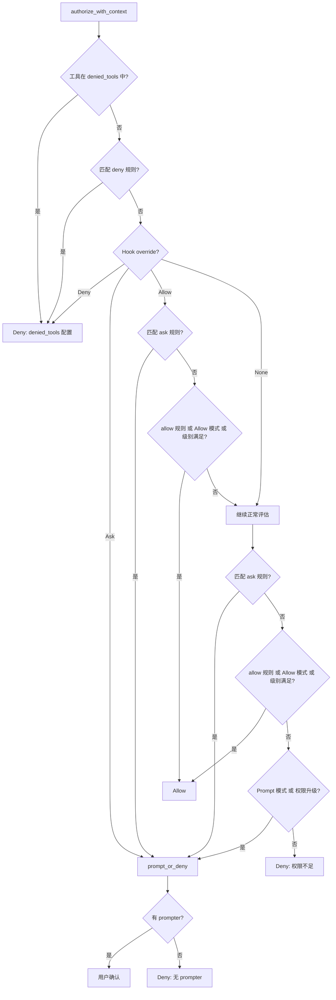

# 第7章 权限系统：Agent 的安全边界

## 本章概览

本章分析 claw-code 的权限系统——如何在每次工具调用前确认操作是否在用户授权范围内。对应第2章架构全景中的 `runtime::permissions` 和 `runtime::permission_enforcer` 模块，以及 Python 端的 `permissions.py` 和 `path_scope.py`。

Agent 能执行 shell 命令和文件读写，天然具有破坏系统的能力。权限系统要解决的核心问题是：每次工具调用前，根据当前权限模式、工具的权限要求、用户配置的规则、钩子的覆盖决策，判断这次操作是允许、拒绝还是需要用户确认。

本章按数据流顺序展开：先看权限模式的五级模型和 Python 端的黑名单机制（7.1），再看 Rust 端 `PermissionPolicy` 的规则引擎和授权评估流程（7.2），然后看 `PermissionEnforcer` 的执行层实现（7.3），包括路径边界检查和 bash 命令分类。

| 关键文件 | 职责 |
| --- | --- |
| `src/permissions.py` | Python 端工具黑名单与路径作用域委托 |
| `src/path_scope.py` | Python 端路径提取与工作区边界验证 |
| `rust/crates/runtime/src/permissions.rs` | Rust 端五级权限模型，规则引擎，授权评估 |
| `rust/crates/runtime/src/permission_enforcer.rs` | Rust 端执行层，路径规范化，命令分类 |

## 7.1 权限模式与 Python 端黑名单

### PermissionMode：五级偏序模型

Rust 端将权限抽象为五个层级，形成偏序关系：

```rust
// claw-code/rust/crates/runtime/src/permissions.rs

#[derive(Debug, Clone, Copy, PartialEq, Eq, PartialOrd, Ord)]
pub enum PermissionMode {
    ReadOnly,
    WorkspaceWrite,
    DangerFullAccess,
    Prompt,
    Allow,
}
```

`#[derive(..., PartialOrd, Ord)]` 让枚举变体支持大小比较——`ReadOnly < WorkspaceWrite < DangerFullAccess`。这个偏序关系用于权限检查：`current_mode >= required_mode` 表示当前权限级别满足工具要求。

五个变体的含义和设计意图：

`ReadOnly` 是最严格的权限级别——只允许读取操作（`read_file`、`glob_search`、`grep_search`）。在这个模式下，所有写操作和 shell 命令都被拒绝（除非 bash 命令被分类为只读）。适用于只读分析场景，如代码审查。

`WorkspaceWrite` 允许在工作区目录内读写文件。工作区外的写操作被拒绝。bash 命令需要检查路径参数是否在工作区内。这是默认的权限级别——在可信环境中允许大部分操作，但防止意外修改工作区外的文件。

`DangerFullAccess` 允许任意操作，包括工作区外的文件写入和任意 shell 命令。用户需要显式指定 `--permission-mode danger-full-access` 才会启用。适用于需要完全控制权的场景，如系统管理任务。

`Prompt` 不在偏序链中——它不与 `ReadOnly`/`WorkspaceWrite`/`DangerFullAccess` 比较大小。在 `Prompt` 模式下，每次敏感操作都需要用户交互确认。`PermissionEnforcer::check` 在 `Prompt` 模式下直接返回 `Allowed`，把交互确认的逻辑交给调用方（如 CLI 前端）。

`Allow` 是最高权限——无条件允许所有操作，不需要任何确认。与 `DangerFullAccess` 的区别是：`DangerFullAccess` 仍然受 deny 规则和 ask 规则约束，`Allow` 则跳过这些检查（除了 denied_tools）。

`as_str` 方法把枚举转为字符串表示，用于错误消息和配置序列化：

```rust
// claw-code/rust/crates/runtime/src/permissions.rs

impl PermissionMode {
    #[must_use]
    pub fn as_str(self) -> &'static str {
        match self {
            Self::ReadOnly => "read-only",
            Self::WorkspaceWrite => "workspace-write",
            Self::DangerFullAccess => "danger-full-access",
            Self::Prompt => "prompt",
            Self::Allow => "allow",
        }
    }
}
```

`match self` 是穷尽的——编译器保证所有变体都被处理。`Self::ReadOnly` 是 `PermissionMode::ReadOnly` 的简写，在 `impl` 块内可以用 `Self` 代替类型名。

### Python 端 ToolPermissionContext

Python 端的权限模型相对精简，集中在 `ToolPermissionContext`：

```python
# claw-code/src/permissions.py

@dataclass(frozen=True)
class ToolPermissionContext:
    deny_names: frozenset[str] = field(default_factory=frozenset)
    deny_prefixes: tuple[str, ...] = ()
    workspace_scope: WorkspacePathScope | None = None
    cwd: Path | None = None
```

四个字段构成两层防御。`deny_names` 和 `deny_prefixes` 是工具名黑名单——`deny_names` 做精确匹配（`frozenset`，O(1) 查找），`deny_prefixes` 做前缀匹配（如 `"bash"` 拦截所有以 `bash` 开头的工具名）。`workspace_scope` 和 `cwd` 用于路径作用域验证——确保工具操作的路径在工作区内。

```python
# claw-code/src/permissions.py

    @classmethod
    def from_iterables(
        cls,
        deny_names: list[str] | None = None,
        deny_prefixes: list[str] | None = None,
        workspace_root: str | Path | None = None,
        workspace_roots: list[str | Path] | tuple[str | Path, ...] | None = None,
        cwd: str | Path | None = None,
    ) -> 'ToolPermissionContext':
        roots: list[str | Path] = []
        if workspace_roots:
            roots.extend(workspace_roots)
        if workspace_root is not None:
            roots.append(workspace_root)
        return cls(
            deny_names=frozenset(name.lower() for name in (deny_names or [])),
            deny_prefixes=tuple(prefix.lower() for prefix in (deny_prefixes or [])),
            workspace_scope=WorkspacePathScope.from_roots(roots) if roots else None,
            cwd=Path(cwd).expanduser().resolve(strict=False) if cwd is not None else None,
        )
```

所有工具名和前缀都转为小写——与 Rust 端的工具名规范化一致，确保大小写不影响匹配。`workspace_root` 和 `workspace_roots` 合并为一个列表，然后创建 `WorkspacePathScope`。`expanduser().resolve(strict=False)` 展开 `~` 并解析为绝对路径，`strict=False` 允许路径不存在。

`blocks` 方法做黑名单检查：

```python
# claw-code/src/permissions.py

    def blocks(self, tool_name: str) -> bool:
        lowered = tool_name.lower()
        return lowered in self.deny_names or any(lowered.startswith(prefix) for prefix in self.deny_prefixes)
```

`lowered in self.deny_names` 做精确匹配（`frozenset` 的 `in` 是 O(1)）。`any(lowered.startswith(prefix) for prefix in self.deny_prefixes)` 做前缀匹配——`any` 在第一个 `True` 时短路。如果任一匹配，返回 `True` 表示工具被拦截。

`validate_payload_scope` 做路径作用域验证：

```python
# claw-code/src/permissions.py

    def validate_payload_scope(self, tool_name: str, payload: str) -> PathScopeDecision:
        if self.workspace_scope is None or not _scope_checked_tool(tool_name):
            return PathScopeDecision(True, 'workspace path scope not required for this tool')
        return self.workspace_scope.validate_payload(payload, cwd=self.cwd)
```

`_scope_checked_tool` 判断工具是否需要路径检查——只有涉及文件系统操作的工具才检查：

```python
# claw-code/src/permissions.py

def _scope_checked_tool(tool_name: str) -> bool:
    lowered = tool_name.lower()
    return any(marker in lowered for marker in ('bash', 'shell', 'powershell', 'fileread', 'filewrite', 'fileedit'))
```

如果工具名中包含 `bash`、`shell`、`powershell`、`fileread`、`filewrite`、`fileedit` 中的任何一个标记，就需要做路径检查。其他工具（如 `TodoWrite`、`Skill`、`Agent`）不涉及文件系统，不需要路径验证。这与 Rust 端的 `classify_*` 函数理念一致——只有文件系统工具才需要路径作用域验证。

## 7.2 PermissionPolicy：规则引擎与授权评估

### PermissionPolicy 结构

`PermissionPolicy` 是 Rust 端授权决策的核心。它维护五组数据：

```rust
// claw-code/rust/crates/runtime/src/permissions.rs

pub struct PermissionPolicy {
    active_mode: PermissionMode,
    tool_requirements: BTreeMap<String, PermissionMode>,
    allow_rules: Vec<PermissionRule>,
    deny_rules: Vec<PermissionRule>,
    ask_rules: Vec<PermissionRule>,
    denied_tools: Vec<String>,
}
```

`active_mode` 是当前激活的权限级别——由 CLI 参数 `--permission-mode` 或配置文件设置。`tool_requirements` 是每个工具的最低权限要求映射——`BTreeMap` 按键排序，查找是 O(log n)。`allow_rules`、`deny_rules`、`ask_rules` 是三组规则列表，分别表示允许、拒绝和需要确认的规则。`denied_tools` 是工具名黑名单——无条件拒绝，优先于所有规则。

`new` 创建一个只有 active_mode 的策略，其余为空：

```rust
// claw-code/rust/crates/runtime/src/permissions.rs

impl PermissionPolicy {
    #[must_use]
    pub fn new(active_mode: PermissionMode) -> Self {
        Self {
            active_mode,
            tool_requirements: BTreeMap::new(),
            allow_rules: Vec::new(),
            deny_rules: Vec::new(),
            ask_rules: Vec::new(),
            denied_tools: Vec::new(),
        }
    }
```

```rust
// claw-code/rust/crates/runtime/src/permissions.rs

    #[must_use]
    pub fn with_tool_requirement(
        mut self,
        tool_name: impl Into<String>,
        required_mode: PermissionMode,
    ) -> Self {
        self.tool_requirements
            .insert(tool_name.into(), required_mode);
        self
    }
```

`impl Into<String>` 接受 `&str` 或 `String`——调用方不需要显式转换。`insert` 把工具名和权限级别存入 `BTreeMap`。返回 `self` 支持链式调用：`policy.with_tool_requirement("bash", DangerFullAccess).with_tool_requirement("read_file", ReadOnly)`。

`with_permission_rules` 从配置加载规则：

```rust
// claw-code/rust/crates/runtime/src/permissions.rs

    #[must_use]
    pub fn with_permission_rules(mut self, config: &RuntimePermissionRuleConfig) -> Self {
        self.allow_rules = config
            .allow()
            .iter()
            .map(|rule| PermissionRule::parse(rule))
            .collect();
        self.deny_rules = config
            .deny()
            .iter()
            .map(|rule| PermissionRule::parse(rule))
            .collect();
        self.ask_rules = config
            .ask()
            .iter()
            .map(|rule| PermissionRule::parse(rule))
            .collect();
        // #94: normalize denied tool names to lowercase to match runtime convention
        self.denied_tools = config
            .denied_tools()
            .iter()
            .map(|t| t.to_lowercase())
            .collect();
        self
    }
```

注释 `#94` 引用 issue 编号——工具名统一转小写以匹配运行时约定。`PermissionRule::parse` 把规则字符串解析为结构化的 `PermissionRule`。三组规则分别从配置的 `allow()`、`deny()`、`ask()` 方法获取。

`required_mode_for` 查询工具的权限要求，默认为 `DangerFullAccess`：

```rust
// claw-code/rust/crates/runtime/src/permissions.rs

    #[must_use]
    pub fn required_mode_for(&self, tool_name: &str) -> PermissionMode {
        self.tool_requirements
            .get(tool_name)
            .copied()
            .unwrap_or(PermissionMode::DangerFullAccess)
    }
```

`copied()` 把 `Option<&PermissionMode>` 转为 `Option<PermissionMode>`——因为 `PermissionMode` 实现了 `Copy` trait（它是枚举，大小固定，可以按值拷贝）。`unwrap_or(DangerFullAccess)` 在工具不在映射中时返回默认值——未知工具默认需要最高权限，这是安全保守策略。

### PermissionRule：规则语法与匹配

`PermissionRule` 定义规则的语法和匹配逻辑：

```rust
// claw-code/rust/crates/runtime/src/permissions.rs

#[derive(Debug, Clone, PartialEq, Eq)]
struct PermissionRule {
    raw: String,
    tool_name: String,
    matcher: PermissionRuleMatcher,
}

#[derive(Debug, Clone, PartialEq, Eq)]
enum PermissionRuleMatcher {
    Any,
    Exact(String),
    Prefix(String),
}
```

`raw` 是原始规则字符串（如 `"bash(git:*)"`），用于错误消息。`tool_name` 是规则适用的工具名（如 `"bash"`）。`matcher` 是匹配器——`Any` 匹配任何输入，`Exact` 精确匹配，`Prefix` 前缀匹配。

`parse` 方法把规则字符串解析为结构体：

```rust
// claw-code/rust/crates/runtime/src/permissions.rs

impl PermissionRule {
    fn parse(raw: &str) -> Self {
        let trimmed = raw.trim();
        let open = find_first_unescaped(trimmed, '(');
        let close = find_last_unescaped(trimmed, ')');

        if let (Some(open), Some(close)) = (open, close) {
            if close == trimmed.len() - 1 && open < close {
                let tool_name = trimmed[..open].trim();
                let content = &trimmed[open + 1..close];
                if !tool_name.is_empty() {
                    let matcher = parse_rule_matcher(content);
                    return Self {
                        raw: trimmed.to_string(),
                        tool_name: tool_name.to_lowercase(),
                        matcher,
                    };
                }
            }
        }

        Self {
            raw: trimmed.to_string(),
            tool_name: trimmed.to_lowercase(),
            matcher: PermissionRuleMatcher::Any,
        }
    }
```

解析逻辑分两步。第一步查找括号——`find_first_unescaped` 查找第一个未转义的 `(`，`find_last_unescaped` 查找最后一个未转义的 `)`。`find_first_unescaped` 和 `find_last_unescaped` 处理转义字符，确保括号内的括号不被误识别。

第二步如果找到匹配的括号对，提取工具名和内容。`trimmed[..open]` 是括号前的部分（工具名），`trimmed[open + 1..close]` 是括号内的内容（匹配参数）。`parse_rule_matcher` 把内容解析为 `PermissionRuleMatcher`——如果内容以 `*` 结尾，解析为 `Prefix`（去掉 `*`）；否则解析为 `Exact`。

如果找不到括号对，整个字符串作为工具名，matcher 设为 `Any`——表示该规则匹配此工具的任何输入。

`matches` 方法做实际匹配：

```rust
// claw-code/rust/crates/runtime/src/permissions.rs

    fn matches(&self, tool_name: &str, input: &str) -> bool {
        if self.tool_name != tool_name {
            return false;
        }

        match &self.matcher {
            PermissionRuleMatcher::Any => true,
            PermissionRuleMatcher::Exact(expected) => {
                extract_permission_subject(input).is_some_and(|candidate| candidate == *expected)
            }
            PermissionRuleMatcher::Prefix(prefix) => extract_permission_subject(input)
                .is_some_and(|candidate| candidate.starts_with(prefix)),
        }
    }
```

匹配分两步。第一步工具名必须完全匹配——`self.tool_name != tool_name` 时直接返回 `false`。注意 `self.tool_name` 在 `parse` 时已经转小写，但传入的 `tool_name` 可能不是小写——这里假设调用方已经做了规范化。

第二步根据 matcher 类型匹配输入内容。`Any` 直接返回 `true`。`Exact` 和 `Prefix` 都需要先从输入中提取主体（`extract_permission_subject`），然后做精确或前缀匹配。`is_some_and` 是 `Option` 的方法——`Some` 时应用闭包，`None` 时返回 `false`。

`extract_permission_subject` 从工具输入的 JSON payload 中提取匹配主体——通常是 `command`（bash 工具）、`path`（文件工具）或 `file_path` 字段的值。这个函数把 JSON 字符串解析后提取关键字段，作为规则匹配的候选。

### authorize_with_context：授权评估流程

`authorize_with_context` 是授权决策的核心方法，按固定顺序执行多层检查：

```rust
// claw-code/rust/crates/runtime/src/permissions.rs

    #[must_use]
    #[allow(clippy::too_many_lines)]
    pub fn authorize_with_context(
        &self,
        tool_name: &str,
        input: &str,
        context: &PermissionContext,
        prompter: Option<&mut dyn PermissionPrompter>,
    ) -> PermissionOutcome {
        // #159: check denied_tools before rule-based evaluation.
        if self.denied_tools.iter().any(|t| t == tool_name) {
            return PermissionOutcome::Deny {
                reason: format!("tool '{tool_name}' has been denied by denied_tools configuration"),
            };
        }

        if let Some(rule) = Self::find_matching_rule(&self.deny_rules, tool_name, input) {
            return PermissionOutcome::Deny {
                reason: format!(
                    "Permission to use {tool_name} has been denied by rule '{}'",
                    rule.raw
                ),
            };
        }
```

前两步是无条件拒绝。第一步检查 `denied_tools`——如果工具名在黑名单中，直接拒绝。注释 `#159` 说明这是第一道防线，优先于所有规则。`self.denied_tools.iter().any(|t| t == tool_name)` 线性扫描黑名单——黑名单通常很短，O(n) 可以接受。

第二步检查 `deny_rules`——`find_matching_rule` 在 deny 规则列表中查找匹配的规则。如果找到，直接拒绝，错误消息包含原始规则字符串 `rule.raw`。

接下来处理钩子覆盖：

```rust
// claw-code/rust/crates/runtime/src/permissions.rs

        let current_mode = self.active_mode();
        let required_mode = self.required_mode_for(tool_name);
        let ask_rule = Self::find_matching_rule(&self.ask_rules, tool_name, input);
        let allow_rule = Self::find_matching_rule(&self.allow_rules, tool_name, input);

        match context.override_decision() {
            Some(PermissionOverride::Deny) => {
                return PermissionOutcome::Deny {
                    reason: context.override_reason().map_or_else(
                        || format!("tool '{tool_name}' denied by hook"),
                        ToOwned::to_owned,
                    ),
                };
            }
            Some(PermissionOverride::Ask) => {
                let reason = context.override_reason().map_or_else(
                    || format!("tool '{tool_name}' requires approval due to hook guidance"),
                    ToOwned::to_owned,
                );
                return Self::prompt_or_deny(
                    tool_name,
                    input,
                    current_mode,
                    required_mode,
                    Some(reason),
                    prompter,
                );
            }
            Some(PermissionOverride::Allow) => {
                if let Some(rule) = ask_rule {
                    let reason = format!(
                        "tool '{tool_name}' requires approval due to ask rule '{}'",
                        rule.raw
                    );
                    return Self::prompt_or_deny(
                        tool_name,
                        input,
                        current_mode,
                        required_mode,
                        Some(reason),
                        prompter,
                    );
                }
                if allow_rule.is_some()
                    || current_mode == PermissionMode::Allow
                    || current_mode >= required_mode
                {
                    return PermissionOutcome::Allow;
                }
            }
            None => {}
        }
```

`context.override_decision()` 返回 `Option<PermissionOverride>`——钩子可能返回 `Allow`、`Deny` 或 `Ask` 三种覆盖。`match` 处理每种情况：

`Deny` 覆盖：无条件拒绝，使用钩子提供的原因或默认消息。`map_or_else(|| default, ToOwned::to_owned)` 在 `override_reason` 为 `None` 时用默认消息，为 `Some` 时克隆原因字符串。

`Ask` 覆盖：强制进入交互确认流程——`prompt_or_deny` 如果有 prompter 则弹出确认，没有则拒绝。

`Allow` 覆盖：钩子说允许，但 ask 规则仍然可以覆盖钩子决策——如果 ask 规则匹配，仍然进入交互确认。这是安全设计：ask 规则的优先级高于钩子的 Allow 覆盖。如果没有 ask 规则，检查 allow 规则、`Allow` 模式或权限级别满足要求，任一满足则允许。

`None`（无覆盖）：进入正常评估流程。

无钩子覆盖时的正常评估：

```rust
// claw-code/rust/crates/runtime/src/permissions.rs

        if let Some(rule) = ask_rule {
            let reason = format!(
                "tool '{tool_name}' requires approval due to ask rule '{}'",
                rule.raw
            );
            return Self::prompt_or_deny(
                tool_name,
                input,
                current_mode,
                required_mode,
                Some(reason),
                prompter,
            );
        }

        if allow_rule.is_some()
            || current_mode == PermissionMode::Allow
            || current_mode >= required_mode
        {
            return PermissionOutcome::Allow;
        }

        if current_mode == PermissionMode::Prompt
            || (current_mode == PermissionMode::WorkspaceWrite
                && required_mode == PermissionMode::DangerFullAccess)
        {
            let reason = Some(format!(
                "tool '{tool_name}' requires approval to escalate from {} to {}",
                current_mode.as_str(),
                required_mode.as_str()
            ));
            return Self::prompt_or_deny(
                tool_name,
                input,
                current_mode,
                required_mode,
                reason,
                prompter,
            );
        }

        PermissionOutcome::Deny {
            reason: format!(
                "tool '{tool_name}' requires {} permission; current mode is {}",
                required_mode.as_str(),
                current_mode.as_str()
            ),
        }
    }
```

正常评估分四步。第一步检查 ask 规则——如果匹配，强制进入交互确认。即使当前模式是 `Allow` 或 `DangerFullAccess`，ask 规则也能强制确认。这是安全设计——ask 规则让用户对特定操作保持控制权。

第二步检查是否允许——三个条件任一满足即允许：`allow_rule.is_some()`（allow 规则匹配）、`current_mode == Allow`（Allow 模式无条件允许）、`current_mode >= required_mode`（权限级别满足要求）。`current_mode >= required_mode` 利用 `PermissionMode` 的 `Ord` trait——`WorkspaceWrite >= ReadOnly` 为 `true`，`ReadOnly >= WorkspaceWrite` 为 `false`。

第三步检查是否需要确认——`Prompt` 模式总是需要确认，`WorkspaceWrite` 模式当工具要求 `DangerFullAccess` 时也需要确认（权限升级）。`prompt_or_deny` 如果有 prompter 则弹出确认，没有则拒绝。

第四步默认拒绝——如果以上都不满足，返回拒绝，错误消息说明需要的权限级别和当前级别。

### prompt_or_deny：交互确认

`prompt_or_deny` 是交互确认的统一入口：

```rust
// claw-code/rust/crates/runtime/src/permissions.rs

    fn prompt_or_deny(
        tool_name: &str,
        input: &str,
        current_mode: PermissionMode,
        required_mode: PermissionMode,
        reason: Option<String>,
        mut prompter: Option<&mut dyn PermissionPrompter>,
    ) -> PermissionOutcome {
        let request = PermissionRequest {
            tool_name: tool_name.to_string(),
            input: input.to_string(),
            current_mode,
            required_mode,
            reason: reason.clone(),
        };

        match prompter.as_mut() {
            Some(prompter) => match prompter.decide(&request) {
                PermissionPromptDecision::Allow => PermissionOutcome::Allow,
                PermissionPromptDecision::Deny { reason } => PermissionOutcome::Deny { reason },
            },
            None => PermissionOutcome::Deny {
                reason: reason.unwrap_or_else(|| {
                    format!(
                        "tool '{tool_name}' requires approval to run while mode is {}",
                        current_mode.as_str()
                    )
                }),
            },
        }
    }
```

`PermissionRequest` 包含完整的权限请求信息——工具名、输入、当前模式、要求模式、原因。这个请求传给 `prompter.decide()`，由 prompter 展示给用户并等待决策。

`prompter.as_mut()` 是 `Option<&mut dyn PermissionPrompter>` 的可变借用。`Some` 时调用 `decide`，返回 `Allow` 或 `Deny`。`None` 时直接拒绝——没有 prompter 就不能确认，安全保守。

```java
interface PermissionPrompter {
    PermissionPromptDecision decide(PermissionRequest request);
}
```

CLI 前端实现这个接口，在 `decide` 方法中显示提示并等待用户输入。非交互环境（如 CI）不提供 prompter，所有需要确认的操作自动拒绝。



## 7.3 PermissionEnforcer：执行层

### EnforcementResult

`PermissionEnforcer` 把 `PermissionPolicy` 的抽象决策落地为具体的工具检查。返回值是 `EnforcementResult`：

```rust
// claw-code/rust/crates/runtime/src/permission_enforcer.rs

#[derive(Debug, Clone, PartialEq, Eq, Serialize, Deserialize)]
#[serde(tag = "outcome")]
pub enum EnforcementResult {
    Allowed,
    Denied {
        tool: String,
        active_mode: String,
        required_mode: String,
        reason: String,
    },
}
```

`#[serde(tag = "outcome")]` 让 JSON 序列化时用 `outcome` 字段区分变体——`{"outcome": "Allowed"}` 或 `{"outcome": "Denied", "tool": "...", ...}`。

`Denied` 变体携带四个字段：`tool`（被拒绝的工具名）、`active_mode`（当前权限模式）、`required_mode`（工具要求的权限模式）、`reason`（拒绝原因）。这些信息用于错误报告和调试——用户可以看到"工具 X 需要 workspace-write 权限，当前是 read-only"。

### check 方法

`check` 是通用检查方法：

```rust
// claw-code/rust/crates/runtime/src/permission_enforcer.rs

pub fn check(&self, tool_name: &str, input: &str) -> EnforcementResult {
    if self.policy.active_mode() == PermissionMode::Prompt {
        return EnforcementResult::Allowed;
    }

    let outcome = self.policy.authorize(tool_name, input, None);

    match outcome {
        PermissionOutcome::Allow => EnforcementResult::Allowed,
        PermissionOutcome::Deny { reason } => {
            let active_mode = self.policy.active_mode();
            let required_mode = self.policy.required_mode_for(tool_name);
            EnforcementResult::Denied {
                tool: tool_name.to_owned(),
                active_mode: active_mode.as_str().to_owned(),
                required_mode: required_mode.as_str().to_owned(),
                reason,
            }
        }
    }
}
```

`Prompt` 模式直接返回 `Allowed`——交互确认由调用方负责，enforcer 不硬拒绝。注释说明"defer to the caller's interactive prompt flow rather than hard-denying (the enforcer has no prompter)"。enforcer 没有 prompter，无法做交互确认，因此 Prompt 模式下把决策权交给上层。

其他模式下调用 `policy.authorize`——注意传 `None` 作为 prompter，这意味着 enforcer 层面的检查不会弹出交互确认。如果策略要求确认但没有 prompter，`prompt_or_deny` 会返回 `Deny`。

### check_with_required_mode

`check_with_required_mode` 用于动态权限分类场景——工具的 required_permission 在 `ToolSpec` 中是静态的，但实际执行时可能需要动态调整：

```rust
// claw-code/rust/crates/runtime/src/permission_enforcer.rs

pub fn check_with_required_mode(
    &self,
    tool_name: &str,
    input: &str,
    required_mode: PermissionMode,
) -> EnforcementResult {
    if self.policy.active_mode() == PermissionMode::Prompt {
        return EnforcementResult::Allowed;
    }

    let active_mode = self.policy.active_mode();

    if active_mode >= required_mode {
        return EnforcementResult::Allowed;
    }

    EnforcementResult::Denied {
        tool: tool_name.to_owned(),
        active_mode: active_mode.as_str().to_owned(),
        required_mode: required_mode.as_str().to_owned(),
        reason: format!(
            "'{tool_name}' with input '{input}' requires '{}' permission, but current mode is '{}'",
            required_mode.as_str(),
            active_mode.as_str()
        ),
    }
}
```

这个方法不查规则，只做权限级别比较——`active_mode >= required_mode`。如果当前级别满足动态要求的级别，允许；否则拒绝。这个方法被 `execute_tool_with_enforcer` 调用（第5章），用于 bash 命令分类后的权限检查——`classify_bash_permission` 把 `ls` 命令降级为 `WorkspaceWrite`，然后 `check_with_required_mode` 检查 `active_mode >= WorkspaceWrite`。

### check_file_write：工作区边界检查

`check_file_write` 实现了文件写入的路径边界检查：

```rust
// claw-code/rust/crates/runtime/src/permission_enforcer.rs

pub fn check_file_write(&self, path: &str, workspace_root: &str) -> EnforcementResult {
    let mode = self.policy.active_mode();

    match mode {
        PermissionMode::ReadOnly => EnforcementResult::Denied {
            tool: "write_file".to_owned(),
            active_mode: mode.as_str().to_owned(),
            required_mode: PermissionMode::WorkspaceWrite.as_str().to_owned(),
            reason: format!("file writes are not allowed in '{}' mode", mode.as_str()),
        },
        PermissionMode::WorkspaceWrite => {
            if is_within_workspace(path, workspace_root) {
                EnforcementResult::Allowed
            } else {
                EnforcementResult::Denied {
                    tool: "write_file".to_owned(),
                    active_mode: mode.as_str().to_owned(),
                    required_mode: PermissionMode::DangerFullAccess.as_str().to_owned(),
                    reason: format!(
                        "path '{}' is outside workspace root '{}'",
                        path, workspace_root
                    ),
                }
            }
        }
        PermissionMode::Allow | PermissionMode::DangerFullAccess => EnforcementResult::Allowed,
        PermissionMode::Prompt => EnforcementResult::Denied {
            tool: "write_file".to_owned(),
            active_mode: mode.as_str().to_owned(),
            required_mode: PermissionMode::WorkspaceWrite.as_str().to_owned(),
            reason: "file write requires confirmation in prompt mode".to_owned(),
        },
    }
}
```

五种权限模式分别处理。`ReadOnly` 直接拒绝——只读模式不允许任何文件写入。`WorkspaceWrite` 调用 `is_within_workspace` 检查路径是否在工作区内——在工作区内允许，在工作区外拒绝（required_mode 提升为 `DangerFullAccess`）。`Allow` 和 `DangerFullAccess` 无条件允许。`Prompt` 拒绝——enforcer 没有 prompter，prompt 模式下的文件写入交给上层处理。

### is_within_workspace：词法路径规范化

`is_within_workspace` 没有做简单的字符串前缀匹配，而是先做词法路径规范化：

```rust
// claw-code/rust/crates/runtime/src/permission_enforcer.rs

fn is_within_workspace(path: &str, workspace_root: &str) -> bool {
    let combined = if path.starts_with('/') {
        path.to_owned()
    } else {
        format!("{workspace_root}/{path}")
    };

    let normalized = lexically_normalize(&combined);
    let root = lexically_normalize(workspace_root);
    let root_with_slash = if root.ends_with('/') {
        root.clone()
    } else {
        format!("{root}/")
    };

    normalized == root || normalized.starts_with(&root_with_slash)
}
```

函数分三步。第一步拼接路径——如果是绝对路径（以 `/` 开头），直接使用；如果是相对路径，拼接到 workspace_root 后面。

第二步词法规范化——`lexically_normalize` 折叠 `.` 和 `..` 但不访问文件系统。第三步比较——规范化后的路径等于 root 或以 `root/` 开头。`root_with_slash` 确保 `root` 以 `/` 结尾，避免 `/workspace-evil` 被误判为 `/workspace` 的子路径。

`lexically_normalize` 用栈算法折叠路径组件：

```rust
// claw-code/rust/crates/runtime/src/permission_enforcer.rs

fn lexically_normalize(path: &str) -> String {
    let is_absolute = path.starts_with('/');
    let mut stack: Vec<&str> = Vec::new();
    for component in path.split('/') {
        match component {
            "" | "." => {}
            ".." => {
                stack.pop();
            }
            other => stack.push(other),
        }
    }
    let joined = stack.join("/");
    if is_absolute {
        format!("/{joined}")
    } else {
        joined
    }
}
```

`path.split('/')` 把路径按 `/` 分割为组件。`match` 处理每种组件：空字符串和 `.` 忽略（`.` 表示当前目录，无意义），`..` 弹出栈顶（回到上级目录），其他组件压入栈。

`stack.pop()` 在栈为空时返回 `None` 但不报错——这意味着 `..` 超出根目录时被截断。比如 `/workspace/../../etc` 规范化后是 `/etc`（两个 `..` 把 `workspace` 弹出后继续弹出根目录的空栈，`etc` 压入），不会逃逸到 `/etc`。实际上，因为绝对路径的 `split('/')` 第一个组件是空字符串（被忽略），`/../../etc` 的栈操作是：`..` 弹空栈（无效果），`..` 弹空栈（无效果），`etc` 压入。最终结果是 `/etc`。但 `is_within_workspace` 会检查 `/etc` 是否以 `/workspace/` 开头——不是，所以拒绝。

词法规范化不访问文件系统——这是关键设计。写入操作的目标路径可能还不存在（新文件），无法用 `canonicalize` 解析符号链接。词法规范化不依赖文件系统存在性，始终能正确折叠 `..`。代价是无法检测符号链接逃逸——但 Python 端的 `WorkspacePathScope` 做了符号链接解析，两者互补。

### check_bash：命令只读分类

`check_bash` 在不同权限模式下对 bash 命令做不同处理：

```rust
// claw-code/rust/crates/runtime/src/permission_enforcer.rs

pub fn check_bash(&self, command: &str) -> EnforcementResult {
    let mode = self.policy.active_mode();

    match mode {
        PermissionMode::ReadOnly => {
            if is_read_only_command(command) {
                EnforcementResult::Allowed
            } else {
                EnforcementResult::Denied {
                    tool: "bash".to_owned(),
                    active_mode: mode.as_str().to_owned(),
                    required_mode: PermissionMode::WorkspaceWrite.as_str().to_owned(),
                    reason: format!(
                        "command may modify state; not allowed in '{}' mode",
                        mode.as_str()
                    ),
                }
            }
        }
        PermissionMode::Prompt => EnforcementResult::Denied {
            tool: "bash".to_owned(),
            active_mode: mode.as_str().to_owned(),
            required_mode: PermissionMode::DangerFullAccess.as_str().to_owned(),
            reason: "bash requires confirmation in prompt mode".to_owned(),
        },
        _ => EnforcementResult::Allowed,
    }
}
```

`ReadOnly` 模式下调用 `is_read_only_command` 判断命令是否只读——只读命令允许，可能修改状态的命令拒绝。`Prompt` 模式拒绝——enforcer 没有 prompter。其他模式（`WorkspaceWrite`、`Allow`、`DangerFullAccess`）无条件允许——`_` 通配符匹配剩余所有变体。

`is_read_only_command` 用保守的启发式判断：

```rust
// claw-code/rust/crates/runtime/src/permission_enforcer.rs

fn is_read_only_command(command: &str) -> bool {
    const SHELL_METACHARS: &[char] = &[';', '|', '&', '$', '`', '>', '<', '(', ')', '{', '}', '\n'];
    if command.contains(SHELL_METACHARS) {
        return false;
    }

    let mut tokens = command.split_whitespace();
    let first_token = tokens.next().unwrap_or("").rsplit('/').next().unwrap_or("");

    if first_token == "git" {
        let subcommand = tokens.next().unwrap_or("");
        return matches!(
            subcommand,
            "status" | "log" | "diff" | "show" | "branch"
                | "rev-parse" | "ls-files" | "blame" | "describe" | "tag" | "remote"
        );
    }
```

`SHELL_METACHARS` 定义了 12 个 shell 元字符——分号（命令链）、管道（管道符）、`&`（后台执行）、`$`（变量替换）、反引号（命令替换）、重定向符、括号（子shell）、花括号（花括号展开）、换行符。如果命令包含任何元字符，直接返回 `false`——无法仅从首 token 判断安全性。

`first_token` 提取命令的第一个词——`split_whitespace().next()` 取第一个空白分隔的词，`rsplit('/').next()` 取路径的最后一部分（处理 `/usr/bin/ls` → `ls`）。

`git` 命令只允许白名单内的子命令——`status`、`log`、`diff`、`show`、`branch` 等只读子命令。`git push`、`git commit`、`git reset` 等修改状态的子命令不在白名单中，返回 `false`。

这个启发式的核心假设是：只要命令中包含任何 shell 元字符，就无法仅通过首 token 判断其安全性，因此一律拒绝。测试用例覆盖了命令链（`cat foo; rm bar`）、命令替换（`$(rm bar)`）、解释器执行（`python script.py`）等绕过场景。

权限检查在 `FilterSecurityInterceptor` 中执行，通过 `AccessDecisionManager` 投票决定是否允许。claw-code 的权限模型围绕工具调用设计——工具名 + JSON payload + 权限模式。权限检查在 `PermissionEnforcer` 中执行，通过 `PermissionPolicy` 的规则评估决定是否允许。

两者的核心差异在于权限的动态性。claw-code 的权限是动态的——同一个 `bash` 工具，`ls` 命令可能只需要 `ReadOnly`，`rm` 命令需要 `DangerFullAccess`。

路径边界检查是 claw-code 独有的设计。claw-code 的 `is_within_workspace` 用词法规范化防止目录遍历攻击，Python 端的 `WorkspacePathScope` 用 `resolve()` 解析符号链接。两者互补——词法规范化快速但无法检测符号链接，符号链接解析准确但需要文件系统访问。

## 小结

权限系统在 Python 端以 `ToolPermissionContext`（`permissions.py`）提供工具名黑名单（`deny_names` + `deny_prefixes`）和路径作用域委托（`workspace_scope`），`WorkspacePathScope`（`path_scope.py`）通过 `shlex` 分词提取路径候选，解析符号链接后验证是否在工作区根目录内。Rust 端 `PermissionMode`（`permissions.rs`）定义五级偏序模型（ReadOnly < WorkspaceWrite < DangerFullAccess，加 Prompt 和 Allow），`PermissionPolicy` 维护五组数据（active_mode、tool_requirements、allow/deny/ask 规则、denied_tools），`authorize_with_context` 按固定顺序执行多层检查：denied_tools → deny 规则 → 钩子覆盖 → ask 规则 → allow 规则/权限级别比较 → Prompt/权限升级确认 → 默认拒绝。`PermissionEnforcer`（`permission_enforcer.rs`）是执行层，`check_file_write` 用 `is_within_workspace` 做词法路径规范化（折叠 `.` 和 `..`，不访问文件系统），`check_bash` 用 `is_read_only_command` 做命令分类（shell 元字符检测 + git 白名单 + 解释器排除）。

| 关键文件 | 核心机制 | 对应章节 |
| --- | --- | --- |
| `src/permissions.py` | `ToolPermissionContext`，黑名单与前缀匹配 | 本章 7.1 |
| `src/path_scope.py` | `WorkspacePathScope`，路径提取与边界验证 | 本章 7.1 |
| `rust/crates/runtime/src/permissions.rs` | `PermissionMode`，`PermissionPolicy`，规则引擎 | 本章 7.2 |
| `rust/crates/runtime/src/permission_enforcer.rs` | `PermissionEnforcer`，路径规范化，命令分类 | 本章 7.3 |

下一章将分析钩子系统——`HookRunner` 如何在工具执行前后插入用户自定义逻辑，PreToolUse 和 PostToolUse 钩子如何修改输入、覆盖权限和追加反馈。
