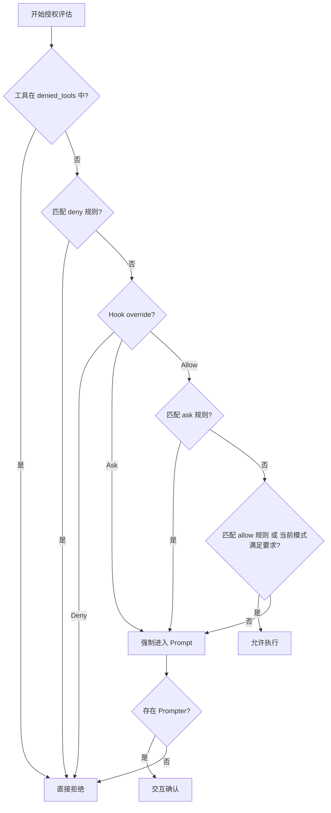

# 第7章 权限系统：Agent 的安全边界

Agent 能执行 shell 命令和文件读写，这意味着它天然具有破坏系统的能力。权限系统的核心目标不是限制 Agent 的聪明才智，而是在每一次工具调用前确认：这次操作是否在用户授权的范围之内。claw-code 的权限实现横跨 Python 原型和 Rust 生产版，从工具名黑名单到路径沙箱，从五级权限模型到策略规则引擎，构成了多层防御体系。

## 7.1 Python 端：工具黑名单与工作区路径范围

Python 端的权限模型相对精简，集中在两个数据类：`ToolPermissionContext` 负责工具级别的准入控制，`WorkspacePathScope` 负责路径级别的沙箱验证。

```python
# claw-code/src/permissions.py

@dataclass(frozen=True)
class ToolPermissionContext:
    deny_names: frozenset[str] = field(default_factory=frozenset)
    deny_prefixes: tuple[str, ...] = ()
    workspace_scope: WorkspacePathScope | None = None
    cwd: Path | None = None
```

`deny_names` 和 `deny_prefixes` 构成工具名的黑名单机制。`blocks()` 方法将工具名转小写后进行全名匹配或前缀匹配，这意味着配置 `deny_prefixes=("bash",)` 就能阻止所有以 bash 开头的工具。

```python
# claw-code/src/permissions.py

def _scope_checked_tool(tool_name: str) -> bool:
    lowered = tool_name.lower()
    return any(marker in lowered for marker in (
        'bash', 'shell', 'powershell', 'fileread', 'filewrite', 'fileedit'
    ))
```

`_scope_checked_tool` 定义了需要路径安全检查的工具类型。只有这些工具的 payload 才会被送往 `WorkspacePathScope` 验证。

```python
# claw-code/src/path_scope.py

@dataclass(frozen=True)
class WorkspacePathScope:
    roots: tuple[Path, ...]

    def validate_payload(self, payload: str, cwd: str | Path | None = None) -> PathScopeDecision:
        cwd_path = Path(cwd).expanduser().resolve(strict=False) if cwd else self.roots[0]
        cwd_decision = self.validate_path(cwd_path)
        if not cwd_decision.allowed:
            return PathScopeDecision(False, f'cwd outside workspace scope: {cwd_path}', ...)
        for candidate in extract_path_candidates(payload):
            decision = self.validate_path(candidate, cwd_path)
            if not decision.allowed:
                return decision
        return PathScopeDecision(True, 'all path candidates are inside workspace scope')
```

`validate_payload` 的执行顺序很关键：先确认当前工作目录本身在 roots 内，再从 payload 中提取所有疑似路径的候选，逐一验证。`extract_path_candidates` 使用 `shlex.split` 对 payload 做 shell 分词，过滤掉选项参数（`-x`）和环境变量赋值（`KEY=value`），然后识别出看起来像路径的 token。

```python
# claw-code/src/path_scope.py

def _looks_like_path(token: str) -> bool:
    return (
        token in {'.', '..'}
        or token.startswith(('./', '../', '/', '~/', '~/'))
        or '..' in token.split('/')
        or '/' in token
        or '\\' in token
        or any(char in token for char in _GLOB_META)
        or _is_windows_absolute(token)
    )
```

路径验证时，`validate_path` 会解析相对路径、展开 glob、解析符号链接，最终检查解析后的绝对路径是否落在任意一个 root 之下。glob 未匹配时，系统会退而验证 glob 表达式中稳定的前缀部分，防止 `rm /workspace/*` 因未匹配到文件而绕过检查。

## 7.2 Rust 端：五级权限模型

Rust 生产版将权限抽象为五个层级，形成严格的偏序关系：

```rust
// claw-code/rust/crates/runtime/src/permissions.rs

pub enum PermissionMode {
    ReadOnly,
    WorkspaceWrite,
    DangerFullAccess,
    Prompt,
    Allow,
}
```

| 权限级别 | 含义 |
| --- | --- |
| ReadOnly | 只允许读取操作 |
| WorkspaceWrite | 允许在工作区内读写 |
| DangerFullAccess | 允许任意操作，包括工作区外 |
| Prompt | 每次敏感操作都要求交互确认 |
| Allow | 无条件允许所有操作 |

`PermissionPolicy` 是授权决策的核心。它维护了三组规则（allow、deny、ask）、一个工具名黑名单（denied_tools），以及每个工具所需的最低权限映射（tool_requirements）。

```rust
// claw-code/rust/crates/runtime/src/permissions.rs

pub struct PermissionPolicy {
    active_mode: PermissionMode,
    tool_requirements: BTreeMap<String, PermissionMode>,
    allow_rules: Vec<PermissionRule>,
    deny_rules: Vec<PermissionRule>,
    ask_rules: Vec<PermissionRule>,
    denied_tools: Vec<String>,
}
```

`authorize_with_context` 实现了完整的授权评估流程，按固定顺序执行：



这个顺序设计有其安全考量：`denied_tools` 是第一道防线，无条件拒绝；`deny` 规则次之；Hook 的 override 可以短路整个流程；`ask` 规则即使在最高权限模式下也能强制要求确认。测试中有一个典型场景：当 Hook 返回 `Allow` 但 `ask` 规则匹配时，系统仍会弹出确认对话框。

规则语法支持三种匹配器：

```rust
// claw-code/rust/crates/runtime/src/permissions.rs

enum PermissionRuleMatcher {
    Any,
    Exact(String),
    Prefix(String),
}
```

规则字符串如 `bash(git:*)` 会被解析为：工具名 `bash`，匹配器 `Prefix("git")`。`extract_permission_subject` 从工具输入的 JSON payload 中提取 `command`、`path`、`file_path` 等字段作为被匹配的主体。

## 7.3 执行层：命令分类与工作区边界

`PermissionEnforcer` 将 `PermissionPolicy` 的抽象决策落地为具体的工具检查。它提供三类检查方法：通用 `check()`、文件写入 `check_file_write()`、bash 命令 `check_bash()`。

```rust
// claw-code/rust/crates/runtime/src/permission_enforcer.rs

pub struct PermissionEnforcer {
    policy: PermissionPolicy,
}

impl PermissionEnforcer {
    pub fn check(&self, tool_name: &str, input: &str) -> EnforcementResult {
        if self.policy.active_mode() == PermissionMode::Prompt {
            return EnforcementResult::Allowed; // 交给调用方的交互流程
        }
        let outcome = self.policy.authorize(tool_name, input, None);
        // ...
    }
}
```

当 active_mode 为 Prompt 时，`check()` 直接返回 Allowed，因为交互确认的逻辑由调用方（如 CLI 前端）负责，执行层不硬拒绝。

`check_file_write` 实现了工作区边界检查：

```rust
// claw-code/rust/crates/runtime/src/permission_enforcer.rs

pub fn check_file_write(&self, path: &str, workspace_root: &str) -> EnforcementResult {
    match mode {
        PermissionMode::ReadOnly => EnforcementResult::Denied { ... },
        PermissionMode::WorkspaceWrite => {
            if is_within_workspace(path, workspace_root) {
                EnforcementResult::Allowed
            } else {
                EnforcementResult::Denied { ... }
            }
        }
        PermissionMode::Allow | PermissionMode::DangerFullAccess => EnforcementResult::Allowed,
        PermissionMode::Prompt => EnforcementResult::Denied { ... },
    }
}
```

`is_within_workspace` 没有做简单的字符串前缀匹配，而是先进行词法路径规范化：

```rust
// claw-code/rust/crates/runtime/src/permission_enforcer.rs

fn is_within_workspace(path: &str, workspace_root: &str) -> bool {
    let combined = if path.starts_with('/') { path.to_owned() }
                   else { format!("{workspace_root}/{path}") };
    let normalized = lexically_normalize(&combined);
    let root = lexically_normalize(workspace_root);
    // ...
}

fn lexically_normalize(path: &str) -> String {
    let mut stack: Vec<&str> = Vec::new();
    for component in path.split('/') {
        match component {
            "" | "." => {}
            ".." => { stack.pop(); }
            other => stack.push(other),
        }
    }
    // ...
}
```

`lexically_normalize` 折叠 `.` 和 `..` 但不访问文件系统，因此即使目标路径尚不存在（写入操作常见），也能正确判断。`..` 超出根目录时会被截断，防止 `/workspace/../../etc/passwd` 这类遍历攻击。

`check_bash` 在 ReadOnly 模式下使用保守的启发式判断命令是否只读：

```rust
// claw-code/rust/crates/runtime/src/permission_enforcer.rs

fn is_read_only_command(command: &str) -> bool {
    const SHELL_METACHARS: &[char] = &[';', '|', '&', '$', '`', '>', '<', '(', ')', '{', '}', '\n'];
    if command.contains(SHELL_METACHARS) {
        return false;
    }
    // git 只允许白名单内的子命令
    // find 拒绝 -exec/-delete 等动作
    // cat/ls/grep 等命令允许，但带 -i 或 --in-place 时拒绝
}
```

这个启发式的核心假设是：只要命令中包含任何 shell 元字符（分号、管道、重定向、反引号等），就无法仅通过首 token 判断其安全性，因此一律拒绝。测试用例覆盖了命令链（`cat foo; rm bar`）、命令替换（`$(rm bar)`）、解释器执行（`python script.py`）等绕过场景。

## 7.4 策略引擎：Lane 生命周期决策

`PolicyEngine` 位于更高一层，不直接拦截单次工具调用，而是根据 Lane（工作流分支）的整体状态决定下一步动作。这是多 Agent 编排场景中的核心组件。

```rust
// claw-code/rust/crates/runtime/src/policy_engine.rs

pub struct PolicyRule {
    pub name: String,
    pub condition: PolicyCondition,
    pub action: PolicyAction,
    pub priority: u32,
}

pub struct PolicyEngine {
    rules: Vec<PolicyRule>,
}
```

`PolicyCondition` 支持组合逻辑（And/Or）和多种状态探测：

```rust
// claw-code/rust/crates/runtime/src/policy_engine.rs

pub enum PolicyCondition {
    And(Vec<PolicyCondition>),
    Or(Vec<PolicyCondition>),
    GreenAt { level: GreenLevel },
    StaleBranch,
    ReviewPassed,
    ApprovalTokenPresent,
    // ...
}
```

`PolicyAction` 定义了系统可执行的响应动作，支持链式组合（Chain）：

```rust
// claw-code/rust/crates/runtime/src/policy_engine.rs

pub enum PolicyAction {
    MergeToDev,
    Retry { reason: String },
    Rebase { reason: String },
    Escalate { reason: String },
    RequireApprovalToken { operation: String },
    Block { reason: String },
    Chain(Vec<PolicyAction>),
}
```

`PolicyEngine::evaluate` 按优先级排序后遍历所有规则，对匹配的规则的 action 做扁平化展开：

```rust
// claw-code/rust/crates/runtime/src/policy_engine.rs

pub fn evaluate_with_events(engine: &PolicyEngine, context: &LaneContext) -> PolicyEvaluation {
    let mut actions = Vec::new();
    let mut events = Vec::new();
    for rule in &engine.rules {
        if rule.matches(context) {
            let before = actions.len();
            rule.action.flatten_into(&mut actions);
            for action in &actions[before..] {
                events.push(decision_event(rule, context, action));
            }
        }
    }
    PolicyEvaluation { actions, events }
}
```

每条匹配的规则都会产生对应的 `PolicyDecisionEvent`，包含决策类型（Merge、Retry、Escalate 等）、规则名、优先级和解释文本。这种设计使得权限决策不仅是布尔结果，还是可审计的事件流。

`ApprovalToken` 是策略引擎中的显式授权凭证：

```rust
// claw-code/rust/crates/runtime/src/policy_engine.rs

pub struct ApprovalToken {
    pub token_id: String,
    pub operation: String,
    pub granted_by: String,
}
```

测试用例展示了一个完整场景：当 Lane 缺少 ApprovalToken 时，策略引擎会触发 `RequireApprovalToken` 动作；当 Token 被补充后，同一组规则会允许 `MergeToDev`。

## 7.5 信任解析器：文件夹级安全边界

`TrustResolver` 处理另一类安全问题：当 Agent 首次进入某个文件夹时，IDE 或终端可能会弹出"是否信任此文件夹"的提示。`TrustResolver` 通过分析屏幕文本检测这类提示，并结合 allowlist/denylist 做出自动决策。

```rust
// claw-code/rust/crates/runtime/src/trust_resolver.rs

pub struct TrustResolver {
    config: TrustConfig,
}

impl TrustResolver {
    pub fn resolve(&self, cwd: &str, worktree: Option<&str>, screen_text: &str) -> TrustDecision {
        if !detect_trust_prompt(screen_text) {
            return TrustDecision::NotRequired;
        }
        // 先检查 denylist，再检查 allowlist
        // 最后回退到 RequireApproval
    }
}
```

`detect_trust_prompt` 使用关键词匹配：

```rust
// claw-code/rust/crates/runtime/src/trust_resolver.rs

const TRUST_PROMPT_CUES: &[&str] = &[
    "do you trust the files in this folder",
    "trust the files in this folder",
    "trust this folder",
    "allow and continue",
    "yes, proceed",
];
```

`TrustConfig` 支持精确匹配、前缀匹配、glob 匹配和路径组件包含匹配：

```rust
// claw-code/rust/crates/runtime/src/trust_resolver.rs

pub struct TrustConfig {
    pub allowlisted: Vec<TrustAllowlistEntry>,
    pub denied: Vec<PathBuf>,
    pub emit_events: bool,
}
```

`pattern_matches` 实现了多层匹配策略：精确匹配 → 目录前缀匹配 → `/*` 后缀通配 → 路径组件包含匹配 → 完整 glob 回溯匹配。这种分层设计让常见场景（如 `/tmp/worktrees/*`）能快速命中，复杂模式才进入递归回溯。

`TrustResolver` 的决策是三层结构：`NotRequired`（没有检测到信任提示）、`Required { policy, events }`（检测到提示并给出决策）。事件流包括 `TrustRequired`、`TrustResolved`、`TrustDenied` 三种，便于上层记录审计日志。

## 设计对比

| claw-code 概念 | Java 生态对应 |
| --- | --- |
| `PermissionMode` 五级模型 | Spring Security 的 `AccessDecisionVoter` 层级投票 |
| `PermissionPolicy` 规则评估 | Spring Security 的 `AccessDecisionManager` + `ConfigAttribute` |
| `PermissionRule` 语法 | Spring Security 的 SpEL 表达式或 URL 权限映射 |
| `PolicyEngine` 条件-动作规则 | Drools 规则引擎或 Camunda DMN 决策表 |
| `TrustResolver` allowlist/denylist | Spring Security 的 `WebSecurityCustomizer` 忽略路径 |
| `is_within_workspace` 路径规范化 | Java `Path.normalize()` + `Path.startsWith()` 沙箱检查 |

主要差异在于爪形代码的权限评估是同步、单机的，没有 HTTP 请求上下文。`PermissionPolicy` 的 `authorize_with_context` 相当于一个内嵌的访问决策管理器，但决策依据不是 URL 和方法注解，而是工具名和 JSON payload。`PolicyEngine` 的规则-条件-动作模式与 Drools 类似，但实现极为轻量，没有 Rete 网络，只是简单的优先级遍历。

## 小结

本章涉及的关键文件和机制如下。

Python 端：
- `src/permissions.py` 定义 `ToolPermissionContext`，提供工具名黑名单和路径范围委托。
- `src/path_scope.py` 定义 `WorkspacePathScope`，通过 shell 分词提取路径候选，验证 glob 展开和符号链接后的绝对路径是否落在工作区 roots 内。

Rust 端：
- `rust/crates/runtime/src/permissions.rs` 定义五级 `PermissionMode` 和 `PermissionPolicy`，实现基于规则、Hook override 和交互提示的授权评估。
- `rust/crates/runtime/src/permission_enforcer.rs` 定义 `PermissionEnforcer`，提供文件写入边界检查（防目录遍历）和 bash 命令的只读启发式分类。
- `rust/crates/runtime/src/policy_engine.rs` 定义 `PolicyEngine`，通过优先级排序的规则列表对 Lane 状态进行条件-动作评估，生成可审计的决策事件。
- `rust/crates/runtime/src/trust_resolver.rs` 定义 `TrustResolver`，通过屏幕文本检测信任提示，结合 allowlist/denylist 和 glob 匹配自动决策。
