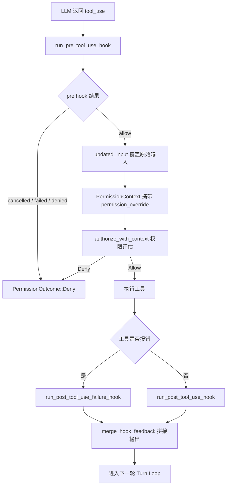

# 第8章 钩子系统：AOP 思想在 Agent 中的应用

工具调用是 Agent 唯一能对现实世界产生影响的动作。权限系统决定了"能不能做"，而钩子系统决定了"做之前和做之后还能干什么"。钩子让用户在不修改 Agent 核心循环的前提下，在工具调用的生命周期里插入自定义脚本，实现拦截、审批、改写输入、追加反馈等能力。claw-code 里"hook"一词有两层含义：Python 侧归档的 TypeScript hooks 子系统是前端 React 钩子，Rust 侧的插件与运行时钩子是真正的扩展点，本章以后者为主。

## 8.1 Python 端：归档的 TypeScript hooks 子系统

Python 包的 `src/hooks/` 目录里只有一个占位文件，它不包含任何逻辑，而是从元数据快照里读取归档信息：

```python
# claw-code/src/hooks/__init__.py

"""Python package placeholder for the archived `hooks` subsystem."""

from src._archive_helper import load_archive_metadata

_SNAPSHOT = load_archive_metadata("hooks")

ARCHIVE_NAME = _SNAPSHOT["archive_name"]
MODULE_COUNT = _SNAPSHOT["module_count"]
SAMPLE_FILES = tuple(_SNAPSHOT["sample_files"])
PORTING_NOTE = f"Python package placeholder for '{ARCHIVE_NAME}' with {MODULE_COUNT} archived module references."
```

`load_archive_metadata` 从 `reference_data/subsystems/hooks.json` 读取快照：

```json
// claw-code/src/reference_data/subsystems/hooks.json

{
  "archive_name": "hooks",
  "package_name": "hooks",
  "module_count": 104,
  "sample_files": [
    "hooks/notifs/useRateLimitWarningNotification.tsx",
    "hooks/notifs/useModelMigrationNotifications.tsx",
    "hooks/toolPermission/PermissionContext.ts",
    "hooks/toolPermission/handlers/coordinatorHandler.ts",
    "hooks/toolPermission/handlers/interactiveHandler.ts",
    "hooks/unifiedSuggestions.ts",
    "hooks/useAfterFirstRender.ts"
  ]
}
```

这里能看到 104 个归档模块的样本。它们几乎都是 `useXxx` 命名的 React 自定义钩子和通知组件，属于原版 Claw Code 的 IDE 前端界面层，负责渲染"限流警告""模型迁移提示""LSP 初始化状态"这类 UI 状态。Python 端口把这些模块归档为元数据而非移植过来，说明它们与 Agent 核心循环无关。

真正参与运行时的是 Rust 侧的两套钩子实现：`rust/crates/plugins` 里的插件钩子负责把多个插件声明的钩子命令聚合起来执行，`rust/crates/runtime` 里的钩子负责在 Turn Loop 中按配置触发，并解析钩子返回的结构化结果。

## 8.2 插件层：PluginHooks 的定义与聚合

插件通过 `plugin.json` 清单声明自己的钩子。Rust 侧对应的数据结构是 `PluginHooks`，它把钩子按触发时机分成三组：

```rust
// claw-code/rust/crates/plugins/src/lib.rs

#[derive(Debug, Clone, Default, PartialEq, Eq, Serialize, Deserialize)]
pub struct PluginHooks {
    #[serde(rename = "PreToolUse", default)]
    pub pre_tool_use: Vec<String>,
    #[serde(rename = "PostToolUse", default)]
    pub post_tool_use: Vec<String>,
    #[serde(rename = "PostToolUseFailure", default)]
    pub post_tool_use_failure: Vec<String>,
}
```

每组都是字符串数组，字符串是 shell 命令或相对脚本路径。`serde(rename)` 让 Rust 的 snake_case 字段能直接反序列化 JSON 里的 PascalCase 键。仓库里的示例插件演示了完整清单：

```json
// claw-code/rust/crates/plugins/bundled/sample-hooks/.claude-plugin/plugin.json

{
  "name": "sample-hooks",
  "version": "0.1.0",
  "description": "Bundled sample plugin scaffold for hook integration tests.",
  "defaultEnabled": false,
  "hooks": {
    "PreToolUse": ["./hooks/pre.sh"],
    "PostToolUse": ["./hooks/post.sh"]
  }
}
```

`pre.sh` 的内容只有一行 `printf 'sample bundled pre hook'`，退出码 0 表示允许。清单里 `./hooks/pre.sh` 是相对路径，加载时会被解析为插件根目录下的绝对路径。解析逻辑区分字面命令和文件路径：

```rust
// claw-code/rust/crates/plugins/src/lib.rs

fn resolve_hook_entry(root: &Path, entry: &str) -> String {
    if is_literal_command(entry) {
        entry.to_string()
    } else {
        root.join(entry).display().to_string()
    }
}

fn is_literal_command(entry: &str) -> bool {
    !entry.starts_with("./") && !entry.starts_with("../") && !Path::new(entry).is_absolute()
}
```

以 `./` 或 `../` 开头，或本身是绝对路径的条目，会被当作文件路径拼接到插件根目录。其他条目（如 `printf 'hello'`）被视为字面 shell 命令原样保留。`validate_hook_paths` 在插件加载时校验这些路径真实存在且是文件，避免运行到一半才发现脚本缺失。

多个插件各自声明钩子，运行时需要合并成一份。`PluginRegistry::aggregated_hooks` 遍历所有启用的插件，逐一把 `PluginHooks` 合并：

```rust
// claw-code/rust/crates/plugins/src/lib.rs

pub fn aggregated_hooks(&self) -> Result<PluginHooks, PluginError> {
    self.plugins
        .iter()
        .filter(|plugin| plugin.is_enabled())
        .try_fold(PluginHooks::default(), |acc, plugin| {
            plugin.validate()?;
            Ok(acc.merged_with(plugin.hooks()))
        })
}
```

`merged_with` 按触发时机分别拼接三个数组，因此同一个 PreToolUse 时机下，插件 A 和插件 B 的钩子会按插件注册顺序依次执行。

## 8.3 插件层 HookRunner：命令执行与退出码协议

聚合出的 `PluginHooks` 交给 `HookRunner` 执行。它维护三个触发时机的入口方法，最终都收敛到 `run_commands`：

```rust
// claw-code/rust/crates/plugins/src/hooks.rs

pub enum HookEvent {
    PreToolUse,
    PostToolUse,
    PostToolUseFailure,
}
```

钩子执行结果用 `HookRunResult` 表达，只有 `denied`、`failed`、`messages` 三个字段，语义比运行时的版本更精简：

```rust
// claw-code/rust/crates/plugins/src/hooks.rs

pub struct HookRunResult {
    denied: bool,
    failed: bool,
    messages: Vec<String>,
}
```

命令执行前，`run_command` 通过环境变量向钩子脚本传递上下文：

```rust
// claw-code/rust/crates/plugins/src/hooks.rs

child.env("HOOK_EVENT", event.as_str());
child.env("HOOK_TOOL_NAME", tool_name);
child.env("HOOK_TOOL_INPUT", tool_input);
child.env("HOOK_TOOL_IS_ERROR", if is_error { "1" } else { "0" });
if let Some(tool_output) = tool_output {
    child.env("HOOK_TOOL_OUTPUT", tool_output);
}
```

同时把一份 JSON payload 通过 stdin 写入子进程，payload 由 `hook_payload` 生成，包含 `hook_event_name`、`tool_name`、`tool_input`、`tool_output` 等字段。钩子脚本既可以从环境变量读，也可以从 stdin 解析 JSON，两种渠道等价。

退出码是钩子与主程序之间的核心协议，`run_command` 按固定规则解释：

```rust
// claw-code/rust/crates/plugins/src/hooks.rs

match output.status.code() {
    Some(0) => HookCommandOutcome::Allow { message },
    Some(2) => HookCommandOutcome::Deny { message },
    Some(code) => HookCommandOutcome::Failed {
        message: format_hook_warning(command, code, message.as_deref(), stderr.as_str()),
    },
    None => HookCommandOutcome::Failed { ... },
}
```

| 退出码 | 含义 | 后续动作 |
| --- | --- | --- |
| 0 | 允许，stdout 作为反馈消息 | 继续执行下一条钩子 |
| 2 | 拒绝 | 立即返回 `denied`，停止执行剩余钩子 |
| 其他 | 钩子自身失败 | 立即返回 `failed`，停止执行剩余钩子 |
| 被信号终止 | 钩子异常 | 返回 `failed` |

`run_commands` 逐条执行命令，`Allow` 继续，`Deny` 或 `Failed` 短路返回。这个短路语义在测试里被显式验证：第一条钩子 `exit 1` 后，第二条钩子不会执行。

命令的启动方式由 `shell_command` 决定，跨平台做了分支：

```rust
// claw-code/rust/crates/plugins/src/hooks.rs

fn shell_command(command: &str) -> CommandWithStdin {
    #[cfg(windows)]
    let command_builder = {
        let mut command_builder = Command::new("cmd");
        command_builder.arg("/C").arg(command);
        CommandWithStdin::new(command_builder)
    };

    #[cfg(not(windows))]
    let command_builder = if Path::new(command).exists() {
        let mut command_builder = Command::new("sh");
        command_builder.arg(command);
        CommandWithStdin::new(command_builder)
    } else {
        let mut command_builder = Command::new("sh");
        command_builder.arg("-lc").arg(command);
        CommandWithStdin::new(command_builder)
    };

    command_builder
}
```

Windows 用 `cmd /C`，Unix 用 `sh`。Unix 下如果命令指向一个存在的文件则直接执行该文件，否则用 `sh -lc` 走 shell 解析。`CommandWithStdin` 封装了 `Command`，把 stdin/stdout/stderr 配置成管道，并提供 `output_with_stdin` 写 payload 并收集输出。它额外处理了 BrokenPipe：钩子脚本在父进程写完 stdin 之前就退出会触发 EPIPE，这种情况不算失败，因为子进程已经正常退出，仍要等待真实退出码。

## 8.4 运行时 HookRunner：匹配器、中止信号与结构化输出

插件层的 `HookRunner` 是为插件扩展点服务的，而 `rust/crates/runtime/src/hooks.rs` 里还有一个生产版 `HookRunner`，它读取的是运行时配置而非插件清单，能力更完整。差异首先体现在配置结构上：

```rust
// claw-code/rust/crates/runtime/src/config.rs

pub struct RuntimeHookConfig {
    pre_tool_use: Vec<RuntimeHookCommand>,
    post_tool_use: Vec<RuntimeHookCommand>,
    post_tool_use_failure: Vec<RuntimeHookCommand>,
    invalid_hooks: Vec<RuntimeInvalidHookConfig>,
}

pub struct RuntimeHookCommand {
    command: String,
    matcher: Option<String>,
}
```

每个 `RuntimeHookCommand` 除了命令外还带一个可选的工具匹配器。对象风格的钩子配置可以用 `{"command": "...", "matcher": "Bash"}` 的形式声明，让钩子只对特定工具生效：

```rust
// claw-code/rust/crates/runtime/src/config.rs

pub fn matches_tool(&self, tool_name: &str) -> bool {
    self.matcher
        .as_deref()
        .is_none_or(|matcher| hook_matcher_matches(matcher, tool_name))
}

fn hook_matcher_matches(matcher: &str, tool_name: &str) -> bool {
    matcher
        .split([',', '|'])
        .map(str::trim)
        .filter(|part| !part.is_empty())
        .any(|part| {
            part == "*" || part.eq_ignore_ascii_case(tool_name) || wildcard_match(part, tool_name)
        })
}
```

匹配器支持用逗号或竖线分隔多个模式，`*` 匹配所有，精确匹配忽略大小写，还支持 `Bash*` 这类通配。`run_commands` 执行前先按 `matches_tool` 过滤，没有 matcher 的命令对所有工具生效。

生产版支持取消长运行钩子。`HookAbortSignal` 包装一个原子布尔，`output_with_stdin` 用轮询代替阻塞等待：

```rust
// claw-code/rust/crates/runtime/src/hooks.rs

loop {
    if abort_signal.is_some_and(HookAbortSignal::is_aborted) {
        let _ = child.kill();
        let _ = child.wait_with_output();
        return Ok(CommandExecution::Cancelled);
    }

    match child.try_wait()? {
        Some(_) => return child.wait_with_output().map(CommandExecution::Finished),
        None => thread::sleep(Duration::from_millis(20)),
    }
}
```

每 20 毫秒检查一次中止信号，触发时 kill 子进程并返回 `Cancelled`。测试用例验证了一个 `sleep 5` 的钩子在 100 毫秒后被中止，结果标记为 `is_cancelled()`。配合 `HookProgressReporter` 特质，钩子的 Started/Completed/Cancelled 状态还能上报给前端展示执行进度。

生产版最大的差异在于对钩子 stdout 的解析。插件层把 stdout 原样当作消息，而运行时版本尝试把 stdout 解析成 JSON 结构：

```rust
// claw-code/rust/crates/runtime/src/hooks.rs

if let Some(message) = root.get("systemMessage").and_then(Value::as_str) {
    parsed.messages.push(message.to_string());
}
if root.get("continue").and_then(Value::as_bool) == Some(false)
    || root.get("decision").and_then(Value::as_str) == Some("block")
{
    parsed.deny = true;
}

if let Some(Value::Object(specific)) = root.get("hookSpecificOutput") {
    if let Some(decision) = specific.get("permissionDecision").and_then(Value::as_str) {
        parsed.permission_override = match decision {
            "allow" => Some(PermissionOverride::Allow),
            "deny" => Some(PermissionOverride::Deny),
            "ask" => Some(PermissionOverride::Ask),
            _ => None,
        };
    }
    if let Some(updated_input) = specific.get("updatedInput") {
        parsed.updated_input = serde_json::to_string(updated_input).ok();
    }
}
```

钩子可以通过 `systemMessage` 向用户反馈消息，通过 `continue: false` 或 `decision: "block"` 表达拒绝，通过 `hookSpecificOutput.permissionDecision` 覆盖权限决策（allow/deny/ask），通过 `hookSpecificOutput.updatedInput` 改写工具输入。如果 stdout 不是合法 JSON 而只是纯文本，则退化为把整段 stdout 当作消息。如果 stdout 看起来像 JSON 但解析失败，会生成 `hook_invalid_json` 的诊断消息，附上 stdout 和 stderr 的截断预览，方便排查钩子脚本的 bug。

`HookRunResult` 相应扩展了字段：

```rust
// claw-code/rust/crates/runtime/src/hooks.rs

pub struct HookRunResult {
    denied: bool,
    failed: bool,
    cancelled: bool,
    messages: Vec<String>,
    permission_override: Option<PermissionOverride>,
    permission_reason: Option<String>,
    updated_input: Option<String>,
}
```

`permission_override` 和 `updated_input` 正是钩子系统与权限系统、工具执行层的接口。

## 8.5 钩子如何接入 Turn Loop

钩子不是孤立运行的，它嵌入在 `conversation.rs` 的工具调用流水线中。每个 `tool_use` 从模型返回后，先跑 PreToolUse 钩子，再决定是否执行：

```rust
// claw-code/rust/crates/runtime/src/conversation.rs

let pre_hook_result = self.run_pre_tool_use_hook(&tool_name, &input);
let effective_input = pre_hook_result
    .updated_input()
    .map_or_else(|| input.clone(), ToOwned::to_owned);
let permission_context = PermissionContext::new(
    pre_hook_result.permission_override(),
    pre_hook_result.permission_reason().map(ToOwned::to_owned),
);
```

PreToolUse 钩子有三重作用。第一，`updated_input` 可以替换原始输入，让钩子在工具执行前改写参数。第二，`permission_override` 会被塞进 `PermissionContext`，成为第 7 章权限评估链里 Hook override 的来源。第三，`is_cancelled`、`is_failed`、`is_denied` 任一为真时，工具直接被判为 `PermissionOutcome::Deny`，不进入权限评估。

执行成功后，`merge_hook_feedback` 把钩子消息追加到工具输出末尾：

```rust
// claw-code/rust/crates/runtime/src/conversation.rs

fn merge_hook_feedback(messages: &[String], output: String, is_error: bool) -> String {
    if messages.is_empty() {
        return output;
    }
    let mut sections = Vec::new();
    if !output.trim().is_empty() {
        sections.push(output);
    }
    let label = if is_error { "Hook feedback (error)" } else { "Hook feedback" };
    sections.push(format!("{label}:\n{}", messages.join("\n")));
    sections.join("\n\n")
}
```

钩子消息以 `Hook feedback` 为标签拼在真实输出之后，模型能在下一轮看到这些反馈。整个工具调用的生命周期如下：



PostToolUse 和 PostToolUseFailure 钩子不参与是否执行的决策，它们的结果只作为反馈消息拼进输出，供模型在后续轮次感知。

## 设计对比

钩子系统是 AOP 思想在 Agent 里的直接映射，与 Java 生态的拦截器、过滤器是同构的。

| claw-code 概念 | Java 生态对应 |
| --- | --- |
| `HookEvent`（Pre/Post/PostFailure） | Spring AOP 的 `@Before` / `@AfterReturning` / `@AfterThrowing` 通知 |
| `HookRunner.run_commands` 顺序执行 | `FilterChain.doFilter` 或 `HandlerInterceptor` 链 |
| 退出码 0/2/其他 | 拦截器正常返回 / 抛异常中止链 / 抛异常记录失败 |
| `matcher` 工具匹配器 | Spring Security 的 URL pattern 匹配或 `@Pointcut` 表达式 |
| `hookSpecificOutput.permissionDecision` | `AccessDecisionVoter` 返回的授权投票结果 |
| `updatedInput` 改写输入 | `HttpServletRequestWrapper` 包装请求改写参数 |
| `HookAbortSignal` 取消钩子 | `Future.cancel()` 或 `TimeoutException` 中断 |

关键差异在于执行模型。Java AOP 通过字节码增强或动态代理把横切逻辑织入方法调用，钩子逻辑与被代理对象运行在同一个 JVM 内；claw-code 的钩子则是独立的子进程，通过 stdin/env 传参、stdout/退出码返回结果，隔离性更强但通信成本更高。退出码协议扮演了异常机制的角色：Java 里拦截器抛异常中断链，钩子里 `exit 2` 表达拒绝、`exit 1` 表达失败，都是同一套"中止信号"的编码。

## 小结

本章涉及的关键文件和机制如下。

Python 端：
- `src/hooks/__init__.py` 是占位包，通过 `_archive_helper.load_archive_metadata` 读取 `src/reference_data/subsystems/hooks.json`，其中记录了归档的 104 个 TypeScript 前端 React 钩子模块。

Rust 插件层：
- `rust/crates/plugins/src/lib.rs` 定义 `PluginHooks`（PreToolUse/PostToolUse/PostToolUseFailure 三组命令）与 `PluginManifest.hooks`，`PluginRegistry::aggregated_hooks` 聚合启用插件的钩子，`resolve_hook_entry`/`is_literal_command` 区分文件路径与字面命令。
- `rust/crates/plugins/src/hooks.rs` 定义插件层 `HookRunner`，通过环境变量和 stdin JSON payload 向钩子传参，按退出码协议（0 允许、2 拒绝、其他失败）解释结果。

Rust 运行时层：
- `rust/crates/runtime/src/config.rs` 定义 `RuntimeHookConfig` 与 `RuntimeHookCommand`，`matches_tool`/`hook_matcher_matches` 支持 `*`、逗号/竖线分隔、忽略大小写和通配匹配。
- `rust/crates/runtime/src/hooks.rs` 定义生产版 `HookRunner`，支持 `HookAbortSignal` 取消、`HookProgressReporter` 进度上报，以及 `parse_hook_output` 对 stdout 的结构化 JSON 解析（systemMessage、permissionDecision、updatedInput）。
- `rust/crates/runtime/src/conversation.rs` 将钩子嵌入 Turn Loop：PreToolUse 钩子的 `updated_input` 和 `permission_override` 分别驱动输入改写和权限评估，`merge_hook_feedback` 把钩子消息拼进工具输出。
