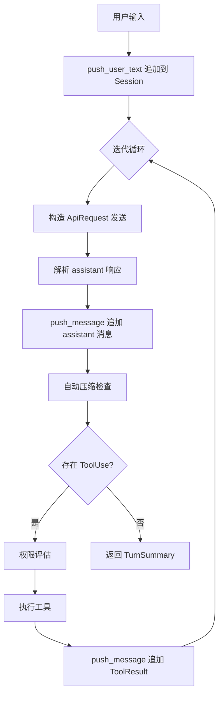

# 第9章 状态机与会话管理

Agent 与 LLM 的交互不是单次请求-响应，而是多轮对话的累积过程。每一次用户输入、模型回复、工具执行结果都需要被记录，并在下一次请求时完整回传。当对话长度超出模型上下文窗口时，还需要对历史消息进行压缩。本章从数据模型、持久化、存储管理和生命周期四个层面，拆解 claw-code 的会话机制。

## 9.1 会话的数据模型

Rust 侧的 `Session` 结构是会话的核心载体，定义在 `rust/crates/runtime/src/session.rs`。

```rust
// claw-code/rust/crates/runtime/src/session.rs

pub struct Session {
    pub version: u32,
    pub session_id: String,
    pub created_at_ms: u64,
    pub updated_at_ms: u64,
    pub messages: Vec<ConversationMessage>,
    pub compaction: Option<SessionCompaction>,
    pub fork: Option<SessionFork>,
    pub workspace_root: Option<PathBuf>,
    pub prompt_history: Vec<SessionPromptEntry>,
    pub last_health_check_ms: Option<u64>,
    pub model: Option<String>,
    persistence: Option<SessionPersistence>,
}
```

`version` 当前固定为 `1`，用于未来格式迁移。`session_id` 由时间戳和原子计数器生成，格式为 `session-{millis}-{counter}`。`messages` 是按顺序存储的完整对话历史。`compaction` 记录最近一次压缩的摘要信息。`workspace_root` 将会话绑定到创建时的工作目录，防止多个并行实例写错位置。`persistence` 是内部字段，持有磁盘文件路径，控制是否启用增量持久化。

对话消息由 `ConversationMessage` 表达：

```rust
// claw-code/rust/crates/runtime/src/session.rs

pub struct ConversationMessage {
    pub role: MessageRole,
    pub blocks: Vec<ContentBlock>,
    pub usage: Option<TokenUsage>,
}
```

`MessageRole` 区分四种角色：

```rust
// claw-code/rust/crates/runtime/src/session.rs

pub enum MessageRole {
    System,
    User,
    Assistant,
    Tool,
}
```

`ContentBlock` 枚举了消息可包含的四种内容类型：

```rust
// claw-code/rust/crates/runtime/src/session.rs

pub enum ContentBlock {
    Text { text: String },
    Thinking { thinking: String, signature: Option<String> },
    ToolUse { id: String, name: String, input: String },
    ToolResult { tool_use_id: String, tool_name: String, output: String, is_error: bool },
}
```

`Thinking` 用于支持链式思维模型的签名思考块。`ToolUse` 和 `ToolResult` 成对出现：模型发出工具调用请求，运行时再将其执行结果以 `ToolResult` 回传。

Python 侧保留了简化版的会话概念。`src/session_store.py` 中的 `StoredSession` 仅记录会话 ID、消息列表和 token 用量，以单个 JSON 文件存储：

```python
# claw-code/src/session_store.py

@dataclass(frozen=True)
class StoredSession:
    session_id: str
    messages: tuple[str, ...]
    input_tokens: int
    output_tokens: int
```

`src/history.py` 则提供内存级的事件日志，用于生成可读的会话历史 Markdown：

```python
# claw-code/src/history.py

@dataclass
class HistoryLog:
    events: list[HistoryEvent] = field(default_factory=list)

    def add(self, title: str, detail: str) -> None:
        self.events.append(HistoryEvent(title=title, detail=detail))
```

## 9.2 持久化与增量存储

Rust 侧采用 JSON Lines（JSONL）格式进行增量持久化。每条消息或元数据占一行 JSON，追加写入文件尾部，避免每次保存都重写整个会话。

```rust
// claw-code/rust/crates/runtime/src/session.rs

fn append_persisted_message(&self, message: &ConversationMessage) -> Result<(), SessionError> {
    let Some(path) = self.persistence_path() else {
        return Ok(());
    };

    let needs_bootstrap = !path.exists() || fs::metadata(path)?.len() == 0;
    if needs_bootstrap {
        self.save_to_path(path)?;  // 首次写入完整快照
        return Ok(());
    }

    let mut file = OpenOptions::new().append(true).open(path)?;
    writeln!(file, "{}", message_record(message).render())?;
    Ok(())
}
```

首次保存或文件为空时，调用 `save_to_path` 写入完整快照；此后仅追加新消息。快照通过 `render_jsonl_snapshot` 按固定顺序渲染：元数据记录 → 压缩记录 → 提示历史 → 消息列表。

写入采用原子写策略，防止进程崩溃导致文件损坏：

```rust
// claw-code/rust/crates/runtime/src/session.rs

fn write_atomic(path: &Path, contents: &str) -> Result<(), SessionError> {
    if let Some(parent) = path.parent() {
        fs::create_dir_all(parent)?;
    }
    let temp_path = temporary_path_for(path);
    fs::write(&temp_path, contents)?;
    fs::rename(temp_path, path)?;  // 原子替换
    Ok(())
}
```

当会话文件增长超过 256KB 时，触发日志轮转：

```rust
// claw-code/rust/crates/runtime/src/session.rs

const ROTATE_AFTER_BYTES: u64 = 256 * 1024;
const MAX_ROTATED_FILES: usize = 3;

fn rotate_session_file_if_needed(path: &Path) -> Result<(), SessionError> {
    let Ok(metadata) = fs::metadata(path) else {
        return Ok(());
    };
    if metadata.len() < ROTATE_AFTER_BYTES {
        return Ok(());
    }
    let rotated_path = rotated_log_path(path);  // stem.rot-{timestamp}.jsonl
    fs::rename(path, rotated_path)?;
    Ok(())
}
```

轮转后的旧日志最多保留 3 个，按修改时间排序，超出的自动删除。加载时则双格式兼容：若内容可解析为含 `messages` 键的 JSON 对象，走 `from_json` 全量解析；否则按行解析 JSONL，通过 `"type"` 字段分发到 `session_meta`、`message`、`compaction`、`prompt_history` 四种记录类型。

## 9.3 会话存储与命名空间隔离

`SessionStore` 负责管理磁盘上的会话文件，按工作空间隔离命名空间，防止多个项目并行运行时的会话碰撞。

```rust
// claw-code/rust/crates/runtime/src/session_control.rs

pub struct SessionStore {
    sessions_root: PathBuf,    // e.g. /project/.claw/sessions/a1b2c3d4e5f60718/
    workspace_root: PathBuf,
}
```

工作空间通过 FNV-1a 64 位哈希生成 16 位十六进制指纹，作为会话目录的子目录名：

```rust
// claw-code/rust/crates/runtime/src/session_control.rs

pub fn workspace_fingerprint(workspace_root: &Path) -> String {
    let input = workspace_root.to_string_lossy();
    let mut hash = 0xcbf2_9ce4_8422_2325_u64;
    for byte in input.as_bytes() {
        hash ^= u64::from(*byte);
        hash = hash.wrapping_mul(0x0100_0000_01b3);
    }
    format!("{hash:016x}")
}
```

目录布局为 `<data_dir>/sessions/<workspace_hash>/`，其中 `data_dir` 可以是项目本地的 `.claw/` 或全局的 `~/.local/share/opencode/`。`SessionStore` 提供两种构造方式：`from_cwd` 从当前工作目录推导，`from_data_dir` 接受显式的 `--data-dir` 参数。

会话引用支持别名解析。`latest`、`last`、`recent` 会被解析为当前命名空间下消息数非零的最新会话：

```rust
// claw-code/rust/crates/runtime/src/session_control.rs

pub fn latest_session_excluding(
    &self,
    exclude_id: Option<&str>,
) -> Result<ManagedSessionSummary, SessionControlError> {
    // 先查当前 workspace 命名空间
    if let Some(latest) = self.list_sessions()?.into_iter()
        .find(|s| s.id != exclude && s.message_count > 0) {
        return Ok(latest);
    }
    // fallback：扫描全局所有 workspace 命名空间
    if let Some(latest) = self.scan_global_sessions()?.into_iter()
        .find(|s| s.id != exclude && s.message_count > 0) {
        return Ok(latest);
    }
    // ...
}
```

加载会话时，`load_session_loose` 对别名引用允许跨工作空间恢复，仅打印警告；对显式会话 ID 则强制校验 `workspace_root` 匹配，防止误加载其他项目的会话。

## 9.4 会话压缩

随着对话轮次增加，消息历史会逼近甚至超出 LLM 的上下文窗口。`compact.rs` 实现了自动压缩机制：保留最近若干条消息的原文，将更早的消息替换为一段摘要，并以 `System` 角色的合成消息插入到消息队列头部。

```rust
// claw-code/rust/crates/runtime/src/compact.rs

pub struct CompactionConfig {
    pub preserve_recent_messages: usize,  // 默认 4
    pub max_estimated_tokens: usize,      // 默认 10_000
}
```

压缩触发条件有两个：可压缩部分的长度超过 `preserve_recent_messages`，且其估算 token 数达到 `max_estimated_tokens`。

```rust
// claw-code/rust/crates/runtime/src/compact.rs

pub fn should_compact(session: &Session, config: CompactionConfig) -> bool {
    let start = compacted_summary_prefix_len(session);
    let compactable = &session.messages[start..];

    compactable.len() > config.preserve_recent_messages
        && compactable.iter().map(estimate_message_tokens).sum::<usize>() >= config.max_estimated_tokens
}
```

`compact_session` 的核心逻辑是截取 `messages[prefix..keep_from]` 作为待压缩区间，生成摘要后构建新的消息列表：

```rust
// claw-code/rust/crates/runtime/src/compact.rs

let mut compacted_messages = vec![ConversationMessage {
    role: MessageRole::System,
    blocks: vec![ContentBlock::Text { text: continuation }],
    usage: None,
}];
compacted_messages.extend(preserved);

let mut compacted_session = session.clone();
compacted_session.messages = compacted_messages;
compacted_session.record_compaction(summary.clone(), removed.len());
```

其中 `continuation` 是一段预设的前导文本加上自动生成的摘要，告知模型"这是从前一次对话继续"。

压缩边界需要特别处理，防止在 `ToolUse` 和 `ToolResult` 之间切断。如果保留区间的首条消息是 `ToolResult`，代码会向前回溯，确保配对的 `ToolUse` 也被保留，否则 OpenAI 兼容路径会返回 400 错误：

```rust
// claw-code/rust/crates/runtime/src/compact.rs

loop {
    if k == 0 || k <= compacted_prefix_len || k >= session.messages.len() {
        break;
    }
    let first_preserved = &session.messages[k];
    let starts_with_tool_result = first_preserved.blocks.first()
        .is_some_and(|b| matches!(b, ContentBlock::ToolResult { .. }));
    if !starts_with_tool_result { break; }
    // 回溯直到边界安全
    k = k.saturating_sub(1);
}
```

## 9.5 会话在 Turn Loop 中的生命周期

`ConversationRuntime` 持有 `Session` 并驱动其状态在 Turn Loop 中变迁。

```rust
// claw-code/rust/crates/runtime/src/conversation.rs

pub struct ConversationRuntime<C, T> {
    session: Session,
    api_client: C,
    tool_executor: T,
    permission_policy: PermissionPolicy,
    system_prompt: Vec<String>,
    max_iterations: usize,
    usage_tracker: UsageTracker,
    hook_runner: HookRunner,
    auto_compaction_input_tokens_threshold: u32,
    // ...
}
```

`run_turn` 是状态变迁的主入口，执行流程如下：



每次迭代后都会调用 `maybe_auto_compact` 检查是否触发压缩，包括无工具的终止迭代。这防止了会话在长时间对话中无限增长。

会话还维护心跳机制用于健康检测：

```rust
// claw-code/rust/crates/runtime/src/session.rs

pub enum SessionLiveness {
    Healthy,
    Stalled,
    TransportDead,
    Unknown,
}

pub struct SessionHeartbeat {
    pub session_id: String,
    pub observed_at_ms: u64,
    pub transport_alive: bool,
    pub liveness: SessionLiveness,
}
```

`heartbeat_at` 根据传输层状态和最近一次健康检查的时间戳，将会话分类为四种存活状态。`TransportDead` 表示连接已断开；`Stalled` 表示连接仍在但健康检查超时；`Healthy` 为正常；`Unknown` 则尚无健康检查记录。

## 设计对比

| claw-code 概念 | Java 生态对应 |
| --- | --- |
| `Session` | `HttpSession` |
| `SessionStore` / `SessionHandle` | `SessionRepository` + Session ID |
| JSONL 增量追加 | WAL（Write-Ahead Log） |
| `write_atomic` | 事务日志的原子提交（先写临时文件再 rename） |
| `Compaction` | 数据库 Checkpoint / 日志压缩 |
| `ConversationRuntime` 持有 `Session` | Stateful Service 持有用户会话状态 |

在 Spring 应用中，`HttpSession` 由容器管理，通常存储在内存或 Redis 中。claw-code 的 `Session` 则是进程内结构，持久化到本地 JSONL 文件，更接近嵌入式数据库的 WAL 设计。`SessionStore` 的 workspace fingerprint 隔离，类似于多租户场景下按租户 ID 分库分表的做法。

## 小结

本章涉及的源码文件和核心机制如下：

- `rust/crates/runtime/src/session.rs`：定义 `Session`、`ConversationMessage`、`ContentBlock` 等核心数据结构，实现 JSONL 增量持久化、原子写、日志轮转、双格式加载，以及会话心跳和 Fork 语义。
- `rust/crates/runtime/src/session_control.rs`：`SessionStore` 按 workspace fingerprint 隔离会话命名空间，支持别名解析（`latest`）、跨 workspace 恢复、workspace 绑定校验。
- `rust/crates/runtime/src/compact.rs`：自动压缩机制，保留尾部消息、生成摘要、合成续接 system message，并处理 tool-use/tool-result 边界安全。
- `rust/crates/runtime/src/conversation.rs`：`ConversationRuntime` 在 Turn Loop 中驱动会话状态变迁，每次迭代后触发自动压缩检查。
- `src/session_store.py` / `src/history.py`：Python 侧的简化版会话存储（JSON 文件）和内存事件日志。
