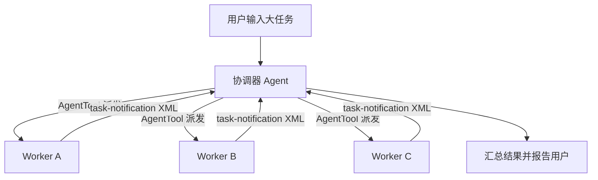

# 第10章 协调器：多 Agent 编排

当单个 Agent 面对大规模重构或跨模块分析任务时，上下文窗口容易耗尽，且无法并行探索不同代码路径。原版 Claude Code 通过协调器模式（Coordinator Mode）解决这一问题：一个主 Agent 拆解任务，多个 Worker Agent 并行执行，最后汇总结果。Python 重写版并未实现这套机制，但保留了完整的移植审计基础设施，用来记录哪些子系统已被迁移、哪些仍停留在存档中。本章通过分析存档元数据、占位符结构和镜像注册表，理解多 Agent 编排的设计意图，以及重写版选择单 Agent 架构的合理性。

## 10.1 协调器模式的概念与原版架构

原版 TypeScript 代码库在 `src/coordinator/` 目录下实现了完整的协调器开关与系统提示词注入逻辑。存档元数据记录了这个子系统的存在：

```json
// claw-code/src/reference_data/subsystems/coordinator.json

{
  "archive_name": "coordinator",
  "package_name": "coordinator",
  "module_count": 1,
  "sample_files": [
    "coordinator/coordinatorMode.ts"
  ]
}
```

`coordinatorMode.ts` 是原版协调器模式的核心文件，负责在检测到环境变量 `CLAUDE_CODE_COORDINATOR_MODE=1` 时，将普通系统提示词替换为协调器专用提示词。协调器 Agent 获得的指令明确告知它如何拆解任务、派发 Worker、汇总结果。这不是编译期分支，而是运行时的行为切换。

工具层的快照数据进一步揭示了原版的多 Agent 基础设施规模。`tools_snapshot.json` 中仅与 Agent 编排直接相关的模块就有 20 余项：

```json
// claw-code/src/reference_data/tools_snapshot.json（节选）

[
  { "name": "AgentTool", "source_hint": "tools/AgentTool/AgentTool.tsx" },
  { "name": "forkSubagent", "source_hint": "tools/AgentTool/forkSubagent.ts" },
  { "name": "resumeAgent", "source_hint": "tools/AgentTool/resumeAgent.ts" },
  { "name": "runAgent", "source_hint": "tools/AgentTool/runAgent.ts" },
  { "name": "SendMessageTool", "source_hint": "tools/SendMessageTool/SendMessageTool.ts" },
  { "name": "TaskStopTool", "source_hint": "tools/TaskStopTool/TaskStopTool.ts" },
  { "name": "TaskCreateTool", "source_hint": "tools/TaskCreateTool/TaskCreateTool.ts" },
  { "name": "TaskGetTool", "source_hint": "tools/TaskGetTool/TaskGetTool.ts" },
  { "name": "TaskListTool", "source_hint": "tools/TaskListTool/TaskListTool.ts" },
  { "name": "TaskOutputTool", "source_hint": "tools/TaskOutputTool/TaskOutputTool.tsx" },
  { "name": "TaskUpdateTool", "source_hint": "tools/TaskUpdateTool/TaskUpdateTool.ts" },
  { "name": "spawnMultiAgent", "source_hint": "tools/shared/spawnMultiAgent.ts" }
]
```

原版架构可以概括为三层：



协调器通过 `AgentTool` 创建子 Agent。每个子 Agent 拥有独立的上下文窗口、工具权限集合和 `AbortController`，但共享父进程的 `AppState` store。Worker 完成后，结果以 `<task-notification>` XML 格式注入协调器的用户消息流，让协调器的 LLM 能够感知任务完成。Worker 之间还可以通过 `SendMessageTool` 进行单向邮箱通信，`TaskStopTool` 则用于强制终止运行中的子 Agent。

## 10.2 Python 重写版的占位符结构

Python 重写版在 `src/coordinator/` 目录下仅保留了一个占位符文件，没有实现任何协调器逻辑：

```python
# claw-code/src/coordinator/__init__.py

from src._archive_helper import load_archive_metadata

_SNAPSHOT = load_archive_metadata("coordinator")

ARCHIVE_NAME = _SNAPSHOT["archive_name"]
MODULE_COUNT = _SNAPSHOT["module_count"]
SAMPLE_FILES = tuple(_SNAPSHOT["sample_files"])
PORTING_NOTE = f"Python placeholder package for '{ARCHIVE_NAME}' with {MODULE_COUNT} archived module references."

__all__ = ["ARCHIVE_NAME", "MODULE_COUNT", "PORTING_NOTE", "SAMPLE_FILES"]
```

这个文件通过 `_archive_helper` 加载子系统的存档元数据，然后暴露为模块常量。`load_archive_metadata` 的实现很简单：

```python
# claw-code/src/_archive_helper.py

def load_archive_metadata(package_name: str) -> dict:
    snapshot_path = (
        Path(__file__).resolve().parent
        / "reference_data"
        / "subsystems"
        / f"{package_name}.json"
    )
    return json.loads(snapshot_path.read_text())
```

整个 `src/coordinator/` 目录下只有 `__init__.py` 这一个文件。与原版 369 行的 `coordinatorMode.ts` 相比，Python 版的协调器子系统是一个空壳。同样的占位符模式也出现在 `src/state/`、`src/remote/`、`src/server/` 等目录中——这些子系统在原版中都有复杂实现，但在 Python 重写版中仅保留了包结构和元数据引用。

## 10.3 移植审计与镜像注册表

虽然协调器本身没有移植，但 Python 重写版建立了一套完整的移植审计基础设施，用来追踪哪些原版模块已被覆盖、哪些仍缺失。这套系统的核心是 `parity_audit.py`：

```python
# claw-code/src/parity_audit.py

ARCHIVE_ROOT_FILES = {
    'QueryEngine.ts': 'QueryEngine.py',
    'Task.ts': 'task.py',
    'Tool.ts': 'Tool.py',
    'commands.ts': 'commands.py',
    # ... 共 19 个根文件映射
}

ARCHIVE_DIR_MAPPINGS = {
    'assistant': 'assistant',
    'bootstrap': 'bootstrap',
    'coordinator': 'coordinator',
    # ... 共 34 个目录映射
}

@dataclass(frozen=True)
class ParityAuditResult:
    archive_present: bool
    root_file_coverage: tuple[int, int]
    directory_coverage: tuple[int, int]
    total_file_ratio: tuple[int, int]
    command_entry_ratio: tuple[int, int]
    tool_entry_ratio: tuple[int, int]
    missing_root_targets: tuple[str, ...]
    missing_directory_targets: tuple[str, ...]
```

`run_parity_audit()` 将当前 Python 文件与存档快照进行对比，输出覆盖率指标。对于协调器而言，`directory_coverage` 会显示 `coordinator` 目录存在（因为有一个 `__init__.py`），但 `total_file_ratio` 会暴露该目录下只有 1 个文件，而原版有 1 个以上的模块。

在运行期，重写版通过 `execution_registry.py` 为镜像的命令和工具提供统一的查找与执行入口：

```python
# claw-code/src/execution_registry.py

@dataclass(frozen=True)
class ExecutionRegistry:
    commands: tuple[MirroredCommand, ...]
    tools: tuple[MirroredTool, ...]

    def command(self, name: str) -> MirroredCommand | None:
        lowered = name.lower()
        for command in self.commands:
            if command.name.lower() == lowered:
                return command
        return None

    def tool(self, name: str) -> MirroredTool | None:
        lowered = name.lower()
        for tool in self.tools:
            if tool.name.lower() == lowered:
                return tool
        return None
```

`ExecutionRegistry` 本身不实现任何业务逻辑，它只是根据名称从快照中查找对应的镜像条目，并返回一条描述性消息：

```python
# claw-code/src/execution_registry.py

def execute_command(name: str, prompt: str = '') -> CommandExecution:
    module = get_command(name)
    if module is None:
        return CommandExecution(name=name, source_hint='', prompt=prompt, handled=False, message=f'Unknown mirrored command: {name}')
    action = f"Mirrored command '{module.name}' from {module.source_hint} would handle prompt {prompt!r}."
    return CommandExecution(name=module.name, source_hint=module.source_hint, prompt=prompt, handled=True, message=action)
```

命令和工具的数据源分别是 `commands_snapshot.json` 和 `tools_snapshot.json`。`commands.py` 在加载时将 207 条命令记录转换为 `PortingModule` 元组：

```python
# claw-code/src/commands.py

@lru_cache(maxsize=1)
def load_command_snapshot() -> tuple[PortingModule, ...]:
    raw_entries = json.loads(SNAPSHOT_PATH.read_text())
    return tuple(
        PortingModule(
            name=entry['name'],
            responsibility=entry['responsibility'],
            source_hint=entry['source_hint'],
            status='mirrored',
        )
        for entry in raw_entries
    )
```

这套镜像系统的价值在于：它为尚未实现的子系统保留了接口契约。协调器相关的命令（如 `commands/agents/agents.tsx`）和工具（如 `AgentTool`、`SendMessageTool`、`TaskStopTool`）都登记在快照中，未来如果决定补完协调器实现，可以直接在这些镜像接口后面填入真实逻辑。

## 10.4 单 Agent 查询引擎：重写版的选择

Python 重写版没有采用多 Agent 架构，而是在 `query_engine.py` 中实现了一个单 Agent 的 Turn Loop：

```python
# claw-code/src/query_engine.py

@dataclass(frozen=True)
class QueryEngineConfig:
    max_turns: int = 8
    max_budget_tokens: int = 2000
    compact_after_turns: int = 12
    structured_output: bool = False
    structured_retry_limit: int = 2

@dataclass
class QueryEnginePort:
    manifest: PortManifest
    config: QueryEngineConfig = field(default_factory=QueryEngineConfig)
    session_id: str = field(default_factory=lambda: uuid4().hex)
    mutable_messages: list[str] = field(default_factory=list)
```

`QueryEnginePort.submit_message()` 处理单轮消息，检查 `max_turns` 和 `max_budget_tokens` 限制，累积 usage，并在超过 `compact_after_turns` 时压缩消息历史。整个流程不涉及任何子 Agent 创建、任务拆分或并发控制。

`query_engine.py` 的 `render_summary()` 方法甚至会输出镜像的命令和工具列表，但协调器相关的工具（如 `AgentTool`）只是作为 backlog 条目存在，没有可调用实现：

```python
# claw-code/src/query_engine.py

def render_summary(self) -> str:
    command_backlog = build_command_backlog()
    tool_backlog = build_tool_backlog()
    sections = [
        '# Python Porting Workspace Summary',
        self.manifest.to_markdown(),
        f'Command surface: {len(command_backlog.modules)} mirrored entries',
        *command_backlog.summary_lines()[:10],
        f'Tool surface: {len(tool_backlog.modules)} mirrored entries',
        *tool_backlog.summary_lines()[:10],
    ]
    return '\n'.join(sections)
```

这种单 Agent 设计的取舍是合理的。原版协调器涉及 prompt 工程、并发控制、跨进程通信、任务状态机和结果聚合，工程复杂度远高于单 Agent Turn Loop。对于重写版的目标——验证核心架构的可移植性——先实现单 Agent 路径、将协调器标记为待办项，是更务实的策略。

## 设计对比

原版 Claude Code 的协调器模式与 Java 生态中的几种编排机制存在结构对应关系：

| claw-code 概念 | Java 生态对应 |
| --- | --- |
| Coordinator Agent | Saga Orchestrator（ Saga 模式的编排协调器） |
| Worker Agent | `CompletableFuture` 或 `Runnable` 提交到 `ThreadPoolExecutor` |
| AgentTool 派发任务 | `ExecutorService.submit(Callable)` |
| SendMessageTool | `BlockingQueue` 或 `EventBus` 异步消息 |
| TaskStopTool | `Future.cancel(true)` |
| task-notification XML | `CompletableFuture.allOf(...).thenApply()` 的结果聚合回调 |
| LocalAgentTask 状态机 | `FutureTask.State`（NEW -> RUNNING -> COMPLETED / CANCELLED） |

两者的核心差异在于调度决策的制定者。Java 的 Saga 或工作流引擎（如 Camunda）将拆分策略、并发度和失败重试逻辑写在代码或 BPMN 流程图中。Claude Code 的协调器则将这些决策交给 LLM：协调器 Agent 自己阅读用户请求，决定拆成几个子任务、每个 Worker 负责什么、何时重试。这是一种"LLM 作为调度引擎"的激进设计，也是 Agent 工程与传统后端编排的本质区别。

Python 重写版目前的位置，相当于一个只实现了单线程执行器、但预留了 `ExecutorService` 接口骨架的 Java 项目。`ExecutionRegistry` 和快照系统扮演了接口契约的角色，让未来的多 Agent 实现有明确的接入点。

## 小结

本章分析了 Python 重写版中协调器子系统的现状。`src/coordinator/__init__.py` 是一个基于 `_archive_helper` 的占位符，没有实现任何多 Agent 编排逻辑。`src/parity_audit.py` 和 `src/execution_registry.py` 构成了移植审计基础设施，通过 `commands_snapshot.json` 和 `tools_snapshot.json` 记录了原版 207 个命令和 184 个工具的元数据，其中包括 `AgentTool`、`SendMessageTool`、`TaskStopTool` 等协调器核心组件。`src/query_engine.py` 选择了单 Agent Turn Loop 作为当前实现路径，将多 Agent 并发留给未来扩展。从工程角度看，这是一种先固化核心、后补高级特性的增量移植策略。
