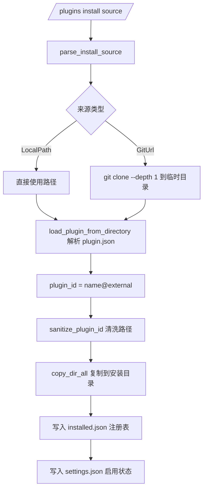
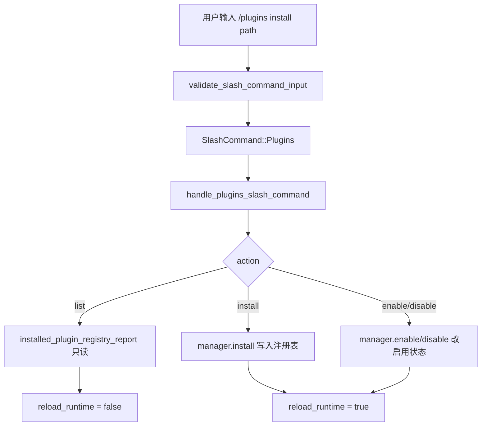

# 第11章 插件系统与命令扩展

原版 Claude Code 的可扩展性来自两层：插件系统（通过 `plugin.json` 声明钩子、工具和命令）和 200 余个内置 slash 命令（`/commit`、`/pr`、`/plugins` 等）。Python 重写版没有实现这两层，而是把它们做成镜像注册表占位，记录哪些模块来自存档；Rust 重写版则真正落地了插件管理器与命令分发。本章沿三个层次拆解：Python 侧的镜像占位、Rust 侧的插件管理器、Rust 侧的命令分发。

## 11.1 Python 占位层：镜像而非实现

`src/plugins/__init__.py` 与本书第 10 章分析的 `src/coordinator/__init__.py` 是同一套模式：不是实现插件系统，而是从存档元数据里读取一个数字，证明这个子系统在原版里存在过。

```python
# claw-code/src/plugins/__init__.py

from src._archive_helper import load_archive_metadata

_SNAPSHOT = load_archive_metadata("plugins")

ARCHIVE_NAME = _SNAPSHOT["archive_name"]
MODULE_COUNT = _SNAPSHOT["module_count"]
SAMPLE_FILES = tuple(_SNAPSHOT["sample_files"])
PORTING_NOTE = f"Python placeholder package for '{ARCHIVE_NAME}' with {MODULE_COUNT} archived module references."

__all__ = ["ARCHIVE_NAME", "MODULE_COUNT", "PORTING_NOTE", "SAMPLE_FILES"]
```

`load_archive_metadata` 定义在 `src/_archive_helper.py`，它拼接路径 `reference_data/subsystems/{package_name}.json` 并返回字典。对应到插件子系统，读到的元数据是：

```json
// claw-code/src/reference_data/subsystems/plugins.json

{
  "archive_name": "plugins",
  "package_name": "plugins",
  "module_count": 2,
  "sample_files": [
    "plugins/builtinPlugins.ts",
    "plugins/bundled/index.ts"
  ]
}
```

原版插件子系统只有两个模块：`builtinPlugins.ts` 负责内置插件，`bundled/index.ts` 是随发行包捆绑的插件入口。`MODULE_COUNT = 2` 这个数字是 Python 侧对原版插件的全部认知，没有清单解析、没有加载逻辑。

命令侧的镜像注册表更完整一些。`src/commands.py` 从 `reference_data/commands_snapshot.json` 加载 207 条命令条目，每条对应原版 `commands/` 目录下的一个 TypeScript 文件：

```python
# claw-code/src/commands.py

SNAPSHOT_PATH = Path(__file__).resolve().parent / 'reference_data' / 'commands_snapshot.json'

@lru_cache(maxsize=1)
def load_command_snapshot() -> tuple[PortingModule, ...]:
    raw_entries = json.loads(SNAPSHOT_PATH.read_text())
    return tuple(
        PortingModule(
            name=entry['name'],
            responsibility=entry['responsibility'],
            source_hint=entry['source_hint'],
            status='mirrored',
        )
        for entry in raw_entries
    )

PORTED_COMMANDS = load_command_snapshot()
```

`PortingModule` 是一个 frozen dataclass，字段为 `name`、`responsibility`、`source_hint`、`status`。这里 `status='mirrored'` 的含义是：这条命令在 Python 侧没有可执行实现，只有指向存档源文件的提示。`commands_snapshot.json` 的每条条目形如：

```json
// claw-code/src/reference_data/commands_snapshot.json（节选）

{ "name": "add-dir", "source_hint": "commands/add-dir/add-dir.tsx",
  "responsibility": "Command module mirrored from archived TypeScript path commands/add-dir/add-dir.tsx" },
{ "name": "advisor", "source_hint": "commands/advisor.ts",
  "responsibility": "Command module mirrored from archived TypeScript path commands/advisor.ts" }
```

`execute_command` 揭示了镜像的本质：它找到命令，返回 `handled=True`，但 `message` 只是"该命令本应处理这个 prompt"，实际没有执行任何东西：

```python
# claw-code/src/commands.py

def execute_command(name: str, prompt: str = '') -> CommandExecution:
    module = get_command(name)
    if module is None:
        return CommandExecution(name=name, source_hint='', prompt=prompt, handled=False, message=f'Unknown mirrored command: {name}')
    action = f"Mirrored command '{module.name}' from {module.source_hint} would handle prompt {prompt!r}."
    return CommandExecution(name=module.name, source_hint=module.source_hint, prompt=prompt, handled=True, message=action)
```

别名映射表是唯一的"活"逻辑。`COMMAND_ALIASES` 把 `plugins` 和 `marketplace` 都归一化到 `plugin`，`get_command` 先查别名再查全名。这个别名表的存在说明命令命名历史上发生过变更，镜像层需要兼容旧名称：

```python
# claw-code/src/commands.py

COMMAND_ALIASES = {
    'plugins': 'plugin',
    'marketplace': 'plugin',
}

def get_command(name: str) -> PortingModule | None:
    normalized = name.strip().lower()
    needle = COMMAND_ALIASES.get(normalized, normalized)
    for module in PORTED_COMMANDS:
        if module.name.lower() == needle:
            return module
    return None
```

`src/command_graph.py` 在镜像之上做了一层分类。它不关心命令的语义，只看 `source_hint` 字符串里是否包含 `plugin` 或 `skills` 关键字，把命令分成三类：

```python
# claw-code/src/command_graph.py

def build_command_graph() -> CommandGraph:
    commands = get_commands()
    builtins = tuple(module for module in commands if 'plugin' not in module.source_hint.lower() and 'skills' not in module.source_hint.lower())
    plugin_like = tuple(module for module in commands if 'plugin' in module.source_hint.lower())
    skill_like = tuple(module for module in commands if 'skills' in module.source_hint.lower())
    return CommandGraph(builtins=builtins, plugin_like=plugin_like, skill_like=skill_like)
```

`CommandGraph` 是 frozen dataclass，字段 `builtins`、`plugin_like`、`skill_like`，`flattened()` 把三类拼接，`as_markdown()` 输出计数摘要。这套分类是给移植审计报告用的：原版命令从归属上分成了内置命令、插件命令、技能命令三个来源，Python 侧把它们原样镜像下来，等待 Rust 侧重新实现。

`archive_surface_snapshot.json` 汇总了存档规模：`command_entry_count = 207`、`tool_entry_count = 184`、`total_ts_like_files = 1902`。Python 占位层的作用到此为止——它是一份"移植待办清单"，真正的插件与命令实现全部在 Rust crate 里。

## 11.2 Rust 插件系统：PluginManager 与清单契约

Rust 插件系统的入口在 `rust/crates/plugins/src/lib.rs`。与 Python 侧只读元数据不同，这里定义了完整的插件类型体系。插件按来源分为三类：

```rust
// claw-code/rust/crates/plugins/src/lib.rs

#[derive(Debug, Clone, Copy, PartialEq, Eq, Serialize, Deserialize)]
#[serde(rename_all = "lowercase")]
pub enum PluginKind {
    Builtin,
    Bundled,
    External,
}
```

三类插件对应三个 marketplace 常量：`builtin`、`bundled`、`external`。`PluginKind::marketplace()` 返回对应的常量字符串，插件 ID 由 `name@marketplace` 拼接而成，因此同一个名字可以同时存在于三个来源而不冲突。

插件的契约文件是 `plugin.json`。`PluginManifest` 是解析后的强类型结构：

```rust
// claw-code/rust/crates/plugins/src/lib.rs

pub struct PluginManifest {
    pub name: String,
    pub version: String,
    pub description: String,
    pub permissions: Vec<PluginPermission>,
    #[serde(rename = "defaultEnabled", default)]
    pub default_enabled: bool,
    #[serde(default)]
    pub hooks: PluginHooks,
    #[serde(default)]
    pub lifecycle: PluginLifecycle,
    #[serde(default)]
    pub tools: Vec<PluginToolManifest>,
    #[serde(default)]
    pub commands: Vec<PluginCommandManifest>,
}
```

清单里的 `permissions` 是插件级别的三类权限，与工具级别的权限是两套独立的枚举。插件权限是 `read`/`write`/`execute`，工具权限沿用会话权限模式的三档 `read-only`/`workspace-write`/`danger-full-access`：

```rust
// claw-code/rust/crates/plugins/src/lib.rs

pub enum PluginPermission { Read, Write, Execute }

pub enum PluginToolPermission { ReadOnly, WorkspaceWrite, DangerFullAccess }
```

工具级权限的默认值是 `danger-full-access`，由 `default_tool_permission_label()` 提供。这意味着清单里没有显式声明权限的工具，默认获得最高权限，属于保守的显式声明设计。

工具执行是插件系统最核心的机制。`PluginTool::execute` 不是调用进程内函数，而是启动一个子进程，通过环境变量和标准输入传递上下文：

```rust
// claw-code/rust/crates/plugins/src/lib.rs

pub fn execute(&self, input: &Value) -> Result<String, PluginError> {
    let input_json = input.to_string();
    let mut process = Command::new(&self.command);
    process
        .args(&self.args)
        .stdin(Stdio::piped())
        .stdout(Stdio::piped())
        .stderr(Stdio::piped())
        .env("CLAWD_PLUGIN_ID", &self.plugin_id)
        .env("CLAWD_PLUGIN_NAME", &self.plugin_name)
        .env("CLAWD_TOOL_NAME", &self.definition.name)
        .env("CLAWD_TOOL_INPUT", &input_json);
    if let Some(root) = &self.root {
        process
            .current_dir(root)
            .env("CLAWD_PLUGIN_ROOT", root.display().to_string());
    }

    let mut child = process.spawn()?;
    if let Some(stdin) = child.stdin.as_mut() {
        stdin.write_all(input_json.as_bytes())?;
    }
    let output = child.wait_with_output()?;
    if output.status.success() {
        Ok(String::from_utf8_lossy(&output.stdout).trim().to_string())
    } else {
        // 失败时把 stderr 拼进错误信息
        Err(PluginError::CommandFailed(...))
    }
}
```

子进程通过四个 `CLAWD_*` 环境变量感知自身身份：插件 ID、插件名、工具名、输入 JSON。如果插件有根目录，还会设置工作目录和 `CLAWD_PLUGIN_ROOT`。输入通过 stdin 再传一遍，意味着工具命令既可以从环境变量读输入，也可以从标准输入读，兼容两种风格的插件实现。

`PluginManager` 是插件的生命周期中枢。它的 `install` 方法展示了从来源到注册的完整路径：

```rust
// claw-code/rust/crates/plugins/src/lib.rs

pub fn install(&mut self, source: &str) -> Result<InstallOutcome, PluginError> {
    let install_source = parse_install_source(source)?;
    let temp_root = self.install_root().join(".tmp");
    let staged_source = materialize_source(&install_source, &temp_root)?;
    let cleanup_source = matches!(install_source, PluginInstallSource::GitUrl { .. });
    let manifest = load_plugin_from_directory(&staged_source)?;

    let plugin_id = plugin_id(&manifest.name, EXTERNAL_MARKETPLACE);
    let install_path = self.install_root().join(sanitize_plugin_id(&plugin_id));
    if install_path.exists() {
        fs::remove_dir_all(&install_path)?;
    }
    copy_dir_all(&staged_source, &install_path)?;
    if cleanup_source {
        let _ = fs::remove_dir_all(&staged_source);
    }

    let mut registry = self.load_registry()?;
    registry.plugins.insert(plugin_id.clone(), record);
    self.store_registry(&registry)?;
    self.write_enabled_state(&plugin_id, Some(true))?;
    self.config.enabled_plugins.insert(plugin_id.clone(), true);

    Ok(InstallOutcome { plugin_id, version: manifest.version, install_path })
}
```

`parse_install_source` 根据字符串前缀判断来源：`http://`、`https://`、`git@` 或 `.git` 后缀视为 Git URL，否则视为本地路径。`materialize_source` 对本地路径直接返回原路径，对 Git URL 执行 `git clone --depth 1` 到临时目录。安装完成后，Git 克隆的临时目录被删除，本地路径来源则保留原目录。



插件 ID 的拼接与清洗是两条独立的规则。`plugin_id(name, marketplace)` 返回 `name@marketplace`，`sanitize_plugin_id` 把路径分隔符替换为横线，防止 ID 被用来构造文件路径时越界：

```rust
// claw-code/rust/crates/plugins/src/lib.rs

fn plugin_id(name: &str, marketplace: &str) -> String {
    format!("{name}@{marketplace}")
}

fn sanitize_plugin_id(plugin_id: &str) -> String {
    plugin_id.chars().map(|ch| match ch {
        '/' | '\\' | '@' | ':' => '-',
        other => other,
    }).collect()
}
```

清单加载不是直接反序列化，中间插入了一层兼容性检测。`load_manifest_from_path` 先读原始 JSON，调用 `detect_claude_code_manifest_contract_gaps` 检查原版 Claude Code 插件契约里那些不被 claw 支持的特性：

```rust
// claw-code/rust/crates/plugins/src/lib.rs

fn load_manifest_from_path(root: &Path, manifest_path: &Path) -> Result<PluginManifest, PluginError> {
    let contents = fs::read_to_string(manifest_path).map_err(...)?;
    let raw_json: Value = serde_json::from_str(&contents)?;
    let compatibility_errors = detect_claude_code_manifest_contract_gaps(&raw_json);
    if !compatibility_errors.is_empty() {
        return Err(PluginError::ManifestValidation(compatibility_errors));
    }
    let raw_manifest: RawPluginManifest = serde_json::from_value(raw_json)?;
    build_plugin_manifest(root, raw_manifest)
}
```

被拒绝的三个字段是 `skills`、`mcpServers`、`agents`。原版 Claude Code 允许插件清单直接携带这三类资源，claw 的契约有意收窄：插件只负责 hooks、lifecycle、tools、commands 四类扩展，技能从本地目录发现，MCP 服务器从配置加载，Agent 目录也不由插件管理。这是一个刻意的设计取舍，避免插件成为绕过其他子系统边界的通道。

多个插件的聚合在 `PluginRegistry` 层完成。`aggregated_hooks` 遍历所有已启用插件，用 `merged_with` 合并钩子列表；`aggregated_tools` 除了合并，还要做工具名去重，同一个工具名被两个插件声明即报错：

```rust
// claw-code/rust/crates/plugins/src/lib.rs

pub fn aggregated_tools(&self) -> Result<Vec<PluginTool>, PluginError> {
    let mut tools = Vec::new();
    let mut seen_names = BTreeMap::new();
    for plugin in self.plugins.iter().filter(|plugin| plugin.is_enabled()) {
        plugin.validate()?;
        for tool in plugin.tools() {
            if let Some(existing_plugin) =
                seen_names.insert(tool.definition().name.clone(), tool.plugin_id().to_string())
            {
                return Err(PluginError::InvalidManifest(format!(
                    "plugin tool `{}` is defined by both `{existing_plugin}` and `{}`",
                    tool.definition().name, tool.plugin_id()
                )));
            }
            tools.push(tool.clone());
        }
    }
    Ok(tools)
}
```

`uninstall` 对捆绑插件做了保护：`PluginKind::Bundled` 的记录不允许卸载，只能禁用。这是把"随发行包分发的插件"与"用户自己安装的插件"区分开的边界，前者由发行方管理，后者由用户管理。

## 11.3 Rust 命令分发：SlashCommand 与插件命令

命令分发在 `rust/crates/commands/src/lib.rs`。核心是一个 60 多个变体的大枚举 `SlashCommand`，每个变体对应一个 `/` 开头的内置命令：

```rust
// claw-code/rust/crates/commands/src/lib.rs

pub enum SlashCommand {
    Help,
    Status,
    Sandbox,
    Compact,
    Bughunter { scope: Option<String> },
    Commit,
    Pr { context: Option<String> },
    Model { model: Option<String> },
    Permissions { mode: Option<String> },
    Clear { confirm: bool },
    Cost,
    Resume { session_path: Option<String> },
    Config { section: Option<String> },
    Mcp { action: Option<String>, target: Option<String> },
    Plugins { action: Option<String>, target: Option<String> },
    Agents { args: Option<String> },
    Skills { args: Option<String> },
    // ... 其余 40 余个变体省略
    Unknown(String),
}
```

枚举变体承载了参数的结构。无参命令是空变体（`Help`、`Status`），带一个可选参数的用 `Option<String>`（`Model { model }`），带两个参数的命令用 `action` 加 `target` 的成对字段（`Plugins`、`Mcp`），无法识别的命令落到 `Unknown(String)` 保留原始输入。

解析入口 `validate_slash_command_input` 先判断输入是否以 `/` 开头，否则返回 `None` 表示这不是命令，交给普通的 prompt 处理：

```rust
// claw-code/rust/crates/commands/src/lib.rs

pub fn validate_slash_command_input(input: &str) -> Result<Option<SlashCommand>, SlashCommandParseError> {
    let trimmed = input.trim();
    if !trimmed.starts_with('/') {
        return Ok(None);
    }

    let mut parts = trimmed.trim_start_matches('/').split_whitespace();
    let command = parts.next().unwrap_or_default();
    if command.is_empty() {
        return Err(SlashCommandParseError::new(
            "Slash command name is missing. Use /help to list available slash commands.",
        ));
    }

    let args = parts.collect::<Vec<_>>();
    let remainder = remainder_after_command(trimmed, command);

    Ok(Some(match command {
        "help" => { validate_no_args(command, &args)?; SlashCommand::Help }
        "model" => SlashCommand::Model { model: optional_single_arg(command, &args, "[model]")? },
        "permissions" => SlashCommand::Permissions { mode: parse_permissions_mode(&args)? },
        // ...
    }))
}
```

每个命令的解析规则由三个辅助函数统一收口：`validate_no_args` 拒绝多余参数，`optional_single_arg` 读至多一个参数，`require_remainder` 强制要求命令名之后的剩余文本。这套函数把 60 多个命令的参数校验收敛到同一种模式，避免每个命令各自写一遍参数处理。

命令元数据表 `SLASH_COMMAND_SPECS` 独立于枚举存在，用于 `help` 展示和模糊匹配。每个条目记录规范名、别名、摘要、参数提示、是否支持 resume：

```rust
// claw-code/rust/crates/commands/src/lib.rs

const SLASH_COMMAND_SPECS: &[SlashCommandSpec] = &[
    SlashCommandSpec { name: "help", aliases: &[], summary: "Show available slash commands",
        argument_hint: None, resume_supported: true },
    SlashCommandSpec { name: "model", aliases: &[], summary: "Show or switch the active model",
        argument_hint: Some("[model]"), resume_supported: false },
    SlashCommandSpec { name: "permissions", aliases: &[], summary: "Show or switch the active permission mode",
        argument_hint: Some("[read-only|workspace-write|danger-full-access]"), resume_supported: false },
    // ...
];
```

`/plugins` 命令把命令层和插件层连接起来。`handle_plugins_slash_command` 接收 `action`、`target` 和 `PluginManager` 的可变引用，把子命令派发到管理器的方法上：

```rust
// claw-code/rust/crates/commands/src/lib.rs

pub fn handle_plugins_slash_command(
    action: Option<&str>,
    target: Option<&str>,
    manager: &mut PluginManager,
) -> Result<PluginsCommandResult, PluginError> {
    match action {
        None | Some("list") => {
            let report = manager.installed_plugin_registry_report()?;
            // 有 target 时按插件 ID 过滤
            let plugins: Vec<_> = if let Some(filter) = target {
                let needle = filter.to_lowercase();
                report.summaries().into_iter()
                    .filter(|p| p.metadata.id.to_lowercase().contains(&needle))
                    .collect()
            } else {
                report.summaries().into_iter().collect()
            };
            Ok(PluginsCommandResult { message: render_plugins_report_with_failures(&plugins, failures), reload_runtime: false })
        }
        Some("install") => {
            let Some(target) = target else {
                return Ok(PluginsCommandResult { message: "Usage: /plugins install <path>".to_string(), reload_runtime: false });
            };
            let install = manager.install(target)?;
            // ...
            Ok(PluginsCommandResult { message: ..., reload_runtime: true })
        }
        Some("enable") => { /* manager.enable(...) */ }
        Some("disable") => { /* manager.disable(...) */ }
        // ...
    }
}
```

`PluginsCommandResult` 里有一个关键字段 `reload_runtime`。`list` 只读，不需要重载；`install`、`enable`、`disable` 改变了插件的启用集合，命令层返回 `reload_runtime: true`，调用方据此决定是否重新加载运行时，让新启用的插件钩子和工具生效。



技能命令是另一个分发分支。`classify_skills_slash_command` 把 `/skills <name>` 解析成 `SkillSlashDispatch`，如果 `<name>` 匹配本地技能目录就本地处理，否则作为 `Invoke` 转发成模型调用：

```rust
// claw-code/rust/crates/commands/src/lib.rs

pub enum SkillSlashDispatch {
    Local,
    Invoke(String),
}
```

这条路径在命令层和技能层之间划出边界：命令层只负责识别技能是否存在，存在则本地执行，不存在则把原始输入包装成对模型的请求，让模型自行解释。命令层不承载技能的语义，语义属于技能文件本身。

命令注册表 `CommandRegistry` 与 Python 侧的 `CommandGraph` 遥相呼应。Rust 侧用 `CommandSource` 枚举区分三种来源，`CommandRegistry` 持有 `CommandManifestEntry` 列表：

```rust
// claw-code/rust/crates/commands/src/lib.rs

pub struct CommandManifestEntry {
    pub name: String,
    pub source: CommandSource,
}

pub enum CommandSource { Builtin, InternalOnly, FeatureGated }
```

`Builtin` 是默认可见的内置命令，`InternalOnly` 是不对外暴露的内部命令，`FeatureGated` 是受特性开关控制的命令。这个三级分类比 Python 侧靠字符串关键字猜测的分类更精确，它把"命令从哪来、谁可见"变成编译期类型。

## 设计对比

插件系统在 Java 生态里最接近的对应物不是 Spring IoC，而是进程外扩展。Spring 的 Bean 在同一个 JVM 内由容器管理生命周期，而 claw 的插件工具是独立子进程，通过环境变量和 stdin/stdout 通信，语义上更接近 Java 里用 `ProcessBuilder` 调外部命令行工具。二者都不共享内存，失败隔离靠进程边界，区别只是 claw 用 `plugin.json` 声明了子进程的契约，Java 侧通常靠约定。

命令分发的对应物是 Spring MVC 的路由。`validate_slash_command_input` 的作用等价于 `DispatcherServlet` 根据 URL 找到 `@RequestMapping` 处理器：输入字符串解析出命令名，再匹配到对应的 `SlashCommand` 变体。`SLASH_COMMAND_SPECS` 表类似 Controller 上的注解元数据，`help` 命令遍历它生成帮助文本，等价于反射扫描 `@RequestMapping` 生成 API 文档。

| claw-code 概念 | Java 生态对应 |
| --- | --- |
| PluginTool::execute 子进程 | ProcessBuilder / Runtime.exec |
| plugin.json 清单 | 插件描述符（如 plugin.xml / MANIFEST.MF） |
| PluginKind 三类来源 | 内置类 / 依赖 JAR / 外部加载的 JAR |
| SlashCommand 枚举 + parse | DispatcherServlet 路由到 Controller |
| SLASH_COMMAND_SPECS 表 | @RequestMapping 注解元数据 |
| CommandRegistry / CommandSource | 命令模式 + 可见性注解 |
| aggregated_tools 去重 | Bean 名冲突检测 |

一处 Java 没有直接对应物的是 `detect_claude_code_manifest_contract_gaps`。它在反序列化之前拦截清单字段，主动拒绝 `skills`、`mcpServers`、`agents` 三类扩展。这类似一个严格的 schema 校验器，但拒绝的动机不是格式错误，而是能力边界：插件不应该成为加载其他资源的隐式入口。Java 生态里更接近的实践是 SPI 的 service 声明，但 SPI 通常只做正向发现，不做负向拒绝。

## 小结

本章覆盖了 claw-code 可扩展性的两层实现。Python 侧 `src/plugins/__init__.py`、`src/commands.py`、`src/command_graph.py` 是镜像占位，从 `reference_data/subsystems/plugins.json` 和 `commands_snapshot.json` 读取原版存档元数据，把 207 条命令和插件子系统标记为 `mirrored` 待移植。Rust 侧 `plugins` crate 实现了完整的插件管理器：`PluginManifest` 清单契约、`PluginKind` 三类来源、`PluginTool::execute` 的子进程执行模型、`install/enable/disable/uninstall` 生命周期。`commands` crate 实现了命令分发：60 余个变体的 `SlashCommand` 枚举、`SLASH_COMMAND_SPECS` 元数据表、`handle_plugins_slash_command` 把命令层接到插件层。三层之间通过 `source_hint`、`CommandSource` 和 `reload_runtime` 字段传递"命令/插件从哪来、是否需重载"的信息。
