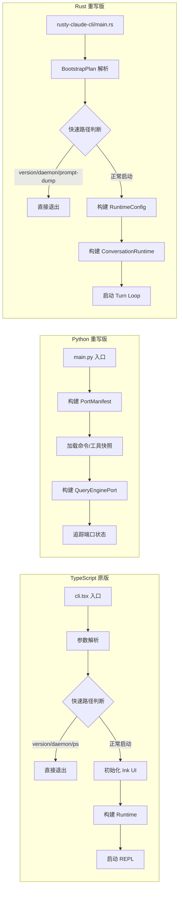

# 第13章 TypeScript 原版 vs Python/Rust 重写版对比

Claw Code 经历了三次主要实现：TypeScript 原版（Claude Code 归档快照）、Python 重写版（`src/` 目录）、Rust 重写版（`rust/crates/` 目录）。三者的代码量、设计目标和实现策略差异很大。

## 13.1 三版规模对比

从代码行数和模块数量看三者定位差异：

| 维度 | TypeScript 原版 | Python 重写版 | Rust 重写版 |
| --- | --- | --- | --- |
| 源码文件数 | 1,902 个 `.ts/.tsx` | 68 个 `.py` | 101 个 `.rs` |
| 代码行数 | ~513,000 | ~1,690 | ~50,300 |
| 顶层目录/模块 | 30 个 `src/` 子目录 | 38 个 `src/` 模块 | 10 个 crate |
| 命令入口数 | 207 | 207（镜像） | 静态注册 |
| 工具入口数 | 184 | 184（镜像） | 特征门控注册 |
| 设计目标 | 产品全功能实现 | 端口追踪骨架 | 高性能本地执行 |

Python 版行数不到 TS 版的 0.4%，Rust 版约为 TS 版的 10%。这不是简单的"精简"，而是三个完全不同的工程定位。

## 13.2 Python 重写版：端口追踪骨架

Python 版的核心不是重新实现功能，而是追踪从 TypeScript 到 Python 的端口进度。`parity_audit.py` 和 `port_manifest.py` 两个文件定义了审计机制。

`parity_audit.py` 中的映射表 `ARCHIVE_ROOT_FILES` 将每个 TS 根文件映射到对应的 Python 文件：

```python
# claw-code/src/parity_audit.py

ARCHIVE_ROOT_FILES = {
    'QueryEngine.ts': 'QueryEngine.py',
    'Task.ts': 'task.py',
    'Tool.ts': 'Tool.py',
    'commands.ts': 'commands.py',
    'context.ts': 'context.py',
    'cost-tracker.ts': 'cost_tracker.py',
    'main.tsx': 'main.py',
    'query.ts': 'query.py',
    'tools.ts': 'tools.py',
    # ... 共 17 个根文件映射
}

ARCHIVE_DIR_MAPPINGS = {
    'bootstrap': 'bootstrap',
    'commands': 'commands.py',
    'coordinator': 'coordinator',
    'hooks': 'hooks',
    'plugins': 'plugins',
    'state': 'state',
    # ... 共 30 个目录映射
}
```

`run_parity_audit()` 函数检查当前 `src/` 目录中是否存在映射目标，计算覆盖率：

```python
# claw-code/src/parity_audit.py

def run_parity_audit() -> ParityAuditResult:
    current_entries = {path.name for path in CURRENT_ROOT.iterdir()}
    root_hits = [target for target in ARCHIVE_ROOT_FILES.values() if target in current_entries]
    dir_hits = [target for target in ARCHIVE_DIR_MAPPINGS.values() if target in current_entries]
    missing_roots = tuple(target for target in ARCHIVE_ROOT_FILES.values() if target not in current_entries)
    # ...
    return ParityAuditResult(
        root_file_coverage=(len(root_hits), len(ARCHIVE_ROOT_FILES)),
        directory_coverage=(len(dir_hits), len(ARCHIVE_DIR_MAPPINGS)),
        total_file_ratio=(current_python_files, int(reference['total_ts_like_files'])),
        command_entry_ratio=(_snapshot_count(COMMAND_SNAPSHOT_PATH), int(reference['command_entry_count'])),
        # ...
    )
```

Python 版的命令和工具不是真正实现，而是从 JSON 快照加载的"镜像条目"：

```python
# claw-code/src/commands.py

@lru_cache(maxsize=1)
def load_command_snapshot() -> tuple[PortingModule, ...]:
    raw_entries = json.loads(SNAPSHOT_PATH.read_text())
    return tuple(
        PortingModule(
            name=entry['name'],
            responsibility=entry['responsibility'],
            source_hint=entry['source_hint'],
            status='mirrored',  # 状态统一为 mirrored
        )
        for entry in raw_entries
    )

PORTED_COMMANDS = load_command_snapshot()
```

`execute_command` 并不真正执行操作，只返回一条"would handle"消息：

```python
# claw-code/src/commands.py

def execute_command(name: str, prompt: str = '') -> CommandExecution:
    module = get_command(name)
    if module is None:
        return CommandExecution(name=name, source_hint='', prompt=prompt, handled=False, ...)
    action = f"Mirrored command '{module.name}' from {module.source_hint} would handle prompt {prompt!r}."
    return CommandExecution(name=module.name, source_hint=module.source_hint, prompt=prompt, handled=True, message=action)
```

`tools.py` 中的 `execute_tool` 也是同样的镜像模式，额外多了一层权限检查框架（`ToolPermissionContext`），为 Rust 版的权限系统做前期探索。

## 13.3 Rust 重写版：Crate 拆分与特征门控

Rust 版按职责拆为 10 个 crate：

| Crate | 职责 | 关键类型 |
| --- | --- | --- |
| `runtime` | 会话、权限、压缩、Turn Loop、Worker | `ConversationRuntime`, `Session`, `PermissionPolicy` |
| `api` | 多 Provider 客户端、SSE 流解析 | `ProviderClient`, `SseParser`, `MessageRequest` |
| `tools` | 内置工具实现（Bash/File/Agent/LSP 等） | `ToolRegistry`, `BashTool`, `FileEditTool` |
| `commands` | 斜杠命令清单与调度 | `CommandManifestEntry`, `CommandSource` |
| `plugins` | 插件生命周期与健康检查 | `PluginManager`, `PluginLifecycle` |
| `rusty-claude-cli` | CLI 入口与启动编排 | `main`, BootstrapPlan 执行 |
| `telemetry` | 使用量统计与上报 | `TokenUsage`, `UsageTracker` |
| `compat-harness` | 上游 TS 清单提取与对比 | `UpstreamPaths`, `ExtractedManifest` |
| `claw-analog` | 代码分析与诊断 | — |
| `claw-rag-service` | 检索增强生成服务 | — |

`compat-harness` crate 承担了与 Python 版 `parity_audit.py` 类似的对比功能，但实现方式不同。它从 TS 版源码目录动态提取命令、工具和启动阶段清单：

```rust
// claw-code/rust/crates/compat-harness/src/lib.rs

pub fn extract_manifest(paths: &UpstreamPaths) -> std::io::Result<ExtractedManifest> {
    let commands_source = fs::read_to_string(paths.commands_path())?;
    let tools_source = fs::read_to_string(paths.tools_path())?;
    let cli_source = fs::read_to_string(paths.cli_path())?;

    Ok(ExtractedManifest {
        commands: extract_commands(&commands_source),
        tools: extract_tools(&tools_source),
        bootstrap: extract_bootstrap_plan(&cli_source),
    })
}
```

`extract_commands` 通过解析 TS 源码中的 `INTERNAL_ONLY_COMMANDS` 数组、`import` 语句和 `feature('...')` 调用来识别命令入口：

```rust
// claw-code/rust/crates/compat-harness/src/lib.rs

pub fn extract_commands(source: &str) -> CommandRegistry {
    let mut entries = Vec::new();
    let mut in_internal_block = false;

    for raw_line in source.lines() {
        let line = raw_line.trim();

        if line.starts_with("export const INTERNAL_ONLY_COMMANDS = [") {
            in_internal_block = true;
            continue;
        }

        if in_internal_block {
            if line.starts_with(']') { in_internal_block = false; continue; }
            if let Some(name) = first_identifier(line) {
                entries.push(CommandManifestEntry {
                    name,
                    source: CommandSource::InternalOnly,
                });
            }
            continue;
        }
        // ... 解析 import 和 feature gate
    }
    dedupe_commands(entries)
}
```

`extract_bootstrap_plan` 通过检测 CLI 源码中是否包含特定的字符串常量来推断启动阶段：

```rust
// claw-code/rust/crates/compat-harness/src/lib.rs

pub fn extract_bootstrap_plan(source: &str) -> BootstrapPlan {
    let mut phases = vec![BootstrapPhase::CliEntry];

    if source.contains("--version") { phases.push(BootstrapPhase::FastPathVersion); }
    if source.contains("startupProfiler") { phases.push(BootstrapPhase::StartupProfiler); }
    if source.contains("--dump-system-prompt") { phases.push(BootstrapPhase::SystemPromptFastPath); }
    if source.contains("--daemon-worker") { phases.push(BootstrapPhase::DaemonWorkerFastPath); }
    // ... 共 11 种快速路径检测
    phases.push(BootstrapPhase::MainRuntime);

    BootstrapPlan::from_phases(phases)
}
```

这种基于字符串匹配的提取方式与 `runtime` crate 中 `BootstrapPhase` 枚举的定义一一对应，确保 Rust 版的启动路径覆盖了 TS 版的所有快速出口。

## 13.4 命令系统实现对比

三版中命令系统的实现策略差异最大。

**TypeScript 版**：207 个命令入口分布在 `commands/` 目录下，每个命令是独立的 `.ts/.tsx` 文件，通过 `commands.ts` 统一导出。

**Python 版**：将 207 个命令条目存在 `commands_snapshot.json` 中，运行时加载为 `PortingModule` 数据类，状态统一标记为 `mirrored`。没有真正的命令实现。

```json
// claw-code/src/reference_data/commands_snapshot.json (前两条)

[
  {
    "name": "add-dir",
    "source_hint": "commands/add-dir/add-dir.tsx",
    "responsibility": "Command module mirrored from archived TypeScript path commands/add-dir/add-dir.tsx"
  },
  {
    "name": "advisor",
    "source_hint": "commands/advisor.ts",
    "responsibility": "Command module mirrored from archived TypeScript path commands/advisor.ts"
  }
]
```

**Rust 版**：在 `commands` crate 中用静态常量数组定义命令清单：

```rust
// claw-code/rust/crates/commands/src/lib.rs

pub struct SlashCommandSpec {
    pub name: &'static str,
    pub aliases: &'static [&'static str],
    pub summary: &'static str,
    pub argument_hint: Option<&'static str>,
    pub resume_supported: bool,
}

const SLASH_COMMAND_SPECS: &[SlashCommandSpec] = &[
    // 静态注册，编译期确定
];
```

`CommandSource` 枚举区分三种来源：

```rust
// claw-code/rust/crates/commands/src/lib.rs

pub enum CommandSource {
    Builtin,       // 内置命令
    InternalOnly,  // 仅内部使用
    FeatureGated,  // 特性门控，需配置开启
}
```

Python 版的 `CommandSource` 不区分这些来源，全部标记为 `mirrored`；Rust 版通过 `CommandSource` 在编译期控制命令可见性。

## 13.5 工具系统实现对比

| 维度 | TypeScript | Python | Rust |
| --- | --- | --- | --- |
| 工具数量 | 184 | 184（镜像） | 特征门控注册 |
| 注册方式 | `tools.ts` 统一导出 | JSON 快照加载 | `ToolRegistry` + 条件编译 |
| 权限控制 | 运行时判断 | `ToolPermissionContext` 框架 | `PermissionEnforcer` + 沙箱 |
| 执行方式 | 直接调用 | 返回"would handle"消息 | `spawn` 进程/LSP/MCP |

Python 版的 `tools.py` 比 `commands.py` 多了一层权限框架探索：

```python
# claw-code/src/tools.py

def execute_tool(name: str, payload: str = '', permission_context: ToolPermissionContext | None = None) -> ToolExecution:
    module = get_tool(name)
    if module is None:
        return ToolExecution(name=name, source_hint='', payload=payload, handled=False, ...)
    if permission_context and permission_context.blocks(module.name):
        return ToolExecution(name=module.name, ..., handled=False,
                            message=f"Permission denied for mirrored tool '{module.name}'.")
    if permission_context:
        scope_decision = permission_context.validate_payload_scope(module.name, payload)
        if not scope_decision.allowed:
            return ToolExecution(name=module.name, ..., handled=False,
                                message=f"Permission denied for mirrored tool '{module.name}': {scope_decision.reason}")
    # ... 实际仍然是镜像返回
```

这段代码的 `ToolPermissionContext.validate_payload_scope` 在 Python 版中只是接口定义，真正的实现在 Rust 版的 `permission_enforcer` 模块中。Python 版的作用是验证接口设计是否合理。

## 13.6 启动流程对比



TypeScript 版和 Rust 版的启动流程结构相似，都有 11 种快速路径检测。Python 版没有快速路径概念，它的入口 `main.py` 主要做端口清单构建：

```python
# claw-code/src/main.py (简化)

from .port_manifest import build_port_manifest
from .query_engine import QueryEnginePort

def main():
    manifest = build_port_manifest()
    engine = QueryEnginePort(manifest=manifest)
    # ... 端口状态查询和追踪
```

`QueryEnginePort` 不是真正的查询引擎，而是端口进度的汇总层：

```python
# claw-code/src/query_engine.py

@dataclass
class QueryEnginePort:
    manifest: PortManifest
    config: QueryEngineConfig = field(default_factory=QueryEngineConfig)
    session_id: str = field(default_factory=lambda: uuid4().hex)
    mutable_messages: list[str] = field(default_factory=list)
```

对应的 Rust 版 `ConversationRuntime` 是完整的 Turn Loop 驱动者：

```rust
// claw-code/rust/crates/runtime/src/conversation.rs (第12章已引用)

pub struct ConversationRuntime<C, T> {
    api_client: C,
    tool_executor: T,
    session: Session,
    // ...
}
```

## 13.7 设计对比

| Claw Code 概念 | TypeScript 实现 | Python 角色 | Rust 实现 | Java 生态对应 |
| --- | --- | --- | --- | --- |
| 模块组织 | `src/` 30 个目录 | `src/` 38 个模块（含骨架） | 10 个 crate | Maven 多模块 |
| 依赖注入 | `tsyringe` / 手动 | 无（dataclass 直传） | 泛型 trait 注入 | Spring IoC |
| 配置加载 | `cosmiconfig` | 无 | `ConfigLoader` + 三层合并 | `application.yml` |
| 错误处理 | 异常 + Result 模式 | 异常 | `Result<T, E>` 全覆盖 | Checked Exception |
| 异步模型 | `async/await` + Promise | 无（同步） | `async/await` + tokio | `CompletableFuture` |
| 工具执行 | 子进程 + Ink UI | 镜像（不执行） | `spawn` + 沙箱隔离 | `ProcessBuilder` |

Python 版在 Java 生态中没有直接对应物。它不像 Spring Boot 那样是完整应用，而更接近一个"端口清单生成器"——类似于用 Python 脚本解析 Java 源码的 AST 来生成迁移报告。

Rust 版的 crate 组织对应 Maven 多模块：每个 crate 是一个独立编译单元，有明确的依赖边界。`runtime` crate 对应核心模块，`api` 对应 HTTP 客户端层，`tools` 对应工具层，`commands` 对应命令层——这与 Spring Boot 项目中 `controller`/`service`/`repository` 的分层思路一致。

## 小结

- TypeScript 原版：1,902 文件 / ~513K 行，全功能实现，包含 Ink UI、远程会话、Chrome MCP 等完整产品能力
- Python 重写版：68 文件 / ~1.7K 行，端口追踪骨架，从 JSON 快照加载 207 命令 + 184 工具条目，不执行实际操作
- Rust 重写版：101 文件 / ~50K 行，10 个 crate 拆分，完整的 Turn Loop、权限系统、会话持久化和多 Provider 支持
- Python 版的核心文件：`parity_audit.py`、`port_manifest.py`、`commands.py`、`tools.py`、`query_engine.py`
- Rust 版通过 `compat-harness` crate 实现与 TS 版的清单对比，`extract_manifest` 动态解析 TS 源码获取命令、工具和启动阶段
- 三版的关系：TS 是产品基准，Python 是端口进度追踪工具，Rust 是面向本地高性能场景的重写实现
