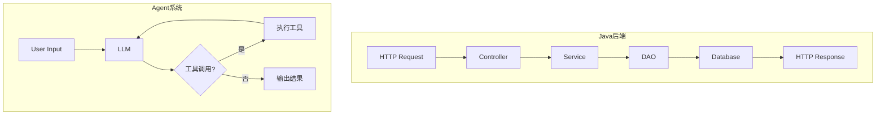

# 第14章 从 Java 工程师到 Agent 工程师的思维转型

前 13 章分析了 claw-code 的源码实现。本章不再追踪代码，而是梳理 Java 后端工程师理解 Agent 系统时需要的思维转变。

## 14.1 确定性 vs 概率性

Java 后端系统的核心假设是确定性：相同的输入必定产生相同的输出。一个 `UserController.createUser()` 方法，传相同的参数，执行相同的 SQL，写入相同的数据。单元测试可以断言精确的返回值。

Agent 系统的底层是 LLM，输出是概率性的。相同的 prompt，两次调用可能返回不同的代码、不同的工具选择、不同的执行路径。claw-code 的 Turn Loop（第6章）每轮都把 LLM 的响应当作"建议"而非"命令"——工具调用的结果会反馈给 LLM，由它决定下一步。这本质上是概率系统驱动的控制流。



Java 后端的控制流在编译时就确定了（方法调用链）。Agent 系统的控制流在运行时由 LLM 动态决定。这意味着 Agent 工程师无法通过阅读代码预知执行路径，只能理解"系统有哪些可能的路径"以及"每条路径的触发条件"。

## 14.2 请求-响应 vs Turn Loop

Java 后端的基本模式是请求-响应：一个 HTTP 请求进来，经过拦截器链、Controller、Service、DAO，最终返回响应。整个过程是线性的、一次性的。

Agent 系统的基本模式是 Turn Loop（第6章分析过的 `query_engine.py`）：

```python
# claw-code/src/query_engine.py

class QueryEngine:
    def submit(self, prompt: str) -> None:
        self.conversation.add_user_message(prompt)
        self._turn_loop()

    def _turn_loop(self) -> None:
        while True:
            response = self.llm.chat(self.conversation.messages)
            if response.has_tool_calls():
                self.conversation.add_assistant_message(response)
                for call in response.tool_calls:
                    result = self.tools.execute(call)
                    self.conversation.add_tool_result(call, result)
                # 继续循环，让 LLM 看到工具结果后决定下一步
            else:
                self.conversation.add_assistant_message(response)
                break  # LLM 没有调用工具，Turn Loop 结束
```

关键区别：HTTP 请求处理完就结束了。Turn Loop 在 LLM 调用工具后不会结束，而是把工具结果喂回 LLM，启动新一轮。循环的终止条件不是"代码执行完毕"，而是"LLM 决定不再调用工具"。

对应关系：Spring MVC 的 `DispatcherServlet` 是一次性的请求分发器。claw-code 的 `QueryEngine` 是一个循环，更像 Spring Batch 的 `ItemReader` → `ItemProcessor` → `ItemWriter` 循环，但循环的继续/终止由 LLM 而非数据源决定。

## 14.3 依赖注入 vs 工具池

Spring 的 IoC 容器在启动时扫描所有 `@Component`，通过构造器注入或字段注入组装依赖。依赖关系是静态的、声明式的。

claw-code 的 `ToolPool`（第5章）在启动时注册所有内置工具，但工具的选择和使用是动态的：

```python
# claw-code/src/tool_pool.py

class ToolPool:
    def __init__(self, config: Config):
        self.tools: dict[str, Tool] = {}
        self._register_builtin_tools(config)

    def get_tool(self, name: str) -> Tool | None:
        return self.tools.get(name)

    def execute(self, call: ToolCall) -> ToolResult:
        tool = self.get_tool(call.name)
        if tool is None:
            return ToolResult(error=f"Unknown tool: {call.name}")
        return tool.run(call.arguments)
```

工具池注册了工具，但具体调用哪个工具、传什么参数，由 LLM 在运行时决定。这相当于 Spring 容器里有所有 Bean，但哪个 Bean 被调用不由 `@Autowired` 决定，而由一个外部模型在运行时动态选择。

Agent 工程师的设计关注点从"如何组装依赖"转向"如何描述工具让 LLM 能正确选择"。工具的 JSON Schema 定义（name、description、parameters）相当于 Bean 的接口契约，但它面向的消费者不是编译器，而是 LLM。

## 14.4 权限模型：编译时 vs 运行时

Spring Security 的权限检查通过注解声明：

```java
@PreAuthorize("hasRole('ADMIN')")
public void deleteUser(Long id) { ... }
```

权限规则在编译时确定，运行时按固定规则拦截。

claw-code 的权限系统（第7章）是运行时动态的。`PermissionMode` 有三个级别：

```rust
// claw-code/rust/crates/runtime/src/policy_engine.rs

pub enum PermissionMode {
    ReadOnly,         // 只读，不允许任何写操作
    WorkspaceWrite,   // 只允许写工作区目录
    DangerFullAccess, // 完全访问
}
```

权限模式可以在启动时通过 `--permission-mode` 参数指定，也可以在运行中通过 LLM 的请求动态调整。每次工具调用前，`PolicyEngine` 会检查目标路径是否在当前模式允许的范围内。

Java 工程师的习惯是在代码层面声明权限（注解、配置文件）。Agent 工程师需要理解权限是运行时的策略链，工具调用在执行前经过多层检查，且策略可以根据上下文变化。

## 14.5 状态管理：数据库 vs 会话上下文

Java 后端的状态主要存在数据库中。HTTP 请求是无状态的，会话状态通过 Session 或 JWT 在请求间传递，但核心业务状态持久化在数据库。

Agent 系统的状态存在于会话上下文（Conversation）中。claw-code 的 `conversation.rs`（第9章）维护了一个消息列表：

```rust
// claw-code/rust/crates/runtime/src/conversation.rs

pub struct Conversation {
    pub messages: Vec<Message>,    // 完整对话历史
    pub system_prompt: String,     // 系统提示词（含 CLAUDE.md）
    pub tool_results: Vec<ToolResult>, // 待处理的工具结果
    pub cwd: PathBuf,              // 当前工作目录
}
```

整个会话的状态就是 `messages` 数组。每一轮 Turn Loop 都把完整的 messages 发给 LLM。上下文窗口（Context Window）限制了 messages 的总长度，超出时需要压缩（第12章的 `compact.rs`）。

这带来了一个 Java 工程师不习惯的问题：状态膨胀。在 Java 后端，一个用户的操作历史可以分散在多张表中，按需查询。在 Agent 系统中，历史信息全部在内存中的 messages 数组里，每次调用 LLM 都要全量发送。上下文管理成为一个核心工程问题。

## 14.6 测试：断言 vs 评估

Java 后端的测试是确定性的。`assertEquals(expected, actual)` 断言精确值。Mock 框架（Mockito）模拟外部依赖，保证测试可重复。

Agent 系统的测试面临根本性困难：LLM 输出不确定。同样的输入两次执行可能得到不同的代码、不同的工具调用序列。claw-code 的测试策略分两层：

第一层是确定性的单元测试，测试非 LLM 部分。比如 `ConfigLoader` 的三层合并、`ToolPool` 的工具注册、`PolicyEngine` 的权限检查。这些和 Java 单元测试没有区别。

第二层是兼容性测试，验证 Python 版和 Rust 版的行为一致性。`compat-harness` 目录下的测试用例比较两个实现的输出：

```rust
// claw-code/rust/crates/compat-harness/src/lib.rs

pub struct CompatCase {
    pub name: String,
    pub input: String,
    pub expected_python_output: String,
    pub expected_rust_output: String,
}
```

Agent 工程师需要接受一个现实：LLM 驱动的行为无法用传统断言测试。测试策略转向"验证工具链正确性"和"评估输出质量"（评估而非断言），而不是"验证 LLM 说了什么"。

## 设计对比

| 维度 | Java 后端 | Agent 系统 |
| --- | --- | --- |
| 控制流 | 编译时确定（方法调用链） | 运行时动态（LLM 决定路径） |
| 基本模式 | 请求-响应（一次性） | Turn Loop（循环到 LLM 停止） |
| 依赖组装 | IoC 容器静态注入 | 工具池注册，LLM 动态选择 |
| 权限 | 注解声明，编译时固定 | 运行时策略链，可动态调整 |
| 状态 | 数据库持久化 | 会话上下文数组，受 Token 限制 |
| 测试 | 精确断言 | 工具链断言 + 输出评估 |

## 小结

从 Java 工程师到 Agent 工程师的核心转变不是学新语言，而是接受"控制流由概率模型驱动"这个前提。具体的思维转变包括：从线性执行到循环驱动、从静态注入到动态选择、从数据库状态到上下文窗口管理、从精确断言到质量评估。claw-code 的源码结构（Bootstrap → ToolPool → Turn Loop → PolicyEngine → Conversation）在后续章节中逐步展现了这些转变的具体实现。
