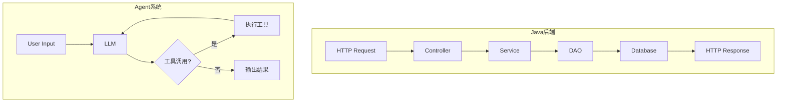

# 第14章 从 Java 工程师到 Agent 工程师的思维转型

前 13 章分析了 claw-code 的源码实现，其中第 4-11 章的代码解析刻意去掉了 Java 类比，聚焦于 claw-code 自身的设计逻辑。本章把那些 Java 类比集中收拢，按章节顺序逐一对照，帮助 Java 后端工程师建立从已有知识到 Agent 系统的认知桥梁。

## 14.1 确定性 vs 概率性

Java 后端系统的核心假设是确定性：相同的输入必定产生相同的输出。一个 `UserController.createUser()` 方法，传相同的参数，执行相同的 SQL，写入相同的数据。单元测试可以断言精确的返回值。

Agent 系统的底层是 LLM，输出是概率性的。相同的 prompt，两次调用可能返回不同的代码、不同的工具选择、不同的执行路径。claw-code 的 Turn Loop（第6章）每轮都把 LLM 的响应当作"建议"而非"命令"——工具调用的结果会反馈给 LLM，由它决定下一步。这本质上是概率系统驱动的控制流。



Java 后端的控制流在编译时就确定了（方法调用链）。Agent 系统的控制流在运行时由 LLM 动态决定。这意味着 Agent 工程师无法通过阅读代码预知执行路径，只能理解"系统有哪些可能的路径"以及"每条路径的触发条件"。

## 14.2 请求-响应 vs Turn Loop

Java 后端的基本模式是请求-响应：一个 HTTP 请求进来，经过拦截器链、Controller、Service、DAO，最终返回响应。整个过程是线性的、一次性的。

Agent 系统的基本模式是 Turn Loop（第6章分析过的 `query_engine.py`）：

```python
# claw-code/src/query_engine.py

class QueryEngine:
    def submit(self, prompt: str) -> None:
        self.conversation.add_user_message(prompt)
        self._turn_loop()

    def _turn_loop(self) -> None:
        while True:
            response = self.llm.chat(self.conversation.messages)
            if response.has_tool_calls():
                self.conversation.add_assistant_message(response)
                for call in response.tool_calls:
                    result = self.tools.execute(call)
                    self.conversation.add_tool_result(call, result)
                # 继续循环，让 LLM 看到工具结果后决定下一步
            else:
                self.conversation.add_assistant_message(response)
                break  # LLM 没有调用工具，Turn Loop 结束
```

关键区别：HTTP 请求处理完就结束了。Turn Loop 在 LLM 调用工具后不会结束，而是把工具结果喂回 LLM，启动新一轮。循环的终止条件不是"代码执行完毕"，而是"LLM 决定不再调用工具"。

对应关系：Spring MVC 的 `DispatcherServlet` 是一次性的请求分发器。claw-code 的 `QueryEngine` 是一个循环，更像 Spring Batch 的 `ItemReader` → `ItemProcessor` → `ItemWriter` 循环，但循环的继续/终止由 LLM 而非数据源决定。

## 14.3 依赖注入 vs 工具池

Spring 的 IoC 容器在启动时扫描所有 `@Component`，通过构造器注入或字段注入组装依赖。依赖关系是静态的、声明式的。

claw-code 的 `ToolPool`（第5章）在启动时注册所有内置工具，但工具的选择和使用是动态的：

```python
# claw-code/src/tool_pool.py

class ToolPool:
    def __init__(self, config: Config):
        self.tools: dict[str, Tool] = {}
        self._register_builtin_tools(config)

    def get_tool(self, name: str) -> Tool | None:
        return self.tools.get(name)

    def execute(self, call: ToolCall) -> ToolResult:
        tool = self.get_tool(call.name)
        if tool is None:
            return ToolResult(error=f"Unknown tool: {call.name}")
        return tool.run(call.arguments)
```

工具池注册了工具，但具体调用哪个工具、传什么参数，由 LLM 在运行时决定。这相当于 Spring 容器里有所有 Bean，但哪个 Bean 被调用不由 `@Autowired` 决定，而由一个外部模型在运行时动态选择。

Agent 工程师的设计关注点从"如何组装依赖"转向"如何描述工具让 LLM 能正确选择"。工具的 JSON Schema 定义（name、description、parameters）相当于 Bean 的接口契约，但它面向的消费者不是编译器，而是 LLM。

## 14.4 权限模型：编译时 vs 运行时

Spring Security 的权限检查通过注解声明：

```java
@PreAuthorize("hasRole('ADMIN')")
public void deleteUser(Long id) { ... }
```

权限规则在编译时确定，运行时按固定规则拦截。

claw-code 的权限系统（第7章）是运行时动态的。`PermissionMode` 有五个级别：

```rust
// claw-code/rust/crates/runtime/src/permissions.rs

pub enum PermissionMode {
    ReadOnly,
    WorkspaceWrite,
    DangerFullAccess,
    Prompt,
    Allow,
}
```

权限模式可以在启动时通过 `--permission-mode` 参数指定，也可以在运行中通过 LLM 的请求动态调整。每次工具调用前，`PermissionPolicy` 会检查目标路径是否在当前模式允许的范围内。

Java 工程师的习惯是在代码层面声明权限（注解、配置文件）。Agent 工程师需要理解权限是运行时的策略链，工具调用在执行前经过多层检查，且策略可以根据上下文变化。

## 14.5 状态管理：数据库 vs 会话上下文

Java 后端的状态主要存在数据库中。HTTP 请求是无状态的，会话状态通过 Session 或 JWT 在请求间传递，但核心业务状态持久化在数据库。

Agent 系统的状态存在于会话上下文（Conversation）中。claw-code 的 `conversation.rs`（第9章）维护了一个消息列表：

```rust
// claw-code/rust/crates/runtime/src/conversation.rs

pub struct Conversation {
    pub messages: Vec<Message>,    // 完整对话历史
    pub system_prompt: String,     // 系统提示词（含 CLAUDE.md）
    pub tool_results: Vec<ToolResult>, // 待处理的工具结果
    pub cwd: PathBuf,              // 当前工作目录
}
```

整个会话的状态就是 `messages` 数组。每一轮 Turn Loop 都把完整的 messages 发给 LLM。上下文窗口（Context Window）限制了 messages 的总长度，超出时需要压缩（第9章的 `compact.rs`）。

这带来了一个 Java 工程师不习惯的问题：状态膨胀。在 Java 后端，一个用户的操作历史可以分散在多张表中，按需查询。在 Agent 系统中，历史信息全部在内存中的 messages 数组里，每次调用 LLM 都要全量发送。上下文管理成为一个核心工程问题。

## 14.6 测试：断言 vs 评估

Java 后端的测试是确定性的。`assertEquals(expected, actual)` 断言精确值。Mock 框架（Mockito）模拟外部依赖，保证测试可重复。

Agent 系统的测试面临根本性困难：LLM 输出不确定。同样的输入两次执行可能得到不同的代码、不同的工具调用序列。claw-code 的测试策略分两层：

第一层是确定性的单元测试，测试非 LLM 部分。比如 `ConfigLoader` 的三层合并、`ToolPool` 的工具注册、`PermissionPolicy` 的权限检查。这些和 Java 单元测试没有区别。

第二层是兼容性测试，验证 Python 版和 Rust 版的行为一致性。`compat-harness` 目录下的测试用例比较两个实现的输出：

```rust
// claw-code/rust/crates/compat-harness/src/lib.rs

pub struct CompatCase {
    pub name: String,
    pub input: String,
    pub expected_python_output: String,
    pub expected_rust_output: String,
}
```

Agent 工程师需要接受一个现实：LLM 驱动的行为无法用传统断言测试。测试策略转向"验证工具链正确性"和"评估输出质量"（评估而非断言），而不是"验证 LLM 说了什么"。

## 14.7 第4章对照：启动流程

claw-code 的命令行参数声明用 Python 的 `argparse`，和 Java 的 CLI 库 Picocli 几乎一样——Picocli 用 `@Parameters` 和 `@Option` 注解，argparse 用 `add_argument` 方法调用，本质都是把命令行字符串映射为类型化的参数对象。

命令分发方面，Spring Shell 用 `@ShellComponent` + `@ShellMethod` 注解注册命令，Spring MVC 用 `@RequestMapping` 路由到 Controller 方法。两者都是声明式的——命令和处理逻辑的绑定关系由框架在运行时通过反射建立。Python 版的 if-elif 链是命令式的——绑定关系在代码中显式写出来。前者更优雅，后者更透明。

Rust 的枚举匹配穷尽性在 Java 中也有对应。Java 的 `switch` 语句在 `switch` 表达式（Java 14+）中也是穷尽的，但传统的 `switch` 语句不强制。Sealed class（Java 17+）配合 `switch` 表达式可以实现和 Rust 枚举匹配类似的安全性。

Bootstrap 七阶段与 Spring Boot 的启动过程在结构上高度相似。Spring Boot 的启动分为：准备 `Environment` → 创建 `ApplicationContext` → 注册 Bean 定义 → 初始化单例 Bean → 启动内嵌容器 → 执行 `ApplicationRunner`。claw-code 的 prefetch 阶段对应 Spring Boot 的 `Environment` 准备阶段——都在加载配置后才开始初始化核心组件。

延迟初始化方面，Spring Boot 的 `@Lazy` 注解是按 Bean 粒度的——每个 Bean 可以独立声明 `@Lazy`。claw-code 的延迟初始化是按 trust 级别批量控制的——一个 `trusted` 布尔值决定四个组件的开关。这是因为 claw-code 的安全模型更粗粒度：要么完全可信（本地开发），要么完全不可信（CI 环境），中间状态很少需要。

配置层级上，claw-code 的三层配置（User/Project/Local）对应 Spring Boot 的多 profile 配置：

| claw-code 层级 | Spring Boot 对应 | 说明 |
| --- | --- | --- |
| User 级 `~/.claw/settings.json` | `application.properties` 在 `~/.config/` 下 | 用户在所有项目中共享 |
| Project 级 `./.claw/settings.json` | `src/main/resources/application.properties` | 项目团队共享，提交 git |
| Local 级 `./.claw/settings.local.json` | `application-local.properties` + `spring.profiles.active=local` | 个人覆盖，不提交 git |

`deep_merge_objects` 的递归合并和 Spring Boot 的配置覆盖机制一致——`application-{profile}.properties` 中的值覆盖 `application.properties` 中的同名键。差异在于 Spring 是扁平覆盖，claw-code 是递归合并。

`ModelProvenance` 四级溯源在 Spring 中对应 `@Value` 的来源链。Spring 不主动暴露属性来源，claw-code 显式记录每个配置值的来源文件和合并路径。`emit_config_warning_once` 的去重机制对应 Spring 的 `DeprecationLogger`，两者都解决重复警告问题。

trust gate + deferred init 对应 Spring 的 `@ConditionalOnProperty`——批量禁用 vs 逐 Bean 条件装配。

## 14.8 第5章对照：工具系统

`ToolDefinition` 结构在 Java 中相当于定义了一个接口 `interface ToolDefinition { String getName(); String getPurpose(); }`，然后用一个 record 或 immutable class 实现。Rust 的 `&'static str` 比 Java 的 `private final String name` 更进一步——它是一个指向程序只读数据段的引用，零分配开销。

`ToolPool` 的缓存机制在 Java 中等价于 Guava 的 `CacheBuilder.newBuilder().maximumSize(1)` 或简单的 `private volatile Tuple cached;` + double-checked locking。

`GlobalToolRegistry` 的三层注册（builtin → plugin → runtime）在 Java 中相当于三层 Bean 注册：内置工具像 Spring Boot 的自动配置 Bean（框架内置），插件工具像通过 `@ComponentScan` 扫描到的 Bean（外部贡献），运行时工具像通过 `BeanDefinitionRegistry.registerBeanDefinition()` 动态注册的 Bean。冲突检测对应 Spring 的 `BeanDefinitionStoreException`——两个 Bean 定义同名时报错。

`ToolSearch` 的打分排序在 Java 中相当于 `Comparator.comparingDouble(ToolSpec::score).reversed()` + `stream().limit(n)`。

`classify_bash_permission` 的命令分类在 Java 中相当于一个 `switch` 语句按首 token 分发，但 Rust 的模式匹配更简洁。`is_read_only_command` 的 shell 元字符检测在 Java 中相当于 `String.containsAny(command, SHELL_METACHARS)`，但 Java 标准库没有 `containsAny`，需要自己实现或用 Apache Commons。

## 14.9 第6章对照：Turn Loop

`QueryEngineConfig` 的 frozen dataclass 在 Java 中等价于 `public final class QueryEngineConfig` + 所有字段 `final` + 全参构造器。`TurnResult` 的 `matched_commands` 用 tuple 存储在 Java 中等价于 `List.copyOf(matched_commands)` 创建不可变列表（Java 10+）。

`TranscriptStore` 的可变状态在 Java 中等价于一个有状态的 Spring `@Component`（scope=prototype），每次注入都创建新实例。`mutable_messages` 是一个 `ArrayList<String>`，`append()` 方法向其添加元素。

`from_saved_session` 工厂方法从持久化的会话恢复状态，在 Java 中这等价于从数据库反序列化一个实体，创建新的 ArrayList 防止修改持久层缓存。

`stream_submit_message` 的 generator（`yield`）实现了惰性流式输出。Java 的 generator 更轻量——不需要额外的 Stream API 或 Reactor 框架，Python 的 generator 原生就是语言级的协程。

Rust 的 `ApiClient` 和 `ToolExecutor` trait 在 Java 中等价于接口：

```java
interface ApiClient {
    List<AssistantEvent> stream(ApiRequest request) throws RuntimeError;
}

interface ToolExecutor {
    String execute(String toolName, String input) throws ToolError;
}
```

Java 用接口定义行为契约，Rust 用 trait。差异在于 Rust 的 trait 可以有关联类型和泛型约束，且 trait 的分发可以是静态的（编译期单态化）或动态的（`dyn Trait`）。Java 接口只有动态分发（虚方法调用）。

`ConversationRuntime<C, T>` 的泛型设计在 Java 中等价于 `class ConversationRuntime<C extends ApiClient, T extends ToolExecutor>`。Rust 的泛型通过单态化在编译期生成特化代码，零运行时开销——Java 的泛型通过类型擦除实现，运行时无类型信息。

`StaticToolExecutor` 和 `ScriptedApiClient` 在 Java 中等价于测试用的 Mock 对象（Mockito 的 `mock(ApiClient.class)`），但 Rust 的实现是显式的结构体而非动态代理。

`maybe_auto_compact` 的 token 阈值检查在 Java 中相当于一个 `if (tokenCount > threshold)` 条件判断，`compact_session` 的摘要生成在 Java 中相当于把消息列表序列化为 JSON 再截断。

`SessionTracer` 的 `tracing::info!` 在 Java 中等价于 SLF4J 的 `logger.info()`，`Arc<Mutex<Vec<TraceEntry>>>` 等价于 `Collections.synchronizedList(new ArrayList<>())`。

## 14.10 第7章对照：权限系统

`PermissionMode` 枚举的 `as_str()` 方法在 Java 中等价于枚举的 `toString()` 方法或 `@JsonValue` 注解。

`PermissionPolicy` 的 `from_iterables` 工厂方法在 Java 中等价于 `List.copyOf()` 创建不可变列表。`with_tool_requirement` 用构建器模式添加工具权限要求。

`PermissionPrompter` 对应一个 Java 回调接口：

```java
interface PermissionPrompter {
    PermissionPromptDecision decide(PermissionRequest request);
}
```

`PermissionOutcome` 枚举在 Java 中对应 Jackson 的 `@JsonTypeInfo(use = NAME, include = PROPERTY, property = "outcome")`。

`PermissionRule` 的解析（`parse` 方法）在 Java 中等价于正则表达式 `Pattern.compile("([^(]+)\\(([^)]+)\\)")` + `Matcher.matches()`。

`is_within_workspace` 的词法路径规范化在 Java 中等价于 `Paths.get(path).normalize()`，但 Rust 的实现不访问文件系统，因此即使目标路径不存在也能正确判断。`lexically_normalize` 折叠 `.` 和 `..` 的逻辑在 Java 中相当于 `Path.normalize()`，但 Rust 的实现是纯字符串操作。

`is_read_only_command` 的 shell 元字符检测在 Java 中相当于 `command.indexOf(';') >= 0 || command.indexOf('|') >= 0 || ...` 的链式检查。`SHELL_METACHARS` 数组在 Java 中等价于 `private static final char[] SHELL_METACHARS = {';', '|', '&', ...}`。

## 14.11 第8章对照：钩子系统

钩子系统从 Java 工程师的视角看，本质上就是 AOP（面向切面编程）——`PreToolUse` 相当于 `@Before`，`PostToolUse` 相当于 `@AfterReturning`，`PostToolUseFailure` 相当于 `@AfterThrowing`。

`PluginHooks` 的 `#[serde(rename = "PreToolUse", default)]` 属性在 Java 中等价于 Jackson 的 `@JsonProperty("PreToolUse")` + `@JsonSetter(nulls = Nulls.SKIP)` 组合——让 Rust 的 snake_case 字段能直接反序列化 JSON 里的 PascalCase 键名。

`resolve_hook_entry` 的路径解析逻辑在 Java 中等价于 `Paths.get(root, entry).toString()`，但 Rust 的实现区分了字面命令和文件路径。`validate_hook_paths` 的校验在 Java 中相当于 `Files.exists(path)` 检查。

`try_fold` 是 Rust 迭代器的带错误传播的折叠操作，等价于 Java 的 `stream().reduce()` 但支持 `Result` 类型的短路。`merged_with` 按触发时机分别拼接三个 `Vec`，在 Java 中相当于 `Stream.concat(streamA, streamB).collect(toList())`。

退出码协议在 Java 中等价于 `Process.waitFor()` + `exitValue()` 的 switch 判断。`shell_command` 的跨平台分支在 Java 中等价于 `System.getProperty("os.name")` 判断 + `ProcessBuilder` 配置。

`HookAbortSignal` 的 `Arc<AtomicBool>` 在 Java 中等价于 `AtomicBoolean`，`Ordering::Release/Acquire` 对应 `AtomicBoolean` 的 volatile 语义。`output_with_stdin` 的轮询循环在 Java 中相当于 `Process.waitFor(timeout, TimeUnit.MILLISECONDS)` + `Process.destroyForcibly()`。

`HookProgressReporter` trait 在 Java 中等价于一个回调接口：

```java
interface HookProgressReporter {
    void onEvent(HookProgressEvent event);
}
```

`HookRunResult` 的 `permission_override` 和 `updated_input` 在 Java 中等价于 `Optional<PermissionOverride>` 和 `Optional<String>`。`parse_hook_output` 的 JSON 解析在 Java 中相当于 Jackson 的 `ObjectMapper.readValue(stdout, HookOutput.class)`，但 Rust 的实现手动检查每个字段而非一次性反序列化。

插件层与运行时层的分层设计类似于 Spring AOP 的两级设计：`Advisor`（切面声明）定义"在什么时机执行什么"，`MethodInterceptor`（拦截器实现）负责实际的执行控制。

## 14.12 第9章对照：会话管理

`Session` 在 Java 中相当于 `HttpSession`，`SessionStore` 相当于 `SessionRepository`。JSONL 增量追加相当于数据库的 WAL（Write-Ahead Log），自动压缩相当于数据库的 Checkpoint。

`StoredSession` 的 frozen dataclass 在 Java 中相当于用 `final` 修饰所有字段 + 无 setter 的 DTO 类。`HistoryLog` 的 `field(default_factory=list)` 在 Java 中相当于 `private List<HistoryEvent> events = new ArrayList<>()`。

`Session` 手动实现的 `PartialEq` 在 Java 中相当于在 `equals()` 方法中只比较业务字段，排除 `transient` 的文件路径字段。`with_persistence_path` 的 Builder 方法在 Java 中相当于返回 `this` 的链式 setter。

`MessageRole` 枚举在 Java 中对应 `enum MessageRole { System, User, Assistant, Tool }`。`ContentBlock` 枚举在 Java 中需要用 sealed class + record 的组合才能表达（Java 17+），因为每个变体有不同的字段。

`generate_session_id` 的 `AtomicU64::fetch_add` 在 Java 中相当于 `AtomicLong.getAndIncrement()`。`current_time_millis` 的 CAS 循环在 Java 中相当于 `AtomicLong.compareAndSet(expected, update)` 的时间戳单调递保证。

`write_atomic` 的"先写临时文件再 rename"策略在 Java 中相当于 `Files.write(tempPath, bytes)` + `Files.move(tempPath, targetPath, StandardCopyOption.ATOMIC_MOVE)`。日志轮转机制与 Log4j 的 `RollingFileAppender` 概念相同。

`workspace_fingerprint` 的 FNV-1a 哈希在 Java 中可以用 `long` 类型手写实现，或使用 Guava 的 `Hashing.fnv1a_64()`。`SessionStore` 的 workspace 隔离类似于多租户场景按 tenant ID 分库分表。

`Session::fork` 在 Java 中相当于原型模式（Prototype Pattern）的 `clone()` + 修改部分字段。`SessionHeartbeat` 的四级存活状态在 Java 中相当于 Spring Boot Actuator 的 `HealthIndicator`。

| claw-code 概念 | Java 生态对应 |
| --- | --- |
| `Session` | `HttpSession`（进程内状态载体） |
| `SessionStore` | `SessionRepository`（按 workspace 隔离） |
| JSONL 增量追加 | WAL（Write-Ahead Log） |
| `write_atomic` | 事务日志的原子提交（临时文件 + rename） |
| 日志轮转 | Log4j 的 `RollingFileAppender` |
| `Compaction` | 数据库 Checkpoint / 日志压缩 |
| `workspace_fingerprint` | 多租户场景按 tenant ID 分库分表 |
| `Session::fork` | 原型模式（Prototype Pattern） |
| `SessionHeartbeat` | Spring Boot Actuator 的 `HealthIndicator` |

## 14.13 第10章对照：协调器

`TaskRegistry` 相当于 `ThreadPoolExecutor` + `FutureTask` 的组合。`TaskStatus` 的六状态状态机对应 `FutureTask.State`（NEW → RUNNING → COMPLETED/CANCELLED），但 claw-code 多了 `Blocked` 状态。

`Arc<Mutex<RegistryInner>>` 在 Java 中相当于一个线程安全的 `ConcurrentHashMap`，但 Rust 的 `Mutex` 是全量锁定而非分段锁定。`.expect("registry lock poisoned")` 处理了 mutex 中毒——Java 没有这个概念，因为 Java 的 `synchronized` 不会在线程死亡时"中毒"。

`LaneBoard` 的三列看板（Active/Blocked/Finished）在 Java 中相当于 Kanban 风格的任务看板。`LaneHeartbeat` 的三级新鲜度判断与 `SessionHeartbeat` 逻辑相同。

`PolicyEngine` 相当于 Drools 规则引擎。`PolicyRule` 对应 Drools 的 `rule "name" when condition then action` 语法。`PolicyCondition::And/Or` 对应 Drools 的 `and`/`or` 条件组合。`PolicyAction::Chain` 对应 Composite Action 模式——`flatten_into` 的递归展开就是组合模式的经典实现。

`PolicyEngine::evaluate_with_events` 的全量遍历（非短路）意味着多条规则可以同时匹配并产生多个动作。这在 Java 的 Drools 中也是默认行为——所有匹配的规则都会触发。

`LaneContext` 的 Builder 模式在 Java 中相当于 `LaneContext.builder().laneId("...").greenLevel(3).build()`。`LaneEventName` 的 21 种事件对应领域事件（Domain Event），`LaneFailureClass` 的 10 种失败分类对应异常分类体系。

`WorkerBoot` 的七状态状态机类似于 Spring Security 的过滤器链——每个请求必须通过所有安全过滤器才能到达业务逻辑。`WorkerFailureKind` 的 `StartupNoEvidence` 是一个独特的失败类型——Worker 声称启动但无法证明，这种"静默启动"在 Java 生态中没有直接对应物。

核心差异在于调度决策的制定者。Java 的 Saga 或工作流引擎（如 Camunda）将拆分策略、并发度和失败重试逻辑写在代码或 BPMN 流程图中。claw-code 的 `PolicyEngine` 则将条件判断和动作选择都编码在规则中——规则本身是声明式的，但规则的评估和执行是确定性的。这与原版 Claude Code 的"LLM 作为调度引擎"有本质区别。

| claw-code 概念 | Java 生态对应 |
| --- | --- |
| `TaskRegistry` | `ThreadPoolExecutor` + `FutureTask` |
| `Task` | `FutureTask<TaskOutput>` |
| `TaskStatus` | `FutureTask.State` |
| `LaneBoard` | Kanban 看板 |
| `PolicyEngine` | Drools 规则引擎 |
| `PolicyRule` | Drools 的 `rule when then` |
| `PolicyAction::Chain` | Composite Action 模式 |
| `LaneContext` | `ProcessContext` / `ExecutionContext` |
| `LaneEventName` | 领域事件（Domain Event） |
| `WorkerBoot` 状态机 | Spring Security 过滤器链 |

## 14.14 第11章对照：插件与命令扩展

Rust 的插件系统类似于 OSGi 或 SPI 机制——插件通过清单文件声明能力，框架负责发现、加载和生命周期管理。`PluginKind` 的三类来源（Builtin/Bundled/External）在 Java 中对应三种类加载方式：内置类（bootstrap classpath）、依赖 JAR（应用 classpath）、外部加载的 JAR（自定义 ClassLoader）。

`PluginManifest` 相当于一个插件描述符接口（如 OSGi 的 `Bundle-Manifest`），用注解或 XML 声明插件的能力和需求。`PluginPermission` 和 `PluginToolPermission` 的 `PartialOrd, Ord` trait 在 Java 中相当于 `Comparable` 接口——让权限级别可以比较大小。

`PluginTool::execute` 的子进程模型在 Java 中等价于 `ProcessBuilder` + `Process.waitFor()` + `InputStream` 读取。环境变量传递对应 `ProcessBuilder.environment().put("KEY", "value")`。

`PluginLifecycle` 的 Init/Shutdown 命令在 Java 中对应 `@PostConstruct` 和 `@PreDestroy` 注解——生命周期回调在特定时机自动触发。

`PluginManager::install` 的流程在 Java 中相当于 Maven 的 `install` 目标——下载依赖、解析 POM、复制到本地仓库、更新索引。`sanitize_plugin_id` 的路径清洗在 Java 中相当于 `String.replaceAll("[/\\\\@:]", "-")`。

`detect_claude_code_manifest_contract_gaps` 的负向拒绝设计在 Java 生态里不常见——Java 的 SPI 通常只做正向发现，不做负向拒绝。这是一个刻意的设计取舍，避免插件成为绕过其他子系统边界的隐式入口。

`aggregated_tools` 的 BTreeMap 去重在 Java 中相当于 `Map.putIfAbsent` 返回旧值来检测冲突，类似于 Spring 的 `BeanDefinitionStoreException`。

`SlashCommand` 枚举在 Java 中需要用 sealed class + record 的组合才能表达（因为每个变体有不同的字段结构），或者用 Command 模式的 `Map<String, CommandHandler>`。`validate_slash_command_input` 的路由解析相当于 Spring MVC 的 `DispatcherServlet` 根据 URL 找到 `@RequestMapping` 处理器。

`SLASH_COMMAND_SPECS` 元数据表与 `SlashCommand` 枚举分离——相当于 Spring MVC 中 `@RequestMapping` 注解元数据与 `HandlerMethod` 执行体的分离。`handle_plugins_slash_command` 的 `reload_runtime` 标志相当于 Spring 的 `refresh()` ——修改了 Bean 定义后需要刷新 ApplicationContext。

`CommandSource` 的三级分类（Builtin/InternalOnly/FeatureGated）在 Java 中相当于用注解（`@PublicApi`、`@Internal`、`@FeatureGated`）标记命令的可见性。

| claw-code 概念 | Java 生态对应 |
| --- | --- |
| `PluginManifest` | OSGi Bundle-Manifest / plugin.xml |
| `PluginKind` 三类来源 | 内置类 / 依赖 JAR / 外部 ClassLoader |
| `PluginTool::execute` 子进程 | `ProcessBuilder` / `Runtime.exec` |
| `PluginManager::install` | Maven install 目标 |
| `SlashCommand` 枚举 | `DispatcherServlet` 路由到 Controller |
| `SLASH_COMMAND_SPECS` | `@RequestMapping` 注解元数据 |
| `reload_runtime` 标志 | Spring `refresh()` 触发条件 |
| `CommandSource` 三级分类 | `@PublicApi` / `@Internal` / `@FeatureGated` |

## 14.15 设计对比总览

| 维度 | Java 后端 | Agent 系统 |
| --- | --- | --- |
| 控制流 | 编译时确定（方法调用链） | 运行时动态（LLM 决定路径） |
| 基本模式 | 请求-响应（一次性） | Turn Loop（循环到 LLM 停止） |
| 依赖组装 | IoC 容器静态注入 | 工具池注册，LLM 动态选择 |
| 权限 | 注解声明，编译时固定 | 运行时策略链，可动态调整 |
| 状态 | 数据库持久化 | 会话上下文数组，受 Token 限制 |
| 测试 | 精确断言 | 工具链断言 + 输出评估 |
| 启动流程 | Spring Boot 七阶段 | Bootstrap 七阶段 + trust gate |
| 配置管理 | `application.properties` 多 profile | 三层 JSON 配置 + 递归合并 |
| 扩展机制 | SPI / ClassLoader | plugin.json 清单 + 子进程执行 |
| 命令分发 | `@RequestMapping` 注解 | `SlashCommand` 枚举匹配 |
| 多 Agent 编排 | Camunda / BPMN 工作流 | `PolicyEngine` 规则引擎 |

## 小结

从 Java 工程师到 Agent 工程师的核心转变不是学新语言，而是接受"控制流由概率模型驱动"这个前提。具体的思维转变包括：从线性执行到循环驱动、从静态注入到动态选择、从数据库状态到上下文窗口管理、从精确断言到质量评估。claw-code 的源码结构（Bootstrap → ToolPool → Turn Loop → PermissionPolicy → Session → Hooks → Coordinator → Plugins）在前面章节中逐步展现了这些转变的具体实现，本章则从 Java 视角逐一对照，帮助你在已有知识体系上建立对 Agent 系统的理解。
