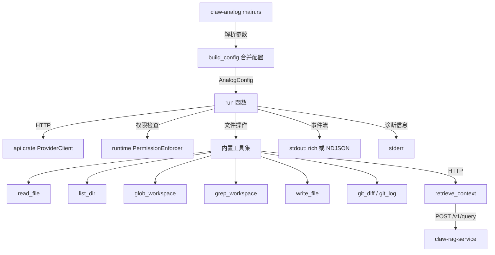

# 第 15 章 claw-analog：精简 Agent Harness

## 本章概览

claw-analog 是一个独立于核心 CLI（claw）的精简 Agent 工具循环，面向 CI 流水线和自动化场景提供窄工具集的文件读写与检索能力。它复用了 `api` crate 的 `ProviderClient` 和 `runtime` 的 `PermissionEnforcer`，但拥有独立的配置合并逻辑、事件流输出格式以及工具分发实现。与核心 CLI 的 55 个工具不同，claw-analog 只暴露 read_file、list_dir、glob_workspace、grep_workspace、write_file、git_diff、git_log、retrieve_context 八个工具，去掉了 bash 执行、MCP 协议和插件系统。

| 文件路径 | 职责 |
|----------|------|
| rust/crates/claw-analog/src/lib.rs | 核心 harness：配置合并、工具循环、权限校验、事件流输出 |
| rust/crates/claw-analog/src/main.rs | CLI 参数解析、子命令分发（doctor/config/complete/agents） |
| rust/crates/claw-analog/Cargo.toml | 依赖关系：api + runtime + clap + reqwest |

## 15.1 设计理念与使用场景

核心 CLI（claw）的完整工具集包含 bash 执行、文件操作、MCP 外部工具、插件扩展等 55 个工具，面向交互式开发场景设计。但在 CI 流水线、代码审计、自动化文档生成等场景中，用户需要的是一个行为可预测、工具集受限、输出可被机器解析的 Agent —— 不需要 shell 执行，不需要 MCP 会话管理，只需要文件读写和检索能力。

claw-analog 的设计决策体现在三个维度：

**工具集边界**。只保留与文件系统直接交互的 8 个工具。去掉了 bash 意味着 Agent 无法执行任意命令；去掉了 MCP 意味着不会引入外部工具调用的不确定性；去掉了插件系统意味着行为完全由代码决定，不受用户安装的第三方扩展影响。

**权限模型简化**。复用第 9 章介绍的 `PermissionMode`（ReadOnly / WorkspaceWrite / Prompt / DangerFullAccess / Allow），但在默认配置下更保守：未指定 preset 时默认 ReadOnly，指定 implement preset 时才升级到 WorkspaceWrite。

**输出可解析性**。支持两种输出模式：rich 模式输出人类可读的纯文本（与核心 CLI 一致），JSON 模式输出 newline-delimited JSON（NDJSON）事件流，供下游程序消费。

与核心 CLI 的功能对比：

| 维度 | claw（核心 CLI） | claw-analog |
|------|-----------------|-------------|
| 工具数量 | 55 | 8 |
| bash 执行 | 有 | 无 |
| MCP 外部工具 | 有 | 无 |
| 插件系统 | 有 | 无 |
| 会话管理 | 多会话 + 自动压缩 | 单文件会话持久化 |
| 输出格式 | rich text | rich / NDJSON |
| 适用场景 | 交互式开发 | CI / 自动化 |

## 15.2 配置体系与 CLI 参数

claw-analog 的配置通过三层来源合并：CLI 参数、`.claw-analog.toml` 文件、profile hint 文件。合并优先级为 CLI > TOML > 默认值。

### 配置文件

工作区根目录下的 `.claw-analog.toml` 定义持久化的运行参数：

```toml
# .claw-analog.toml 示例
model = "sonnet"
stream = true
output_format = "json"
permission = "workspace-write"
preset = "implement"
language = "en"
max_read_bytes = 262144
max_turns = 24

# RAG 服务地址（可选）
rag_base_url = "http://localhost:8080"
rag_timeout_secs = 30
rag_top_k_max = 32
```

该文件通过 `AnalogFileConfig` 结构反序列化，字段全部为可选，缺失时使用默认值。

### CLI 参数表

| 参数 | 类型 | 说明 |
|------|------|------|
| `--config PATH` | PathBuf | 配置文件路径，默认 `<workspace>/.claw-analog.toml` |
| `--model` | String | 覆盖配置文件的模型名 |
| `-w / --workspace` | PathBuf | 工作区根目录，默认当前目录 |
| `--permission` | enum | 权限模式：read-only / workspace-write / prompt / danger-full-access / allow |
| `--preset` | enum | 行为预设：none / auto / audit / explain / implement |
| `--lang` | enum | 回复语言提示：en / ru |
| `--stream` / `--no-stream` | flag | 控制 SSE 流式输出 |
| `--output-format` | enum | rich 或 json |
| `--no-runtime-enforcer` | flag | 禁用 PermissionEnforcer（路径隔离仍然生效） |
| `--accept-danger-non-interactive` | flag | 允许在非 TTY 模式下使用 danger-full-access / allow |
| `--session PATH` | PathBuf | 会话持久化路径（支持续传） |
| `--save-session PATH` | PathBuf | 额外导出会话快照的路径 |
| `--profile PATH` | PathBuf | profile hint 文件路径 |
| `--max-read-bytes` | u64 | 单文件读取上限，默认 256KB |
| `--max-turns` | u32 | 最大工具循环轮数，默认 24 |

### 配置合并逻辑

`build_config` 函数将 CLI 参数和文件配置合并为最终的 `AnalogConfig`。每个字段都遵循"CLI 优先"的规则：

```rust
// claw-code/rust/crates/claw-analog/src/lib.rs

fn build_config(
    cli: &RunCli,
    file: &AnalogFileConfig,
    prompt: String,
    profile_hint: Option<String>,
    session_path: Option<PathBuf>,
    preset: Preset,
    permission_mode: PermissionMode,
) -> AnalogConfig {
    let model = cli
        .model
        .clone()
        .or_else(|| file.model.clone())
        .unwrap_or_else(|| ANALOG_DEFAULT_MODEL.into());

    let use_stream = if cli.no_stream {
        false
    } else if cli.stream {
        true
    } else {
        file.stream.unwrap_or(false)
    };

    let use_runtime_enforcer =
        !cli.no_runtime_enforcer && !file.no_runtime_enforcer.unwrap_or(false);
    // ... 其余字段遵循相同模式
}
```

`use_runtime_enforcer` 的合并逻辑是一个"与"关系：CLI 和 TOML 都未显式关闭时才启用。这意味着 `--no-runtime-enforcer` 可以单独关闭策略检查，但无法在 TOML 已关闭的情况下重新开启。

### Permission 合并

权限模式的合并路径比 stream 更复杂，因为 preset 可以推导默认权限：

```rust
// claw-code/rust/crates/claw-analog/src/lib.rs

fn merge_permission(
    cli: Option<PermissionArg>,
    file_perm: Option<String>,
    preset: Preset,
) -> PermissionMode {
    if let Some(p) = cli {
        // CLI 参数直接映射
        return match p {
            PermissionArg::ReadOnly => PermissionMode::ReadOnly,
            PermissionArg::WorkspaceWrite => PermissionMode::WorkspaceWrite,
            // ...
        };
    }
    if let Some(s) = file_perm.as_deref().and_then(permission_mode_from_toml_str) {
        return s;
    }
    // 无显式配置时，preset 推导默认值
    match preset {
        Preset::Implement => PermissionMode::WorkspaceWrite,
        _ => PermissionMode::ReadOnly,
    }
}
```

这个设计使得 `preset = implement` 在未指定权限时自动获得写权限，而其他 preset 保持只读。

### Profile Hint

profile 机制允许用户在 `~/.claw-analog/profile.toml` 中写入单行提示，注入到 system prompt 中：

```toml
# ~/.claw-analog/profile.toml
line = "Focus on Rust code quality and safety guarantees."
```

`load_profile_hint` 函数限制文件大小（2048 字节）和单行长度（512 字符），避免 profile 内容喧宾夺主。

## 15.3 核心实现

### 启动与初始化

`run` 函数是核心入口，执行以下初始化步骤：

```rust
// claw-code/rust/crates/claw-analog/src/lib.rs

pub async fn run(
    config: AnalogConfig,
    out: &mut impl std::io::Write,
) -> Result<(), Box<dyn std::error::Error + Send + Sync>> {
    let workspace = config.workspace.canonicalize()?;
    enforce_non_interactive_permission_rules(
        config.permission_mode,
        config.accept_danger_non_interactive,
    )?;
    let model = resolve_model_alias(&config.model);
    let client = ProviderClient::from_model(model.as_str())?;
    let tools = tool_definitions(config.permission_mode, config.rag_base_url.as_deref());
    // ...
}
```

`enforce_non_interactive_permission_rules` 在非 TTY 环境下拒绝 `danger-full-access` 和 `allow` 模式，除非用户显式传入 `--accept-danger-non-interactive`。这是防止 CI 配置误用高权限模式的安全阀。

### 工具定义

`tool_definitions` 函数根据权限模式和 RAG 配置动态生成工具列表：

```rust
// claw-code/rust/crates/claw-analog/src/lib.rs

fn tool_definitions(mode: PermissionMode, rag_base_url: Option<&str>) -> Vec<ToolDefinition> {
    let mut tools = vec![
        ToolDefinition {
            name: "read_file".to_string(),
            description: Some("Read a UTF-8 file under the workspace.".to_string()),
            input_schema: json!({ "type": "object", "properties": {
                "path": { "type": "string", "description": "Relative path from workspace root" }
            }, "required": ["path"] }),
        },
        // list_dir, glob_workspace, grep_workspace, grep_search, git_diff, git_log
    ];
    if rag_base_url.is_some() {
        tools.push(ToolDefinition { name: "retrieve_context", /* ... */ });
    }
    if matches!(mode, PermissionMode::WorkspaceWrite | PermissionMode::DangerFullAccess | PermissionMode::Allow) {
        tools.push(ToolDefinition { name: "write_file", /* ... */ });
    }
    tools
}
```

两个条件决定工具可见性：`retrieve_context` 仅在配置了 RAG 服务地址时出现；`write_file` 仅在权限模式为 WorkspaceWrite 或更高时出现。这确保了 Agent 无法调用其当前权限不允许的工具。

### 工具循环

核心循环在 `max_turns` 限制内反复发送请求、处理工具调用：

```rust
// claw-code/rust/crates/claw-analog/src/lib.rs

for turn in 0..config.max_turns {
    let request = MessageRequest {
        model: model.clone(),
        max_tokens,
        messages: messages.clone(),
        system: Some(system.clone()),
        tools: Some(tools.clone()),
        tool_choice: Some(ToolChoice::Auto),
        ..Default::default()
    };

    let response = if config.use_stream {
        stream_to_message_response(&client, &request, out, config.output_format).await?
    } else {
        client.send_message(&request).await?
    };

    // 收集工具调用并执行
    let tool_uses = collect_tool_uses(&response.content);
    if tool_uses.is_empty() || response.stop_reason.as_deref() != Some("tool_use") {
        persist_conversation_sessions(&config, &ws_str, model.as_str(), &messages)?;
        break;
    }

    let mut results: Vec<InputContentBlock> = Vec::new();
    for tu in tool_uses {
        let text = if tu.name == "retrieve_context" {
            // RAG 调用走异步 HTTP
            retrieve_context_tool(/* ... */).await
        } else {
            dispatch_tool(/* ... */)
        };
        results.push(InputContentBlock::ToolResult { /* ... */ });
    }
    messages.push(InputMessage { role: "user".to_string(), content: results });
}
```

循环终止条件有两个：模型未产生工具调用（`stop_reason != "tool_use"`），或达到 `max_turns` 上限。每次工具执行后都会持久化会话（如果配置了 `--session`），确保中途失败时已有进度不丢失。

### 路径隔离

所有涉及文件操作的工具都通过 `validate_rel_path` 和 `assert_workspace_path` 两层检查防止路径穿越：

```rust
// claw-code/rust/crates/claw-analog/src/lib.rs

pub fn validate_rel_path(rel: &str) -> Result<(), String> {
    // 拒绝 Windows 风格的反斜杠路径（Unix 上反斜杠是合法文件名字符）
    if rel.contains('\\') {
        return Err("path must not contain backslashes".into());
    }
    let p = Path::new(rel);
    for c in p.components() {
        match c {
            Component::Normal(_) | Component::CurDir => {}
            Component::Prefix(_) | Component::RootDir | Component::ParentDir => {
                return Err("path must be relative with no '..' or absolute segments".into());
            }
        }
    }
    Ok(())
}

fn join_under_root(root: &Path, rel: &str) -> Result<PathBuf, String> {
    validate_rel_path(rel)?;
    Ok(root.join(rel))
}
```

`assert_workspace_path` 在 `join_under_root` 之后执行，通过 canonicalize 验证最终路径确实位于 workspace 内部。这是防御符号链接攻击的关键步骤：一个 workspace 内的符号链接可能指向外部路径，`join_under_root` 无法检测，但 `canonicalize` + `starts_with` 可以。

### System Prompt 构造

`system_prompt` 函数根据权限模式和 preset 生成差异化的系统提示：

```rust
// claw-code/rust/crates/claw-analog/src/lib.rs

fn system_prompt(mode: PermissionMode, root: &Path, preset: Preset, 
                 profile_hint: Option<&str>, language: AnalogLanguage,
                 rag_enabled: bool) -> String {
    let base = match mode {
        PermissionMode::ReadOnly => format!(
            "You are a read-only coding assistant. Workspace root: {root_s}. \
             Tools: `read_file`, `list_dir`, `glob_workspace`, `grep_workspace`..."
        ),
        PermissionMode::WorkspaceWrite => format!(
            "You are a coding assistant with read/list/glob/grep/write... Workspace root: {root_s}..."
        ),
        // ... 其他模式
    };
    let mut out = base;
    out.push_str(SOURCE_GROUNDING_HINT);  // 锚定到源码而非部署配置
    if let Some(x) = preset.extra_system() { out.push_str(x); }
    if let Some(h) = profile_hint.filter(|s| !s.is_empty()) {
        out.push_str("Learner hint: ");
        out.push_str(h);
    }
    out
}
```

`SOURCE_GROUNDING_HINT` 是一条固定指令，要求模型在回答"某功能在哪里实现"时优先引用源码（crate 模块、CLI 入口），而非部署配置文件（docker-compose、CI YAML）。这是针对模型倾向于从运维配置推断实现的行为矫正。

## 15.4 输出格式

### Rich 模式

rich 模式（默认）的行为与核心 CLI 一致：工具执行期间不输出额外信息，只在最终回复时将模型的文本内容写入 stdout。诊断信息（turn 进度、工具调用结果长度）输出到 stderr。

### NDJSON 模式

当 `--output-format json` 指定时，claw-analog 输出结构化事件流，每行一个 JSON 对象：

```json
{"type":"run_start","schema":"claw-analog-ndjson","format_version":1,"workspace":"/repo","model":"sonnet","stream":true,"permission":"workspace-write","preset":"implement","rag_enabled":false}
{"type":"turn_start","turn":1}
{"type":"assistant_text_delta","text":"Let me examine "}
{"type":"assistant_text_delta","text":"the source..."}
{"type":"assistant_turn","turn":1,"stop_reason":"tool_use","usage":{"input_tokens":1280,"output_tokens":245},"text":"Let me examine the source...","tool_calls":[{"id":"tool_0","name":"read_file","input":{"path":"src/lib.rs"}}]}
{"type":"tool_result","turn":1,"tool_use_id":"tool_0","name":"read_file","is_error":false,"output":"use std::...","output_len_chars":1842,"truncated":false}
{"type":"turn_start","turn":2}
// ...
{"type":"run_end","ok":true}
```

事件类型表：

| 事件类型 | 时机 | 关键字段 |
|----------|------|----------|
| `run_start` | 循环开始前 | schema, format_version, workspace, model, permission, preset |
| `turn_start` | 每轮迭代开始 | turn（从 1 开始） |
| `assistant_text_delta` | 流式输出每个文本增量 | text |
| `assistant_turn` | 模型响应完成后 | stop_reason, usage, text, tool_calls |
| `tool_result` | 每个工具执行后 | tool_use_id, name, is_error, output, truncated |
| `run_end` | 循环正常结束 | ok |

`NDJSON_FORMAT_VERSION` 当前为 1，当事件 schema 发生不兼容变更时递增。下游消费者应检查此字段以决定解析策略。

流式输出的降级策略值得注意：`stream_to_message_response` 在流未正常终止（`saw_stop == false`）或内容为空时，会 fallback 到非流式请求：

```rust
// claw-code/rust/crates/claw-analog/src/lib.rs

if !saw_stop {
    return client.send_message(request).await;
}
let content: Vec<OutputContentBlock> = finished.into_values().collect();
if content.is_empty() {
    return client.send_message(request).await;
}
```

这意味着流式输出的失败不会导致运行中断，而是静默回退到更可靠的路径。

## 15.5 与核心系统的集成

### 依赖关系

从 Cargo.toml 可以看到 claw-analog 依赖的核心 crate：

```toml
# claw-code/rust/crates/claw-analog/Cargo.toml

[dependencies]
api = { path = "../api" }
runtime = { path = "../runtime" }
clap = { version = "4", features = ["derive"] }
reqwest = { version = "0.12", default-features = false, features = ["json", "rustls-tls"] }
serde = { version = "1", features = ["derive"] }
tokio = { version = "1", features = ["macros", "rt-multi-thread"] }
toml = "0.8"
walkdir = "2"
ignore = "0.4"
```

`api` crate 提供 `ProviderClient`、`MessageRequest`/`MessageResponse` 和流式事件类型；`runtime` crate 提供 `PermissionEnforcer`、`PermissionMode` 和 `PermissionPolicy`。claw-analog 没有引入 `tools` crate，它的工具实现是内联在 lib.rs 中的独立代码。



### 与 PermissionEnforcer 的关系

claw-analog 使用 `build_policy` 函数构造与核心 CLI 一致的权限策略：

```rust
// claw-code/rust/crates/claw-analog/src/lib.rs

fn build_policy(mode: PermissionMode) -> PermissionPolicy {
    PermissionPolicy::new(mode)
        .with_tool_requirement("read_file", PermissionMode::ReadOnly)
        .with_tool_requirement("list_dir", PermissionMode::ReadOnly)
        .with_tool_requirement("glob_workspace", PermissionMode::ReadOnly)
        .with_tool_requirement("grep_workspace", PermissionMode::ReadOnly)
        .with_tool_requirement("grep_search", PermissionMode::ReadOnly)
        .with_tool_requirement("git_diff", PermissionMode::ReadOnly)
        .with_tool_requirement("git_log", PermissionMode::ReadOnly)
        .with_tool_requirement("retrieve_context", PermissionMode::ReadOnly)
        .with_tool_requirement("write_file", PermissionMode::WorkspaceWrite)
}
```

9 个工具中 8 个要求 ReadOnly，只有 `write_file` 要求 WorkspaceWrite。这比核心 CLI 的策略表更精简，反映了窄工具集的设计定位。

`enforce_tool` 函数在每次工具调用前检查权限：

```rust
// claw-code/rust/crates/claw-analog/src/lib.rs

fn enforce_tool(enforcer: Option<&PermissionEnforcer>, tool: &str, input: &Value) -> Result<(), String> {
    let Some(e) = enforcer else { return Ok(()); };
    let payload = input.to_string();
    match e.check(tool, &payload) {
        EnforcementResult::Allowed => Ok(()),
        EnforcementResult::Denied { reason, .. } => Err(reason),
    }
}
```

当 `use_runtime_enforcer` 为 false 时传入 `None`，跳过策略检查。此时路径隔离（`validate_rel_path` + `assert_workspace_path`）仍然生效，只是不执行基于策略模式的细粒度权限判断。

### RAG 集成

`retrieve_context` 工具通过 HTTP 调用外部 claw-rag-service 实现语义检索：

```rust
// claw-code/rust/crates/claw-analog/src/lib.rs

async fn retrieve_context_tool(
    http: &reqwest::Client,
    rag_base_url: &str,
    top_k_cap: u32,
    enforcer: Option<&PermissionEnforcer>,
    input: &Value,
) -> String {
    // 权限检查
    if let Err(e) = enforce_tool(enforcer, "retrieve_context", input) {
        return format!("error: permission denied: {e}");
    }
    let Some(q) = input.get("query").and_then(|v| v.as_str()) else {
        return "error: missing query".to_string();
    };
    let q = q.trim();
    if q.is_empty() { return "error: empty query".to_string(); }
    if q.chars().count() > RAG_QUERY_MAX_CHARS {
        return format!("error: query too long (max {RAG_QUERY_MAX_CHARS} chars)");
    }
    // top_k 限制在配置上限内
    let top_k = input.get("top_k").and_then(|v| v.as_u64())
        .map(|n| n as u32).unwrap_or(8).clamp(1, cap);
    let url = format!("{base}/v1/query");
    let body = json!({ "query": q, "top_k": top_k });
    let resp = http.post(url).json(&body).send().await;
    // ...
}
```

RAG 服务地址的解析优先级为：TOML `rag_base_url` > 环境变量 `RAG_BASE_URL` > 不启用。查询长度限制为 12000 字符，top_k 硬上限为 256（配置默认 32）。返回结果经过 `format_rag_query_json_for_model` 格式化为带序号和分数的文本，而非直接透传 JSON。

`format_rag_query_json_for_model` 还执行 bootstrap phase 验证，确保 RAG 服务返回的 phase 字段是已知值之一（`1-sqlite-no-db`、`1-sqlite-empty`、`1-sqlite`、`2-qdrant`），否则返回错误而非静默渲染。这是防御 RAG 服务升级后格式不兼容的保护措施。

### 会话持久化

会话以 JSON 格式存储，结构包含版本号、工作区路径、模型名、preset 和消息列表：

```rust
// claw-code/rust/crates/claw-analog/src/lib.rs

#[derive(Debug, Clone, serde::Serialize, serde::Deserialize)]
struct SessionFile {
    version: u32,
    workspace: String,
    model: String,
    preset: Option<String>,
    messages: Vec<InputMessage>,
}
```

会话恢复时会检查 version、workspace、model、preset 是否匹配，不匹配时输出警告但不中断。`atomic_write` 通过先写临时文件再 rename 的方式保证写入的原子性，防止进程崩溃时损坏已有会话文件。

## 15.6 子命令

claw-analog 除了默认的 run 子命令外，还提供 doctor、config、complete、agents 四个辅助子命令。

### doctor

`doctor` 命令执行健康检查：验证 API 凭证（cargo check）、配置文件合并预览、可选的 TCP ping。它是运行实际任务前的诊断工具，用于排查配置问题。

```rust
// claw-code/rust/crates/claw-analog/src/main.rs

Some(Commands::Doctor(d)) => {
    let code = doctor::run_doctor(d);
    std::process::exit(code);
}
```

### config validate

`config validate` 解析 `.claw-analog.toml` 和 profile，打印合并后的配置预览，不发起 API 请求。用于调试配置合并逻辑。

### complete

`complete` 生成 shell 补全脚本（bash/zsh/fish/powershell），支持重定向到文件后 source 加载。

### agents

`agents` 命令按顺序运行多个专门的子 Agent，共享基础会话。这是 claw-analog 面向多步骤自动化场景的扩展，例如"先 audit 再 explain 再 implement"的流水线。

## 小结

claw-analog 是一个独立的精简 Agent 工具循环，面向 CI/自动化场景提供 8 个窄工具（read/list/grep/write/git/retrieve_context）。核心文件 lib.rs 承载了配置合并、工具分发、事件流输出和会话持久化逻辑，main.rs 负责 CLI 参数解析和子命令分发。

与核心运行时的主要差异在于：去掉了 bash/MCP/插件，工具实现内联而非通过 tools crate 注册，输出支持 NDJSON 事件流供下游消费。权限系统复用 `runtime::PermissionEnforcer`，但支持 `--no-runtime-enforcer` 降级到纯路径隔离模式。

关键文件：
- lib.rs：配置合并、工具循环、dispatch_tool、事件流
- main.rs：CLI 参数定义、子命令分发
- Cargo.toml：依赖 api + runtime + clap

下一章将介绍 claw-rag-service，即 claw-analog 中 `retrieve_context` 工具调用的 RAG 检索服务，它独立提供工作区文件的语义索引和查询能力。
