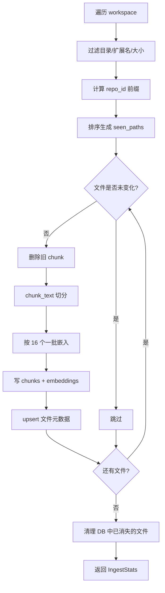
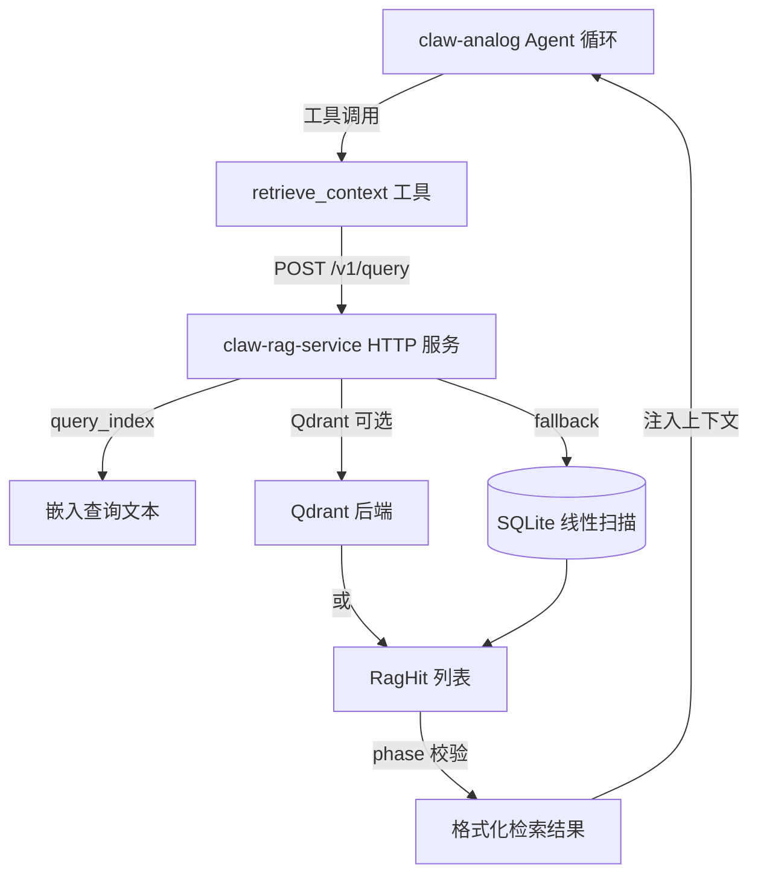

# 第 16 章 claw-rag-service：RAG 检索服务

## 本章概览

claw-rag-service 是一个独立 HTTP 服务，负责对工作区文件进行遍历、切分、嵌入和语义检索。它不依赖核心 Agent 运行时，也不依赖 claw-analog，三者之间唯一的交互是 claw-analog 通过 HTTP 向 claw-rag-service 发起 `POST /v1/query` 请求。服务内部采用 SQLite 存储 chunk 文本与向量，用线性扫描计算余弦相似度作为 MVP 检索实现，并通过一个编译期 feature 开关切换到可选的 Qdrant 后端。

| 文件路径 | 职责 |
|----------|------|
| rust/crates/claw-rag-service/src/lib.rs | 模块入口：RagHit、QueryRequest/Response 类型定义与 re-export |
| rust/crates/claw-rag-service/src/ingest.rs | 文件遍历、chunk 生成、批量嵌入写入、增量更新 |
| rust/crates/claw-rag-service/src/search.rs | 查询嵌入、线性扫描余弦相似度、top-k 排序 |
| rust/crates/claw-rag-service/src/main.rs | axum 路由、serve/ingest 子命令、端口绑定 |
| rust/crates/claw-rag-service/src/chunk.rs | 字符级重叠窗口切分 |
| rust/crates/claw-rag-service/src/db.rs | SQLite schema、文件元数据、向量 blob 读写 |
| rust/crates/claw-rag-service/src/embed.rs | OpenAI 兼容嵌入 HTTP 客户端、余弦相似度 |
| rust/crates/claw-rag-service/src/qdrant_index.rs | Qdrant 可选后端（feature 门控） |
| rust/crates/claw-rag-service/Cargo.toml | 依赖与 `qdrant-index` 特性开关 |

## 16.1 设计理念与使用场景

RAG 能力没有内嵌在核心运行时或 claw-analog 中，而是被拆成一个独立服务。这个决策的动机来自三个维度。

**生命周期独立**。核心运行时的 Agent 循环与工具执行是短生命周期、按需启动的进程；而 RAG 索引需要长时间驻留、持续累积向量数据。把索引和检索放进独立服务，可以让索引进程持续运行、单独扩缩容，不必随每次 Agent 调用反复重建。

**模型与环境隔离**。嵌入计算依赖 OpenAI 兼容的 embedding API，需要独立的 API key、base_url 和 model 配置。如果内嵌到 claw-analog，每个 Agent 进程都要自己维护嵌入客户端和向量缓存；独立成服务后，嵌入配置集中在一个进程，检索和索引共享同一份数据库文件。

**解耦检索与生成**。核心运行时关心的是把检索结果作为上下文注入 system prompt，而不关心向量是如何生成、存储和排序的。通过 HTTP 边界隔离，RAG 服务的存储后端可以从 SQLite 平滑迁移到 Qdrant，调用方（claw-analog）无需感知。

与核心 CLI 和 claw-analog 的定位对比：

| 维度 | claw（核心 CLI） | claw-analog | claw-rag-service |
|------|-----------------|-------------|------------------|
| 进程形态 | 交互式 Agent 循环 | 一次性工具循环 | 常驻 HTTP 服务 |
| 工具/能力 | 55 个工具 | 8 个窄工具 | 无工具，纯 HTTP API |
| 向量检索 | 无 | 通过 retrieve_context 调用外部 | 索引 + 检索 |
| 存储 | 会话文件 | 会话文件 | SQLite / Qdrant |
| 依赖核心运行时 | 本体 | api + runtime crate | 无 |

claw-rag-service 与核心运行时无直接依赖，与 claw-analog 的交互也只是一次 HTTP 请求，边界清晰。

## 16.2 配置与 CLI 参数

### 嵌入配置

嵌入相关配置集中在 `EmbedConfig` 结构，通过环境变量解析：

```rust
// claw-code/rust/crates/claw-rag-service/src/embed.rs

pub fn from_env() -> Result<Self, String> {
    let api_key = std::env::var("CLAW_RAG_OPENAI_API_KEY")
        .or_else(|_| std::env::var("OPENAI_API_KEY"))
        .map_err(|_| {
            "set CLAW_RAG_OPENAI_API_KEY or OPENAI_API_KEY for embeddings".to_string()
        })?;
    let base_url = std::env::var("CLAW_RAG_EMBEDDING_BASE_URL")
        .unwrap_or_else(|_| "https://api.openai.com/v1".into());
    let model = std::env::var("CLAW_RAG_EMBEDDING_MODEL")
        .unwrap_or_else(|_| "text-embedding-3-small".into());
    Ok(Self {
        api_key,
        base_url: base_url.trim_end_matches('/').to_string(),
        model,
    })
}
```

api_key 的解析顺序是先查 `CLAW_RAG_OPENAI_API_KEY`，缺失时回退到通用的 `OPENAI_API_KEY`。base_url 和 model 都有默认值，用户只提供 api_key 即可使用 OpenAI 官方嵌入端点。`base_url` 末尾的 `/` 被 trim 掉，避免拼接 `/embeddings` 时出现双斜杠。

### 环境变量表

| 环境变量 | 默认值 | 说明 |
|----------|--------|------|
| `CLAW_RAG_OPENAI_API_KEY` | 无（必填，或回退 `OPENAI_API_KEY`） | 嵌入 API 密钥 |
| `CLAW_RAG_EMBEDDING_BASE_URL` | `https://api.openai.com/v1` | 嵌入 API 基址（OpenAI 兼容） |
| `CLAW_RAG_EMBEDDING_MODEL` | `text-embedding-3-small` | 嵌入模型名 |
| `CLAW_RAG_DB` | `.claw-rag/index.sqlite` | SQLite 索引文件路径 |
| `CLAW_RAG_PORT` | `8787` | HTTP 监听端口 |
| `CLAW_RAG_HOST` | `127.0.0.1` | HTTP 监听地址 |
| `CLAW_RAG_MOCK_PROVIDERS` | 无 | 设为 `1` 时使用确定性假向量（测试/干跑） |
| `CLAW_RAG_QDRANT_URL` | 无 | 配置后启用 Qdrant 后端 |
| `CLAW_RAG_QDRANT_COLLECTION` | `claw_rag_chunks` | Qdrant collection 名 |
| `CLAW_RAG_QDRANT_API_KEY` | 无 | Qdrant API 密钥（可选） |

### CLI 子命令

`main.rs` 用 clap 定义了两个子命令，缺省时进入 serve 模式：

```rust
// claw-code/rust/crates/claw-rag-service/src/main.rs

#[derive(Subcommand)]
enum Cmd {
    /// Run HTTP server (default when no subcommand).
    Serve(ServeArgs),
    /// Index a workspace into `SQLite` (calls embedding API).
    Ingest(IngestArgs),
}

#[derive(Parser)]
struct ServeArgs {
    #[arg(long, env = "CLAW_RAG_DB", default_value = ".claw-rag/index.sqlite")]
    db: PathBuf,
}

#[derive(Parser)]
struct IngestArgs {
    /// Workspace roots to ingest. Repeat `--workspace` to ingest multiple repos (cross-repo RAG).
    #[arg(short, long)]
    workspace: Vec<PathBuf>,
    #[arg(long, env = "CLAW_RAG_DB", default_value = ".claw-rag/index.sqlite")]
    db: PathBuf,
}
```

`IngestArgs.workspace` 是 `Vec<PathBuf>`，可通过重复 `--workspace` 传入多个仓库根目录实现跨仓库索引。`--db` 参数通过 clap 的 `env` 特性与 `CLAW_RAG_DB` 绑定，CLI 显式传入时覆盖环境变量。

### Cargo 特性

```toml
# claw-code/rust/crates/claw-rag-service/Cargo.toml

[dependencies]
axum = "0.8"
clap = { version = "4", features = ["derive", "env"] }
dotenvy = "0.15"
reqwest = { version = "0.12", default-features = false, features = ["json", "rustls-tls"] }
rusqlite = { version = "0.32", features = ["bundled"] }
serde = { version = "1", features = ["derive"] }
tokio = { version = "1", features = ["macros", "net", "rt-multi-thread", "signal"] }
walkdir = "2"
qdrant-client = { version = "1.17", optional = true }
blake3 = "1"

[features]
default = []
qdrant-index = ["dep:qdrant-client"]
```

`qdrant-client` 是可选依赖，默认不编译。`qdrant-index` feature 通过 `dep:qdrant-client` 语法启用它，源码中所有 Qdrant 相关代码都包裹在 `#[cfg(feature = "qdrant-index")]` 之后。`rusqlite` 使用 `bundled` 特性，把 SQLite 的 C 源码直接编译进二进制，部署时无需依赖系统 libsqlite。

## 16.3 数据模型与存储层

### 类型定义

`lib.rs` 定义了跨模块共享的核心类型：

```rust
// claw-code/rust/crates/claw-rag-service/src/lib.rs

mod chunk;
mod db;
mod embed;
mod ingest;
#[cfg(feature = "qdrant-index")]
mod qdrant_index;
mod search;

pub use db::{chunk_count, open_db};
pub use embed::EmbedConfig;
pub use ingest::{run_ingest, IngestStats};
pub use search::query_index;

/// One retrieved chunk for the model or UI.
#[derive(Debug, Clone, Serialize, Deserialize)]
pub struct RagHit {
    pub path: String,
    pub snippet: String,
    #[serde(skip_serializing_if = "Option::is_none")]
    pub score: Option<f32>,
}

#[derive(Debug, Clone, Deserialize)]
pub struct QueryRequest {
    pub query: String,
    #[serde(default = "default_top_k")]
    pub top_k: u32,
}

fn default_top_k() -> u32 {
    8
}

#[derive(Debug, Clone, Serialize)]
pub struct QueryResponse {
    pub hits: Vec<RagHit>,
    /// `0-stub` (legacy), `1-sqlite`, `1-sqlite-empty`, `1-sqlite-no-db`
    pub phase: &'static str,
}
```

`RagHit` 是单条检索结果，包含文件路径、文本片段和可选分数。`score` 字段通过 `skip_serializing_if` 在为空时从 JSON 中省略，兼容 UI 层对旧格式的解析。`QueryRequest.top_k` 用 `default_top_k` 提供默认值 8，客户端只传 `query` 也能工作。`QueryResponse.phase` 是一个 `&'static str`，用字符串字面量标记后端状态，四个值分别对应 SQLite 正常、SQLite 空库、SQLite 无库文件、Qdrant 后端，外加一个遗留的 `0-stub` 值。

### SQLite Schema

`db.rs` 用三张表存储索引数据：

```rust
// claw-code/rust/crates/claw-rag-service/src/db.rs

const SCHEMA: &str = r"
CREATE TABLE IF NOT EXISTS chunks (
    id INTEGER PRIMARY KEY AUTOINCREMENT,
    path TEXT NOT NULL,
    ordinal INTEGER NOT NULL,
    text TEXT NOT NULL,
    UNIQUE(path, ordinal)
);
CREATE TABLE IF NOT EXISTS embeddings (
    chunk_id INTEGER PRIMARY KEY,
    dim INTEGER NOT NULL,
    vec BLOB NOT NULL,
    FOREIGN KEY (chunk_id) REFERENCES chunks(id) ON DELETE CASCADE
);
CREATE TABLE IF NOT EXISTS files (
    path TEXT PRIMARY KEY,
    content_hash TEXT NOT NULL,
    size_bytes INTEGER NOT NULL,
    mtime_ms INTEGER NOT NULL,
    indexed_at_ms INTEGER NOT NULL
);
CREATE INDEX IF NOT EXISTS idx_chunks_path ON chunks(path);
";
```

三张表的分工明确。`chunks` 存切分后的文本片段，`(path, ordinal)` 唯一约束保证同一文件内的 chunk 顺序唯一；`embeddings` 存向量，通过 `chunk_id` 外键关联，`ON DELETE CASCADE` 让删除 chunk 时自动清理对应向量；`files` 存文件级元数据，用于增量索引时判断文件是否变化。

向量以 little-endian 的 f32 字节序列存入 BLOB：

```rust
// claw-code/rust/crates/claw-rag-service/src/db.rs

pub(crate) fn f32_slice_to_blob(v: &[f32]) -> Vec<u8> {
    let mut b = Vec::with_capacity(v.len() * 4);
    for x in v {
        b.extend_from_slice(&x.to_le_bytes());
    }
    b
}

pub fn blob_to_f32_vec(blob: &[u8], dim: usize) -> Option<Vec<f32>> {
    if blob.len() != dim * 4 {
        return None;
    }
    let mut v = Vec::with_capacity(dim);
    for chunk in blob.chunks_exact(4) {
        v.push(f32::from_le_bytes([chunk[0], chunk[1], chunk[2], chunk[3]]));
    }
    Some(v)
}
```

每个 f32 占 4 字节，`dim` 字段记录了向量维度，读取时用 `dim * 4` 校验 BLOB 长度后再反序列化，防止脏数据导致越界。

数据库打开时设置 WAL 日志模式并启用外键：

```rust
// claw-code/rust/crates/claw-rag-service/src/db.rs

pub fn open_db(path: &Path) -> Result<Connection, String> {
    if let Some(parent) = path.parent() {
        if !parent.as_os_str().is_empty() {
            std::fs::create_dir_all(parent).map_err(|e| e.to_string())?;
        }
    }
    let conn = Connection::open(path).map_err(|e| e.to_string())?;
    conn.execute_batch(
        r"
PRAGMA foreign_keys = ON;
PRAGMA journal_mode = WAL;
",
    )
    .map_err(|e| e.to_string())?;
    conn.execute_batch(SCHEMA).map_err(|e| e.to_string())?;
    Ok(conn)
}
```

`open_db` 先确保父目录存在，再打开连接。WAL 模式让读写并发不互相阻塞，适合 ingest 写和 query 读可能同时发生的情况。schema 用 `CREATE TABLE IF NOT EXISTS` 声明，幂等地完成首次初始化。

### chunk 切分

`chunk.rs` 实现字符级重叠窗口切分，不依赖任何分词库：

```rust
// claw-code/rust/crates/claw-rag-service/src/chunk.rs

#[must_use]
pub fn chunk_text(text: &str, max_chars: usize, overlap: usize) -> Vec<String> {
    if max_chars == 0 {
        return Vec::new();
    }
    let overlap = overlap.min(max_chars.saturating_sub(1));
    let mut out = Vec::new();
    let chars: Vec<char> = text.chars().collect();
    if chars.is_empty() {
        return out;
    }
    let mut start = 0;
    loop {
        let end = (start + max_chars).min(chars.len());
        let piece: String = chars[start..end].iter().collect();
        if !piece.trim().is_empty() {
            out.push(piece);
        }
        if end >= chars.len() {
            break;
        }
        let step = max_chars.saturating_sub(overlap).max(1);
        start += step;
    }
    out
}
```

切分按 Unicode 字符而非字节进行，避免在多字节 UTF-8 文本中切出非法序列。`overlap` 被钳制到 `max_chars - 1`，防止重叠超过窗口本身；`step` 是实际滑动步长，等于 `max_chars - overlap`，最小为 1。每个非空窗口被收集，纯空白片段被丢弃。ingest 传入的窗口参数是 `CHUNK_CHARS = 900`、`CHUNK_OVERLAP = 120`，即每 900 字符一个窗口，相邻窗口重叠 120 字符。

## 16.4 索引流程：从文件遍历到向量持久化

`ingest.rs` 的 `run_ingest` 是整个索引流程的编排者，分为遍历、增量过滤、切分嵌入、清理四个阶段。



### 遍历与过滤

```rust
// claw-code/rust/crates/claw-rag-service/src/ingest.rs

const DEFAULT_MAX_FILE_BYTES: u64 = 2 * 1024 * 1024;
const CHUNK_CHARS: usize = 900;
const CHUNK_OVERLAP: usize = 120;
const EMBED_BATCH: usize = 16;

static SKIP_DIR_NAMES: &[&str] = &[".git", "target", "node_modules", "__pycache__", ".claw-rag"];

static TEXT_EXTENSIONS: &[&str] = &[
    "rs", "md", "toml", "txt", "json", "yaml", "yml", "js", "ts", "tsx", "jsx", "py", "go", "c",
    "h", "cpp", "hpp", "cs", "java", "kt", "swift", "rb", "php", "sh", "ps1", "html", "css", "sql",
];
```

`SKIP_DIR_NAMES` 硬编码跳过 `.git`、`target`、`node_modules` 等构建产物目录，`TEXT_EXTENSIONS` 白名单限定 28 种文本扩展名。文件大小超过 2MB 直接跳过，避免把大二进制文件读入内存。

遍历用 walkdir 的 `filter_entry` 在进入目录前就剪枝，不会深入跳过的目录：

```rust
// claw-code/rust/crates/claw-rag-service/src/ingest.rs

for ws in workspaces {
    let workspace = ws
        .canonicalize()
        .map_err(|e| format!("workspace: {}: {e}", ws.display()))?;
    let ws_prefix = workspace.clone();
    let repo_id = repo_id_for_workspace(&workspace);

    for entry in WalkDir::new(&workspace)
        .into_iter()
        .filter_entry(|e| !should_skip_dir(e.path()))
    {
        let entry = entry.map_err(|e| e.to_string())?;
        if !entry.file_type().is_file() {
            continue;
        }
        let path = entry.path();
        if !is_text_extension(path) {
            continue;
        }
        let meta = entry.metadata().map_err(|e| e.to_string())?;
        if meta.len() > DEFAULT_MAX_FILE_BYTES {
            continue;
        }
        let rel = path
            .strip_prefix(&ws_prefix)
            .unwrap_or(path)
            .to_string_lossy()
            .replace('\\', "/");
        let key = format!("{repo_id}:{rel}");
        seen_paths.push(key.clone());
        all_files.push((key, path.to_path_buf()));
    }
}
```

每个 workspace 先 `canonicalize` 解析符号链接，得到规范路径作为 strip_prefix 的基准。相对路径统一把 `\` 替换成 `/`，保证跨平台索引的一致性。

### 跨仓库 repoId 前缀

`repo_id_for_workspace` 用 workspace 目录名加 blake3 哈希前缀构造仓库标识：

```rust
// claw-code/rust/crates/claw-rag-service/src/ingest.rs

fn repo_id_for_workspace(workspace: &Path) -> String {
    let name = workspace
        .file_name()
        .and_then(std::ffi::OsStr::to_str)
        .filter(|s| !s.is_empty())
        .unwrap_or("workspace");
    let hash = blake3::hash(workspace.to_string_lossy().as_bytes())
        .to_hex()
        .to_string();
    format!("{name}-{h}", name = name, h = &hash[..8])
}
```

repo_id 由目录名和完整路径哈希的前 8 位组成，形如 `myrepo-a1b2c3d4`。完整路径参与哈希，即使两个不同仓库的目录名相同（如都叫 `src`），也不会产生 key 冲突。最终文件的 key 是 `{repo_id}:{rel}`，检索结果中的 `path` 字段就带这个前缀，调用方据此区分 chunk 来自哪个仓库。

### 增量索引与批量嵌入

文件级增量判断通过 `file_is_unchanged` 完成，比较 content_hash、size_bytes、mtime_ms 三项：

```rust
// claw-code/rust/crates/claw-rag-service/src/ingest.rs

let content_hash = blake3::hash(raw.as_bytes()).to_hex().to_string();
if file_is_unchanged(&conn, &rel, &content_hash, size_bytes, mtime_ms)? {
    continue;
}

// Re-index this file: delete previous chunks (and embeddings) for path.
delete_file_and_chunks(&conn, &rel)?;

let pieces = chunk_text(&raw, CHUNK_CHARS, CHUNK_OVERLAP);
if pieces.is_empty() {
    continue;
}

let mut batch: Vec<(i32, String)> = Vec::new();
for (ord, piece) in pieces.into_iter().enumerate() {
    stats.chunks_total += 1;
    let ord_i32 =
        i32::try_from(ord).map_err(|_| "file produced too many chunks".to_string())?;
    batch.push((ord_i32, piece));
    if batch.len() >= EMBED_BATCH {
        flush_path_batch(&conn, &rel, &mut batch, client, cfg, &mut stats).await?;
    }
}
flush_path_batch(&conn, &rel, &mut batch, client, cfg, &mut stats).await?;
```

content_hash 用 blake3 计算，比 mtime 更可靠地检测内容变化。未变化的文件直接跳过，变化的文件先删除旧 chunk（级联删除旧向量），再重新切分嵌入。chunk 按 `EMBED_BATCH = 16` 分批提交嵌入 API，减少 HTTP 往返次数。

`flush_path_batch` 是批量嵌入的落库函数：

```rust
// claw-code/rust/crates/claw-rag-service/src/ingest.rs

async fn flush_path_batch(
    conn: &rusqlite::Connection,
    path: &str,
    batch: &mut Vec<(i32, String)>,
    client: &Client,
    cfg: &EmbedConfig,
    stats: &mut IngestStats,
) -> Result<(), String> {
    if batch.is_empty() {
        return Ok(());
    }
    let texts: Vec<String> = batch.iter().map(|(_, t)| t.clone()).collect();
    let vecs = embed_batch(client, cfg, &texts).await?;
    if vecs.len() != batch.len() {
        return Err("embed batch size mismatch".into());
    }

    for ((ord, t), vec) in batch.drain(..).zip(vecs.into_iter()) {
        let dim = vec.len();
        let cid = insert_chunk(conn, path, ord, &t)?;
        insert_embedding(conn, cid, dim, &vec)?;
        stats.embeddings_written += 1;
    }
    Ok(())
}
```

函数先一次性嵌入整批文本，校验返回向量数与输入文本数一致，防止嵌入 API 静默丢数据。然后用 `batch.drain(..)` 逐条消费，每条先插入 chunk 拿到 `cid`，再以 `cid` 为主键插入 embedding。`drain` 配合 zip 保证批内 chunk 与其向量按顺序一一对应。

### 清理已删除文件

索引末尾清理数据库中已不存在于文件系统的条目：

```rust
// claw-code/rust/crates/claw-rag-service/src/ingest.rs

// Delete entries for files that no longer exist.
let mut seen_set = std::collections::BTreeSet::new();
for p in &seen_paths {
    seen_set.insert(p.as_str());
}
for p in list_all_files(&conn)? {
    if !seen_set.contains(p.as_str()) {
        delete_file_and_chunks(&conn, &p)?;
    }
}
```

`list_all_files` 返回 DB 中所有已索引 path，与本次遍历收集的 `seen_paths` 做差集，把文件系统里已删除的文件的 chunk 一并清掉。这里用 BTreeSet 内存对比替代 SQL 的 `NOT IN` 临时表，避免构造大 SQL 语句。

## 16.5 检索流程：线性扫描与余弦相似度

`search.rs` 的 `query_index` 实现查询侧的全部逻辑：

```rust
// claw-code/rust/crates/claw-rag-service/src/search.rs

pub async fn query_index(
    db_path: &Path,
    client: &Client,
    cfg: &EmbedConfig,
    req: &QueryRequest,
) -> Result<QueryResponse, String> {
    if !db_path.is_file() {
        return Ok(QueryResponse {
            hits: Vec::new(),
            phase: "1-sqlite-no-db",
        });
    }

    let conn = open_db(db_path)?;
    let qvecs = embed_batch(client, cfg, std::slice::from_ref(&req.query)).await?;
    let q = qvecs
        .into_iter()
        .next()
        .ok_or_else(|| "no query embedding".to_string())?;

    let rows = load_all_indexed(&conn)?;
    drop(conn);

    if rows.is_empty() {
        return Ok(QueryResponse {
            hits: Vec::new(),
            phase: "1-sqlite-empty",
        });
    }

    let expected = rows[0].vec.len();
    if q.len() != expected {
        return Err(format!(
            "embedding dimension mismatch: index uses dim {} but query embedding has {} (same model/env as ingest required)",
            expected, q.len()
        ));
    }

    let mut scored: Vec<(f32, usize)> = rows
        .iter()
        .enumerate()
        .map(|(i, r)| (cosine_similarity(&q, &r.vec), i))
        .collect();
    scored.sort_by(|a, b| b.0.partial_cmp(&a.0).unwrap_or(std::cmp::Ordering::Equal));

    let top = req.top_k.min(64) as usize;
    let hits: Vec<RagHit> = scored
        .into_iter()
        .take(top)
        .map(|(score, i)| {
            let r = &rows[i];
            RagHit {
                path: r.path.clone(),
                snippet: truncate_snippet(&r.text, 480),
                score: Some(score),
            }
        })
        .collect();

    Ok(QueryResponse {
        hits,
        phase: "1-sqlite",
    })
}
```

查询流程是典型的 MVP 实现：先查 DB 文件是否存在，不存在直接返回 `1-sqlite-no-db` 空结果；再嵌入查询文本得到查询向量；然后 `load_all_indexed` 把整张 chunks 表 JOIN embeddings 表读入内存，做线性扫描。

维度校验是这里的关键防御。`load_all_indexed` 读出的第一条记录决定了期望维度，若查询向量的维度与之不符，直接返回错误并提示"same model/env as ingest required"。这是因为换用不同 embedding 模型会产出不同维度的向量，跨模型比较余弦相似度没有意义。

线性扫描对每条记录调用 `cosine_similarity`，用 `partial_cmp` 降序排序，取前 `top_k.min(64)` 条。`top_k` 被硬上限 64 钳制，防止客户端传入超大值导致内存放大。snippet 通过 `truncate_snippet` 截断到 480 字符：

```rust
// claw-code/rust/crates/claw-rag-service/src/search.rs

fn truncate_snippet(s: &str, max_chars: usize) -> String {
    let n = s.chars().count();
    if n <= max_chars {
        return s.to_string();
    }
    s.chars().take(max_chars).collect::<String>() + "…"
}
```

截断同样按字符而非字节，末尾追加省略号标记被裁剪。截断后的 snippet 直接返回给调用方，避免把整段 chunk 文本塞进响应体。

余弦相似度在 `embed.rs` 中实现：

```rust
// claw-code/rust/crates/claw-rag-service/src/embed.rs

pub fn cosine_similarity(a: &[f32], b: &[f32]) -> f32 {
    if a.len() != b.len() || a.is_empty() {
        return 0.0;
    }
    let dot: f32 = a.iter().zip(b.iter()).map(|(x, y)| x * y).sum();
    let na: f32 = a.iter().map(|x| x * x).sum::<f32>().sqrt();
    let nb: f32 = b.iter().map(|x| x * x).sum::<f32>().sqrt();
    if na == 0.0 || nb == 0.0 {
        return 0.0;
    }
    dot / (na * nb)
}
```

实现是教科书式的点积除以模长乘积，长度不等或空向量返回 0，模长为 0 时避免除零返回 0。线性扫描的复杂度是 O(n)，对于个人工作区级别的 chunk 数量（几千到几万条）是可接受的，这也是 MVP 选择线性扫描而非向量索引的原因。

### 嵌入 HTTP 客户端

`embed_batch` 封装了 OpenAI 兼容的 `/embeddings` 调用：

```rust
// claw-code/rust/crates/claw-rag-service/src/embed.rs

pub async fn embed_batch(
    client: &Client,
    cfg: &EmbedConfig,
    texts: &[String],
) -> Result<Vec<Vec<f32>>, String> {
    if cfg.base_url.starts_with("mock://") {
        return Ok(texts
            .iter()
            .map(|s| mock_vector_for_text(s.as_str()))
            .collect());
    }

    let url = format!("{}/embeddings", cfg.base_url);
    let inputs: Vec<&str> = texts.iter().map(String::as_str).collect();
    let body = EmbeddingsRequest {
        model: &cfg.model,
        input: inputs,
    };
    let res = client
        .post(&url)
        .header("Authorization", format!("Bearer {}", cfg.api_key))
        .header("Content-Type", "application/json")
        .json(&body)
        .send()
        .await
        .map_err(|e| e.to_string())?;
    if !res.status().is_success() {
        let t = res.text().await.unwrap_or_default();
        return Err(format!("embeddings HTTP error: {t}"));
    }
    let parsed: EmbeddingsResponse = res.json().await.map_err(|e| e.to_string())?;
    if parsed.data.len() != texts.len() {
        return Err(format!(
            "embeddings count mismatch: got {} for {} inputs",
            parsed.data.len(),
            texts.len()
        ));
    }
    Ok(parsed.data.into_iter().map(|d| d.embedding).collect())
}
```

当 base_url 以 `mock://` 开头时走本地假向量路径，不发起 HTTP 请求。真实请求构造 `{model, input}` 的 JSON body，携带 Bearer token，并在失败时把响应体原文拼进错误信息，便于排查上游错误。返回后再次校验 `data.len() == texts.len()`，与 ingest 侧的校验形成双重保险。

mock 向量是一个 16 维的确定性向量，供测试和干跑使用：

```rust
// claw-code/rust/crates/claw-rag-service/src/embed.rs

fn mock_vector_for_text(s: &str) -> Vec<f32> {
    const DIM: usize = 16;
    let mut v = vec![0f32; DIM];
    for (i, b) in s.bytes().enumerate().take(DIM * 4) {
        v[i % DIM] += f32::from(b) / 255.0;
    }
    let norm: f32 = v.iter().map(|x| x * x).sum::<f32>().sqrt();
    if norm > 0.0 {
        for x in &mut v {
            *x /= norm;
        }
    }
    v
}
```

向量按文本字节值累加后归一化，维度固定 16，与真实 OpenAI 模型（通常 1536 或 3072 维）不同。`lib.rs` 中 `mock_from_env` 的注释提到"1536 dims match common OpenAI models"，但实际代码用 16 维，两者不一致，以代码实现为准。mock 路径的价值在于让 ingest 和 query 在不消耗 API 额度的前提下跑通全流程，维度一致性只要求 ingest 与 query 用同一 mock。

## 16.6 存储演进：SQLite MVP 到 Qdrant 后端

Qdrant 后端是编译期 feature 加运行时环境变量的双层开关。`qdrant_index.rs` 的全部代码被 `#[cfg(feature = "qdrant-index")]` 门控，未启用 feature 时该模块不存在；启用后还需配置 `CLAW_RAG_QDRANT_URL` 才会真正走 Qdrant 路径。

### 配置与查询路由

```rust
// claw-code/rust/crates/claw-rag-service/src/qdrant_index.rs

pub async fn query_qdrant(q: &[f32], top_k: u32) -> Result<Option<QueryResponse>, String> {
    let Some(cfg) = QdrantConfig::from_env() else {
        return Ok(None);
    };

    let limit = top_k.min(64);
    let mut client = qdrant_client::Qdrant::from_url(&cfg.url);
    if let Some(key) = &cfg.api_key {
        client = client.api_key(key.clone());
    }
    let client = client.build().map_err(|e| format!("qdrant client: {e}"))?;

    if let Err(e) = client.collection_info(&cfg.collection).await {
        let msg = e.to_string();
        if msg.contains("doesn't exist") || msg.contains("Not found") {
            return Ok(None);
        }
        return Err(format!("qdrant collection_info: {e}"));
    }

    let res = client
        .query(
            qdrant_client::qdrant::QueryPointsBuilder::new(&cfg.collection)
                .query(q.to_vec())
                .limit(u64::from(limit))
                .with_payload(true),
        )
        .await
        .map_err(|e| format!("qdrant query: {e}"))?;
    // ... 将 result 转为 RagHit 列表，phase 标记为 "2-qdrant"
}
```

`query_qdrant` 的返回值是 `Result<Option<QueryResponse>>`，三层语义：环境变量未配置返回 `Ok(None)` 表示"不启用，交给上层 fallback"；collection 不存在也返回 `Ok(None)`，同样 fallback；真正查询成功才返回 `Ok(Some(...))`。这个 `Option` 设计让 search.rs 的调用点可以用一行 `if let` 完成路由。

search.rs 中的调用位置体现了 SQLite 与 Qdrant 的优先级关系：

```rust
// claw-code/rust/crates/claw-rag-service/src/search.rs

#[cfg(feature = "qdrant-index")]
if let Ok(Some(r)) = crate::qdrant_index::query_qdrant(&q, req.top_k).await {
    return Ok(r);
}

let rows = load_all_indexed(&conn)?;
```

查询先尝试 Qdrant，成功就直接返回；Qdrant 未配置、collection 未创建或出错时，全部 fallback 到 SQLite 线性扫描。这意味着 SQLite 始终是兜底后端，Qdrant 是可选加速层。

### 写入路径

ingest 侧在写入 SQLite 的同时，若 Qdrant 已配置则同步 upsert：

```rust
// claw-code/rust/crates/claw-rag-service/src/ingest.rs

#[cfg(feature = "qdrant-index")]
let mut qdrant_points: Vec<ChunkPoint> = Vec::with_capacity(batch.len());

for ((ord, t), vec) in batch.drain(..).zip(vecs.into_iter()) {
    let dim = vec.len();
    let cid = insert_chunk(conn, path, ord, &t)?;
    insert_embedding(conn, cid, dim, &vec)?;
    stats.embeddings_written += 1;

    #[cfg(feature = "qdrant-index")]
    {
        qdrant_points.push(ChunkPoint {
            id: cid,
            vec,
            path: path.to_string(),
            text: t,
        });
    }
}

#[cfg(feature = "qdrant-index")]
upsert_points(qdrant_points).await?;
```

Qdrant 的点 id 直接复用 SQLite 的 chunk 自增 id，两套存储共享同一主键，便于后续对齐。payload 只存 `path` 和 `text` 两个字段，向量由 Qdrant 内部管理。

`upsert_points` 在写入前确保 collection 存在：

```rust
// claw-code/rust/crates/claw-rag-service/src/qdrant_index.rs

async fn ensure_collection(
    client: &qdrant_client::Qdrant,
    collection: &str,
    dim: usize,
) -> Result<(), String> {
    let dim_u64 = u64::try_from(dim).map_err(|_| "embedding dim too large".to_string())?;
    let res = client
        .create_collection(
            qdrant_client::qdrant::CreateCollectionBuilder::new(collection).vectors_config(
                qdrant_client::qdrant::VectorParamsBuilder::new(
                    dim_u64,
                    qdrant_client::qdrant::Distance::Cosine,
                ),
            ),
        )
        .await;

    match res {
        Ok(_) => Ok(()),
        Err(e) => {
            let msg = e.to_string();
            if msg.contains("already exists") || msg.contains("Already exists") {
                Ok(())
            } else {
                Err(format!("qdrant create_collection: {e}"))
            }
        }
    }
}
```

collection 使用 Cosine 距离，维度由首个 batch 的向量长度决定。`ensure_collection` 把"collection 已存在"视为成功，保证 ingest 幂等；其他错误则向上抛出。查询侧刻意不调用 `ensure_collection`，因为 collection 的维度应由 ingest 阶段的模型决定，查询侧创建可能导致维度不一致。

## 16.7 HTTP API 与 serve 入口

`main.rs` 用 axum 组装路由，`AppState` 持有数据库路径、reqwest 客户端和嵌入配置：

```rust
// claw-code/rust/crates/claw-rag-service/src/main.rs

#[derive(Clone)]
struct AppState {
    db_path: PathBuf,
    client: reqwest::Client,
    cfg: EmbedConfig,
}

fn rag_router(state: Arc<AppState>) -> Router {
    Router::new()
        .route("/", get(ui_index))
        .route("/health", get(|| async { "ok" }))
        .route("/v1/stats", get(stats))
        .route("/v1/query", post(query))
        .with_state(state)
}
```

HTTP API 路由表：

| 方法 | 路径 | 处理器 | 返回 |
|------|------|--------|------|
| GET | `/` | `ui_index` | 内嵌的 HTML 单页查询界面 |
| GET | `/health` | 内联闭包 | 纯文本 `ok` |
| GET | `/v1/stats` | `stats` | `{"chunks": N, "phase": "1-sqlite"}` |
| POST | `/v1/query` | `query` | `QueryResponse`（hits + phase） |

`stats` 处理器把 SQLite 查询放到 `spawn_blocking` 中执行，避免阻塞 tokio 运行时：

```rust
// claw-code/rust/crates/claw-rag-service/src/main.rs

async fn stats(State(state): State<Arc<AppState>>) -> Result<Json<serde_json::Value>, StatusCode> {
    let path = state.db_path.clone();
    if !path.is_file() {
        return Ok(Json(serde_json::json!({
            "chunks": 0,
            "phase": "1-sqlite-no-db"
        })));
    }
    let res = tokio::task::spawn_blocking(move || {
        let conn = open_db(&path).map_err(|_| ())?;
        chunk_count(&conn).map_err(|_| ())
    })
    .await
    .map_err(|_| StatusCode::INTERNAL_SERVER_ERROR)?
    .map_err(|()| StatusCode::INTERNAL_SERVER_ERROR)?;
    Ok(Json(serde_json::json!({
        "chunks": res,
        "phase": "1-sqlite"
    })))
}
```

rusqlite 是同步阻塞 API，在异步 handler 里直接调用会阻塞整个 worker 线程，所以用 `spawn_blocking` 把它挪到专用线程池。`query` 处理器则直接调用 `query_index`，因为嵌入 HTTP 请求本身是异步的，线性扫描的量级也不构成明显阻塞。

主函数的子命令分发逻辑：

```rust
// claw-code/rust/crates/claw-rag-service/src/main.rs

#[tokio::main]
async fn main() -> Result<(), Box<dyn std::error::Error + Send + Sync>> {
    let _ = dotenvy::dotenv();

    let cli = Cli::parse();

    if let Some(Cmd::Ingest(a)) = cli.command {
        let cfg = resolve_embed_config()?;
        let client = reqwest::Client::new();
        let st = run_ingest(&a.workspace, &a.db, &cfg, &client).await?;
        eprintln!(
            "ingest: files={} chunks={} embeddings={}",
            st.files_indexed, st.chunks_total, st.embeddings_written
        );
        return Ok(());
    }

    let db = if let Some(Cmd::Serve(s)) = cli.command {
        s.db
    } else {
        PathBuf::from(
            std::env::var("CLAW_RAG_DB").unwrap_or_else(|_| ".claw-rag/index.sqlite".into()),
        )
    };

    let cfg = resolve_embed_config()?;
    let state = Arc::new(AppState {
        db_path: db,
        client: reqwest::Client::new(),
        cfg,
    });

    let app = rag_router(state.clone());

    let port: u16 = std::env::var("CLAW_RAG_PORT")
        .ok()
        .and_then(|s| s.parse().ok())
        .unwrap_or(8787);
    let host: std::net::IpAddr = std::env::var("CLAW_RAG_HOST")
        .ok()
        .and_then(|s| s.parse().ok())
        .unwrap_or(std::net::IpAddr::V4(std::net::Ipv4Addr::LOCALHOST));
    let addr = std::net::SocketAddr::from((host, port));
    let listener = tokio::net::TcpListener::bind(addr).await?;
    axum::serve(listener, app).await?;
    Ok(())
}
```

`dotenvy::dotenv` 在启动时加载 `.env` 文件，注释明确说明这是本地开发的便利，CI/生产应设置真实环境变量。无子命令时默认进入 serve 模式，此时 db 路径从 `CLAW_RAG_DB` 或默认值读取。host 默认绑定 `127.0.0.1`，仅监听本机，避免把索引服务暴露到局域网。

`resolve_embed_config` 优先使用 mock 配置：

```rust
// claw-code/rust/crates/claw-rag-service/src/main.rs

fn resolve_embed_config() -> Result<EmbedConfig, String> {
    if let Some(c) = EmbedConfig::mock_from_env() {
        return Ok(c);
    }
    EmbedConfig::from_env()
}
```

当 `CLAW_RAG_MOCK_PROVIDERS=1` 时用 mock，否则从环境变量读真实配置。测试环境和本地干跑可以完全绕开嵌入 API。

## 16.8 与核心系统的集成

claw-rag-service 与核心运行时无直接依赖，唯一的调用方是 claw-analog 的 `retrieve_context` 工具。调用链如下：



claw-analog 通过 `retrieve_context_tool` 发起 HTTP 请求，构造 `{"query": ..., "top_k": ...}` 的 JSON body，解析返回的 `RagHit` 列表，再格式化为带序号和分数的文本注入模型上下文。claw-analog 还执行 bootstrap phase 校验，只接受 `1-sqlite-no-db`、`1-sqlite-empty`、`1-sqlite`、`2-qdrant` 四个已知 phase 值，遇到未知值返回错误而非静默渲染，防止服务升级后格式不兼容导致模型读到脏数据。

从 Cargo.toml 可以看到，claw-rag-service 没有依赖 `api`、`runtime` 或 `tools` 等核心 crate，其依赖全部是通用网络和存储库。这意味着它可以在没有核心运行时源码的环境独立编译和部署。核心运行时、claw-analog、claw-rag-service 三者之间只通过 HTTP 和 JSON 契约耦合，这是它被归类为"社区扩展模块"而非核心模块的根本原因。

部署形态上，RAG 服务是常驻进程，需要在首次查询前先运行一次 `claw-rag-service ingest --workspace /path/to/repo` 建立索引。索引完成后，serve 进程持续响应查询。索引与查询可以运行在不同进程甚至不同机器上，只要共享同一个 SQLite 文件（或指向同一个 Qdrant 实例）。

## 小结

claw-rag-service 是一个独立的 RAG 检索服务，将工作区文件索引与语义检索从核心运行时中解耦出来。索引流程由 `ingest.rs` 的 `run_ingest` 编排，依次完成目录遍历、扩展名过滤、blake3 增量判断、chunk 重叠切分、批量嵌入和 SQLite 落库；检索流程由 `search.rs` 的 `query_index` 实现，通过查询嵌入、线性扫描余弦相似度和 top-k 排序返回结果。

核心机制集中在三个维度：`db.rs` 的 SQLite 三表 schema 与外键级联删除，`embed.rs` 的 OpenAI 兼容嵌入客户端与维度校验，`qdrant_index.rs` 的 feature 门控可选后端。存储从 SQLite MVP 起步，通过 `qdrant-index` feature 和 `CLAW_RAG_QDRANT_URL` 环境变量平滑切换到 Qdrant，SQLite 始终作为兜底。

关键文件：

- lib.rs：RagHit、QueryRequest/Response 类型与模块声明
- ingest.rs：文件遍历、增量索引、批量嵌入写入
- search.rs：线性扫描检索、top-k 排序
- chunk.rs：字符级重叠窗口切分
- db.rs：SQLite schema 与向量 blob 读写
- embed.rs：嵌入客户端与余弦相似度
- main.rs：axum 路由与 serve/ingest 子命令
- qdrant_index.rs：Qdrant 可选后端

下一章将介绍 telemetry，即为核心运行时提供结构化事件收集与持久化的共享库，它作为 `api` 和 `runtime` crate 的库依赖被使用，与本章的独立服务形态形成对照。
