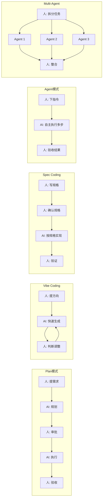
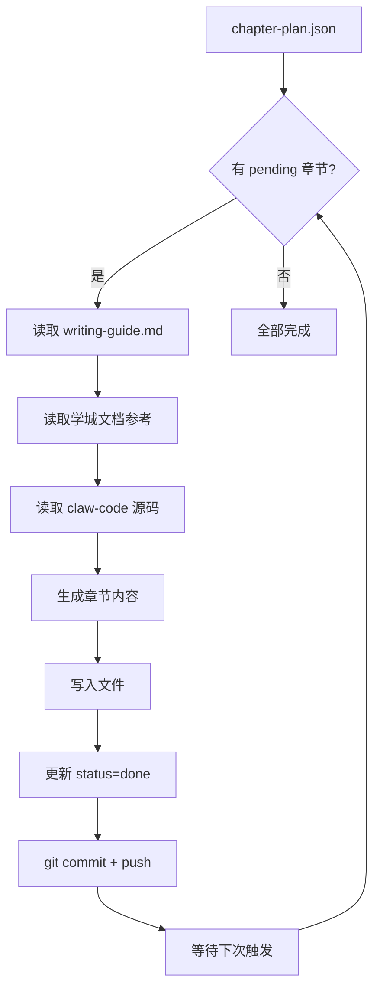

# 第16章 AI-Native 工程工作流

前 15 章分析了 claw-code 的内部实现。本章不再追踪源码，而是讨论如何把前述的 Bootstrap、ToolPool、Turn Loop、Coordinator 等机制转化为实际的工程生产力。

## 16.1 五种工作模式

claw-code 的架构支持五种工作模式，每种模式在不同的控制权转移点上把决策权在人和 LLM 之间切换。



五种模式的区别在于控制权的转移时机：

Plan 模式在规划阶段就把控制权交给 AI，但在执行前必须经过人的审批。对应 claw-code 的 Bootstrap 阶段 3（第4章）——CLI 解析参数后，进入 trust gate 判断是否可信模式，不可信模式下会限制 AI 的执行范围。

Vibe Coding 几乎把全部控制权交给 AI，人只做方向性判断。风险最高但迭代最快，适合原型探索。

Spec Coding 的控制权转移最谨慎。人先写规格文档，确认后再让 AI 按规格实现。规格是锚点，确保 AI 的输出不会偏离预期。

Agent 模式把一个完整任务交给 AI 自主执行。claw-code 的 Turn Loop（第6章）就是 Agent 模式的底层引擎——LLM 在循环中自主决定调用哪些工具、按什么顺序执行，直到认为任务完成。

Multi-Agent 把任务拆分给多个 Agent 并行处理。claw-code 的 Coordinator（第10章）提供了多 Agent 编排的基础设施。

## 16.2 Plan 模式与权限收敛

Plan 模式的核心是"先规划再执行"。在 claw-code 中，这对应 Bootstrap 的 trust gate 机制。第4章分析过 `system_init.py` 中的 `run_setup` 函数：

```python
# claw-code/src/system_init.py

def run_setup(cwd: Path | None = None, trusted: bool = True) -> SetupReport:
    root = cwd or Path(__file__).resolve().parent.parent
    prefetches = [
        start_mdm_raw_read(),
        start_keychain_prefetch(),
        start_project_scan(root),
    ]
    return SetupReport(
        setup=build_workspace_setup(),
        prefetches=tuple(prefetches),
        deferred_init=run_deferred_init(trusted=trusted),
        trusted=trusted,
        cwd=root,
    )
```

`trusted` 参数控制了后续初始化的范围。不可信模式下，`deferred_init` 跳过部分组件的加载。这对应 Plan 模式的设计意图：在规划阶段，AI 只能读取和分析，不能执行写操作。

第7章分析过 `PermissionMode` 的三个级别：

```rust
// claw-code/rust/crates/runtime/src/policy_engine.rs

pub enum PermissionMode {
    ReadOnly,         // Plan 模式：只读
    WorkspaceWrite,   // 正常模式：工作区写
    DangerFullAccess, // Agent 模式：完全访问
}
```

Plan 模式对应 `ReadOnly`，AI 可以读取代码、分析架构、输出方案，但不能修改文件。这保证了规划阶段不会产生副作用。

`ModelProvenance`（第4章）记录模型来源的四级链路（Flag → Env → Config → Default），在 Plan 模式中同样生效。不同模型的分析能力不同，规划质量也不同。通过 `--model` 参数可以在规划阶段使用更强的模型，执行阶段切换到更快的模型。

## 16.3 Spec Coding

Spec Coding 的核心是把需求写成结构化的规格文档，让 AI 按规格实现。规格文档的质量直接决定输出质量。

一个有效的 Spec 应包含以下部分：

功能边界：明确做什么、不做什么。每条边界用一句陈述句描述。

接口契约：输入参数、返回值、异常情况。格式接近 Java 的接口定义，但用自然语言补充约束。

测试要求：正常路径、异常路径、边界条件各列出具体用例。

质量约束：覆盖率要求、性能要求、兼容性要求。

claw-code 的 `commands.py` 中的 `CommandExecution` 结构（第15章）体现了 Spec 的展开机制：

```python
# claw-code/src/commands.py

@dataclass(frozen=True)
class CommandExecution:
    name: str           # 命令名
    source_hint: str    # 来源
    prompt: str         # 展开后的完整 prompt
    handled: bool       # 是否被处理
    message: str        # 结果消息
```

`prompt` 字段就是 Spec 展开后的完整文本。斜杠命令（如 `/write-chapter 4`）的本质就是一个预定义的 Spec 模板，`$ARGUMENTS` 被用户传入的参数替换后，成为完整的规格说明注入到会话中。

本书自身的写作流程就是 Spec Coding 的实例。`writing-guide.md` 是规格文档，定义了风格规则、代码引用规则、章节结构。`chapter-plan.json` 是任务分解，每章绑定源码文件和输出路径。`/write-chapter` 命令是执行入口。生成的内容严格遵循规格，不满足时用 `/rewrite-chapter` 迭代修正。

## 16.4 Agent 模式的失控与防范

Agent 模式让 AI 自主执行多步骤任务。claw-code 的 Turn Loop（第6章）是底层引擎：

```python
# claw-code/src/query_engine.py

class QueryEngine:
    def _turn_loop(self) -> None:
        while True:
            response = self.llm.chat(self.conversation.messages)
            if response.has_tool_calls():
                self.conversation.add_assistant_message(response)
                for call in response.tool_calls:
                    result = self.tools.execute(call)
                    self.conversation.add_tool_result(call, result)
                # 继续循环
            else:
                break  # LLM 决定停止
```

Turn Loop 的终止条件是"LLM 不再调用工具"。如果 LLM 持续调用工具，循环会一直运行。这带来三种失控风险：

无限循环：LLM 反复调用同一个工具，每次得到相同结果但认为需要再次调用。防范方式是在工具执行层加入调用次数限制和去重逻辑。

错误放大：LLM 在某一步做了错误判断，后续每一步都基于错误前提继续。防范方式是在 Turn Loop 中加入人工检查点（Human-in-the-loop），在关键步骤暂停等待确认。

权限越界：LLM 调用了超出预期的工具。第7章的 `PolicyEngine` 在每次工具调用前检查权限，是最后一道防线。`PermissionMode` 设为 `WorkspaceWrite` 时，工具只能在工作区目录内操作，无法修改系统文件。

`DangerFullAccess` 模式跳过所有权限检查，只在完全可信的环境中使用。对应 claw-code Bootstrap 的 `trusted=True` 路径，跳过 trust gate 直接全量初始化。

## 16.5 Multi-Agent 编排

Multi-Agent 模式把任务拆分给多个 Agent 并行处理。claw-code 的 Coordinator（第10章）提供了编排基础设施。

第10章分析过 `coordinator/__init__.py` 和 `task.py` 的任务注册机制。`TaskRegistry` 管理子任务的生命周期，`ExecutionRegistry` 跟踪执行状态。每个子任务可以独立分配给一个 Agent，Agent 之间通过共享的会话上下文或消息传递进行通信。

任务拆分有三个原则：

独立性：每个子任务的输入和输出明确，不依赖其他子任务的中间状态。claw-code 的 `Task` 数据结构要求每个任务定义完整的输入参数。

可合并性：子任务的输出可以独立整合到最终结果中。如果两个子任务的输出互相依赖，它们应该合并为一个任务，而不是拆分。

等量性：子任务的工作量大致均衡。如果一个子任务需要 10 分钟而另一个只需要 1 分钟，并行收益会被长任务拖垮。

本书的写作流程是 Multi-Agent 的实例。`chapter-plan.json` 定义了 18 个独立章节，每个章节是一个独立任务。定时任务每小时执行一次，每次处理一个 pending 章节。章节之间通过 `chapter-plan.json` 的 `status` 字段传递进度——已完成的章节标记为 `done`，下一个 Agent 读取状态后跳过已完成的，处理编号最小的 pending 章节。



## 16.6 工作流编排：Plan → Spec → Agent → Review

实际工程中，五种模式不是孤立使用的。一个完整的工作流通常组合多种模式：

Plan 阶段用 Plan 模式（ReadOnly），让 AI 分析需求、读取代码、输出技术方案和任务拆解。

Spec 阶段基于 Plan 的输出，人写规格文档。这个阶段 AI 不参与，是人的决策环节。

Agent 阶段用 Spec Coding 或 Agent 模式，把 Spec 交给 AI 按规格实现。复杂任务用 Multi-Agent 拆分并行。

Review 阶段用 Plan 模式（ReadOnly），让 AI 审查代码、检查覆盖率、验证是否符合 Spec。

claw-code 的配置层（第15章）为这个工作流提供了基础设施。`RulesImportConfig` 控制 AI 能看到哪些项目规则。Commands 定义了 `/plan`、`/review` 等工作流入口。MCP 工具让 AI 能访问外部系统（如 ONES 工单、CI 流水线）。Skills 封装了特定领域的审查规则。

## 16.7 模式选择矩阵

| 任务特征 | 推荐模式 | 理由 |
| --- | --- | --- |
| 需求不明确，需探索 | Plan 模式 | 先分析再决策，避免方向性错误 |
| 原型验证，允许失败 | Vibe Coding | 快速迭代，接受返工 |
| 生产代码，需可追溯 | Spec Coding | 规格驱动，质量可控 |
| 重复性多步骤任务 | Agent 模式 | 自主执行，释放人力 |
| 大规模并行任务 | Multi-Agent | 分工协作，效率倍增 |
| 安全敏感（如权限系统） | Spec + Review | 规格 + 审查双重保障 |
| 创意探索（如 UI 设计） | Vibe + Plan | 先发散后收敛 |

选择模式时的核心判断是：这个任务中，控制权在哪个节点转移给 AI 是安全的。容错越低的任务，控制权转移越晚（Spec Coding）。容错越高的任务，控制权转移越早（Vibe Coding）。

## 设计对比

| claw-code 工作模式 | Java 生态对应 |
| --- | --- |
| Plan 模式（ReadOnly） | Spring Boot 的 `--dry-run` 模式 |
| Spec Coding | TDD（测试驱动开发）的"红-绿-重构" |
| Agent 模式 Turn Loop | Spring Batch 的 `Tasklet` 循环 |
| Multi-Agent Coordinator | Spring Cloud 的微服务编排 |
| PermissionMode 三级 | Spring Security 的 `@Secured` 分级权限 |
| Commands 斜杠命令 | Maven 的 `mvn compile`/`mvn test` 目标 |

Spec Coding 和 TDD 的理念高度一致。TDD 先写测试（相当于 Spec），再写实现让测试通过（相当于 AI 按 Spec 实现）。区别在于 TDD 的 Spec 是可执行的测试代码，Spec Coding 的 Spec 是自然语言文档。两者都通过"先定义正确性标准再实现"来降低返工成本。

## 小结

AI-Native 工程工作流的核心不是"用 AI 替代人"，而是"把工作流重新设计为人机协作系统"。五种模式（Plan、Vibe、Spec、Agent、Multi-Agent）在控制权转移时机上各有侧重。claw-code 的 Bootstrap trust gate、PermissionMode 三级权限、Turn Loop 循环引擎、Coordinator 多 Agent 编排分别为这五种模式提供了底层支撑。模式选择的核心判断是容错性：容错越低，控制权转移越晚。
