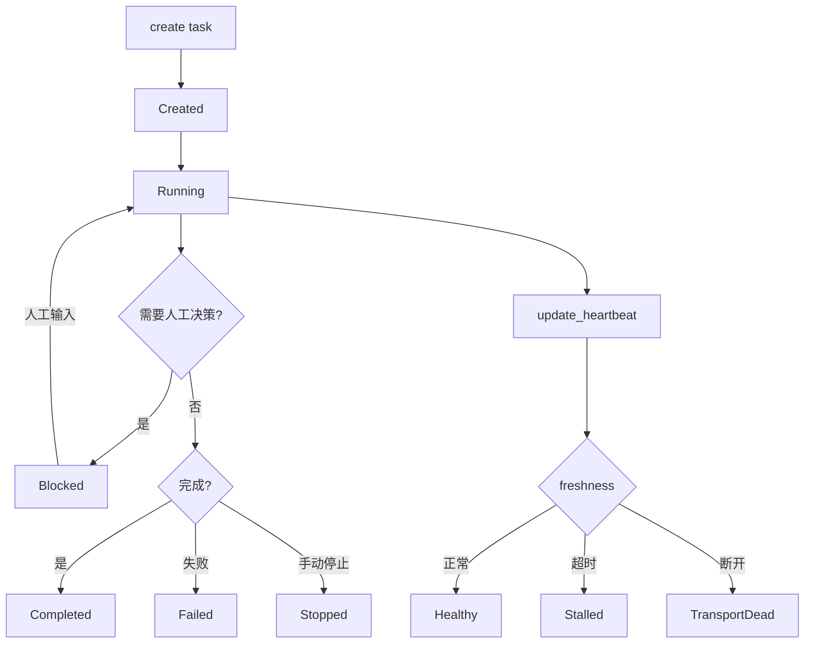
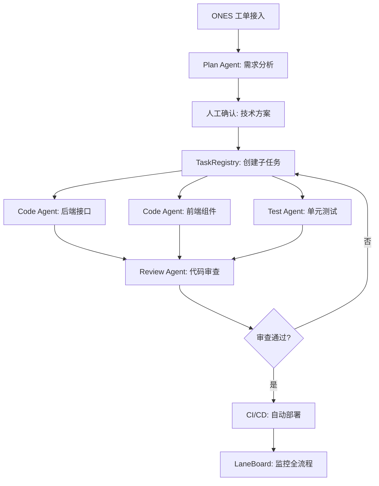

# 第17章 实战：研发全流程 Multi-Agent

本章把前 16 章的分析整合为一个完整的 Multi-Agent 工作流设计。以 claw-code 的 `TaskRegistry`、`Coordinator`、`remote_runtime` 等模块为基础，构建一个从需求接入到代码交付的端到端 Agent 系统。

## 17.1 TaskRegistry：任务的生命周期管理

Rust 版的 `TaskRegistry` 是多 Agent 编排的基础设施，定义在 `runtime/src/task_registry.rs` 中。`Task` 结构体是核心数据模型：

```rust
// claw-code/rust/crates/runtime/src/task_registry.rs

pub struct Task {
    pub task_id: String,               // 唯一标识，格式 task_{timestamp}_{counter}
    pub prompt: String,                 // 任务指令
    pub description: Option<String>,    // 任务描述
    pub task_packet: Option<TaskPacket>, // 结构化任务包
    pub status: TaskStatus,             // 当前状态
    pub created_at: u64,                // 创建时间戳
    pub updated_at: u64,                // 最后更新时间戳
    pub messages: Vec<TaskMessage>,     // 对话历史
    pub output: String,                 // 最终输出
    pub team_id: Option<String>,        // 所属团队
    pub heartbeat: Option<LaneHeartbeat>, // 心跳信息
}
```

`TaskStatus` 枚举定义了任务的六个状态：

```rust
// claw-code/rust/crates/runtime/src/task_registry.rs

pub enum TaskStatus {
    Created,    // 已创建，未开始
    Running,    // 执行中
    Blocked,    // 被阻塞（等待人工输入或依赖完成）
    Completed,  // 已完成
    Failed,     // 执行失败
    Stopped,    // 被手动停止
}
```

状态流转路径：`Created → Running → (Blocked → Running)* → Completed | Failed | Stopped`。`Blocked` 状态是人工介入点——当 Agent 需要决策确认时，任务进入 `Blocked`，等待人工输入后恢复为 `Running`。

`TaskRegistry` 使用 `Arc<Mutex<RegistryInner>>` 保证线程安全：

```rust
// claw-code/rust/crates/runtime/src/task_registry.rs

pub struct TaskRegistry {
    inner: Arc<Mutex<RegistryInner>>,
}

struct RegistryInner {
    tasks: HashMap<String, Task>,
    counter: u64,
}
```

`create` 方法生成任务 ID 并插入 HashMap：

```rust
// claw-code/rust/crates/runtime/src/task_registry.rs

pub fn create(&self, prompt: &str, description: Option<&str>) -> Task {
    self.create_task(prompt.to_owned(), description.map(str::to_owned), None)
}

fn create_task(
    &self,
    prompt: String,
    description: Option<String>,
    task_packet: Option<TaskPacket>,
) -> Task {
    let mut inner = self.inner.lock().expect("registry lock poisoned");
    inner.counter += 1;
    let ts = now_secs();
    let task_id = format!("task_{:08x}_{}", ts, inner.counter);
    let task = Task {
        task_id: task_id.clone(),
        prompt,
        description,
        task_packet,
        status: TaskStatus::Created,
        created_at: ts,
        updated_at: ts,
        messages: Vec::new(),
        output: String::new(),
        team_id: None,
        heartbeat: None,
    };
    inner.tasks.insert(task_id, task.clone());
    task
}
```

`create_from_packet` 接受结构化的 `TaskPacket`，经过验证后创建任务：

```rust
// claw-code/rust/crates/runtime/src/task_registry.rs

pub fn create_from_packet(
    &self,
    packet: TaskPacket,
) -> Result<Task, TaskPacketValidationError> {
    let packet = validate_packet(packet)?.into_inner();
    let description = packet
        .scope_path
        .clone()
        .or_else(|| Some(packet.scope.to_string()));
    Ok(self.create_task(packet.objective.clone(), description, Some(packet)))
}
```

`TaskPacket` 提供了比纯 prompt 更丰富的结构化输入，包含目标（objective）、范围（scope）、路径（scope_path）等字段。`validate_packet` 在创建前验证包的完整性和合法性。

## 17.2 LaneBoard：任务看板与心跳监控

`LaneBoard` 是 `TaskRegistry` 的监控视图，把任务按状态分组：

```rust
// claw-code/rust/crates/runtime/src/task_registry.rs

pub struct LaneBoard {
    pub generated_at: u64,
    pub active: Vec<LaneBoardEntry>,    // 运行中的任务
    pub blocked: Vec<LaneBoardEntry>,   // 被阻塞的任务
    pub finished: Vec<LaneBoardEntry>,  // 已完成的任务
}
```

`LaneBoardEntry` 携带心跳信息，用于判断任务是否健康：

```rust
// claw-code/rust/crates/runtime/src/task_registry.rs

pub struct LaneBoardEntry {
    pub task_id: String,
    pub prompt: String,
    pub status: TaskStatus,
    pub team_id: Option<String>,
    pub heartbeat: Option<LaneHeartbeat>,
    pub freshness: LaneFreshness,
}
```

`LaneFreshness` 枚举定义了三种健康状态：

```rust
// claw-code/rust/crates/runtime/src/task_registry.rs

pub enum LaneFreshness {
    Healthy,       // 心跳正常
    Stalled,       // 心跳超时，可能卡住
    TransportDead, // 传输层已断开
    Unknown,       // 无心跳信息
}
```

`update_heartbeat` 方法由 Agent 定期调用，报告自己的存活状态：

```rust
// claw-code/rust/crates/runtime/src/task_registry.rs

pub fn update_heartbeat(&self, task_id: &str, heartbeat: LaneHeartbeat) -> Result<(), String> {
    let mut inner = self.inner.lock().expect("registry lock poisoned");
    let task = inner
        .tasks
        .get_mut(task_id)
        .ok_or_else(|| format!("task not found: {task_id}"))?;
    task.heartbeat = Some(heartbeat);
    task.updated_at = now_secs();
    Ok(())
}
```

`LaneHeartbeat` 包含传输层存活状态和 Agent 报告的状态字符串：

```rust
// claw-code/rust/crates/runtime/src/task_registry.rs

pub struct LaneHeartbeat {
    pub observed_at: u64,
    pub transport_alive: bool,
    pub status: String,
}
```

这套机制使得 `LaneBoard` 可以实时展示所有任务的运行状态。`Stalled` 状态的任务（心跳超时）会被标记为需要关注，`TransportDead` 的任务需要重新分配。



## 17.3 远程运行模式

`remote_runtime.py` 定义了 claw-code 支持的远程执行模式：

```python
# claw-code/src/remote_runtime.py

@dataclass(frozen=True)
class RuntimeModeReport:
    mode: str
    connected: bool
    detail: str

def run_remote_mode(target: str) -> RuntimeModeReport:
    return RuntimeModeReport('remote', True, f'Remote control placeholder prepared for {target}')

def run_ssh_mode(target: str) -> RuntimeModeReport:
    return RuntimeModeReport('ssh', True, f'SSH proxy placeholder prepared for {target}')

def run_teleport_mode(target: str) -> RuntimeModeReport:
    return RuntimeModeReport('teleport', True, f'Teleport resume/create placeholder prepared for {target}')
```

三种远程模式对应不同的连接场景：

`remote` 模式通过 claw-code 的远程运行时协议连接到另一台机器上的 Agent 实例。`ssh` 模式通过 SSH 隧道连接远程机器。`teleport` 模式通过 Teleport 基础设施进行连接。

这三种模式出现在第4章分析过的 Bootstrap 阶段 6（mode routing）中：

```python
# claw-code/src/bootstrap_graph.py

'mode routing: local / remote / ssh / teleport / direct-connect / deep-link'
```

阶段 6 根据 CLI 参数选择运行模式，不同模式下 Agent 的执行环境不同。`local` 模式在当前机器上直接执行，`remote`/`ssh`/`teleport` 模式在远程机器上执行，Agent 通过网络通信。

## 17.4 ExecutionRegistry：命令与工具的注册表

`ExecutionRegistry` 把命令和工具统一管理：

```python
# claw-code/src/execution_registry.py

@dataclass(frozen=True)
class MirroredCommand:
    name: str
    source_hint: str

    def execute(self, prompt: str) -> str:
        return execute_command(self.name, prompt).message

@dataclass(frozen=True)
class MirroredTool:
    name: str
    source_hint: str

    def execute(self, payload: str) -> str:
        return execute_tool(self.name, payload).message

@dataclass(frozen=True)
class ExecutionRegistry:
    commands: tuple[MirroredCommand, ...]
    tools: tuple[MirroredTool, ...]

    def command(self, name: str) -> MirroredCommand | None:
        lowered = name.lower()
        for command in self.commands:
            if command.name.lower() == lowered:
                return command
        return None

    def tool(self, name: str) -> MirroredTool | None:
        lowered = name.lower()
        for tool in self.tools:
            if tool.name.lower() == lowered:
                return tool
        return None

def build_execution_registry() -> ExecutionRegistry:
    return ExecutionRegistry(
        commands=tuple(MirroredCommand(module.name, module.source_hint) for module in PORTED_COMMANDS),
        tools=tuple(MirroredTool(module.name, module.source_hint) for module in PORTED_TOOLS),
    )
```

`build_execution_registry` 在启动时构建注册表，把所有命令和工具的快照加载进来。`command` 和 `tool` 方法做大小写不敏感的名称查找。这个注册表是 Agent 执行能力的清单——Agent 能调用哪些命令、能使用哪些工具，都由这个注册表决定。

## 17.5 完整工作流设计

基于前述的 `TaskRegistry`、`LaneBoard`、`remote_runtime` 和 `ExecutionRegistry`，可以构建一个端到端的 Multi-Agent 研发工作流：



工作流分为六个阶段：

需求接入：Plan Agent 以 `ReadOnly` 权限运行，读取 ONES 工单内容、分析现有代码、输出技术方案和任务拆解。对应第16章的 Plan 模式。

人工确认：Plan Agent 输出方案后，任务状态进入 `Blocked`，等待人工审批。这是第一个控制权回收点。

任务分发：确认后，`TaskRegistry.create` 为每个子任务创建 `Task` 实例。每个子任务独立分配给一个 Code Agent 或 Test Agent，以 `WorkspaceWrite` 权限运行。对应第16章的 Multi-Agent 模式。

并行执行：多个 Agent 并行工作，各自维护自己的 Turn Loop（第6章）。`LaneBoard` 实时展示所有任务的状态和心跳。

代码审查：Review Agent 以 `ReadOnly` 权限审查所有 Agent 的产出。审查不通过的任务回到分发阶段重新执行。

交付：审查通过后触发 CI/CD 流水线自动部署。`LaneBoard` 中任务状态变为 `Completed`。

每个阶段使用的 claw-code 机制：

| 阶段 | claw-code 组件 | 对应章节 |
| --- | --- | --- |
| 需求接入 | `PermissionMode::ReadOnly` + Turn Loop | 第7章、第6章 |
| 任务分发 | `TaskRegistry.create` + `TaskPacket` | 第10章 |
| 并行执行 | `LaneBoard` 心跳监控 + `ExecutionRegistry` | 第10章、第17.4节 |
| 代码审查 | `PermissionMode::ReadOnly` + Hooks | 第7章、第8章 |
| 交付 | `remote_runtime` 远程触发 CI | 第17.3节 |

## 17.6 错误恢复与断点续行

`TaskRegistry` 的 `Blocked` 和 `Stopped` 状态为错误恢复提供了基础。

`Blocked` 状态的任务保留完整的 `messages` 历史，人工输入后可以从断点恢复执行，不需要重新开始。`TaskMessage` 结构体记录了每一轮对话：

```rust
// claw-code/rust/crates/runtime/src/task_registry.rs

pub struct TaskMessage {
    pub role: String,       // "user" / "assistant" / "tool"
    pub content: String,    // 消息内容
    pub timestamp: u64,     // 时间戳
}
```

`Stopped` 状态的任务可以通过 `TaskRegistry.get(task_id)` 获取完整状态，重新分配给另一个 Agent 继续。`heartbeat` 信息帮助判断任务停止的原因——如果是 `TransportDead`，说明是网络问题，任务本身可能没有逻辑错误，重新分配即可恢复。

本书的写作流程就是断点续行的实例。`chapter-plan.json` 中的 `status` 字段相当于 `TaskStatus`——每个章节是一个任务，`pending` 对应 `Created`，`done` 对应 `Completed`。定时任务每次运行时读取状态，跳过已完成的章节，处理下一个 `pending` 章节。如果某次执行失败（如源码文件缺失），章节状态保持 `pending`，下次运行会重新处理。

## 设计对比

| claw-code Multi-Agent 组件 | Java 生态对应 |
| --- | --- |
| `TaskRegistry` | Spring Batch 的 `JobRepository` |
| `TaskStatus` 六状态 | Spring Batch 的 `BatchStatus`（STARTING/STARTED/COMPLETED/FAILED） |
| `LaneBoard` 看板 | Spring Boot Actuator 的 `/actuator/batchjobs` |
| `LaneFreshness` 心跳 | Spring Cloud 的健康检查（Health Check） |
| `ExecutionRegistry` | Spring IoC 的 `BeanFactory` |
| `remote_runtime` 远程模式 | Spring Cloud 的远程调用（Feign/Ribbon） |
| `TaskPacket` 结构化任务包 | Spring Batch 的 `JobParameters` |

`TaskRegistry` 和 Spring Batch 的 `JobRepository` 在设计意图上高度一致：都是把任务状态持久化，支持断点恢复和状态查询。区别在于 Spring Batch 的任务是有界的（固定步骤序列），claw-code 的任务是开放-ended 的（由 LLM 在 Turn Loop 中动态决定执行路径）。

`LaneBoard` 的 `active`/`blocked`/`finished` 三栏看板，对应 Spring Batch 的 `JobRepository` 中按状态查询任务。`LaneFreshness` 的心跳机制在 Java 生态中通常通过 Spring Cloud 的 Eureka 健康检查实现——服务定期发送心跳，超时后被标记为不健康。

## 小结

本章把前 16 章的分析整合为一个完整的 Multi-Agent 研发工作流。`TaskRegistry` 提供任务的生命周期管理，`TaskStatus` 的六状态枚举支持 `Blocked` 断点和 `Stopped` 恢复。`LaneBoard` 提供实时看板和心跳监控，`LaneFreshness` 区分健康、超时和断连三种状态。`ExecutionRegistry` 统一管理 Agent 可用的命令和工具。`remote_runtime` 支持本地、远程、SSH、Teleport 四种执行模式。完整工作流分为需求接入、人工确认、任务分发、并行执行、代码审查、交付六个阶段，每个阶段使用前序章节分析过的 claw-code 机制作为底层支撑。
