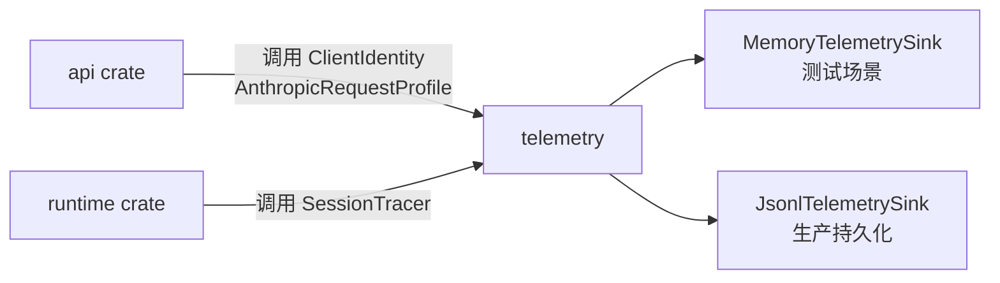
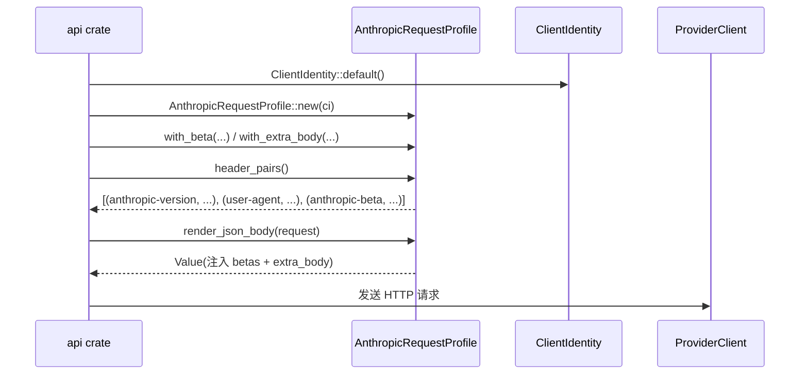

# 第17章 telemetry：会话追踪与遥测

## 本章概览

telemetry crate 是一个共享库，为核心运行时提供结构化事件收集和持久化能力。它不启动独立进程，而是被第 5 章介绍的 api crate 的 ProviderClient 和第 10 章介绍的 runtime crate 的会话管理模块作为库依赖调用，负责在 API 请求链路中注入身份标识、记录 HTTP 生命周期事件，以及为会话生成有序追踪记录。

关键文件清单：

| 文件路径 | 职责 |
|----------|------|
| rust/crates/telemetry/src/lib.rs | 全部实现：事件类型、Sink trait、SessionTracer |
| rust/crates/telemetry/Cargo.toml | 纯 serde + std 依赖，刻意保持零外部网络库 |

telemetry 与核心运行时的关系如下：



## 17.1 事件模型与类型设计

lib.rs 定义了五类遥测事件，通过 TelemetryEvent 枚举统一表示。事件分为两个层级：底层 HTTP 生命周期事件（HttpRequestStarted、HttpRequestSucceeded、HttpRequestFailed）和业务层事件（AnalyticsEvent、SessionTraceRecord）。所有变体均实现 Serialize 和 Deserialize，保证跨语言消费时的结构稳定性。

TelemetryEvent 采用 #[serde(tag = "type", rename_all = "snake_case")] 进行内部标签序列化，每条 NDJSON 记录都会携带 "type" 字段作为下游分拣键。

```rust
// claw-code/rust/crates/telemetry/src/lib.rs

#[derive(Debug, Clone, PartialEq, Serialize, Deserialize)]
#[serde(tag = "type", rename_all = "snake_case")]
pub enum TelemetryEvent {
    HttpRequestStarted {
        session_id: String,
        attempt: u32,
        method: String,
        path: String,
        #[serde(default, skip_serializing_if = "Map::is_empty")]
        attributes: Map<String, Value>,
    },
    HttpRequestSucceeded {
        session_id: String,
        attempt: u32,
        method: String,
        path: String,
        status: u16,
        #[serde(default, skip_serializing_if = "Option::is_none")]
        request_id: Option<String>,
        #[serde(default, skip_serializing_if = "Map::is_empty")]
        attributes: Map<String, Value>,
    },
    HttpRequestFailed {
        session_id: String,
        attempt: u32,
        method: String,
        path: String,
        error: String,
        retryable: bool,
        #[serde(default, skip_serializing_if = "Map::is_empty")]
        attributes: Map<String, Value>,
    },
    Analytics(AnalyticsEvent),
    SessionTrace(SessionTraceRecord),
}
```

HttpRequestStarted 和 HttpRequestSucceeded 共享 session_id、attempt、method、path 四个字段，构成请求追踪的最小上下文。attempt 字段记录重试次数，用于在多副本或超时重试场景下区分同一逻辑请求的不同物理尝试。HttpRequestSucceeded 额外携带 status 和可选的 request_id，后者通常由上游服务商返回，用于事后对账。HttpRequestFailed 则记录 error 字符串和 retryable 布尔值，为自动重试策略提供决策输入。

AnalyticsEvent 采用命名空间-动作模型，允许业务代码在不修改 telemetry crate 的前提下发送自定义事件。

```rust
// claw-code/rust/crates/telemetry/src/lib.rs

#[derive(Debug, Clone, PartialEq, Serialize, Deserialize)]
pub struct AnalyticsEvent {
    pub namespace: String,
    pub action: String,
    #[serde(default, skip_serializing_if = "Map::is_empty")]
    pub properties: Map<String, Value>,
}
```

namespace 用于事件分类（例如 "cli"、"session"、"tool"），action 描述具体操作（例如 "prompt_sent"、"turn_completed"），properties 承载任意 JSON 扩展字段。这种设计将事件 schema 的演进压力从库内部转移到调用方，telemetry crate 只负责序列化和投递。

SessionTraceRecord 是会话追踪的基本单元，包含原子序列号、时间戳和可扩展属性。

```rust
// claw-code/rust/crates/telemetry/src/lib.rs

#[derive(Debug, Clone, PartialEq, Serialize, Deserialize)]
pub struct SessionTraceRecord {
    pub session_id: String,
    pub sequence: u64,
    pub name: String,
    pub timestamp_ms: u64,
    #[serde(default, skip_serializing_if = "Map::is_empty")]
    pub attributes: Map<String, Value>,
}
```

sequence 由 AtomicU64 单调递增生成，保证同一 session_id 下所有事件的全序关系。timestamp_ms 使用 UNIX 纪元毫秒，避免时区歧义。SessionTraceRecord 与 TelemetryEvent 中的 HTTP 变体不是互斥关系，而是互补关系：当 HTTP 事件发生时，SessionTracer 会同时生成一个底层 TelemetryEvent 和一个高层 SessionTraceRecord，实现多粒度观测。

## 17.2 TelemetrySink 与持久化架构

telemetry 采用 Sink trait 抽象持久化后端，将事件生成与存储解耦。TelemetrySink 要求实现 Send + Sync，允许在多线程环境中共享。

```rust
// claw-code/rust/crates/telemetry/src/lib.rs

pub trait TelemetrySink: Send + Sync {
    fn record(&self, event: TelemetryEvent);
}
```

record 方法接受所有权并立即处理，不返回 Result。这意味着 telemetry 将错误处理策略下放给具体实现：内存 Sink 可以忽略溢出，文件 Sink 可以静默丢弃序列化失败。这种设计避免了在热路径上引入错误分支，但要求生产环境的 Sink 实现具备内部容错。

crate 提供两个内置实现：MemoryTelemetrySink 用于测试，JsonlTelemetrySink 用于生产持久化。

```rust
// claw-code/rust/crates/telemetry/src/lib.rs

#[derive(Default)]
pub struct MemoryTelemetrySink {
    events: Mutex<Vec<TelemetryEvent>>,
}

impl TelemetrySink for MemoryTelemetrySink {
    fn record(&self, event: TelemetryEvent) {
        self.events
            .lock()
            .unwrap_or_else(std::sync::PoisonError::into_inner)
            .push(event);
    }
}
```

MemoryTelemetrySink 使用 Mutex<Vec<_>> 顺序存储事件，并通过 unwrap_or_else(std::sync::PoisonError::into_inner) 在锁中毒时恢复内部数据。测试代码可以直接调用 events() 方法取出完整列表进行断言，无需解析外部文件。

```rust
// claw-code/rust/crates/telemetry/src/lib.rs

pub struct JsonlTelemetrySink {
    path: PathBuf,
    file: Mutex<File>,
}

impl TelemetrySink for JsonlTelemetrySink {
    fn record(&self, event: TelemetryEvent) {
        let Ok(line) = serde_json::to_string(&event) else {
            return;
        };
        let mut file = self
            .file
            .lock()
            .unwrap_or_else(std::sync::PoisonError::into_inner);
        let _ = writeln!(file, "{line}");
        let _ = file.flush();
    }
}
```

JsonlTelemetrySink 将每条事件序列化为单行 JSON 并追加到文件。create(true).append(true) 的打开模式保证进程重启后不会覆盖历史数据。序列化和写入错误均被静默忽略，这是有意为之的降级策略：即使磁盘满了或路径不可写，API 请求链路也不应被遥测系统阻塞。

两个 Sink 的对比如下：

| 维度 | MemoryTelemetrySink | JsonlTelemetrySink |
|------|---------------------|-------------------|
| 用途 | 测试断言 | 生产持久化 |
| 存储介质 | 堆内存 | 本地 NDJSON 文件 |
| 进程重启后数据 | 丢失 | 保留 |
| 序列化失败处理 | 无（内存无需序列化） | 静默丢弃 |
| 并发安全 | Mutex | Mutex |

## 17.3 SessionTracer：会话关联与原子排序

SessionTracer 是 telemetry 对外暴露的主要 API，它将 session_id、原子序列号和 TelemetrySink 封装为一个可克隆的句柄。SessionTracer 本身不持有线程句柄，所有操作均在调用线程同步完成。

```rust
// claw-code/rust/crates/telemetry/src/lib.rs

#[derive(Clone)]
pub struct SessionTracer {
    session_id: String,
    sequence: Arc&lt;AtomicU64&gt;,
    sink: Arc&lt;dyn TelemetrySink&gt;,
}
```

`Arc<AtomicU64>` 保证跨克隆实例的序列号全局单调。`Ordering::Relaxed` 即可满足需求，因为序列号只要求单调递增，不要求跨线程的严格即时可见性。

SessionTracer 为 HTTP 请求提供了三个快捷方法：record_http_request_started、record_http_request_succeeded、record_http_request_failed。以下以成功路径为例说明其双重记录机制。

```rust
// claw-code/rust/crates/telemetry/src/lib.rs

pub fn record_http_request_succeeded(
    &self,
    attempt: u32,
    method: impl Into<String>,
    path: impl Into<String>,
    status: u16,
    request_id: Option<String>,
    attributes: Map<String, Value>,
) {
    let method = method.into();
    let path = path.into();
    self.sink.record(TelemetryEvent::HttpRequestSucceeded {
        session_id: self.session_id.clone(),
        attempt,
        method: method.clone(),
        path: path.clone(),
        status,
        request_id: request_id.clone(),
        attributes: attributes.clone(),
    });
    let mut trace_attributes = merge_trace_fields(method, path, attempt, attributes);
    trace_attributes.insert("status".to_string(), Value::from(status));
    if let Some(request_id) = request_id {
        trace_attributes.insert("request_id".to_string(), Value::String(request_id));
    }
    self.record("http_request_succeeded", trace_attributes);
}
```

该方法首先向 Sink 投递一个 TelemetryEvent::HttpRequestSucceeded，然后构造 SessionTraceRecord 并再次投递。merge_trace_fields 将 method、path、attempt 合并到属性映射中，避免重复编码。双重记录的设计意图是：下游可观测性系统可以选择消费结构化的 HTTP 事件（用于请求拓扑分析），也可以选择消费扁平化的追踪记录（用于时序数据库或日志聚合）。

record 方法是所有追踪记录的统一入口，负责填充序列号和时间戳。

```rust
// claw-code/rust/crates/telemetry/src/lib.rs

pub fn record(&self, name: impl Into<String>, attributes: Map<String, Value>) {
    let record = SessionTraceRecord {
        session_id: self.session_id.clone(),
        sequence: self.sequence.fetch_add(1, Ordering::Relaxed),
        name: name.into(),
        timestamp_ms: current_timestamp_ms(),
        attributes,
    };
    self.sink.record(TelemetryEvent::SessionTrace(record));
}
```

fetch_add(1, Ordering::Relaxed) 返回递增前的旧值，因此第一个事件的序列号为 0。current_timestamp_ms 使用 SystemTime::duration_since(UNIX_EPOCH)，在时钟回拨时回退到 0，避免 panic。

## 17.4 与 api crate 的集成：ClientIdentity 与请求画像

telemetry crate 不仅负责事件收集，还定义了 API 请求的身份标识结构。ClientIdentity 和 AnthropicRequestProfile 被 api crate（第 5 章）用于构造发往 Anthropic API 的请求头和请求体。

ClientIdentity 封装应用名称、版本和运行时标识。

```rust
// claw-code/rust/crates/telemetry/src/lib.rs

#[derive(Debug, Clone, PartialEq, Eq, Serialize, Deserialize)]
pub struct ClientIdentity {
    pub app_name: String,
    pub app_version: String,
    pub runtime: String,
}

impl ClientIdentity {
    pub fn new(app_name: impl Into<String>, app_version: impl Into<String>) -> Self {
        Self {
            app_name: app_name.into(),
            app_version: app_version.into(),
            runtime: DEFAULT_RUNTIME.to_string(),
        }
    }

    pub fn user_agent(&self) -> String {
        format!("{}/{}", self.app_name, self.app_version)
    }
}
```

DEFAULT_RUNTIME 固定为 "rust"，与 Python 原始实现区分。user_agent() 生成 "claude-code/0.x.x" 格式的字符串，作为 HTTP user-agent 头。with_runtime 允许覆盖运行时标识，为后续非 Rust 绑定预留扩展点。

AnthropicRequestProfile 将 ClientIdentity 与 Anthropic API 特定的协议字段组合在一起。

```rust
// claw-code/rust/crates/telemetry/src/lib.rs

#[derive(Debug, Clone, PartialEq, Serialize, Deserialize)]
pub struct AnthropicRequestProfile {
    pub anthropic_version: String,
    pub client_identity: ClientIdentity,
    #[serde(default, skip_serializing_if = "Vec::is_empty")]
    pub betas: Vec<String>,
    #[serde(default, skip_serializing_if = "Map::is_empty")]
    pub extra_body: Map<String, Value>,
}
```

anthropic_version 对应 anthropic-version HTTP 头，betas 列表对应 anthropic-beta 头。默认初始化时，betas 自动包含 DEFAULT_AGENTIC_BETA 和 DEFAULT_PROMPT_CACHING_SCOPE_BETA 两个特性标识，分别启用 agentic 工作流和提示缓存作用域。

header_pairs() 方法将 profile 转换为可直接写入 HTTP 客户端的键值对列表。

```rust
// claw-code/rust/crates/telemetry/src/lib.rs

pub fn header_pairs(&self) -> Vec<(String, String)> {
    let mut headers = vec![
        (
            "anthropic-version".to_string(),
            self.anthropic_version.clone(),
        ),
        ("user-agent".to_string(), self.client_identity.user_agent()),
    ];
    if !self.betas.is_empty() {
        headers.push(("anthropic-beta".to_string(), self.betas.join(",")));
    }
    headers
}
```

render_json_body() 方法则将 profile 中的 extra_body 和 betas 合并到请求体中。这是 telemetry 参与 API 通信的关键位置：它不止提供观测能力，还直接影响请求协议。

```rust
// claw-code/rust/crates/telemetry/src/lib.rs

pub fn render_json_body<T: Serialize>(&self, request: &T) -> Result<Value, serde_json::Error> {
    let mut body = serde_json::to_value(request)?;
    let object = body.as_object_mut().ok_or_else(|| {
        serde_json::Error::io(std::io::Error::new(
            std::io::ErrorKind::InvalidData,
            "request body must serialize to a JSON object",
        ))
    })?;
    for (key, value) in &self.extra_body {
        object.insert(key.clone(), value.clone());
    }
    if !self.betas.is_empty() {
        object.insert(
            "betas".to_string(),
            Value::Array(self.betas.iter().cloned().map(Value::String).collect()),
        );
    }
    Ok(body)
}
```

render_json_body 接受一个泛型请求结构，先将其序列化为 Value，再动态注入 extra_body 和 betas。注入逻辑要求请求体必须是 JSON 对象（即 Value::Object），否则会返回 InvalidData 错误。extra_body 的设计意图是允许调用方在不修改 api crate 的前提下注入实验性字段或厂商扩展。

telemetry 与 api crate 的协作链路如下：



## 17.5 数据契约与可观测性对接

telemetry crate 刻意保持极简依赖。Cargo.toml 中只有 serde 和 serde_json 两个外部依赖，不涉及任何 HTTP 客户端、异步运行时或日志框架。

// claw-code/rust/crates/telemetry/Cargo.toml

```toml
[dependencies]
serde = { version = "1", features = ["derive"] }
serde_json = "1"
```

零网络库的设计决策意味着 telemetry 不直接对接 OpenTelemetry Collector、Prometheus 或任何外部 SaaS。事件持久化完全依赖 JsonlTelemetrySink 写入本地 NDJSON 文件，由外部代理（如 Fluent Bit、Vector、Filebeat）轮转和上传。这种解耦避免了在核心链路中引入网络 I/O 和重试逻辑，同时将后端可观测性栈的选择权留给部署方。

NDJSON 格式要求每条记录为独立的 JSON 对象，以换行符分隔。JsonlTelemetrySink 的写入方式天然满足这一规范。下游系统按行读取后，可通过 "type" 字段进行事件分拣：

| type 值 | 对应变体 | 典型消费方 |
|---------|---------|-----------|
| http_request_started | TelemetryEvent::HttpRequestStarted | 请求拓扑追踪 |
| http_request_succeeded | TelemetryEvent::HttpRequestSucceeded | 成功率统计 |
| http_request_failed | TelemetryEvent::HttpRequestFailed | 告警与重试分析 |
| analytics | TelemetryEvent::Analytics | 业务指标看板 |
| session_trace | TelemetryEvent::SessionTrace | 会话回放与调试 |

SessionTraceRecord 的扁平属性结构便于直接导入列式存储或时序数据库。session_id 和 sequence 组合构成唯一排序键，timestamp_ms 支持按时间范围过滤。调用方在 attributes 中附加的自定义字段会被原样保留，下游 schema 演化无需修改 telemetry crate。

## 小结

telemetry crate 通过 TelemetryEvent 枚举定义了 HTTP 生命周期、分析事件和会话追踪三种事件模型，借助 TelemetrySink trait 将事件生成与持久化解耦。SessionTracer 使用原子序列号保证会话内事件的全序，并在每个 HTTP 方法中同时输出结构化事件和扁平追踪记录。ClientIdentity 与 AnthropicRequestProfile 则承担了 API 请求的身份标识和协议字段注入职责，使 telemetry 超越了传统意义上的日志库。

关键文件清单：

| 文件路径 | 职责 |
|----------|------|
| rust/crates/telemetry/src/lib.rs | 事件类型、Sink trait、SessionTracer、ClientIdentity、AnthropicRequestProfile |
| rust/crates/telemetry/Cargo.toml | 零外部网络依赖的 Cargo 配置 |

telemetry 作为共享库被 api crate 和 runtime crate 调用，本身无独立进程。下一章将介绍 Python 原始实现的移植层架构，说明 Rust 重写前的命令图、工具池和查询引擎设计。
