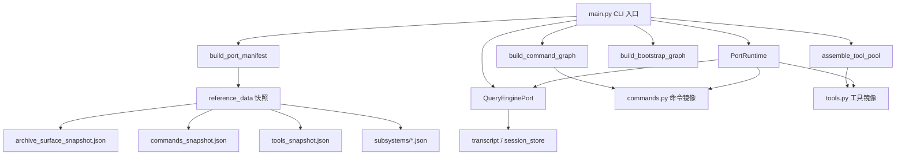

# 第18章 Python 原始实现：移植层架构

## 本章概览

本章讲解 claw-code 仓库中 `src/` 目录下的 Python 移植层。这一层在 Rust 重写之前作为参考实现存在，其核心目标不是运行一个真正的 Agent，而是通过镜像 TypeScript 上游源码的接口来追踪移植进度。它与核心运行时（`rust/crates/`）之间没有任何代码依赖关系，不参与编译，也不参与打包。

理解这一层的价值在于架构对照：Python 层如何组织命令图、工具池、查询引擎三大子系统，以及这些概念在 Rust 重写时被拆分、合并到了哪些 crate。本章将依次说明整体结构、数据镜像机制、启动阶段、运行时模型、命令与工具的组织方式，以及最终迁移到 Rust 的线索。

关键文件清单：

| 文件路径 | 职责 |
|----------|------|
| src/main.py | CLI 入口与子命令注册，共 24 个子命令 |
| src/runtime.py | `PortRuntime` 与 `RuntimeSession`，核心状态机模拟 |
| src/bootstrap_graph.py | 启动阶段定义，镜像 Rust `BootstrapPhase` |
| src/command_graph.py | 命令组织与三段路由 |
| src/query_engine.py | 查询路由、`TurnResult`、turn loop 模拟 |
| src/tool_pool.py | 工具组装与过滤 |
| src/reference_data/ | 子系统 JSON 快照（架构划分参考） |
| src/parity_audit.py | TS→Python 文件映射与覆盖率审计 |
| src/permissions.py、src/path_scope.py | 权限上下文与工作区路径隔离 |

## 18.1 定位与整体结构：移植脚手架，而非第二运行时

`src/AGENTS.md` 用一句话定义了这一层的性质：这是一个 porting workspace，不是生产代码。Python 树中没有任何内容被 Rust 产品导入、编译或发布，它存在的唯一目的就是镜像 Claude Code 的 TypeScript 源码并追踪对等性（parity）。

这个定位决定了整个 Python 层的设计取向。第一，所有模块只用标准库，不引入任何第三方依赖。第二，所谓"执行"命令和工具，实际返回的是 `handled/message` 形式的只读 shim 结果，永远不会真正调用 LLM。第三，`src/` 下约 38 个顶层 `.py` 文件与 TS 源码根文件一一对应，约 30 个子目录是占位包（placeholder package），每个包里只有一个 `__init__.py`，负责从 `reference_data/subsystems/<name>.json` 加载元数据。

整体结构可以用一张图概括：



图中 `main.py` 是唯一入口，其余模块分为三类：镜像数据源（`commands.py`、`tools.py` 与 `reference_data/`）、模拟引擎（`QueryEnginePort`、`PortRuntime`）、以及支撑性的数据模型（`models.py`、`context.py`、`transcript.py`、`session_store.py`）。

三大子系统的划分在源码里体现为三个独立的构建函数：`build_command_graph()` 产出命令图，`assemble_tool_pool()` 产出工具池，`QueryEnginePort` 负责查询引擎。三者之间通过 `models.py` 定义的 `PortingModule` 数据类解耦——命令和工具都以 `PortingModule` 的形式存在，命令图和工具池只关心如何筛选和组装，查询引擎只关心如何路由和记录。

## 18.2 数据镜像：JSON 快照与 parity 审计

Python 层不直接读取 TypeScript 源码，而是依赖 `reference_data/` 目录下的一组 JSON 快照。这些快照是从本地 TypeScript 归档中提取出来的元数据，是"上游接口"的镜像。

`archive_surface_snapshot.json` 描述了归档的整体面貌：

```json
// claw-code/src/reference_data/archive_surface_snapshot.json

{
  "archive_root": "archive/claude_code_ts_snapshot/src",
  "total_ts_like_files": 1902,
  "command_entry_count": 207,
  "tool_entry_count": 184
}
```

这份快照的关键字段是三个计数：1902 个 TS 类文件、207 个命令入口、184 个工具入口。它们是 parity 审计的基准值。`commands_snapshot.json` 与 `tools_snapshot.json` 则分别展开为命令与工具的条目列表，每个条目包含 `name`、`source_hint`、`responsibility` 三个字段。

```json
// claw-code/src/reference_data/commands_snapshot.json

[
  {
    "name": "add-dir",
    "source_hint": "commands/add-dir/add-dir.tsx",
    "responsibility": "Command module mirrored from archived TypeScript path commands/add-dir/add-dir.tsx"
  },
  {
    "name": "agents",
    "source_hint": "commands/agents/agents.tsx",
    "responsibility": "Command module mirrored from archived TypeScript path commands/agents/agents.tsx"
  }
]
```

`source_hint` 字段是镜像机制的核心：它记录了该条目在上游 TypeScript 归档中的原始路径。后续的命令图分段（builtins/plugin/skill）正是依赖这个字段里的 `plugin` 或 `skills` 关键词来区分的。

`subsystems/` 子目录下有 29 个 JSON 文件，每个文件描述一个上游子系统的归档元数据。以 `cli.json` 为例：

```json
// claw-code/src/reference_data/subsystems/cli.json

{
  "archive_name": "cli",
  "package_name": "cli",
  "module_count": 19,
  "sample_files": [
    "cli/exit.ts",
    "cli/handlers/agents.ts",
    "cli/handlers/mcp.tsx",
    "cli/transports/SSETransport.ts",
    "cli/transports/WebSocketTransport.ts"
  ]
}
```

这 29 个子系统记录覆盖了从 `assistant`、`bootstrap`、`bridge` 到 `vim`、`voice` 的完整上游模块地图。`module_count` 字段揭示了各子系统的规模差异，例如 `components` 子系统有 389 个模块，而 `bootstrap` 只有 1 个（`bootstrap/state.ts`）。这些快照的作用是架构划分参考，Python 层本身没有实现它们背后的任何功能。

加载快照的逻辑集中在 `commands.py` 和 `tools.py`。`load_command_snapshot()` 读取 JSON 后把每个条目转换成 `PortingModule`，并用 `lru_cache` 缓存结果：

```python
// claw-code/src/commands.py

@lru_cache(maxsize=1)
def load_command_snapshot() -> tuple[PortingModule, ...]:
    raw_entries = json.loads(SNAPSHOT_PATH.read_text())
    return tuple(
        PortingModule(
            name=entry['name'],
            responsibility=entry['responsibility'],
            source_hint=entry['source_hint'],
            status='mirrored',
        )
        for entry in raw_entries
    )


PORTED_COMMANDS = load_command_snapshot()
```

`lru_cache(maxsize=1)` 保证快照只在首次导入时解析一次，之后直接复用缓存元组。`status='mirrored'` 标记所有条目都是镜像而非实现。`PORTED_COMMANDS` 和对应的 `PORTED_TOOLS` 是全局单例，命令图、工具池、查询引擎、运行时都从这里读取镜像清单。

parity 审计在 `parity_audit.py` 中实现，它维护了一张硬编码的 TS→Python 文件名映射表：

```python
// claw-code/src/parity_audit.py

ARCHIVE_ROOT_FILES = {
    'QueryEngine.ts': 'QueryEngine.py',
    'Task.ts': 'task.py',
    'Tool.ts': 'Tool.py',
    'commands.ts': 'commands.py',
    'context.ts': 'context.py',
    'main.tsx': 'main.py',
    'setup.ts': 'setup.py',
    'tools.ts': 'tools.py',
}

ARCHIVE_DIR_MAPPINGS = {
    'assistant': 'assistant',
    'bootstrap': 'bootstrap',
    'components': 'components',
    'commands': 'commands.py',
    'hooks': 'hooks',
    'services': 'services',
    'voice': 'voice',
}
```

这份映射表是移植进度的基准。`run_parity_audit()` 遍历当前 `src/` 目录，统计根文件覆盖率和目录覆盖率，并与 `archive_surface_snapshot.json` 里的基准计数对比，输出 `root_file_coverage`、`command_entry_ratio`、`tool_entry_ratio` 等指标。`AGENTS.md` 特别提醒，重命名镜像模块时必须同步更新这张映射表，否则审计结果会失真。

## 18.3 启动阶段：bootstrap_graph 与 BootstrapPhase 的对应

`bootstrap_graph.py` 是整棵树里最小的模块之一，却承载了启动流程的架构定义。它只有一个 `BootstrapGraph` 数据类和 `build_bootstrap_graph()` 函数：

```python
// claw-code/src/bootstrap_graph.py

@dataclass(frozen=True)
class BootstrapGraph:
    stages: tuple[str, ...]

    def as_markdown(self) -> str:
        lines = ['# Bootstrap Graph', '']
        lines.extend(f'- {stage}' for stage in self.stages)
        return '\n'.join(lines)


def build_bootstrap_graph() -> BootstrapGraph:
    return BootstrapGraph(
        stages=(
            'top-level prefetch side effects',
            'warning handler and environment guards',
            'CLI parser and pre-action trust gate',
            'setup() + commands/agents parallel load',
            'deferred init after trust',
            'mode routing: local / remote / ssh / teleport / direct-connect / deep-link',
            'query engine submit loop',
        )
    )
```

这 7 个阶段字符串描述的是启动流程的骨架：先触发顶层预取副作用，再做环境守卫和警告处理，然后是 CLI 解析与信任门，接着并行加载 setup 和命令/agent 清单，信任确认后执行延迟初始化，最后按模式路由并进入查询引擎提交循环。

这 7 个阶段在 Rust 侧对应 `runtime/src/bootstrap.rs` 里的 `BootstrapPhase` 枚举。Rust 版本把阶段建模成了强类型枚举而非字符串元组：

```rust
// claw-code/rust/crates/runtime/src/bootstrap.rs

pub enum BootstrapPhase {
    CliEntry,
    FastPathVersion,
    StartupProfiler,
    SystemPromptFastPath,
    ChromeMcpFastPath,
    DaemonWorkerFastPath,
    BridgeFastPath,
    DaemonFastPath,
    BackgroundSessionFastPath,
    TemplateFastPath,
    EnvironmentRunnerFastPath,
    MainRuntime,
}
```

两者的对应关系不是一一映射，而是同一概念在两种抽象粒度下的表达。Python 层用 7 个粗粒度阶段概括了启动主干；Rust 层把主干拆成了 12 个细粒度阶段，其中大量 `FastPath` 变体对应的是各种守护进程和桥接的快速退出路径，这些在 Python 层被折叠进了 "mode routing" 一个阶段里。对应关系可以归纳为下表：

| Python 阶段（bootstrap_graph.py） | Rust 阶段（BootstrapPhase） | 对应关系 |
|----------------------------------|------------------------------|----------|
| top-level prefetch side effects | StartupProfiler | 启动预取与性能探针 |
| warning handler and environment guards | CliEntry | 环境守卫与 CLI 进入 |
| CLI parser and pre-action trust gate | CliEntry | 参数解析与信任门 |
| setup() + commands/agents parallel load | SystemPromptFastPath | 系统提示与清单加载 |
| deferred init after trust | SystemPromptFastPath | 信任后的延迟初始化 |
| mode routing: local/remote/ssh/... | DaemonFastPath / BridgeFastPath / BackgroundSessionFastPath | 运行模式分流 |
| query engine submit loop | MainRuntime | 主运行时提交循环 |

Python 层把 "deferred init" 作为独立阶段，对应的是 `deferred_init.py` 里的 `run_deferred_init()`。该函数接收一个 `trusted` 布尔值，把它映射为四个初始化开关：

```python
// claw-code/src/deferred_init.py

def run_deferred_init(trusted: bool) -> DeferredInitResult:
    enabled = bool(trusted)
    return DeferredInitResult(
        trusted=trusted,
        plugin_init=enabled,
        skill_init=enabled,
        mcp_prefetch=enabled,
        session_hooks=enabled,
    )
```

`plugin_init`、`skill_init`、`mcp_prefetch`、`session_hooks` 四个字段在 Rust 侧分别对应插件生命周期、技能加载、MCP 客户端初始化、钩子注册。Python 层把它们简化为同一个布尔开关的直通，而 Rust 层（第 8 章 MCP、第 11 章钩子、第 19 章插件）对每一项都有独立的生命周期管理。这正是"架构对照"价值的体现：Python 层告诉我们"信任门之后有哪几类初始化要做"，Rust 层告诉我们"每一类怎么做"。

## 18.4 运行时模型：PortRuntime 与 RuntimeSession

`runtime.py` 定义了两个核心结构：`RuntimeSession` 数据类和 `PortRuntime` 类。`RuntimeSession` 是一次完整会话模拟的产物容器，字段设计直接映射了 Rust 侧 `ConversationRuntime` 关心的状态维度：

```python
// claw-code/src/runtime.py

@dataclass
class RuntimeSession:
    prompt: str
    context: PortContext
    setup: WorkspaceSetup
    setup_report: SetupReport
    system_init_message: str
    history: HistoryLog
    routed_matches: list[RoutedMatch]
    turn_result: TurnResult
    command_execution_messages: tuple[str, ...]
    tool_execution_messages: tuple[str, ...]
    stream_events: tuple[dict[str, object], ...]
    persisted_session_path: str
```

这些字段可以归为四类。第一类是输入与上下文（`prompt`、`context`、`setup`），描述会话的起点。第二类是启动产物（`setup_report`、`system_init_message`），对应 Rust 侧的系统提示构建结果。第三类是执行结果（`routed_matches`、`turn_result`、`command_execution_messages`、`tool_execution_messages`、`stream_events`），描述路由、命令执行、工具执行和流式事件。第四类是持久化状态（`history`、`persisted_session_path`），对应 Rust 侧的会话历史与 session 存储。

与 Rust `ConversationRuntime` 的差异在于状态管理方式。Python 的 `RuntimeSession` 是一个扁平的、一次性构建完成的快照，所有字段在 `bootstrap_session()` 返回前一次性填充完毕。Rust 的 `ConversationRuntime`（第 6 章）是一个长生命周期的状态机，持有 `TurnLoop` 循环、对话历史和会话控制，状态在多个 turn 之间持续演进。Python 层的扁平化是刻意为之——它要模拟的是"一个会话长得像什么"，而不是"一个会话如何运行"。

`PortRuntime` 的核心方法是 `route_prompt()`，它把一段 prompt 路由到命令或工具镜像：

```python
// claw-code/src/runtime.py

def route_prompt(self, prompt: str, limit: int = 5) -> list[RoutedMatch]:
    explicit_command = self._explicit_command_match(prompt)
    tokens = {token.lower() for token in prompt.replace('/', ' ').replace('-', ' ').split() if token}
    by_kind = {
        'command': self._collect_matches(tokens, PORTED_COMMANDS, 'command'),
        'tool': self._collect_matches(tokens, PORTED_TOOLS, 'tool'),
    }

    selected: list[RoutedMatch] = []
    if explicit_command is not None:
        selected.append(explicit_command)
        # 显式命令命中后，从命令匹配列表中去重
        by_kind['command'] = [
            match for match in by_kind['command']
            if not (match.name == explicit_command.name and match.source_hint == explicit_command.source_hint)
        ]
    for kind in ('command', 'tool'):
        if by_kind[kind]:
            selected.append(by_kind[kind].pop(0))
    leftovers = sorted(
        [match for matches in by_kind.values() for match in matches],
        key=lambda item: (-item.score, item.kind, item.name),
    )
    selected.extend(leftovers[: max(0, limit - len(selected))])
    return selected[:limit]
```

路由逻辑分两步。第一步是显式命令匹配：如果 prompt 的第一个 token 以 `/` 开头，则精确查 `get_command()`，命中则得到 `score=100` 的最高优先级匹配。第二步是 token 打分匹配：把 prompt 按 `/` 和 `-` 切分为 token，对每个 `PortingModule` 的 `name`、`source_hint`、`responsibility` 三个字段做子串匹配，命中一个 token 加一分。最后按命令优先、工具次之的顺序取 top-k，再用分数降序补齐。

打分函数 `_score()` 刻意保持简单：

```python
// claw-code/src/runtime.py

@staticmethod
def _score(tokens: set[str], module: PortingModule) -> int:
    haystacks = [module.name.lower(), module.source_hint.lower(), module.responsibility.lower()]
    score = 0
    for token in tokens:
        if any(token in haystack for haystack in haystacks):
            score += 1
    return score
```

这个打分没有语义理解，只是字符串包含检查。它对应 Rust 侧命令匹配的粗略形态，但 Rust 的实际实现（第 6 章 prompt 构建、第 12 章任务注册表）用的是结构化的命令注册表和精确的命名空间匹配。Python 层的 token 打分只是为了让 `route` 子命令能输出一份"看起来合理"的匹配清单，不追求与 Rust 行为一致。

`bootstrap_session()` 把上述组件串成一次完整的会话模拟：

```python
// claw-code/src/runtime.py

def bootstrap_session(self, prompt: str, limit: int = 5) -> RuntimeSession:
    context = build_port_context()
    setup_report = run_setup(trusted=True)
    setup = setup_report.setup
    history = HistoryLog()
    engine = QueryEnginePort.from_workspace()
    history.add('context', f'python_files={context.python_file_count}, archive_available={context.archive_available}')
    history.add('registry', f'commands={len(PORTED_COMMANDS)}, tools={len(PORTED_TOOLS)}')
    matches = self.route_prompt(prompt, limit=limit)
    registry = build_execution_registry()
    command_execs = tuple(registry.command(match.name).execute(prompt) for match in matches if match.kind == 'command' and registry.command(match.name))
    tool_execs = tuple(registry.tool(match.name).execute(prompt) for match in matches if match.kind == 'tool' and registry.tool(match.name))
    denials = tuple(self._infer_permission_denials(matches))
    stream_events = tuple(engine.stream_submit_message(prompt, ...))
    turn_result = engine.submit_message(prompt, ...)
    persisted_session_path = engine.persist_session()
    # ... 历史记录后返回完整 RuntimeSession
```

这里可以看到 Python 层如何把会话流程串起来：先构建上下文和 setup 报告，再路由 prompt，然后通过 `execution_registry` 执行命中的命令和工具 shim，推断权限拒绝，流式提交消息，最后持久化会话。每一步都返回确定性的结果对象，没有异步、没有网络、没有模型调用。这个流程在 Rust 侧被拆进了 `conversation.rs`（turn loop）、`session.rs`（会话持久化）、`permission_enforcer.rs`（权限判断）等多个模块。

一个值得注意的细节是 `_infer_permission_denials()`：它把命中工具里名字含 `bash` 的项标记为权限拒绝，理由是 "destructive shell execution remains gated in the Python port"。

```python
// claw-code/src/runtime.py

def _infer_permission_denials(self, matches: list[RoutedMatch]) -> list[PermissionDenial]:
    denials: list[PermissionDenial] = []
    for match in matches:
        if match.kind == 'tool' and 'bash' in match.name.lower():
            denials.append(PermissionDenial(
                tool_name=match.name,
                reason='destructive shell execution remains gated in the Python port',
            ))
    return denials
```

这对应第 9 章权限系统里 bash 工具默认需要审批的设计。Python 层用一条硬编码规则近似表达了"shell 执行默认受限"，而 Rust 层用 `PermissionEnforcer` 和 `PermissionMode` 的完整状态机来实现同一约束。

## 18.5 命令图与工具池的组织

命令的组织由 `command_graph.py` 完成，它把命令清单按来源切分为三段：

```python
// claw-code/src/command_graph.py

@dataclass(frozen=True)
class CommandGraph:
    builtins: tuple[PortingModule, ...]
    plugin_like: tuple[PortingModule, ...]
    skill_like: tuple[PortingModule, ...]

    def flattened(self) -> tuple[PortingModule, ...]:
        return self.builtins + self.plugin_like + self.skill_like


def build_command_graph() -> CommandGraph:
    commands = get_commands()
    builtins = tuple(module for module in commands if 'plugin' not in module.source_hint.lower() and 'skills' not in module.source_hint.lower())
    plugin_like = tuple(module for module in commands if 'plugin' in module.source_hint.lower())
    skill_like = tuple(module for module in commands if 'skills' in module.source_hint.lower())
    return CommandGraph(builtins=builtins, plugin_like=plugin_like, skill_like=skill_like)
```

分段的依据是 `source_hint` 字段里是否包含 `plugin` 或 `skills` 子串。这是典型的镜像层做法：由于命令本身只是 `PortingModule` 元数据，没有运行时行为，分段只能靠来源路径的字符串特征。这种三分类在 Rust 侧对应的是命令 crate 与插件、技能系统的边界——Rust 里内置命令、插件命令、技能命令是三类不同的注册来源，第 12 章的任务注册表和第 19 章的插件系统分别处理。

工具池的组织在 `tool_pool.py` 中，它是一个薄封装：

```python
// claw-code/src/tool_pool.py

@dataclass(frozen=True)
class ToolPool:
    tools: tuple[PortingModule, ...]
    simple_mode: bool
    include_mcp: bool


def assemble_tool_pool(
    simple_mode: bool = False,
    include_mcp: bool = True,
    permission_context: ToolPermissionContext | None = None,
) -> ToolPool:
    return ToolPool(
        tools=get_tools(simple_mode=simple_mode, include_mcp=include_mcp, permission_context=permission_context),
        simple_mode=simple_mode,
        include_mcp=include_mcp,
    )
```

真正的过滤逻辑在 `tools.py` 的 `get_tools()` 里：

```python
// claw-code/src/tools.py

def get_tools(
    simple_mode: bool = False,
    include_mcp: bool = True,
    permission_context: ToolPermissionContext | None = None,
) -> tuple[PortingModule, ...]:
    tools = list(PORTED_TOOLS)
    if simple_mode:
        tools = [module for module in tools if module.name in {'BashTool', 'FileReadTool', 'FileEditTool'}]
    if not include_mcp:
        tools = [module for module in tools if 'mcp' not in module.name.lower() and 'mcp' not in module.source_hint.lower()]
    return filter_tools_by_permission_context(tuple(tools), permission_context)
```

三个过滤维度对应三个不同的架构概念。`simple_mode` 把工具池收窄到 `BashTool`、`FileReadTool`、`FileEditTool` 三个基础工具，对应 Rust 侧 `claw-analog` 的窄工具集设计（第 15 章）。`include_mcp` 控制是否包含 MCP 来源的工具，对应第 8 章的 MCP 工具桥。`permission_context` 则把 `ToolPermissionContext` 的拒绝名单应用到工具清单上，对应第 9 章的权限过滤。

`ToolPermissionContext` 的拒绝逻辑与路径隔离在 `permissions.py` 和 `path_scope.py` 中：

```python
// claw-code/src/permissions.py

def blocks(self, tool_name: str) -> bool:
    lowered = tool_name.lower()
    return lowered in self.deny_names or any(lowered.startswith(prefix) for prefix in self.deny_prefixes)

def validate_payload_scope(self, tool_name: str, payload: str) -> PathScopeDecision:
    if self.workspace_scope is None or not _scope_checked_tool(tool_name):
        return PathScopeDecision(True, 'workspace path scope not required for this tool')
    return self.workspace_scope.validate_payload(payload, cwd=self.cwd)
```

`blocks()` 实现的是 deny-list 语义：工具名精确命中拒绝名单，或以拒绝前缀开头即被拦截。`validate_payload_scope()` 只在工具属于 `bash`、`shell`、`powershell`、`fileread`、`filewrite`、`fileedit` 之一时才做路径范围校验，避免对无关工具做无效检查。这套逻辑在 Rust 侧对应 `permission_enforcer.rs` 的 deny/allow 决策与 `sandbox.rs`（第 20 章）的工作区隔离，Python 层是它的一个简化参考实现。

`path_scope.py` 里的 `WorkspacePathScope` 承担了路径隔离的保守策略。它的 docstring 明确说明：任何解析到配置根目录之外的候选路径都会被拒绝，包括通过符号链接或 glob 展开抵达的路径，Windows 盘符和 UNC 路径在 POSIX 根下视为越界。这套策略的严格程度与 Rust 侧 `sandbox.rs` 的 `WorkspaceOnly` 文件系统隔离模式是一致的，但 Python 层用纯字符串与 `Path` 处理实现，不涉及真正的操作系统级隔离。

## 18.6 查询引擎：TurnResult 与 turn loop 模拟

`query_engine.py` 是 Python 层的"对话引擎"，它用极简的方式模拟了 turn loop 的核心状态。配置项集中在 `QueryEngineConfig`：

```python
// claw-code/src/query_engine.py

@dataclass(frozen=True)
class QueryEngineConfig:
    max_turns: int = 8
    max_budget_tokens: int = 2000
    compact_after_turns: int = 12
    structured_output: bool = False
    structured_retry_limit: int = 2
```

`max_turns` 限制最大轮次，`max_budget_tokens` 限制 token 预算，`compact_after_turns` 触发会话压缩，`structured_output` 与 `structured_retry_limit` 控制结构化输出。这五个字段分别对应 Rust 侧第 6 章（turn loop）、第 10 章（会话压缩）、以及第 5 章的 token 用量统计。

一次提交的结果封装在 `TurnResult` 中：

```python
// claw-code/src/query_engine.py

@dataclass(frozen=True)
class TurnResult:
    prompt: str
    output: str
    matched_commands: tuple[str, ...]
    matched_tools: tuple[str, ...]
    permission_denials: tuple[PermissionDenial, ...]
    usage: UsageSummary
    stop_reason: str
```

`stop_reason` 是最能体现模拟性质的一个字段。它只有三种取值：`completed`、`max_turns_reached`、`max_budget_reached`。前一种表示本轮正常完成，后两种在 `submit_message()` 里被计算出来：

```python
// claw-code/src/query_engine.py

def submit_message(
    self,
    prompt: str,
    matched_commands: tuple[str, ...] = (),
    matched_tools: tuple[str, ...] = (),
    denied_tools: tuple[PermissionDenial, ...] = (),
) -> TurnResult:
    if len(self.mutable_messages) >= self.config.max_turns:
        output = f'Max turns reached before processing prompt: {prompt}'
        return TurnResult(..., stop_reason='max_turns_reached')

    summary_lines = [
        f'Prompt: {prompt}',
        f'Matched commands: {", ".join(matched_commands) if matched_commands else "none"}',
        f'Matched tools: {", ".join(matched_tools) if matched_tools else "none"}',
        f'Permission denials: {len(denied_tools)}',
    ]
    output = self._format_output(summary_lines)
    projected_usage = self.total_usage.add_turn(prompt, output)
    stop_reason = 'completed'
    if projected_usage.input_tokens + projected_usage.output_tokens > self.config.max_budget_tokens:
        stop_reason = 'max_budget_reached'
    self.mutable_messages.append(prompt)
    self.transcript_store.append(prompt)
    self.permission_denials.extend(denied_tools)
    self.total_usage = projected_usage
    self.compact_messages_if_needed()
    return TurnResult(...)
```

`submit_message()` 不调用模型，只做状态记账：检查轮次上限、拼装摘要输出、累加 token 用量、判断预算、追加消息、触发压缩。token 用量的计算方式是 `len(prompt.split())` 和 `len(output.split())`，即按空格分词计数，这是 `models.py` 里 `UsageSummary.add_turn()` 的实现。它离真实 tokenizer 相去甚远，但对追踪"用量会增长、预算会耗尽"这一状态转移逻辑已经足够。

流式事件由 `stream_submit_message()` 生成。它是一个生成器，按顺序 yield 五个事件类型：

```python
// claw-code/src/query_engine.py

def stream_submit_message(self, prompt, matched_commands, matched_tools, denied_tools):
    yield {'type': 'message_start', 'session_id': self.session_id, 'prompt': prompt}
    if matched_commands:
        yield {'type': 'command_match', 'commands': matched_commands}
    if matched_tools:
        yield {'type': 'tool_match', 'tools': matched_tools}
    if denied_tools:
        yield {'type': 'permission_denial', 'denials': [...]}
    result = self.submit_message(prompt, matched_commands, matched_tools, denied_tools)
    yield {'type': 'message_delta', 'text': result.output}
    yield {'type': 'message_stop', 'usage': {...}, 'stop_reason': result.stop_reason}
```

`message_start` → `command_match`/`tool_match`/`permission_denial` → `message_delta` → `message_stop` 的事件序列，是对 SSE 流式协议（第 5 章）的一次结构镜像。Python 层把这些事件以 dict 形式 yield，Rust 层则用 `sse.rs` 的强类型事件结构序列化到网络流。事件类型的名称和顺序基本对齐，区别在于 Python 层的事件是内存中的 dict，Rust 层的事件要经过 `serde` 序列化后经 SSE 传输。

`compact_messages_if_needed()` 与 `transcript_store` 构成了会话压缩的雏形：

```python
// claw-code/src/query_engine.py

def compact_messages_if_needed(self) -> None:
    if len(self.mutable_messages) > self.config.compact_after_turns:
        self.mutable_messages[:] = self.mutable_messages[-self.config.compact_after_turns:]
    self.transcript_store.compact(self.config.compact_after_turns)
```

压缩策略是"保留最近 N 条"，即截断到 `compact_after_turns` 的尾部窗口。这对应第 10 章 Rust 侧 `compact.rs` 的会话压缩，但 Rust 版本在此基础上引入了基于优先级的摘要压缩（`summary_compression.rs`），而不是简单的截断。Python 层的截断是压缩概念的最简表达，Rust 层则把它发展成了有选择性的摘要算法。

## 18.7 迁移线索：从 Python 原型到 Rust crate

Python 移植层的历史价值在于它是 Rust 重写的来源。虽然两者之间没有代码继承关系，但从模块职责可以清晰地看到概念如何迁移。下表列出了 Python 文件到 Rust crate 的架构对应：

| Python 文件 | 承担的架构概念 | 迁移到的 Rust crate / 模块 |
|-------------|----------------|----------------------------|
| main.py | CLI 入口与子命令分发 | rusty-claude-cli crate |
| runtime.py | 会话状态机与路由 | runtime/conversation.rs、runtime/session.rs |
| bootstrap_graph.py | 启动阶段定义 | runtime/bootstrap.rs（`BootstrapPhase`） |
| command_graph.py | 命令分段 | commands crate |
| tool_pool.py | 工具组装与过滤 | tools crate |
| query_engine.py | turn loop 与 TurnResult | runtime/conversation.rs、runtime/prompt.rs |
| permissions.py、path_scope.py | 权限与路径隔离 | runtime/permission_enforcer.rs、runtime/sandbox.rs |
| setup.py、deferred_init.py、prefetch.py | 启动初始化 | runtime/bootstrap.rs |
| session_store.py、transcript.py | 会话持久化 | runtime/session.rs、runtime/compact.rs |
| history.py | 会话历史 | runtime/session.rs |
| system_init.py | 系统提示构建 | runtime/prompt.rs |
| parity_audit.py | 移植进度追踪 | compat-harness crate |
| remote_runtime.py、direct_modes.py | 运行模式路由 | runtime/remote.rs |
| execution_registry.py | 命令/工具执行注册 | tools crate、commands crate |

这张表揭示了一个重要的迁移规律：Python 层的扁平模块在 Rust 侧被按"关注点"重新聚合。`runtime.py` 里的会话状态、路由、权限推断分散到了 `conversation.rs`、`session.rs`、`permission_enforcer.rs` 三个模块；`query_engine.py` 的 turn loop、用量、压缩分别归入了 `conversation.rs`、`usage.rs`、`compact.rs`。Rust 重写不是 Python 代码的逐行翻译，而是在更高抽象层次上按职责边界重新组织了这些概念。

另一个可观察的规律是"模拟层"到"真实层"的跃迁。Python 层的 `execute_command()` 和 `execute_tool()` 返回的是 `handled/message` 形式的占位字符串；Rust 层的对应实现是真正执行文件读写、Bash 命令、MCP 调用的代码。Python 层的 `UsageSummary.add_turn()` 用分词计数近似 token 用量；Rust 层的 `usage.rs` 用真实的 tokenizer 结果和成本估算。Python 层的 `compact_messages_if_needed()` 用截断模拟压缩；Rust 层的 `summary_compression.rs` 实现了优先级摘要。每一处跃迁，都是从一个"验证概念可行"的占位实现，走向一个"满足生产约束"的完整实现。

`parity_audit.py` 和 `compat-harness` crate 的关系也值得注意。两者都承担"追踪移植进度"的职责，但方式不同：Python 层用硬编码的文件映射表做静态审计，`compat-harness`（第 13 章）则通过 mock 服务做行为级兼容性对比。前者回答"文件迁移了几成"，后者回答"行为迁移了几成"。

## 小结

Python 移植层是 claw-code 架构演进的一个横截面：它用 38 个顶层文件和 30 个占位包镜像了 Claude Code 的 TypeScript 源码，用 JSON 快照和 parity 审计追踪移植进度，用 `PortRuntime`、`QueryEnginePort`、`CommandGraph`、`ToolPool` 四个结构抽象出命令图、工具池、查询引擎三大子系统。它不调用 LLM，不执行真实工具，所有"执行"都是只读 shim，但这正是它的价值所在——用最少的代码勾勒出系统的骨架。

本章涉及的关键文件包括 `src/main.py`（24 个子命令入口）、`src/runtime.py`（`PortRuntime` 与 `RuntimeSession`）、`src/bootstrap_graph.py`（7 阶段启动定义）、`src/command_graph.py` 与 `src/tool_pool.py`（命令与工具组织）、`src/query_engine.py`（turn loop 模拟）、以及 `src/reference_data/`（镜像快照）和 `src/parity_audit.py`（进度审计）。

这些概念在 Rust 侧的分化构成了后续章节的主体：命令与工具的组织对应第 19 章的插件系统，权限与路径隔离对应第 20 章的沙箱，运行模式路由的雏形则延续到了核心 CLI 的运行分支。下一章将转向 Rust 侧第一个真正独立于核心运行时的扩展模块——插件系统的契约与生命周期。
