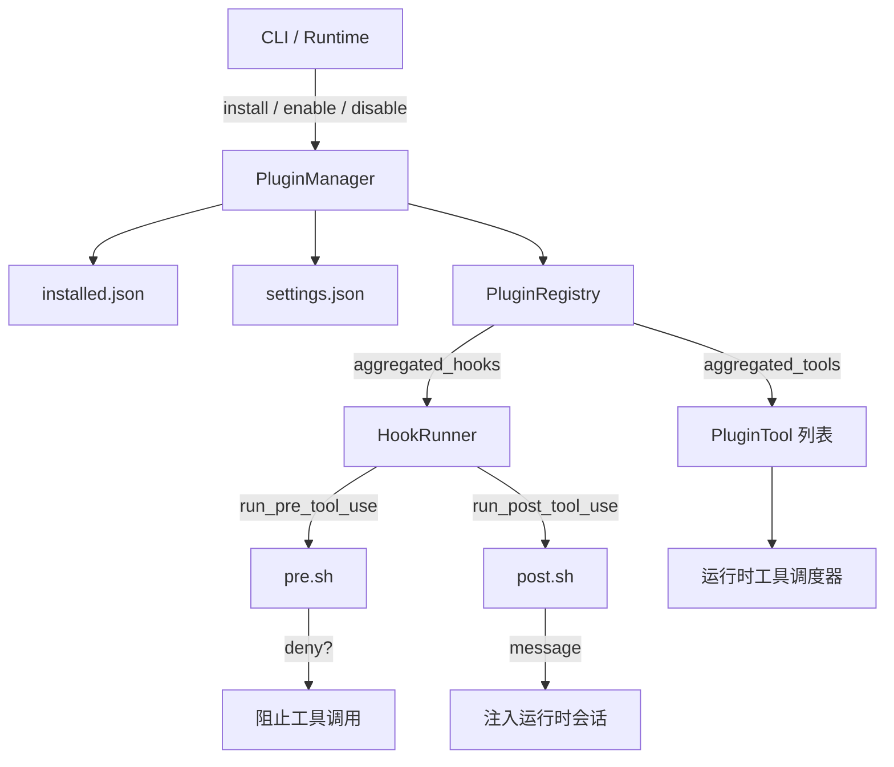

# 第19章 插件系统：契约与生命周期

## 本章概览

插件系统位于 `rust/crates/plugins/` crate，负责插件元数据管理、安装与生命周期控制，以及 hook 集成点的编排。它不在核心 Agent 运行时的主链路上，而是作为扩展设施存在：运行时通过 `PluginManager` 加载已安装插件，通过 `HookRunner` 在工具调用前后执行用户自定义脚本。本章覆盖 plugin.json 的契约定义、目录布局、生命周期状态机、hook 执行上下文，以及 bundled 示例的目录结构解析。

| 文件路径 | 职责 |
|----------|------|
| `rust/crates/plugins/src/lib.rs` | 插件元数据、生命周期管理 surface、`PluginManager` 与 `PluginRegistry` |
| `rust/crates/plugins/src/hooks.rs` | `HookRunner`、`HookEvent`、`HookRunResult` 及脚本执行引擎 |
| `rust/crates/plugins/bundled/example-bundled/.claude-plugin/plugin.json` | bundled 插件契约示例 |
| `rust/crates/plugins/bundled/example-bundled/hooks/pre.sh` | 前置 hook 示例脚本 |
| `rust/crates/plugins/bundled/example-bundled/hooks/post.sh` | 后置 hook 示例脚本 |

---

## 19.1 plugin.json 契约

plugin.json 是插件与运行时的唯一契约文件。运行时通过解析该文件获取插件的名称、版本、hook 声明、生命周期脚本、自定义工具以及权限需求。在 `lib.rs` 中，`PluginManifest` 定义了完整的 schema：

```rust
// claw-code/rust/crates/plugins/src/lib.rs

#[derive(Debug, Clone, PartialEq, Serialize, Deserialize)]
pub struct PluginManifest {
    pub name: String,
    pub version: String,
    pub description: String,
    pub permissions: Vec<PluginPermission>,
    #[serde(rename = "defaultEnabled", default)]
    pub default_enabled: bool,
    #[serde(default)]
    pub hooks: PluginHooks,
    #[serde(default)]
    pub lifecycle: PluginLifecycle,
    #[serde(default)]
    pub tools: Vec<PluginToolManifest>,
    #[serde(default)]
    pub commands: Vec<PluginCommandManifest>,
}
```

`name`、`version`、`description` 是必填字段，加载时若为空字符串会直接报错。`default_enabled` 控制插件首次发现时的默认启用状态，对 bundled 和 builtin 插件生效；外部插件默认不启用，需显式调用 `enable`。`permissions` 声明插件运行所需的能力，目前支持 `read`、`write`、`execute` 三种，由运行时根据权限系统策略决定是否授予。

`hooks` 字段声明三个事件点的脚本列表：`PreToolUse`、`PostToolUse`、`PostToolUseFailure`。`lifecycle` 字段声明 `Init` 和 `Shutdown` 两个阶段的脚本列表，在插件启用和禁用时触发。`tools` 和 `commands` 允许插件注册自定义工具和 slash 命令，每个工具需要指定 `inputSchema`（JSON Schema 对象）和 `requiredPermission`（`read-only`、`workspace-write` 或 `danger-full-access`）。

运行时加载 plugin.json 时，会先执行契约兼容性检查：

```rust
// claw-code/rust/crates/plugins/src/lib.rs

fn detect_claude_code_manifest_contract_gaps(
    raw_manifest: &Value,
) -> Vec<PluginManifestValidationError> {
    let Some(root) = raw_manifest.as_object() else {
        return Vec::new();
    };

    let mut errors = Vec::new();

    for (field, detail) in [
        (
            "skills",
            "plugin manifest field `skills` uses the Claude Code plugin contract; ...",
        ),
        (
            "mcpServers",
            "plugin manifest field `mcpServers` uses the Claude Code plugin contract; ...",
        ),
        (
            "agents",
            "plugin manifest field `agents` uses the Claude Code plugin contract; ...",
        ),
    ] {
        if root.contains_key(field) {
            errors.push(PluginManifestValidationError::UnsupportedManifestContract {
                detail: detail.to_string(),
            });
        }
    }
    // ...
}
```

这段代码显式拒绝 `skills`、`mcpServers`、`agents` 等 Claude Code 专属字段，以及不支持的 hook 名称。Claude Code 的插件契约与本系统部分重叠但不兼容，直接加载会导致行为差异，因此运行时选择提前报错而非静默忽略。

---

## 19.2 目录结构约定

插件目录遵循固定布局。运行时按以下优先级查找 manifest：

1. `<plugin_root>/plugin.json`
2. `<plugin_root>/.claude-plugin/plugin.json`

根目录下的 `plugin.json` 优先，这是为了支持扁平化的插件包；`.claude-plugin/plugin.json` 用于与 Claude Code 的目录约定兼容。hook 脚本、生命周期脚本和自定义工具的可执行文件通常放在插件根目录或 `hooks/` 子目录中。

路径解析遵循两条规则：以 `./`、`../` 开头的相对路径会被解析为相对于插件根目录的绝对路径；不以这些前缀开头的条目被视为字面量 shell 命令，由系统的 `sh -lc` 或 `cmd /C` 直接执行。例如 `"./hooks/pre.sh"` 会被解析为插件根目录下的文件，而 `"echo hello"` 则作为 shell 命令执行。

```rust
// claw-code/rust/crates/plugins/src/lib.rs

fn resolve_hook_entry(root: &Path, entry: &str) -> String {
    if is_literal_command(entry) {
        entry.to_string()
    } else {
        root.join(entry).display().to_string()
    }
}

fn is_literal_command(entry: &str) -> bool {
    !entry.starts_with("./") && !entry.starts_with("../") && !Path::new(entry).is_absolute()
}
```

这种设计允许插件作者既可以引用仓库内的脚本文件，也可以直接写内联 shell 命令，无需为简单逻辑额外创建文件。

---

## 19.3 生命周期状态机

插件的生命周期由 `PluginManager` 管理，包含五个核心操作：安装、启用、禁用、卸载、更新。`PluginManager` 同时维护三个持久化文件来跟踪状态：

| 文件 | 位置 | 内容 |
|------|------|------|
| `installed.json` | `<config_home>/plugins/installed.json` | 已安装插件的元数据记录（`InstalledPluginRegistry`） |
| `settings.json` | `<config_home>/settings.json` | 各插件的启用/禁用状态（`enabledPlugins` 字段） |
| 插件文件目录 | `<config_home>/plugins/installed/<plugin_id>/` | 插件内容的本地副本 |

`PluginManager::plugin_registry_report()` 构建完整的插件发现视图，按以下顺序扫描来源：

```rust
// claw-code/rust/crates/plugins/src/lib.rs

pub fn plugin_registry_report(&self) -> Result<PluginRegistryReport, PluginError> {
    self.sync_bundled_plugins()?;

    let mut discovery = PluginDiscovery::default();
    discovery.plugins.extend(builtin_plugins());

    let installed = self.discover_installed_plugins_with_failures()?;
    discovery.extend(installed);

    let external =
        self.discover_external_directory_plugins_with_failures(&discovery.plugins)?;
    discovery.extend(external);

    Ok(self.build_registry_report(discovery))
}
```

发现顺序决定了插件的加载优先级：builtin 最先，其次是已安装插件，最后是外部目录插件。`sync_bundled_plugins()` 会在每次构建注册表前自动执行，对比 bundled 插件目录与已安装副本的版本、名称、描述和路径，必要时重新复制。这保证了 bundled 插件始终与软件包内的原始定义保持一致。

插件分为三种 kind，在运行时统一通过 `Plugin` trait 访问：

| Kind | 来源 | 验证行为 | 初始化/关闭行为 |
|------|------|----------|----------------|
| `Builtin` | 代码内联定义（`builtin_plugins()`） | 无验证（空实现） | 无操作 |
| `Bundled` | 软件包附带的 `bundled/` 目录 | 验证 hook/生命周期/工具路径存在且为文件 | 执行 `lifecycle.init` / `lifecycle.shutdown` |
| `External` | 用户通过 `install` 安装的本地路径或 Git URL | 同 Bundled | 同 Bundled |

`RegisteredPlugin` 包装了 `PluginDefinition` 和一个 `enabled` 布尔值，代表插件在注册表中的最终状态。`PluginRegistry` 负责聚合所有已启用插件的 hooks 和 tools，并在聚合前对每个插件执行 `validate()`：

```rust
// claw-code/rust/crates/plugins/src/lib.rs

pub fn aggregated_hooks(&self) -> Result<PluginHooks, PluginError> {
    self.plugins
        .iter()
        .filter(|plugin| plugin.is_enabled())
        .try_fold(PluginHooks::default(), |acc, plugin| {
            plugin.validate()?;
            Ok(acc.merged_with(plugin.hooks()))
        })
}
```

`aggregated_tools()` 还额外检查工具名称的全局唯一性，若两个已启用插件定义了同名工具，则返回错误。`initialize()` 和 `shutdown()` 分别按正序和逆序调用已启用插件的生命周期脚本，确保依赖关系在关闭时反向释放。

---

## 19.4 hooks 脚本与执行上下文

hooks 是插件系统与核心运行时交互的主要通道。`hooks.rs` 中的 `HookRunner` 负责在三个事件点执行脚本：`PreToolUse`（工具调用前）、`PostToolUse`（工具调用成功返回后）、`PostToolUseFailure`（工具调用失败后）。

```rust
// claw-code/rust/crates/plugins/src/hooks.rs

#[derive(Debug, Clone, Copy, PartialEq, Eq)]
pub enum HookEvent {
    PreToolUse,
    PostToolUse,
    PostToolUseFailure,
}

#[derive(Debug, Clone, PartialEq, Eq)]
pub struct HookRunResult {
    denied: bool,
    failed: bool,
    messages: Vec<String>,
}
```

`HookRunner` 从 `PluginRegistry` 聚合所有已启用插件的 hooks，依次执行。若某个 hook 脚本返回拒绝（exit code 2），后续脚本不再执行，工具调用被拦截；若某个脚本以非 0 非 2 的状态退出，则视为失败，同样中断后续执行。

执行上下文通过环境变量和 stdin JSON payload 两个通道传递给脚本：

```rust
// claw-code/rust/crates/plugins/src/hooks.rs

fn run_command(
    command: &str,
    event: HookEvent,
    tool_name: &str,
    tool_input: &str,
    tool_output: Option<&str>,
    is_error: bool,
    payload: &str,
) -> HookCommandOutcome {
    let mut child = shell_command(command);
    child.stdin(std::process::Stdio::piped());
    child.stdout(std::process::Stdio::piped());
    child.stderr(std::process::Stdio::piped());
    child.env("HOOK_EVENT", event.as_str());
    child.env("HOOK_TOOL_NAME", tool_name);
    child.env("HOOK_TOOL_INPUT", tool_input);
    child.env("HOOK_TOOL_IS_ERROR", if is_error { "1" } else { "0" });
    if let Some(tool_output) = tool_output {
        child.env("HOOK_TOOL_OUTPUT", tool_output);
    }

    match child.output_with_stdin(payload.as_bytes()) {
        // ...
    }
}
```

环境变量包含事件名、工具名、工具输入 JSON、输出内容和错误标记。stdin 则传递一个完整的 JSON payload，结构如下：

```json
{
  "hook_event_name": "PreToolUse",
  "tool_name": "Read",
  "tool_input": { "path": "README.md" },
  "tool_input_json": "{\"path\":\"README.md\"}",
  "tool_output": null,
  "tool_result_is_error": false
}
```

`tool_input` 是解析后的 JSON 对象，方便脚本直接访问字段；`tool_input_json` 保留原始字符串，防止解析差异。

退出码语义是 hook 契约的核心：

| 退出码 | 含义 | 运行时行为 |
|--------|------|------------|
| 0 | 允许（Allow） | 继续执行下一个 hook，stdout 内容作为 message 收集 |
| 2 | 拒绝（Deny） | 中断 hook 链，阻止当前工具调用 |
| 其他 | 失败（Failed） | 中断 hook 链，将错误信息上报 |

脚本执行通过 `CommandWithStdin` 包装器完成，其中一个细节是 BrokenPipe 容忍：

```rust
// claw-code/rust/crates/plugins/src/hooks.rs

match child_stdin.write_all(stdin) {
    Ok(()) => {}
    Err(error) if error.kind() == std::io::ErrorKind::BrokenPipe => {}
    Err(error) => return Err(error),
}
```

hook 脚本可能在父进程写完 stdin 前就已退出（例如脚本执行极快），此时内核会向写端发送 `EPIPE`。这段代码将 BrokenPipe 视为正常情况而非失败，因为子进程的真实退出码仍需通过 `wait_with_output()` 获取。这个修复来自 Linux CI 的 flaky test 排查，macOS 的管道缓冲行为恰好掩盖了该竞争条件，而 Linux 上则稳定复现。

---

## 19.5 bundled 示例解析

`rust/crates/plugins/bundled/` 目录包含两个示例插件：`example-bundled` 和 `sample-hooks`。它们的结构完全相同，均为最小可运行的 hook 插件模板：

```text
example-bundled/
├── .claude-plugin/
│   └── plugin.json
└── hooks/
    ├── pre.sh
    └── post.sh
```

plugin.json 内容如下：

```json
// claw-code/rust/crates/plugins/bundled/example-bundled/.claude-plugin/plugin.json

{
  "name": "example-bundled",
  "version": "0.1.0",
  "description": "Example bundled plugin scaffold for the Rust plugin system",
  "defaultEnabled": false,
  "hooks": {
    "PreToolUse": ["./hooks/pre.sh"],
    "PostToolUse": ["./hooks/post.sh"]
  }
}
```

`defaultEnabled` 为 `false`，表示该插件在首次同步时不会被自动启用，用户需手动调用 `enable`。hooks 声明了两个脚本，均使用相对路径 `./hooks/`，运行时会被解析为插件根目录下的绝对路径。

pre.sh 和 post.sh 是两个极简的 shell 脚本：

```bash
// claw-code/rust/crates/plugins/bundled/example-bundled/hooks/pre.sh

#!/bin/sh
printf '%s\n' 'example bundled pre hook'
```

```bash
// claw-code/rust/crates/plugins/bundled/example-bundled/hooks/post.sh

#!/bin/sh
printf '%s\n' 'example bundled post hook'
```

这两个脚本仅向 stdout 输出一行标识文本，实际插件可以在此执行任意逻辑，例如权限校验、日志记录、输入过滤或结果格式化。测试代码中使用了类似的脚本来验证多插件的 hook 聚合行为：

```rust
// claw-code/rust/crates/plugins/src/hooks.rs (tests)

fn write_hook_plugin(
    root: &Path,
    name: &str,
    pre_message: &str,
    post_message: &str,
    failure_message: &str,
) {
    fs::create_dir_all(root.join(".claude-plugin")).expect("manifest dir");
    fs::create_dir_all(root.join("hooks")).expect("hooks dir");

    let pre_path = root.join("hooks").join("pre.sh");
    fs::write(
        &pre_path,
        format!("#!/bin/sh\nprintf '%s\\n' '{pre_message}'\n"),
    )
    .expect("write pre hook");
    make_executable(&pre_path);
    // ...
}
```

测试验证了 `HookRunner` 会按插件发现顺序收集并执行所有已启用插件的同类型 hook，且 `PreToolUse` 的拒绝语义和失败传播行为均符合预期。

---

## 19.6 与核心系统的边界

插件系统在架构上分为两层：管理层（`PluginManager` + `PluginRegistry`）和执行层（`HookRunner`）。管理层负责插件的发现、安装、启用/禁用和生命周期持久化，与第 8 章 MCP 协议和第 11 章钩子系统存在明确边界。



与第 8 章 MCP 协议的边界在于：插件系统不加载 MCP servers。plugin.json 中若包含 `mcpServers` 字段，`detect_claude_code_manifest_contract_gaps()` 会直接报错拒绝。MCP 连接由运行时独立的 MCP 客户端管理，与插件工具分属两个不同的扩展通道。插件可以注册自定义工具（`PluginTool`），这些工具通过子进程执行，与 MCP 的 JSON-RPC over stdio 在实现机制上类似，但在注册和发现路径上完全隔离。

与第 11 章钩子系统的边界在于分工：第 11 章的运行时钩子（`runtime/hooks`）是系统级的拦截框架，而本章的 `HookRunner` 是插件层对同一概念的实现。`PluginManager` 管理插件元数据生命周期，`HookRunner` 仅负责在正确的时机执行聚合后的脚本列表。运行时不会在每次工具调用时重新扫描插件目录，而是在启动或配置变更时通过 `PluginManager` 构建一次 `PluginRegistry`，随后 `HookRunner` 复用该注册表直至下一次刷新。

权限方面，插件自定义工具的 `required_permission` 字段（`read-only`、`workspace-write`、`danger-full-access`）与第 9 章权限系统的 `PermissionMode` 语义对齐，运行时通过同一套权限策略判断插件工具是否被允许执行。插件 manifest 中的 `permissions` 字段（`read`/`write`/`execute`）则更多用于声明插件自身的文件系统访问需求，由运行时根据沙箱策略决定是否授权。

---

## 小结

插件系统通过 `PluginManager` 提供完整的生命周期管理，通过 `PluginRegistry` 聚合多来源插件的 hooks 和 tools，通过 `HookRunner` 在工具调用前后执行用户自定义脚本。plugin.json 是插件与运行时的唯一契约，运行时通过显式的兼容性检查拒绝 Claude Code 专属字段，避免行为差异。三种插件来源（builtin、bundled、external）在统一的 `Plugin` trait 下被一致处理，bundled 插件通过自动同步机制与软件包版本保持一致。hook 脚本通过环境变量和 stdin JSON 接收执行上下文，以退出码 0/2/其他 表达允许/拒绝/失败三种结果。插件自定义工具通过子进程执行，权限模型与核心权限系统对齐，但注册和发现路径与 MCP 协议完全隔离。

| 文件路径 | 职责 |
|----------|------|
| `rust/crates/plugins/src/lib.rs` | 插件元数据、生命周期管理、注册表构建 |
| `rust/crates/plugins/src/hooks.rs` | Hook 事件定义、脚本执行引擎、退出码语义 |
| `rust/crates/plugins/bundled/example-bundled/.claude-plugin/plugin.json` | bundled 插件契约模板 |
| `rust/crates/plugins/bundled/example-bundled/hooks/pre.sh` | PreToolUse hook 示例 |
| `rust/crates/plugins/bundled/example-bundled/hooks/post.sh` | PostToolUse hook 示例 |

第 20 章将离开插件扩展层，进入操作系统层面的安全边界——沙箱与进程隔离机制。
