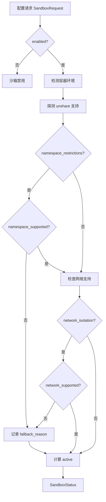
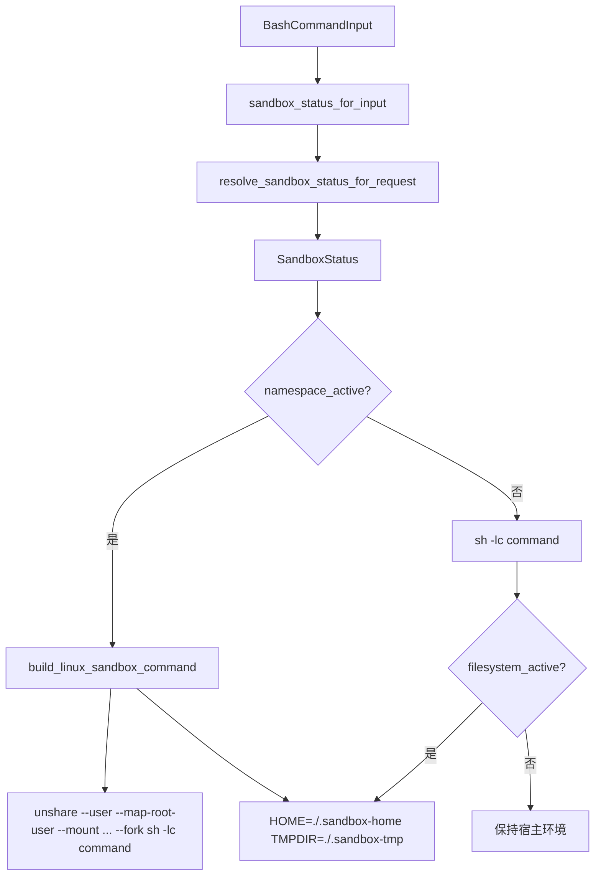

# 第20章 沙箱与进程隔离：Linux Namespace 与容器检测

## 本章概览

这章介绍 claw-code 中 Agent 执行 Bash 命令时的安全边界机制。`sandbox.rs` 负责容器环境检测、Linux namespace 隔离和沙箱命令构建，与第 9 章介绍的 `PermissionMode` 形成互补：`PermissionMode` 决定 Agent "能做什么"，沙箱决定 Agent "在哪个环境里做"。关键文件如下：

| 文件路径 | 职责 |
|---|---|
| claw-code/rust/crates/runtime/src/sandbox.rs | 容器检测、namespace 隔离、沙箱命令构建 |
| claw-code/rust/crates/runtime/src/bash_validation.rs | Bash 命令安全校验流水线 |
| claw-code/rust/crates/runtime/src/bash.rs | 沙箱调用入口，衔接命令执行 |
| claw-code/rust/crates/runtime/src/config.rs | `SandboxConfig` 的解析与加载 |
| claw-code/Containerfile | 官方容器镜像定义 |

## 20.1 容器环境检测：多源联合检测

Agent 在容器内部运行时需要知道自身的环境，以便调整权限策略和沙箱行为。`detect_container_environment` 不依赖单一指标，而是从文件系统、进程 cgroup 和环境变量三个维度联合判断。

```rust
// claw-code/rust/crates/runtime/src/sandbox.rs

#[must_use]
pub fn detect_container_environment() -> ContainerEnvironment {
    let proc_1_cgroup = fs::read_to_string("/proc/1/cgroup").ok();
    detect_container_environment_from(SandboxDetectionInputs {
        env_pairs: env::vars().collect(),
        dockerenv_exists: Path::new("/.dockerenv").exists(),
        containerenv_exists: Path::new("/run/.containerenv").exists(),
        proc_1_cgroup: proc_1_cgroup.as_deref(),
    })
}
```

检测逻辑收集了四类证据：`/.dockerenv` 文件存在、`/run/.containerenv` 文件存在、`/proc/1/cgroup` 内容包含 "docker"、"containerd"、"kubepods"、"podman"、"libpod" 等关键字，以及环境变量 `CONTAINER`、`DOCKER`、`PODMAN`、`KUBERNETES_SERVICE_HOST` 非空。所有证据被归并为 `markers` 向量，排序去重后返回。只要 `markers` 非空，`in_container` 即为真。

这种多源联合检测的设计意图是避免单一指标的误判。例如，某些 CI 环境可能在宿主机上保留 `/.dockerenv` 文件残留，但 `proc_1_cgroup` 不会包含容器运行时名称；反之，在 systemd-nspawn 等环境中，cgroup 路径可能包含 "containerd" 字样，但文件标记不存在。联合检测提高了识别的鲁棒性。

## 20.2 Linux Namespace 隔离与 unshare 探测

沙箱的核心机制是利用 Linux `unshare` 系统调用创建独立的用户、挂载、IPC、PID 和 UTS 命名空间。`build_linux_sandbox_command` 在支持 Linux 且 namespace 可用时，将原始命令包装为 `unshare` 子进程调用。

```rust
// claw-code/rust/crates/runtime/src/sandbox.rs

#[must_use]
pub fn build_linux_sandbox_command(
    command: &str,
    cwd: &Path,
    status: &SandboxStatus,
) -> Option<LinuxSandboxCommand> {
    if !cfg!(target_os = "linux")
        || !status.enabled
        || (!status.namespace_active && !status.network_active)
    {
        return None;
    }

    let mut args: Vec<String> = working_unshare_mapping()
        .unwrap_or(UNSHARE_MAPPING_CANDIDATES[0])
        .iter()
        .map(|arg| arg.to_string())
        .collect();
    if status.network_active {
        args.push("--net".to_string());
    }
    args.push("sh".to_string());
    args.push("-lc".to_string());
    args.push(command.to_string());

    let sandbox_home = cwd.join(".sandbox-home");
    let sandbox_tmp = cwd.join(".sandbox-tmp");
    let mut env = vec![
        ("HOME".to_string(), sandbox_home.display().to_string()),
        ("TMPDIR".to_string(), sandbox_tmp.display().to_string()),
        (
            "CLAWD_SANDBOX_FILESYSTEM_MODE".to_string(),
            status.filesystem_mode.as_str().to_string(),
        ),
        (
            "CLAWD_SANDBOX_ALLOWED_MOUNTS".to_string(),
            status.allowed_mounts.join(":"),
        ),
    ];
    if let Ok(path) = env::var("PATH") {
        env.push(("PATH".to_string(), path));
    }

    Some(LinuxSandboxCommand {
        program: "unshare".to_string(),
        args,
        env,
    })
}
```

`build_linux_sandbox_command` 的返回类型 `Option<LinuxSandboxCommand>` 表明沙箱是可选的。在非 Linux 平台、沙箱被禁用、或者 namespace 和网络隔离都未激活时，函数直接返回 `None`，由调用方回退到普通 `sh -lc` 执行。`CLAWD_SANDBOX_FILESYSTEM_MODE` 和 `CLAWD_SANDBOX_ALLOWED_MOUNTS` 环境变量被注入子进程，使沙箱内的脚本可以感知当前隔离级别。

unshare 的映射参数通过候选探测机制确定。`UNSHARE_MAPPING_CANDIDATES` 定义了两组参数：

```rust
// claw-code/rust/crates/runtime/src/sandbox.rs

const UNSHARE_MAPPING_CANDIDATES: &[&[&str]] = &[
    &[
        "--user",
        "--map-root-user",
        "--mount",
        "--ipc",
        "--pid",
        "--uts",
        "--fork",
    ],
    &[
        "--user",
        "--map-root-user",
        "--map-auto",
        "--mount",
        "--ipc",
        "--pid",
        "--uts",
        "--fork",
    ],
];
```

第一组候选使用 `--map-root-user`，在大多数系统上可直接将当前用户映射为 root。第二组在第一组基础上插入 `--map-auto`，这是针对 hardened 容器和 seccomp 限制的 fallback 策略。当内核或容器阻止非特权进程写入 `/proc/self/uid_map` 时，util-linux 的 `unshare` 会委托 setuid 的 `newuidmap`/`newgidmap` 辅助程序完成映射。探测函数 `unshare_probe` 对每个候选运行一次 `unshare ... true` 的静默测试，成功的结果被缓存在 `OnceLock` 中。

```rust
// claw-code/rust/crates/runtime/src/sandbox.rs

fn unshare_probe(args: &[&str]) -> bool {
    std::process::Command::new("unshare")
        .args(args)
        .arg("true")
        .stdin(std::process::Stdio::null())
        .stdout(std::process::Stdio::null())
        .stderr(std::process::Stdio::null())
        .status()
        .is_ok_and(|status| status.success())
}

fn working_unshare_mapping() -> Option<&'static [&'static str]> {
    use std::sync::OnceLock;
    static MAPPING: OnceLock<Option<&'static [&'static str]>> = OnceLock::new();
    *MAPPING.get_or_init(|| {
        UNSHARE_MAPPING_CANDIDATES
            .iter()
            .copied()
            .find(|args| unshare_probe(args))
    })
}
```

`--net` 网络命名空间的隔离是条件启用的。`network_active` 为真时才会在参数末尾追加 `--net`。探测阶段刻意不测试 `--net`，因为 Docker 的默认 seccomp 配置文件会阻止网络命名空间创建。如果探测时包含 `--net`，沙箱会在不支持网络隔离的主机上被完全禁用，即便用户从未请求网络隔离。这种分离策略确保了只有实际需要网络隔离的场景才会触发相关限制。

## 20.3 文件系统隔离模式

沙箱提供三级文件系统隔离，由 `FilesystemIsolationMode` 枚举定义：

```rust
// claw-code/rust/crates/runtime/src/sandbox.rs

#[derive(Debug, Clone, Copy, Serialize, Deserialize, PartialEq, Eq, Default)]
#[serde(rename_all = "kebab-case")]
pub enum FilesystemIsolationMode {
    Off,
    #[default]
    WorkspaceOnly,
    AllowList,
}
```

`Off` 表示不启用文件系统隔离，`HOME` 和 `TMPDIR` 保持宿主环境值。`WorkspaceOnly` 是默认模式，将 `HOME` 重定向到工作区下的 `.sandbox-home`，`TMPDIR` 重定向到 `.sandbox-tmp`。`AllowList` 模式在 `WorkspaceOnly` 基础上，通过 `allowed_mounts` 额外挂载指定目录到沙箱内。

`AllowList` 模式需要显式配置挂载点。如果用户请求了 `AllowList` 但 `allowed_mounts` 为空，`resolve_sandbox_status_for_request` 会记录 fallback 原因，沙箱不会完全激活。

```rust
// claw-code/rust/crates/runtime/src/sandbox.rs

if request.enabled
    && request.filesystem_mode == FilesystemIsolationMode::AllowList
    && request.allowed_mounts.is_empty()
{
    fallback_reasons
        .push("filesystem allow-list requested without configured mounts".to_string());
}
```

`normalize_mounts` 函数将相对路径转换为基于当前工作区的绝对路径，确保挂载点解析不受执行目录影响。

## 20.4 SandboxStatus 状态机

沙箱的激活决策由 `SandboxStatus` 结构体统一承载，它描述了从配置请求到实际激活的完整链路。

```rust
// claw-code/rust/crates/runtime/src/sandbox.rs

#[derive(Debug, Clone, Serialize, Deserialize, PartialEq, Eq, Default)]
pub struct SandboxStatus {
    pub enabled: bool,
    pub requested: SandboxRequest,
    pub supported: bool,
    pub active: bool,
    pub namespace_supported: bool,
    pub namespace_active: bool,
    pub network_supported: bool,
    pub network_active: bool,
    pub filesystem_mode: FilesystemIsolationMode,
    pub filesystem_active: bool,
    pub allowed_mounts: Vec<String>,
    pub in_container: bool,
    pub container_markers: Vec<String>,
    pub fallback_reason: Option<String>,
}
```

`enabled` 表示用户是否启用了沙箱。`requested` 保存解析后的配置请求。`supported` 和 `active` 是最终的 capability 和激活状态。`namespace_supported` 与 `network_supported` 均依赖 `unshare_user_namespace_works()` 的探测结果。`active` 的计算逻辑如下：

```rust
// claw-code/rust/crates/runtime/src/sandbox.rs

let active = request.enabled
    && (!request.namespace_restrictions || namespace_supported)
    && (!request.network_isolation || network_supported);
```

这意味着：只要用户启用了沙箱，且所有请求的限制（namespace 或网络）都被支持，沙箱即激活。如果用户只请求了文件系统隔离而未请求 namespace 限制，沙箱仍然可以激活，因为文件系统隔离通过环境变量重定向实现，不依赖 unshare。

决策流程可用以下 mermaid 图表示：



`fallback_reason` 字段在 namespace 或网络隔离不可用时，或者 `AllowList` 缺少挂载配置时填充。该字段被上层用于向用户报告沙箱为何降级运行。例如，在 macOS 或 Windows 上运行 claw 时，`namespace_supported` 为假，若用户请求了 namespace 隔离，`fallback_reason` 会包含 "namespace isolation unavailable (requires Linux with `unshare`)"。

## 20.5 Bash 命令安全校验流水线

沙箱解决的是"在哪里执行"的问题，而 `bash_validation.rs` 解决的是"能否执行"的问题。两者构成纵深防御。校验流水线包含四个阶段：

```rust
// claw-code/rust/crates/runtime/src/bash_validation.rs

pub fn validate_command(command: &str, mode: PermissionMode, workspace: &Path) -> ValidationResult {
    let result = validate_mode(command, mode);
    if result != ValidationResult::Allow {
        return result;
    }
    let result = validate_sed(command, mode);
    if result != ValidationResult::Allow {
        return result;
    }
    let result = check_destructive(command);
    if result != ValidationResult::Allow {
        return result;
    }
    validate_paths(command, workspace)
}
```

`validate_mode` 根据 `PermissionMode` 执行不同策略。`ReadOnly` 模式会阻止 `cp`、`mv`、`rm` 等写命令和 `apt`、`npm` 等状态修改命令，同时检查重定向运算符 `>`、`>>`、`>&`。`WorkspaceWrite` 模式允许工作区内的写操作，但会对指向 `/etc/`、`/usr/`、`/var/` 等系统路径的命令发出警告。

`check_destructive` 识别高危险命令模式，如 `rm -rf /`、`mkfs`、`dd if=`、`chmod -R 777` 和 fork bomb 等。这些命令在 `WorkspaceWrite` 或 `DangerFullAccess` 模式下不会被阻止，但会触发 `Warn` 结果，要求用户确认。

`validate_paths` 检查路径遍历和目录逃逸。`../` 模式、未包含工作区路径的相对路径、以及 `~/` 或 `$HOME` 引用都会触发警告，防止命令通过路径操作逃逸沙箱环境。

`validate_sed` 单独处理 `sed -i` 原地编辑。在 `ReadOnly` 模式下，`sed -i` 被直接阻止，因为即便命令本身语义上是读取，`-i` 标志也会修改文件。

`ValidationResult` 枚举定义了三种结果：

```rust
// claw-code/rust/crates/runtime/src/bash_validation.rs

pub enum ValidationResult {
    Allow,
    Block { reason: String },
    Warn { message: String },
}
```

`Block` 用于明确拒绝执行，`Warn` 用于危险但未被完全禁止的命令，需要用户交互确认。`Allow` 表示通过全部校验。`CommandIntent` 枚举将命令按语义分类为 ReadOnly、Write、Destructive、Network、ProcessManagement、PackageManagement、SystemAdmin 和 Unknown，为上层策略提供语义层面的决策依据。

## 20.6 与核心运行时的集成

`sandbox.rs` 和 `bash_validation.rs` 被 `bash.rs` 的消费端统一调度。`bash.rs` 中的 `sandbox_status_for_input` 从配置文件加载 `SandboxConfig`，并与命令输入中的覆盖参数合并：

```rust
// claw-code/rust/crates/runtime/src/bash.rs

fn sandbox_status_for_input(input: &BashCommandInput, cwd: &std::path::Path) -> SandboxStatus {
    let config = ConfigLoader::default_for(cwd).load().map_or_else(
        |_| SandboxConfig::default(),
        |runtime_config| runtime_config.sandbox().clone(),
    );
    let request = config.resolve_request(
        input.dangerously_disable_sandbox.map(|disabled| !disabled),
        input.namespace_restrictions,
        input.isolate_network,
        input.filesystem_mode,
        input.allowed_mounts.clone(),
    );
    resolve_sandbox_status_for_request(&request, cwd)
}
```

`prepare_command` 和 `prepare_tokio_command` 根据 `SandboxStatus` 决定执行方式。如果 `build_linux_sandbox_command` 返回 `Some`，命令通过 `unshare` 启动；否则退化为普通 `sh -lc`。无论哪种路径，只要 `filesystem_active` 为真，`HOME` 和 `TMPDIR` 都会被重定向到工作区内的 `.sandbox-home` 和 `.sandbox-tmp`。



权限校验流水线在命令执行前独立运行。`PermissionMode` 的校验结果与沙箱的构建过程并行不悖：前者决定命令是否允许执行，后者决定命令执行时的进程环境。两者在第 9 章的 `PermissionEnforcer` 中被整合，形成 Agent 安全边界的完整闭环。

`Containerfile` 采用 `rust:bookworm` 基础镜像，安装 `ca-certificates`、`git`、`libssl-dev`、`pkg-config`，不内嵌 claw-code 仓库本身，而是依赖 bind-mount 工作区。镜像本身不预装 claw 二进制，由宿主机构建后挂载进入，这种设计确保了容器环境与宿主代码版本的一致性。

## 小结

`sandbox.rs` 通过容器检测、Linux namespace 隔离和三级文件系统隔离，为 Agent 的 Bash 命令执行提供了操作系统层面的进程隔离。`unshare` 探测机制支持 `--map-root-user` 和 `--map-auto` 两种映射策略，适配普通 Linux 主机和 hardened 容器环境。`bash_validation.rs` 在命令语义层面实施校验，与沙箱的进程隔离形成互补。`SandboxStatus` 状态机记录了从配置请求到实际激活的完整决策链路，并通过 `fallback_reason` 向下游透明报告降级原因。

| 文件路径 | 职责 |
|---|---|
| claw-code/rust/crates/runtime/src/sandbox.rs | 容器检测、namespace 隔离、沙箱命令构建 |
| claw-code/rust/crates/runtime/src/bash_validation.rs | 命令安全校验流水线 |
| claw-code/rust/crates/runtime/src/bash.rs | 沙箱调用入口与命令执行 |
| claw-code/rust/crates/runtime/src/config.rs | 沙箱配置解析 |
| claw-code/Containerfile | 官方容器镜像，提供 `unshare` 和基础工具 |

下一章将介绍系统的故障恢复与自愈机制，探讨当沙箱或命令执行失败时系统如何自动恢复。
