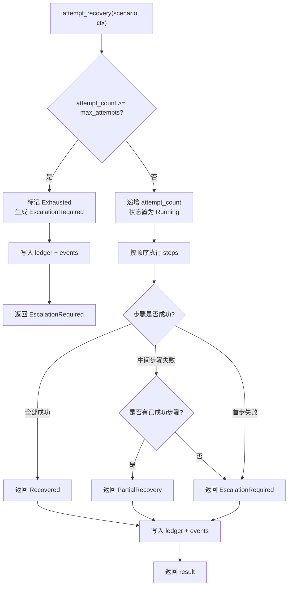

# 第 21 章 故障恢复与自愈：Recovery Recipes 与 Worker Boot

## 本章概览

Agent 运行时在启动和执行过程中会遇到多种失败场景：信任提示未解决、提示投递错误、分支过期、编译失败、MCP 握手失败、插件部分启动失败、Provider 不可用。`recovery_recipes.rs` 为这七种场景定义了结构化的恢复配方，每种配方包含步骤序列、最大尝试次数和升级策略，并通过 `RecoveryContext` 记录机器可读的恢复账本。`worker_boot.rs` 提供了 Worker 启动状态机和失败类型定义，`stale_branch.rs` 负责分支新鲜度检测，`stale_base.rs` 负责基础提交偏移检测，`branch_lock.rs` 负责多 lane 分支锁冲突检测。这些模块共同组成了运行时的故障处理链路。

| 文件路径 | 职责 |
|----------|------|
| `rust/crates/runtime/src/recovery_recipes.rs` | 失败场景枚举、恢复配方、执行引擎、恢复账本 |
| `rust/crates/runtime/src/worker_boot.rs` | Worker 启动状态机、失败类型定义、信任门检测 |
| `rust/crates/runtime/src/stale_branch.rs` | 分支新鲜度检测（Fresh/Stale/Diverged）与策略应用 |
| `rust/crates/runtime/src/stale_base.rs` | 基础提交偏移检测与 `.claw-base` 文件读取 |
| `rust/crates/runtime/src/branch_lock.rs` | 多 lane 分支锁意图与冲突检测 |

## 21.1 失败场景与恢复配方

### 七种失败场景

`FailureScenario` 枚举定义了运行时已知的七种失败场景，每种场景对应一类可识别的故障模式。这个枚举是整个恢复框架的起点——所有恢复配方的查找、尝试计数、账本记录都以此为索引键。

```rust
// claw-code/rust/crates/runtime/src/recovery_recipes.rs

#[derive(Debug, Clone, Copy, PartialEq, Eq, Hash, Serialize, Deserialize)]
#[serde(rename_all = "snake_case")]
pub enum FailureScenario {
    TrustPromptUnresolved,      // 信任提示未解决
    PromptMisdelivery,          // 提示投递到错误目标
    StaleBranch,               // 分支落后于 main
    CompileRedCrossCrate,       // 跨 crate 编译失败
    McpHandshakeFailure,        // MCP 握手超时
    PartialPluginStartup,       // 插件部分启动失败
    ProviderFailure,            // Provider 不可用
}
```

七个变体覆盖了从启动到运行时的主要故障路径。`TrustPromptUnresolved` 和 `PromptMisdelivery` 源自 Worker 启动阶段的信任门和提示路由检测（由 `worker_boot.rs` 产生），`StaleBranch` 源自分支新鲜度检查（由 `stale_branch.rs` 产生），`McpHandshakeFailure` 和 `PartialPluginStartup` 源自 MCP 连接和插件生命周期管理，`ProviderFailure` 源自 API 通信层的错误。枚举使用 `snake_case` 序列化，确保账本和事件日志中的场景名称是机器可读的稳定标识符。

### 恢复步骤与升级策略

`RecoveryStep` 定义了恢复配方中可执行的具体操作。每个步骤是一个独立的恢复动作，配方按照顺序依次执行。

```rust
// claw-code/rust/crates/runtime/src/recovery_recipes.rs

pub enum RecoveryStep {
    AcceptTrustPrompt,                    // 自动接受信任提示
    RedirectPromptToAgent,                // 将提示重定向到正确的 Agent
    RebaseBranch,                         // 对当前分支执行 rebase
    CleanBuild,                           // 清理并重新构建
    RetryMcpHandshake { timeout: u64 },   // 以指定超时重试 MCP 握手
    RestartPlugin { name: String },       // 重启指定插件
    RestartWorker,                         // 重启整个 Worker 进程
    EscalateToHuman { reason: String },    // 直接升级到人工介入
}
```

`EscalationPolicy` 定义了恢复尝试耗尽后的处理策略，三种策略的严格程度递增：

```rust
// claw-code/rust/crates/runtime/src/recovery_recipes.rs

pub enum EscalationPolicy {
    AlertHuman,       // 通知人工介入，运行时继续
    LogAndContinue,   // 仅记录日志，静默继续
    Abort,            // 终止当前操作
}
```

`AlertHuman` 适用于那些不能自动绕过但可以等待人工决策的场景，如信任提示和分支过期。`LogAndContinue` 适用于非关键路径的部分失败，如插件启动不完整——核心功能仍可运行。`Abort` 用于那些继续执行会造成更严重问题的场景，如 MCP 握手失败——没有外部工具连接的 Agent 无法正常工作。

### 恢复配方定义

`RecoveryRecipe` 将场景、步骤序列、最大尝试次数和升级策略组合为一个完整的恢复配方。`recipe_for` 函数是配方的查找入口，为每种失败场景返回预定义的配方。

```rust
// claw-code/rust/crates/runtime/src/recovery_recipes.rs

pub struct RecoveryRecipe {
    pub scenario: FailureScenario,
    pub steps: Vec<RecoveryStep>,
    pub max_attempts: u32,
    pub escalation_policy: EscalationPolicy,
}

pub fn recipe_for(scenario: &FailureScenario) -> RecoveryRecipe {
    match scenario {
        FailureScenario::TrustPromptUnresolved => RecoveryRecipe {
            scenario: *scenario,
            steps: vec![RecoveryStep::AcceptTrustPrompt],
            max_attempts: 1,
            escalation_policy: EscalationPolicy::AlertHuman,
        },
        FailureScenario::StaleBranch => RecoveryRecipe {
            scenario: *scenario,
            steps: vec![RecoveryStep::RebaseBranch, RecoveryStep::CleanBuild],
            max_attempts: 1,
            escalation_policy: EscalationPolicy::AlertHuman,
        },
        FailureScenario::McpHandshakeFailure => RecoveryRecipe {
            scenario: *scenario,
            steps: vec![RecoveryStep::RetryMcpHandshake { timeout: 5000 }],
            max_attempts: 1,
            escalation_policy: EscalationPolicy::Abort,
        },
        FailureScenario::PartialPluginStartup => RecoveryRecipe {
            scenario: *scenario,
            steps: vec![
                RecoveryStep::RestartPlugin { name: "stalled".to_string() },
                RecoveryStep::RetryMcpHandshake { timeout: 3000 },
            ],
            max_attempts: 1,
            escalation_policy: EscalationPolicy::LogAndContinue,
        },
        FailureScenario::ProviderFailure => RecoveryRecipe {
            scenario: *scenario,
            steps: vec![RecoveryStep::RestartWorker],
            max_attempts: 1,
            escalation_policy: EscalationPolicy::AlertHuman,
        },
        // ... 其余场景类似
    }
}
```

所有配方的 `max_attempts` 均为 1，意味着系统执行一次自动恢复尝试后即触发升级。这是一个保守的设计决策：对于 Agent 运行时来说，盲目重试可能导致副作用累积（如重复的 rebase 冲突、重复的插件重启），因此"尝试一次，然后升级"比"多次重试"更安全。

七种配方的完整对照如下：

| 失败场景 | 恢复步骤 | 升级策略 |
|----------|----------|----------|
| TrustPromptUnresolved | AcceptTrustPrompt | AlertHuman |
| PromptMisdelivery | RedirectPromptToAgent | AlertHuman |
| StaleBranch | RebaseBranch → CleanBuild | AlertHuman |
| CompileRedCrossCrate | CleanBuild | AlertHuman |
| McpHandshakeFailure | RetryMcpHandshake(5000ms) | Abort |
| PartialPluginStartup | RestartPlugin("stalled") → RetryMcpHandshake(3000ms) | LogAndContinue |
| ProviderFailure | RestartWorker | AlertHuman |

`StaleBranch` 和 `PartialPluginStartup` 是仅有的两步配方。StaleBranch 先 rebase 再 clean build，因为 rebase 后代码树已变化，必须重新编译验证。PartialPluginStartup 先重启插件再重试 MCP 握手，因为插件进程可能已崩溃，直接重试握手无效。其余场景均为单步配方。

## 21.2 恢复执行引擎与三态结果

### 三态恢复结果

`RecoveryResult` 定义了恢复尝试的三种可能结局。这个三态设计是恢复引擎的核心——它区分了"完全恢复"、"部分恢复"和"需要升级"三种状态，使调用方能够据此决定下一步动作。

```rust
// claw-code/rust/crates/runtime/src/recovery_recipes.rs

pub enum RecoveryResult {
    Recovered {
        steps_taken: u32,           // 成功执行的步骤数
    },
    PartialRecovery {
        recovered: Vec<RecoveryStep>,   // 已成功的步骤
        remaining: Vec<RecoveryStep>,   // 未执行的步骤
    },
    EscalationRequired {
        reason: String,                 // 升级原因
    },
}
```

`Recovered` 表示配方中所有步骤均成功执行，`steps_taken` 记录了执行了多少步。`PartialRecovery` 表示配方在中间步骤失败——已完成的步骤记录在 `recovered` 中，未执行的步骤记录在 `remaining` 中，调用方可以据此判断是否需要手动完成剩余步骤。`EscalationRequired` 表示恢复完全失败或尝试次数已耗尽，`reason` 字段提供机器可读的失败原因。

### 恢复上下文与账本

`RecoveryContext` 是恢复引擎的状态容器，持有每个场景的尝试计数、结构化事件日志和机器可读的恢复账本。

```rust
// claw-code/rust/crates/runtime/src/recovery_recipes.rs

pub struct RecoveryContext {
    attempts: HashMap<FailureScenario, u32>,          // 每场景尝试计数
    events: Vec<RecoveryEvent>,                        // 结构化事件日志
    ledger: HashMap<FailureScenario, RecoveryLedgerEntry>,  // 恢复账本
    clock_tick: u64,                                   // 单调时钟（用于时间戳）
    fail_at_step: Option<usize>,                      // 测试用：指定失败步骤
}
```

`attempts` 是一个 `HashMap`，以场景为键记录尝试次数，用于强制执行 `max_attempts` 限制。`events` 是有序的事件列表，每次恢复尝试都会产生 `RecoveryAttempted` 事件，并根据结果追加 `RecoverySucceeded`、`RecoveryFailed` 或 `Escalated` 事件。`ledger` 以场景为键存储 `RecoveryLedgerEntry`，每个条目包含完整的恢复执行记录。

`RecoveryLedgerEntry` 是账本的核心条目结构，记录了一次恢复尝试的完整机器可读状态：

```rust
// claw-code/rust/crates/runtime/src/recovery_recipes.rs

pub struct RecoveryLedgerEntry {
    pub recipe_id: String,                    // 配方标识（场景名）
    pub attempt_type: RecoveryAttemptType,    // 尝试类型（目前仅 Automatic）
    pub trigger: FailureScenario,            // 触发场景
    pub attempt_count: u32,                  // 已尝试次数
    pub retry_limit: u32,                    // 最大允许次数
    pub attempts_remaining: u32,             // 剩余尝试次数
    pub state: RecoveryAttemptState,         // 当前状态
    pub started_at: Option<String>,          // 开始时间戳
    pub finished_at: Option<String>,         // 完成时间戳
    pub command_results: Vec<RecoveryCommandResult>,  // 每步执行结果
    pub result: Option<RecoveryResult>,      // 恢复结果
    pub last_failure_summary: Option<String>,     // 最近失败摘要
    pub escalation_reason: Option<String>,        // 升级原因
}
```

`RecoveryAttemptState` 定义了恢复尝试的生命周期状态：`Queued`（已排队）、`Running`（执行中）、`Succeeded`（成功）、`Failed`（失败但未耗尽）、`Exhausted`（尝试次数耗尽）。`RecoveryCommandResult` 记录每个步骤的执行状态和结果文本，使账本可以精确到步骤级别的审计。

`RecoveryContext` 还提供了 `status_report` 方法，用于快速查询某个场景的恢复状态。当场景从未被尝试时，返回 `attempted = false` 的报告；当尝试次数耗尽时，返回 `state = Exhausted` 的报告。这两种状态在调用方看来含义不同——前者表示"还没有尝试过自动恢复"，后者表示"自动恢复已用尽，需要人工介入"。

```rust
// claw-code/rust/crates/runtime/src/recovery_recipes.rs

pub struct RecoveryStatusReport {
    pub scenario: FailureScenario,
    pub attempted: bool,                        // 是否尝试过
    pub state: Option<RecoveryAttemptState>,    // 当前状态
    pub attempt_count: u32,                     // 已尝试次数
    pub retry_limit: Option<u32>,               // 最大允许次数
    pub attempts_remaining: Option<u32>,         // 剩余尝试次数
    pub escalation_reason: Option<String>,      // 升级原因
}
```

`attempted` 为 `false` 且 `state` 为 `None` 时，表示该场景从未触发过恢复——此时 `retry_limit` 和 `attempts_remaining` 均为 `None`。`attempted` 为 `true` 且 `state` 为 `Exhausted` 时，表示自动恢复已用尽——此时 `attempts_remaining` 为 `Some(0)`，`escalation_reason` 包含失败原因。这种区分避免了"未尝试"和"已失败"的混淆。

### 恢复执行流程

`attempt_recovery` 是恢复引擎的入口函数。它接收一个失败场景和一个可变 `RecoveryContext`，返回 `RecoveryResult`。整个执行流程分为三个阶段：前置检查（尝试次数是否已耗尽）、步骤执行（按配方顺序执行步骤）、结果记录（更新账本和事件日志）。



前置检查阶段是 `max_attempts` 的强制点。如果当前场景的尝试计数已经达到或超过配方的 `max_attempts`，函数直接返回 `EscalationRequired`，并将账本状态置为 `Exhausted`。这一设计确保了即使用户多次调用 `attempt_recovery`，也不会超出配方允许的尝试次数。

步骤执行阶段的核心逻辑如下：

```rust
// claw-code/rust/crates/runtime/src/recovery_recipes.rs

let fail_index = ctx.fail_at_step;        // 测试模拟：指定失败步骤
let mut executed = Vec::new();
let mut command_results = Vec::new();
let mut failed = false;

for (i, step) in recipe.steps.iter().enumerate() {
    if fail_index == Some(i) {
        command_results.push(RecoveryCommandResult {
            command: step.clone(),
            status: RecoveryAttemptState::Failed,
            result: format!("step {i} failed for {scenario}"),
        });
        failed = true;
        break;
    }
    executed.push(step.clone());
    command_results.push(RecoveryCommandResult {
        command: step.clone(),
        status: RecoveryAttemptState::Succeeded,
        result: format!("step {i} succeeded for {scenario}"),
    });
}
```

这段代码通过 `fail_at_step` 字段控制步骤执行的模拟结果。在生产环境中，`fail_at_step` 为 `None`，所有步骤都会成功执行。在测试中，通过 `with_fail_at_step(index)` 设置失败点，可以验证部分恢复和首步失败的代码路径。`executed` 向量记录已成功执行的步骤，`command_results` 向量记录每个步骤的状态和结果文本，两者共同构成账本的审计轨迹。

结果判定逻辑根据 `failed` 标志和 `executed` 的内容决定返回哪种 `RecoveryResult`：

```rust
// claw-code/rust/crates/runtime/src/recovery_recipes.rs

let result = if failed {
    let remaining: Vec<RecoveryStep> = recipe.steps[executed.len()..].to_vec();
    if executed.is_empty() {
        RecoveryResult::EscalationRequired {
            reason: format!("recovery failed at first step for {}", scenario),
        }
    } else {
        RecoveryResult::PartialRecovery {
            recovered: executed,
            remaining,
        }
    }
} else {
    RecoveryResult::Recovered {
        steps_taken: recipe.steps.len() as u32,
    }
};
```

当首步即失败时（`executed.is_empty()`），直接返回 `EscalationRequired`——因为没有任何步骤成功，没有"部分恢复"可言。当中间步骤失败时，返回 `PartialRecovery`，`recovered` 包含已成功的步骤，`remaining` 包含从失败点开始的剩余步骤。当所有步骤成功时，返回 `Recovered`，`steps_taken` 等于配方步骤总数。

结果记录阶段将 `RecoveryResult` 写入账本条目，并根据结果类型设置账本状态：`Recovered` 对应 `Succeeded`，`PartialRecovery` 对应 `Failed`，`EscalationRequired` 对应 `Exhausted`。同时，事件日志会追加 `RecoveryAttempted` 事件（携带完整配方和结果），以及对应的 `RecoverySucceeded`、`RecoveryFailed` 或 `Escalated` 事件。

## 21.3 Worker Boot 失败类型与映射桥

### Worker 启动状态机

`worker_boot.rs` 定义了 Worker 进程从启动到完成的生命周期状态。`WorkerStatus` 枚举描述了 Worker 在启动过程中可能处于的七种状态，构成一个线性推进的状态机，其中 `TrustRequired` 和 `ToolPermissionRequired` 是需要外部干预的阻塞状态。

```rust
// claw-code/rust/crates/runtime/src/worker_boot.rs

pub enum WorkerStatus {
    Spawning,                 // 进程正在启动
    TrustRequired,           // 阻塞于信任提示
    ToolPermissionRequired,  // 阻塞于工具权限提示
    ReadyForPrompt,           // 就绪，可接收提示
    Running,                  // 正在执行任务
    Finished,                 // 正常完成
    Failed,                   // 失败终止
}
```

Worker 的启动流程是：`Spawning` → 检测信任提示 → `TrustRequired` → 信任解决 → `ReadyForPrompt` → 发送提示 → `Running` → `Finished`。如果在启动过程中检测到信任提示或工具权限提示，Worker 进入阻塞状态，等待外部解决后才能继续。如果 Provider 返回错误或启动超时，Worker 直接进入 `Failed` 状态。

### Worker 失败类型

`WorkerFailureKind` 是 Worker 启动和运行时产生的失败分类，共六种变体。这些失败类型是 `recovery_recipes.rs` 中 `FailureScenario` 的来源——`from_worker_failure_kind` 方法将 Worker 级别的失败映射为恢复框架级别的场景。

```rust
// claw-code/rust/crates/runtime/src/worker_boot.rs

pub enum WorkerFailureKind {
    TrustGate,           // 信任门未通过
    ToolPermissionGate,  // 工具权限门未通过
    PromptDelivery,      // 提示投递到错误目标
    Protocol,            // MCP 协议错误
    Provider,            // Provider 返回错误
    StartupNoEvidence,   // 启动无证据（超时或崩溃）
}
```

`WorkerFailure` 结构体将失败类型与上下文信息组合，包含 `kind`（失败分类）、`message`（人类可读描述）和 `created_at`（Unix 时间戳）。Worker 在检测到失败时构造 `WorkerFailure` 并写入 `last_error` 字段，同时推送对应类型的 `WorkerEvent` 事件。

六种失败类型的触发时机各不相同。`TrustGate` 在 `detect_trust_prompt` 检测到信任提示且 `trust_gate_cleared` 为 `false` 时触发。`ToolPermissionGate` 在 `detect_tool_permission_prompt` 检测到工具权限提示时触发。`PromptDelivery` 在提示发送后发现目标不匹配时触发，`WorkerPromptTarget` 枚举区分了 `Shell`（发到了 shell 而非 Agent）、`WrongTarget`（发到了错误的目标）和 `WrongTask`（发到了错误的任务）三种误投递。`Protocol` 在 MCP 握手阶段检测到协议不匹配时触发。`Provider` 在 API 通信层返回非正常 `finish_reason` 时触发。`StartupNoEvidence` 在启动超时且无法确定具体原因时触发，此时会调用 `classify_startup_failure` 进行启发式分类。

### 失败类型映射桥

`from_worker_failure_kind` 是连接 Worker 启动失败和恢复框架的桥梁方法。它将六种 `WorkerFailureKind` 映射为对应的 `FailureScenario`，使恢复策略可以统一处理来自 Worker 的失败事件。

```rust
// claw-code/rust/crates/runtime/src/recovery_recipes.rs

impl FailureScenario {
    pub fn from_worker_failure_kind(kind: WorkerFailureKind) -> Self {
        match kind {
            WorkerFailureKind::TrustGate
            | WorkerFailureKind::ToolPermissionGate => {
                Self::TrustPromptUnresolved
            }
            WorkerFailureKind::PromptDelivery => Self::PromptMisdelivery,
            WorkerFailureKind::Protocol => Self::McpHandshakeFailure,
            WorkerFailureKind::Provider
            | WorkerFailureKind::StartupNoEvidence => {
                Self::ProviderFailure
            }
        }
    }
}
```

映射逻辑体现了失败类型的语义聚合。`TrustGate` 和 `ToolPermissionGate` 都映射到 `TrustPromptUnresolved`——两者本质上都是"启动被提示阻塞，需要人工或自动解决"。`Provider` 和 `StartupNoEvidence` 都映射到 `ProviderFailure`——两者都指向 Provider 层面的问题，前者是明确的 API 错误，后者是启动无证据但底层原因往往是 Provider 未响应。`PromptDelivery` 和 `Protocol` 是一对一映射。

映射关系总结如下：

| WorkerFailureKind | FailureScenario | 映射原因 |
|-------------------|-----------------|----------|
| TrustGate | TrustPromptUnresolved | 信任门阻塞 |
| ToolPermissionGate | TrustPromptUnresolved | 权限门阻塞，同属提示未解决 |
| PromptDelivery | PromptMisdelivery | 提示投递错误 |
| Protocol | McpHandshakeFailure | MCP 协议错误 |
| Provider | ProviderFailure | Provider 返回错误 |
| StartupNoEvidence | ProviderFailure | 启动超时，底层原因多为 Provider 不响应 |

注意 `FailureScenario` 有七种变体而 `WorkerFailureKind` 只有六种。`StaleBranch` 和 `CompileRedCrossCrate` 没有对应的 `WorkerFailureKind`——这两种场景不来自 Worker 启动失败，而是来自 `stale_branch.rs` 的分支检查和编译系统的编译失败。它们由运行时的其他检测路径直接触发，不经过 Worker 失败映射桥。

## 21.4 分支新鲜度检测与策略

### 分支新鲜度检测

`stale_branch.rs` 负责检测工作分支相对于 `main` 分支的新鲜度。`BranchFreshness` 枚举定义了三种检测结果，区分了"分支是最新的"、"分支落后"和"分支已分叉"三种状态。

```rust
// claw-code/rust/crates/runtime/src/stale_branch.rs

pub enum BranchFreshness {
    Fresh,
    Stale {
        commits_behind: usize,
        missing_fixes: Vec<String>,
    },
    Diverged {
        ahead: usize,
        behind: usize,
        missing_fixes: Vec<String>,
    },
}
```

`Fresh` 表示分支与 `main` 同步或领先于 `main`，无需任何操作。`Stale` 表示分支落后于 `main` 但没有分叉——即分支没有 `main` 不包含的提交，可以通过 fast-forward 或 rebase 直接更新。`missing_fixes` 字段列出了 `main` 上有而当前分支没有的提交消息，帮助开发者理解缺失了哪些修复。`Diverged` 表示分支和 `main` 都有对方不包含的提交——`ahead` 是分支独有的提交数，`behind` 是 `main` 独有的提交数，此时需要 rebase 或 merge 来消除分叉。

检测逻辑通过 `git rev-list --count` 命令计算两个方向的提交差异数：

```rust
// claw-code/rust/crates/runtime/src/stale_branch.rs

pub(crate) fn check_freshness_in(
    branch: &str,
    main_ref: &str,
    repo_path: &Path,
) -> BranchFreshness {
    let behind = rev_list_count(main_ref, branch, repo_path);  // main 有而 branch 没有的
    let ahead = rev_list_count(branch, main_ref, repo_path);    // branch 有而 main 没有的

    if behind == 0 {
        return BranchFreshness::Fresh;  // branch 不落后于 main
    }

    if ahead > 0 {
        return BranchFreshness::Diverged {
            ahead,
            behind,
            missing_fixes: missing_fix_subjects(main_ref, branch, repo_path),
        };
    }

    let missing_fixes = missing_fix_subjects(main_ref, branch, repo_path);
    BranchFreshness::Stale {
        commits_behind: behind,
        missing_fixes,
    }
}
```

`rev_list_count` 执行 `git rev-list --count {b}..{a}` 来计算从 `b` 到 `a` 的提交数。当 `behind` 为 0 时，分支至少与 `main` 同步（也可能领先），直接返回 `Fresh`。当 `behind > 0` 且 `ahead > 0` 时，双向都有独有提交，返回 `Diverged`。当 `behind > 0` 且 `ahead == 0` 时，分支纯粹落后，返回 `Stale`。`missing_fix_subjects` 通过 `git log --format=%s` 获取缺失提交的摘要消息。

### 策略应用

`StaleBranchPolicy` 定义了四种处理策略，`apply_policy` 函数根据新鲜度检测结果和策略生成具体的 `StaleBranchAction`：

```rust
// claw-code/rust/crates/runtime/src/stale_branch.rs

pub enum StaleBranchPolicy {
    AutoRebase,        // 自动 rebase
    AutoMergeForward,  // 自动 merge main
    WarnOnly,          // 仅警告
    Block,             // 阻止操作
}

pub enum StaleBranchAction {
    Noop,
    Warn { message: String },
    Block { message: String },
    Rebase,
    MergeForward,
}
```

`apply_policy` 的映射逻辑是策略模式的标准实现：`Fresh` 状态在所有策略下都返回 `Noop`，`Stale` 和 `Diverged` 状态根据策略返回对应的动作。`WarnOnly` 生成包含缺失修复列表的警告消息，`Block` 生成阻止操作的错误消息，`AutoRebase` 返回 `Rebase` 动作，`AutoMergeForward` 返回 `MergeForward` 动作。

在恢复框架中，`StaleBranch` 场景的配方是 `RebaseBranch → CleanBuild`，与 `AutoRebase` 策略一致。这表明恢复框架在检测到分支过期时会自动执行 rebase 和重新构建，如果失败则升级到 `AlertHuman`。

### 基础提交偏移检测

`stale_base.rs` 提供了另一种代码库状态检测：验证当前工作树的 HEAD 是否与预期的基础提交匹配。这与 `stale_branch.rs` 的分支间比较不同——`stale_base` 关注的是"当前代码库状态是否与启动时记录的基准一致"。

```rust
// claw-code/rust/crates/runtime/src/stale_base.rs

pub enum BaseCommitState {
    Matches,                                              // HEAD 与预期一致
    Diverged { expected: String, actual: String },        // HEAD 已偏移
    NoExpectedBase,                                       // 未提供预期基准
    NotAGitRepo,                                          // 不在 Git 仓库中
}

pub enum BaseCommitSource {
    Flag(String),   // 来自 --base-commit 命令行参数
    File(String),    // 来自 .claw-base 文件
}
```

`resolve_expected_base` 函数按优先级解析预期基准提交：先检查命令行参数 `--base-commit`，如果不为空则使用它；否则读取工作目录下的 `.claw-base` 文件。`.claw-base` 文件由运行时在首次启动时写入，记录当时的 HEAD SHA，后续启动时可以用来检测代码库是否在此期间发生了变化。

`check_base_commit` 通过 `git rev-parse HEAD` 获取当前 HEAD，与预期基准比较。如果两者完全匹配，返回 `Matches`；如果不匹配，返回 `Diverged` 并记录预期和实际的 SHA。当预期 ref 无法通过 `git rev-parse` 解析时，退化为字符串前缀匹配——这是为了处理调用方提供部分 SHA 的情况。

`format_stale_base_warning` 函数将 `Diverged` 和 `NotAGitRepo` 状态格式化为人类可读的警告消息。对于 `Diverged`，消息包含实际 HEAD 和预期提交的 SHA，并提示"Session may run against a stale codebase"。对于 `Matches` 和 `NoExpectedBase`，返回 `None` 表示无需警告。

### 分支锁冲突检测

`branch_lock.rs` 处理多 lane 场景下的分支锁冲突。当多个 lane 试图在同一分支的同一模块上工作时，需要检测冲突并报告。

```rust
// claw-code/rust/crates/runtime/src/branch_lock.rs

pub struct BranchLockIntent {
    pub lane_id: String,
    pub branch: String,
    pub worktree: Option<String>,
    pub modules: Vec<String>,
}

pub struct BranchLockCollision {
    pub branch: String,
    pub module: String,
    pub lane_ids: Vec<String>,
}
```

`detect_branch_lock_collisions` 接收一组 `BranchLockIntent`，两两比较相同分支上的模块是否有重叠。模块重叠的判断逻辑考虑了嵌套关系——`runtime` 和 `runtime/mcp` 被视为有重叠，因为前者是后者的父目录：

```rust
// claw-code/rust/crates/runtime/src/branch_lock.rs

fn modules_overlap(left: &str, right: &str) -> bool {
    left == right
        || left.starts_with(&format!("{right}/"))
        || right.starts_with(&format!("{left}/"))
}

fn shared_scope(left: &str, right: &str) -> String {
    if left.starts_with(&format!("{right}/")) || left == right {
        right.to_string()
    } else {
        left.to_string()
    }
}
```

`modules_overlap` 检查两个模块路径是否相同或存在父子关系。`shared_scope` 返回两个重叠模块的公共父级——当 `runtime` 和 `runtime/mcp` 冲突时，公共范围是 `runtime`。检测结果按分支名、模块名和 lane ID 排序后去重，确保输出的冲突列表是确定性的。

分支锁冲突检测在多 lane 流水线中是 `StaleBranch` 恢复配方的前置检查——如果多个 lane 试图 rebase 同一分支，会产生竞争条件。检测到冲突后，运行时会选择让其中一个 lane 执行 rebase，其他 lane 等待或回退到 `WarnOnly` 策略。

## 21.5 与核心系统的恢复关联

### 与会话管理的关联

第 10 章介绍的会话管理系统（`session.rs`、`compact.rs`）与故障恢复体系有两个交叉点。第一是 `ProviderFailure` 场景：当 API 通信层返回错误时，`worker_boot.rs` 将 Worker 状态置为 `Failed` 并生成 `WorkerFailureKind::Provider`，恢复框架通过 `from_worker_failure_kind` 映射为 `ProviderFailure`，配方是 `RestartWorker`。Worker 重启后会尝试恢复会话上下文——如果会话已持久化（通过第 10 章的 Session 持久化机制），重启后的 Worker 可以加载之前的会话状态继续对话；如果未持久化，会话丢失，升级到 `AlertHuman`。

第二是 `PromptMisdelivery` 场景与 `replay_prompt` 的关联。当 `worker_boot.rs` 检测到提示投递到错误目标时，会将原始提示保存在 `replay_prompt` 字段中，并设置 `WorkerPromptTarget` 分类。恢复框架的配方是 `RedirectPromptToAgent`——将保存的提示重新投递到正确的 Agent。`worker_boot.rs` 在信任门解决后会检查 `replay_prompt`，如果有待重放的提示，自动重新发送。

### 与 MCP 协议的关联

第 8 章介绍的 MCP 协议层与故障恢复体系的关联集中在 `McpHandshakeFailure` 和 `PartialPluginStartup` 两个场景。`McpHandshakeFailure` 的配方是单步 `RetryMcpHandshake { timeout: 5000 }`，升级策略是 `Abort`——这是所有配方中唯一使用 `Abort` 的场景。原因是 MCP 连接是 Agent 工具能力的核心依赖，如果 MCP 握手在 5 秒超时后仍失败，继续运行会导致 Agent 缺少必要的外部工具，不如直接终止。

`PartialPluginStartup` 的配方是两步：先 `RestartPlugin { name: "stalled" }` 再 `RetryMcpHandshake { timeout: 3000 }`。这个配方的升级策略是 `LogAndContinue`——与 `McpHandshakeFailure` 的 `Abort` 不同，插件启动失败被视为非致命错误。Agent 可以在没有该插件的情况下继续运行，只是某些工具可能不可用。这种差异化的升级策略体现了恢复框架对不同失败场景严重程度的精确区分。

### 与权限系统的关联

第 9 章介绍的权限系统与故障恢复体系的关联体现在 `TrustPromptUnresolved` 场景。`WorkerFailureKind::TrustGate` 和 `WorkerFailureKind::ToolPermissionGate` 都映射到这个场景，配方是 `AcceptTrustPrompt`，升级策略是 `AlertHuman`。

在 `worker_boot.rs` 中，信任门检测通过 `detect_trust_prompt` 函数实现。当检测到信任提示时，Worker 进入 `TrustRequired` 状态，等待 `WorkerTrustResolution`（`AutoAllowlisted` 或 `ManualApproval`）。恢复框架的 `AcceptTrustPrompt` 步骤对应自动接受信任提示的操作——如果工作目录在信任列表中（`AutoAllowlisted`），恢复步骤可以自动解决；如果不在列表中，恢复步骤无法自动解决，触发 `AlertHuman` 升级。

工具权限门（`ToolPermissionGate`）的处理路径类似但触发条件不同。它由 `detect_tool_permission_prompt` 在检测到工具权限请求时触发，Worker 进入 `ToolPermissionRequired` 状态。恢复配方同样映射到 `TrustPromptUnresolved` 并执行 `AcceptTrustPrompt`，但这里的"接受"操作实际上是对工具权限的自动批准——是否可以自动批准取决于第 9 章介绍的 `PermissionMode` 和信任等级。

## 小结

故障恢复体系由 `recovery_recipes.rs` 的七种失败场景配方、`worker_boot.rs` 的 Worker 启动状态机和失败类型、`stale_branch.rs` 的分支新鲜度检测、`stale_base.rs` 的基础提交偏移检测，以及 `branch_lock.rs` 的多 lane 分支锁冲突检测共同组成。恢复引擎通过 `attempt_recovery` 函数执行配方的步骤序列，产生 `Recovered`、`PartialRecovery` 和 `EscalationRequired` 三态结果，并将每次尝试记录到机器可读的 `RecoveryLedgerEntry` 账本中。`from_worker_failure_kind` 映射桥将 Worker 级别的六种失败类型聚合为恢复框架的七种场景，使恢复策略能够统一处理来自不同来源的故障事件。所有配方的 `max_attempts` 均为 1，体现了"尝试一次，然后升级"的保守设计原则。

| 文件路径 | 核心机制 |
|----------|----------|
| `recovery_recipes.rs` | 七种失败场景、恢复配方、三态结果、恢复账本 |
| `worker_boot.rs` | Worker 状态机、六种失败类型、信任门检测 |
| `stale_branch.rs` | Fresh/Stale/Diverged 三态检测、四种策略 |
| `stale_base.rs` | 基础提交偏移检测、`.claw-base` 文件 |
| `branch_lock.rs` | 分支锁意图、嵌套模块冲突检测 |

下一章将介绍容器化与部署设施，包括 Containerfile 的设计意图和 docker-compose.yml 的 RAG 服务编排关系。
