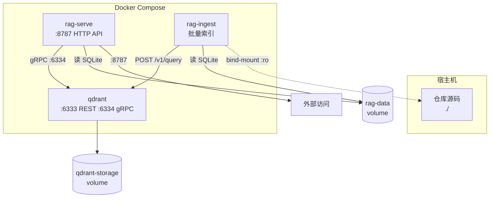
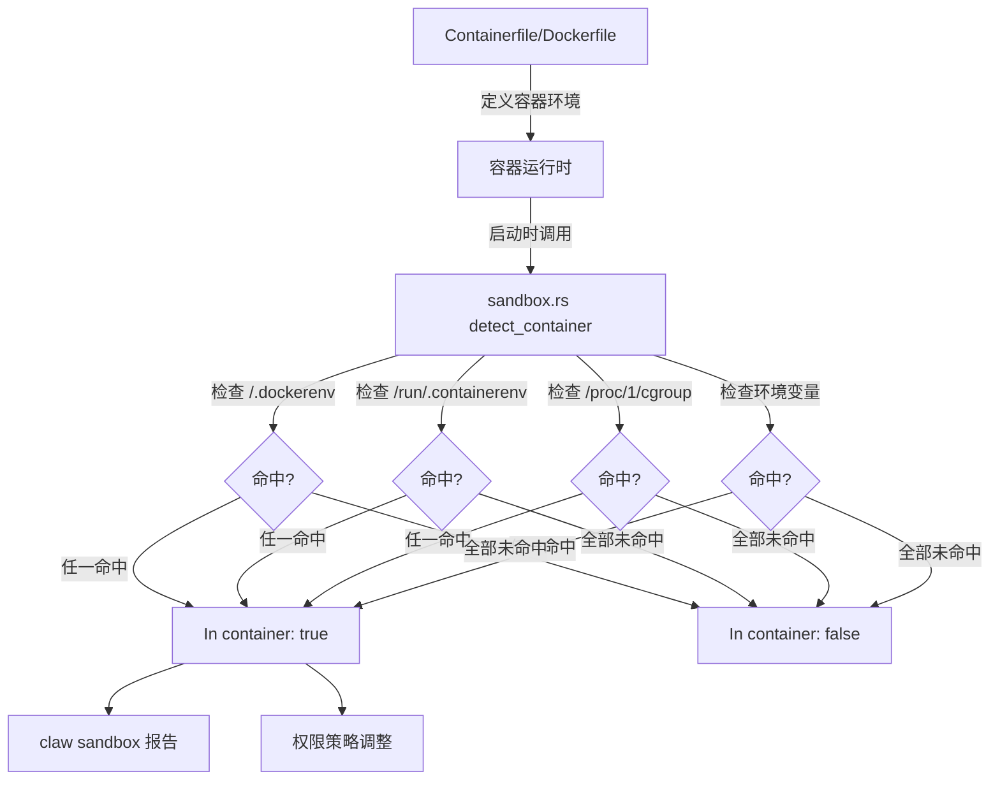

# 第 22 章 容器化与部署：Docker/Podman 工作流

## 本章概览

本章分析 claw-code 的容器化部署设施，包括官方容器镜像定义、RAG 服务与 Qdrant 向量数据库的编排关系，以及容器内运行时的行为差异。这些设施本身与核心运行时无代码依赖，属于部署层面的扩展。第 20 章介绍的 sandbox.rs 在容器内运行时被调用以报告环境状态，构成两者的衔接点。

| 文件路径 | 职责 |
|----------|------|
| `Containerfile` | 官方开发容器镜像定义，提供 Rust 构建/测试环境 |
| `rust/crates/claw-rag-service/Dockerfile` | RAG 服务专用镜像，多阶段构建 |
| `docker-compose.yml` | RAG 服务与 Qdrant 的编排定义 |
| `docs/container.md` | 容器工作流使用文档 |

## 22.1 Containerfile 设计：不内嵌仓库的构建哲学

claw-code 的 Containerfile 是整个容器化策略的起点。它的核心设计决策是：不在镜像中 COPY 仓库源码，而是通过 bind-mount 将宿主机的工作目录挂载到容器内。这一决策直接影响后续的构建命令、工作目录设置和缓存策略。

```dockerfile
// claw-code/Containerfile

FROM rust:bookworm

RUN apt-get update \
    && apt-get install -y --no-install-recommends \
        ca-certificates \
        git \
        libssl-dev \
        pkg-config \
    && rm -rf /var/lib/apt/lists/*

ENV CARGO_TERM_COLOR=always
WORKDIR /workspace
CMD ["bash"]
```

整个文件只有 13 行，但每一行都承载着明确的设计意图。

基础镜像选择 `rust:bookworm` 而非 `rust:latest`，目的是锁定 Debian Bookworm 作为底层发行版，避免上游滚动更新带来不可预期的工具链变更。`rust:bookworm` 自带完整的 Rust 工具链（rustc、cargo），不需要额外安装。

`apt-get install` 安装四个包：`ca-certificates` 用于 HTTPS 通信的根证书，`git` 用于仓库操作和依赖拉取，`libssl-dev` 和 `pkg-config` 是 OpenSSL 的开发头文件和配置工具，claw-code 的部分 crate（如 reqwest 启用 TLS 特性时）需要它们进行链接。`--no-install-recommends` 避免安装推荐但非必需的包，减小镜像体积。末尾 `rm -rf /var/lib/apt/lists/*` 清理 APT 缓存，这是 Docker 最佳实践，防止缓存列表残留在镜像层中。

`ENV CARGO_TERM_COLOR=always` 强制开启 Cargo 的彩色输出。在容器内运行时，stdout/stderr 可能经过多层管道转发（如 CI 日志收集），默认情况下 Cargo 会检测到非 TTY 环境而关闭颜色。显式设置 `always` 确保日志可读性。

`WORKDIR /workspace` 设置默认工作目录，与 docs/container.md 中推荐的 bind-mount 目标路径一致。容器启动后用户的操作默认在 `/workspace` 下进行。

`CMD ["bash"]` 是容器默认的启动命令，提供一个交互式 shell。这是开发容器的典型配置——不预设特定构建命令，而是让用户通过 `docker run` 参数或 `docker exec` 指定。

不在 Containerfile 中 `COPY` 仓库源码是关键决策。传统 Dockerfile 通常会 `COPY . /app` 然后在镜像内构建，但 claw-code 选择了 bind-mount 模式。下表对比两种方式的差异：

| 维度 | COPY 模式 | bind-mount 模式（claw-code 选择） |
|------|-----------|-----------------------------------|
| 镜像体积 | 包含完整源码和构建产物 | 仅含工具链，约 1.2GB |
| 代码变更 | 需要重新 build 镜像 | 容器内直接 cargo build 即可 |
| 宿主机编辑 | 容器内代码与宿主机不同步 | 双向同步，编辑立即生效 |
| CI 适用性 | 适合构建产物镜像 | 适合构建/测试环境 |
| 缓存复用 | 镜像层缓存含源码 | Cargo 缓存通过 volume 持久化 |

bind-mount 模式的核心优势在于开发循环速度：宿主机编辑代码后，容器内立即可以 `cargo build` 看到结果，无需重建镜像。代价是镜像不能直接用于生产部署——它是一个开发环境，不是产物容器。

## 22.2 RAG 服务镜像：多阶段构建

与 Containerfile 的开发环境定位不同，claw-rag-service 的 Dockerfile 面向运行时部署，采用多阶段构建来分离编译环境和运行环境。

```dockerfile
// claw-code/rust/crates/claw-rag-service/Dockerfile

FROM rust:1.91-bookworm AS builder

WORKDIR /repo
COPY . /repo/rust/

WORKDIR /repo/rust
RUN rustc --version && cargo --version
RUN cargo build -p claw-rag-service --release --features qdrant-index

FROM debian:bookworm-slim

WORKDIR /app
COPY --from=builder /repo/rust/target/release/claw-rag-service /app/claw-rag-service

EXPOSE 8787
ENTRYPOINT ["/app/claw-rag-service"]
```

这个 Dockerfile 分为两个阶段，每个阶段有明确职责。

第一阶段 `builder` 使用 `rust:1.91-bookworm` 而非 `rust:bookworm`。版本号 1.91 被锁定，注释说明了原因：`qdrant-client` crate 需要较新的 stable Rust。锁定版本避免了 `rust:latest` 标签在 Docker Hub 上指向更高版本时可能引入的破坏性变更。`COPY . /repo/rust/` 将整个仓库（包括 `rust/` 子目录）复制到镜像中，这与 Containerfile 的 bind-mount 策略不同——产物镜像需要自包含所有编译输入。

`RUN rustc --version && cargo --version` 是一个 sanity check 命令，输出工具链版本到构建日志。当 CI 或 Docker Desktop 出现构建失败时，这行输出帮助快速定位是工具链版本问题还是代码问题。

`cargo build -p claw-rag-service --release --features qdrant-index` 编译命令有三个关键参数。`-p claw-rag-service` 指定只构建 RAG 服务 crate 而非整个 workspace。`--release` 启用优化编译，产物体积更小、运行更快。`--features qdrant-index` 启用 Qdrant 向量数据库的索引支持。注释说明即使不使用 Qdrant 也能正常工作——这是因为 Qdrant 后端在运行时通过环境变量 `CLAW_RAG_QDRANT_URL` 配置，不配置则 fallback 到 SQLite。

第二阶段 `debian:bookworm-slim` 使用精简版 Debian 作为运行时基础镜像。与 `rust:bookworm`（约 1.2GB）相比，`bookworm-slim`（约 80MB）不含编译器和开发头文件，大幅减小最终镜像体积。`COPY --from=builder` 只从第一阶段复制编译产物二进制文件，丢弃所有中间构建文件。

`EXPOSE 8787` 声明服务监听端口，这是文档性指令——不实际发布端口，但告知使用者需要映射此端口。`ENTRYPOINT ["/app/claw-rag-service"]` 设置固定入口点，使容器可以直接通过 `docker run` 参数传递子命令（如 `serve` 或 `ingest`）。

下表对比两个 Dockerfile 的设计差异：

| 维度 | Containerfile | RAG Dockerfile |
|------|--------------|----------------|
| 目标场景 | 开发/测试环境 | 生产部署 |
| 基础镜像 | rust:bookworm (~1.2GB) | rust:1.91 → debian:bookworm-slim |
| 源码处理 | bind-mount，不 COPY | COPY 到镜像内 |
| 构建模式 | 无预编译 | release + features |
| 启动命令 | bash（交互式） | 二进制文件（服务式） |
| 多阶段构建 | 否 | 是 |

## 22.3 docker-compose.yml：RAG 与 Qdrant 编排

docker-compose.yml 编排了三个服务，共同组成完整的 RAG 索引与检索流水线。

```yaml
// claw-code/docker-compose.yml

services:
  qdrant:
    image: qdrant/qdrant:latest
    ports:
      - "6333:6333"
      - "6334:6334"
    environment:
      QDRANT__SERVICE__GRPC_PORT: "6334"
    volumes:
      - qdrant-storage:/qdrant/storage

  rag-serve:
    build:
      context: ./rust
      dockerfile: crates/claw-rag-service/Dockerfile
    command: ["serve", "--db", "/data/index.sqlite"]
    environment:
      CLAW_RAG_MOCK_PROVIDERS: "1"
      CLAW_RAG_DB: "/data/index.sqlite"
      CLAW_RAG_HOST: "0.0.0.0"
      CLAW_RAG_QDRANT_URL: "http://qdrant:6334"
      CLAW_RAG_QDRANT_COLLECTION: "claw_rag_chunks"
    ports:
      - "8787:8787"
    depends_on:
      - qdrant
    volumes:
      - rag-data:/data

  rag-ingest:
    build:
      context: ./rust
      dockerfile: crates/claw-rag-service/Dockerfile
    command: ["ingest", "--db", "/data/index.sqlite"]
    environment:
      CLAW_RAG_MOCK_PROVIDERS: "1"
      CLAW_RAG_DB: "/data/index.sqlite"
      CLAW_RAG_QDRANT_URL: "http://qdrant:6334"
      CLAW_RAG_QDRANT_COLLECTION: "claw_rag_chunks"
    depends_on:
      - qdrant
    volumes:
      - rag-data:/data
      - ./:/workspaces/main:ro

volumes:
  qdrant-storage:
  rag-data:
```

三个服务的编排关系如下：



qdrant 服务使用官方 `qdrant/qdrant:latest` 镜像，暴露两个端口：6333 是 REST API 端口，6334 是 gRPC 端口。环境变量 `QDRANT__SERVICE__GRPC_PORT: "6334"` 显式配置 gRPC 端口号。`qdrant-storage` 命名卷持久化向量索引数据，容器重建后索引不丢失。

rag-serve 是 RAG 检索服务的运行实例。构建上下文（context）设为 `./rust`，使用 `crates/claw-rag-service/Dockerfile` 作为构建文件——注意这里的 dockerfile 路径是相对于 context 的。`command: ["serve", "--db", "/data/index.sqlite"]` 覆盖了 Dockerfile 中的 ENTRYPOINT 参数，指定启动 serve 子命令并使用 `/data/index.sqlite` 作为 SQLite 数据库路径。环境变量配置如下：

| 环境变量 | 值 | 作用 |
|----------|-----|------|
| `CLAW_RAG_MOCK_PROVIDERS` | `"1"` | 使用 mock embedding，不调用真实嵌入模型 |
| `CLAW_RAG_DB` | `/data/index.sqlite` | SQLite 数据库路径 |
| `CLAW_RAG_HOST` | `0.0.0.0` | 监听所有网络接口（容器内必须） |
| `CLAW_RAG_QDRANT_URL` | `http://qdrant:6334` | Qdrant gRPC 地址，使用 Docker 服务名解析 |
| `CLAW_RAG_QDRANT_COLLECTION` | `claw_rag_chunks` | Qdrant collection 名称 |

`CLAW_RAG_HOST: "0.0.0.0"` 在容器环境中是必须的。如果设为 `127.0.0.1`，端口映射 `8787:8787` 将无法从宿主机访问，因为容器内只监听了 loopback 接口。`CLAW_RAG_QDRANT_URL` 使用服务名 `qdrant` 而非 IP 地址，依赖 Docker Compose 内置的 DNS 解析。`CLAW_RAG_MOCK_PROVIDERS: "1"` 的注释说明这是本地开发的默认配置，真实场景下需要覆盖此变量以连接实际的 embedding 服务。

rag-ingest 与 rag-serve 共享同一份 Dockerfile 和构建产物，但启动命令不同。`command: ["ingest", "--db", "/data/index.sqlite"]` 启动索引构建子命令，遍历工作区文件并生成嵌入向量。它额外挂载 `./:/workspaces/main:ro`——将宿主机当前目录以只读方式挂载到容器内 `/workspaces/main`，作为索引输入源。`:ro` 标志防止索引过程意外修改源文件。

两个服务共享 `rag-data` 命名卷，rag-ingest 写入索引数据，rag-serve 读取这些数据响应查询。这种分离设计使得索引构建和查询服务可以独立扩展——可以同时运行多个 ingest 实例加速索引，多个 serve 实例提高查询吞吐量。

## 22.4 容器内运行时的行为差异

在容器内运行 claw-code 时，运行时行为与宿主机直接运行存在若干差异。这些差异来自环境变量隔离、路径映射和权限策略三个方面。

docs/container.md 中推荐的运行命令统一使用 `-e CARGO_TARGET_DIR=/tmp/claw-target` 参数。这一环境变量的作用是将 Cargo 的构建产物目录从默认的 `./rust/target/` 重定向到容器内 `/tmp/` 下。如果不设置，bind-mount 模式下构建产物会写入宿主机的工作目录，文件所有权变为 root（容器内默认用户），导致宿主机上后续 `cargo clean` 或 `git status` 出现权限问题。`/tmp` 路径在容器内可写且不经过 bind-mount，构建产物留在容器层内，容器销毁时自动清理。

路径映射方面，Containerfile 设置 `WORKDIR /workspace`，而实际运行命令通过 `-w /workspace/rust` 覆盖工作目录为 Rust workspace 的根目录。`-v "$PWD":/workspace` 将宿主机当前目录挂载到容器的 `/workspace`，使得容器内 `/workspace/rust/` 对应宿主机的 `./rust/`。docs/container.md 中展示的完整运行命令如下：

```bash
# claw-code/docs/container.md (节选)

docker run --rm -it \
  -v "$PWD":/workspace \
  -e CARGO_TARGET_DIR=/tmp/claw-target \
  -w /workspace/rust \
  claw-code-dev \
  cargo test --workspace
```

`--rm` 标志在容器退出时自动删除容器实例，避免残留。`-it` 组合标志分配伪 TTY 并保持 stdin 打开，使交互式 shell 和彩色输出正常工作。`-v "$PWD":/workspace` 使用 shell 展开 `$PWD` 获取宿主机绝对路径，Docker 要求挂载源必须是绝对路径。

Podman 的等价命令在挂载参数后追加 `:Z` 后缀：

```bash
# claw-code/docs/container.md (节选)

podman run --rm -it \
  -v "$PWD":/workspace:Z \
  -e CARGO_TARGET_DIR=/tmp/claw-target \
  -w /workspace/rust \
  claw-code-dev \
  cargo test --workspace
```

`:Z` 后缀指示 Podman 对挂载路径进行 SELinux 重标签。在 Fedora/RHEL 等 SELinux 强制模式下，容器内进程默认无法访问宿主机文件系统，`:Z` 告诉 Podman 为该挂载点设置 `container_file_t` 标签，使容器进程获得读写权限。Docker 在 SELinux 系统上同样需要此处理，但 Docker Desktop 的默认配置通常已禁用 SELinux 或使用其他隔离机制，因此 Docker 示例中省略了 `:Z`。

多仓库挂载场景展示了 bind-mount 模式的灵活性。docs/container.md 给出了同时挂载 claw-code 仓库和外部仓库的命令：

```bash
# claw-code/docs/container.md (节选)

docker run --rm -it \
  -v "$PWD":/workspace \
  -v "$HOME/src/other-repo":/repo \
  -e CARGO_TARGET_DIR=/tmp/claw-target \
  -w /workspace/rust \
  claw-code-dev
```

宿主机的 `$HOME/src/other-repo` 挂载到容器内 `/repo`，claw-code 保留在 `/workspace`。容器内可以同时访问两个仓库，执行如 `cargo run -p rusty-claude-cli -- prompt "summarize /repo"` 这样的跨仓库操作。这种模式不需要为每个仓库构建单独的镜像，体现了开发容器的设计优势。

## 22.5 与沙箱检测的衔接

第 20 章详细分析了 sandbox.rs 的容器检测机制。在容器化部署场景中，sandbox.rs 与容器设施形成上下游关系：Containerfile 和 Dockerfile 定义容器环境，sandbox.rs 在容器内运行时检测并报告该环境状态。

docs/container.md 中特别提到 `claw sandbox` 命令作为容器内 sanity check：

```bash
# claw-code/docs/container.md (节选)

cargo run -p rusty-claude-cli -- sandbox
```

该命令在 Docker 或 Podman 容器内执行时，应报告 `In container true` 并列出运行时检测到的容器标记。sandbox.rs 的多源联合检测机制检查以下标记：

| 检测源 | 路径/方式 | 说明 |
|--------|-----------|------|
| Docker 标记文件 | `/.dockerenv` | Docker daemon 创建的标记文件 |
| Podman 标记文件 | `/run/.containerenv` | Podman 创建的标记文件 |
| cgroup 信息 | `/proc/1/cgroup` | PID 1 的 cgroup 路径含 docker/lxc/kubepods |
| 环境变量 | `container` 等 | 部分容器运行时设置的环境变量 |

这些检测源在 sandbox.rs 中不是"或"关系而是"和"关系——只要任一源命中，即判定为容器环境。这种冗余设计确保即使部分标记被清除（如自定义镜像删除 `/.dockerenv`），仍能通过其他源正确检测。

容器检测的结果直接影响运行时的权限策略。在容器内，sandbox.rs 报告的容器状态会传递给权限系统（第 9 章 PermissionEnforcer），影响 bash 工具执行器和文件操作的边界决策。具体而言，容器环境下的权限策略可能更宽松——因为容器本身已经提供了操作系统层面的隔离（namespace、cgroup），软件层面的 PermissionMode 可以适当放宽，减少对合法操作的不必要拦截。

docker-compose.yml 中 rag-serve 的 `CLAW_RAG_HOST: "0.0.0.0"` 也与沙箱检测间接相关。sandbox.rs 在检测到容器环境后，可以推断网络隔离可能需要特殊处理——容器内的 `0.0.0.0` 监听在 Docker 网络模型下受 bridge 网络隔离，不会直接暴露到宿主机物理网络，因此是安全的默认行为。



sandbox 命令的输出不仅用于人工检查，也可以被 CI 流水线解析。在 GitHub Actions 中使用 Docker 构建时（如 docs/container.md 提到的 `.github/workflows/rust-ci.yml`），CI 脚本可以在容器启动后运行 `claw sandbox` 验证容器检测是否正常工作，作为环境校验的 smoke test。

## 22.6 Docker 与 Podman 的兼容性设计

claw-code 的容器化设施明确支持 Docker 和 Podman 两个运行时。docs/container.md 的开篇即声明 "Docker and Podman use the same checked-in Containerfile"，所有示例都提供 Docker 和 Podman 两个版本。

兼容性设计的核心是使用 `Containerfile` 而非 `Dockerfile` 作为文件名。Podman 原生识别 `Containerfile`，Docker 通过 `-f Containerfile` 参数指定。这种命名选择避免了 Podman 用户需要额外配置即可使用，同时不破坏 Docker 用户的习惯（Docker 默认查找 `Dockerfile`，但接受 `-f` 指定任意文件名）。

两个运行时在功能上存在细微差异，docs/container.md 在 Notes 部分集中说明：

```text
// docs/container.md (Notes 节选)

- Docker and Podman use the same checked-in Containerfile.
- The :Z suffix in the Podman examples is for SELinux relabeling;
  keep it on Fedora/RHEL-class hosts.
- Running with CARGO_TARGET_DIR=/tmp/claw-target avoids leaving
  container-owned target/ artifacts in your bind-mounted checkout.
- For non-container local development, keep using USAGE.md and
  rust/README.md.
```

三条注意事项分别覆盖了文件命名、SELinux 兼容和构建产物隔离。`:Z` 后缀的说明尤为重要——在 SELinux 强制模式系统上省略此参数会导致挂载路径无法访问，用户可能误以为是 claw-code 的 bug。

Podman 与 Docker 的另一个差异是 rootless 模式。Podman 默认以非 root 用户运行容器，而 Docker 默认以 root 运行。这不影响 Containerfile 本身（因为它只安装包和设置环境变量），但影响 bind-mount 的文件所有权。Podman rootless 模式下，容器内创建的文件归宿主机当前用户所有，而 Docker root 模式下文件归 root 所有。这正是 `CARGO_TARGET_DIR=/tmp/claw-target` 的另一个作用：将构建产物隔离到容器内文件系统，避免 root-owned 文件出现在宿主机工作目录。

| 差异维度 | Docker | Podman |
|----------|--------|--------|
| 默认运行用户 | root | 当前用户（rootless） |
| SELinux 支持 | 需手动配置 `:Z` | 原生支持，仍需 `:Z` |
| 文件名识别 | `Dockerfile`（需 `-f Containerfile`） | 原生识别 `Containerfile` |
| 守护进程 | 需要 dockerd 守护 | 无守护进程 |
| 构建产物所有权 | root（需 CARGO_TARGET_DIR） | 当前用户（风险较低但仍建议隔离） |

## 小结

claw-code 的容器化部署设施由三个文件构成：Containerfile 提供开发环境镜像，采用 bind-mount 策略避免源码内嵌；claw-rag-service/Dockerfile 采用多阶段构建生产部署镜像；docker-compose.yml 编排 RAG 服务与 Qdrant 的三容器拓扑。容器内运行时通过 `CARGO_TARGET_DIR` 隔离构建产物，通过 `CLAW_RAG_HOST: "0.0.0.0"` 适配容器网络模型。sandbox.rs（第 20 章）的容器检测机制在此场景中被调用，通过 `claw sandbox` 命令报告环境状态，权限系统据此调整策略。

| 关键文件 | 核心机制 |
|----------|----------|
| `Containerfile` | bind-mount 开发环境，不内嵌仓库 |
| `rust/crates/claw-rag-service/Dockerfile` | 多阶段构建，release + qdrant-index 特性 |
| `docker-compose.yml` | qdrant + rag-serve + rag-ingest 三服务编排 |
| `docs/container.md` | Docker/Podman 兼容工作流文档 |

第二阶段到此结束。从第 15 章的 claw-analog 精简 harness 到本章的容器化部署，社区扩展模块的分析覆盖了独立工具、独立服务、共享库、移植层、插件系统、沙箱隔离、故障恢复和部署设施共八个维度，与第一阶段的十五章核心运行时形成完整的技术手册。
