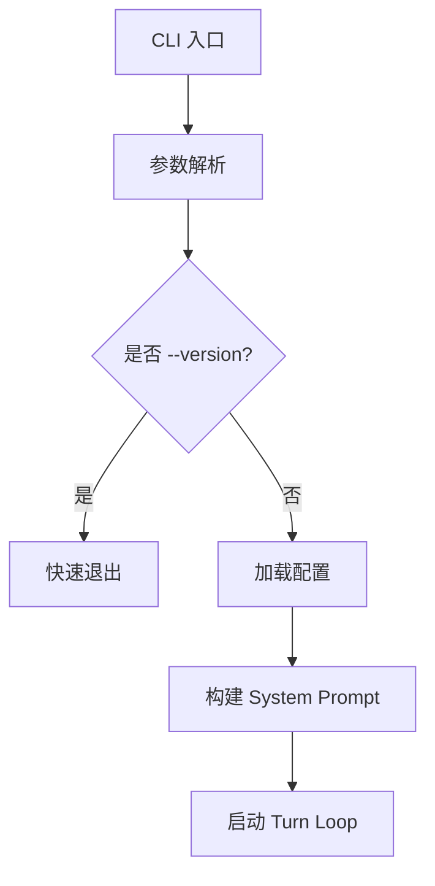

# 写作风格指南

本文件是 claw-code-book 的写作规则。所有章节的生成和重写都必须遵循此指南。修改本文件即可影响后续所有章节的写作风格。

---

## 一、语言风格：去 AI 化

### 禁止项

1. **禁止反问句开场**。不要写"你有没有想过…？""准备好了吗？""什么是 X？"。
2. **禁止感叹式过渡**。不要写"让我们开始吧！""接下来揭晓答案！"。
3. **禁止逐段总结**。不要在每节末尾写"本节我们了解了 X，下一节将探讨 Y"。
4. **禁止滥用加粗**。只加粗代码标识符（类名、函数名、变量名）。不要加粗普通概念词。
5. **禁止 emoji**。正文中不使用任何 emoji。
6. **禁止"小李"式拟人叙事**。不要虚构人物场景来引入技术话题。

### 应当项

1. **用陈述句**。直接说事实和因果关系。
2. **代码优先**。能贴代码说明的，不要用三段文字绕。
3. **一段只说一件事**。段落不超过 6 行。
4. **语气中性**。像同事之间技术分享，不像老师教学生。

---

## 二、章节结构

每章固定四部分，不要额外添加"章节导读""核心收获""阅读建议"等包装：

```markdown
# 第N章 标题

简短的问题引入（2-3句，说明这章解决什么问题）

## N.1 第一个小节标题

正文 + 代码

## N.2 第二个小节标题

正文 + 代码

## 设计对比（可选）

与 Spring Boot / MyBatis 等Java生态的类比。集中在一个小节，不要每段都类比。

## 小结

3-5句，列出本章涉及的关键文件和核心机制。不要展开重复正文。
```

---

## 三、代码引用规则

1. **必须引用真实源码**。每段代码必须来自 claw-code 仓库（`/claw-code/` 目录），标注文件路径。
2. **截取关键片段**。不要贴整个文件，截取最能说明问题的 10-30 行。
3. **行内注释解释**。在代码块内用注释标重点，不要在代码块外重复解释代码做了什么。
4. **标注源码位置**。代码块前一行写明来源文件，格式：`// claw-code/src/xxx.py` 或 `// claw-code/rust/crates/xxx/src/xxx.rs`。

示例：

```python
# claw-code/src/runtime.py

class Runtime:
    def __init__(self, config: Config):
        self.config = config          # 三层合并后的最终配置
        self.conversation = None       # 延迟初始化，等 Turn Loop 启动
        self.tools = ToolPool(config)  # 工具池，启动时注册所有内置工具
```

---

## 四、图表规则

1. **用 mermaid 流程图**替代 AI 生成图片。流程图能精确表达代码执行路径。
2. **用表格**做对比和列举。文件映射、配置项、阶段列表都用表格。
3. **禁止装饰性图片**。如果一张图删掉后不影响理解，就不该放。
4. **禁止"全景图""概念速览图"**。这些图只是文字的重复。

mermaid 示例：



---

## 五、Java 类比规则

1. 每章最多一个"设计对比"小节，集中做类比。
2. 类比必须精确：说明"X 对应 Y"，而不是"X 就像 Y"。
3. 如果某个概念在 Java 生态中找不到好的对应物，就直接讲概念本身，不要硬凑。
4. 常用类比映射表（可在各章复用）：

| claw-code 概念 | Java 生态对应 |
| --- | --- |
| Bootstrap Phase | Spring Boot 启动阶段 |
| Config 三层合并 | application.properties 多 profile 覆盖 |
| ToolPool | Spring IoC 容器中的 Bean 注册 |
| Turn Loop | DispatcherServlet 请求循环 |
| Hook 系统 | Spring AOP / Interceptor |
| Permission System | Spring Security 权限链 |
| Session 管理 | HttpSession / Spring Session |

---

## 六、学城文档使用规则

1. 学城文档只作为**结构和思路参考**，不作为内容来源。
2. 如果学城文档的某个观点在源码中找不到证据，不要写进书里。
3. 如果源码实现与学城文档描述不一致，以源码为准，可以加一句注释说明差异。
4. 学城文档的章节划分可以调整，不必严格对齐。

---

## 七、输出格式

1. 输出为 Markdown 文件，放在 VitePress 项目的对应章节目录下。
2. 文件名用英文小写，如 `chapter-04/startup.md`。
3. 代码块标注语言类型（python / rust / typescript / bash / mermaid）。
4. 不要在 Markdown 中使用 HTML 标签。
